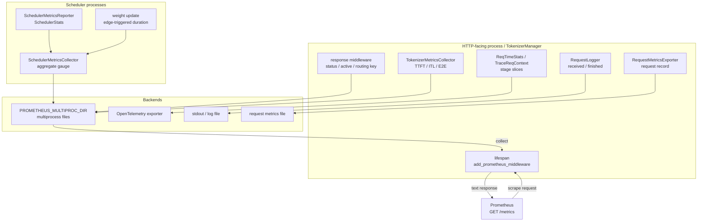

# 可观测性 · 数据流

## 读者任务

这篇只回答一个问题：一个可观测信号从哪里产生，经过哪个进程边界，最后落到 Prometheus、日志、trace 还是文件。

读完后你应该能把任意排障现象放进四类信号路径：

- scrape 路径：`/metrics` 能不能被 Prometheus 抓到。
- Scheduler 路径：队列、KV pool、cache hit、LoRA、HiCache、PD 等 aggregate gauge 如何写入。
- Tokenizer 路径：TTFT、ITL、E2E、prompt/generation/cached tokens 如何按请求生命周期写入。
- 旁路：RequestLogger、OpenTelemetry trace、RequestMetricsExporter 和 HTTP response middleware 不要和引擎内部 metrics 混淆。

## 怎么读这篇

| 现象 | 先读 |
|------|------|
| `/metrics` 是 404 或 series 消失 | scrape 入口 |
| 指标存在但队列、KV 数值不可信 | Scheduler 状态账 |
| TTFT、ITL 或 token 数不符合请求 | Tokenizer 请求账 |
| HTTP 状态正常但引擎内部异常 | middleware 与引擎指标边界 |
| 需要单请求时间线或落盘记录 | 日志、trace、RequestMetricsExporter |
| 权重加载耗时偶尔缺失 | 边沿触发的权重加载指标 |

先确认“谁写、何时写、写到哪里”，再讨论 metric 名称。可观测性最常见的误判，是拿读取面的 `/metrics` 去解释写入者从未产生的状态。

## 总图：四类信号共享一个 scrape 面



这张图的关键不是节点数量，而是方向：`/metrics` 是读取面，Scheduler 和 TokenizerManager 才是主要写入者。日志、trace、exporter 是旁路，能补单请求细节，但不会解释某个 Prometheus series 为什么不存在。

## Scrape 入口只负责聚合

scrape 路径的主线是：

```text
ServerArgs.enable_metrics
  -> set_prometheus_multiproc_dir
  -> HTTP lifespan mounts /metrics OR gRPC starts sidecar route
  -> MultiProcessCollector reads multiprocess files
  -> Prometheus receives text format metrics
```

源码里有两个不变量。第一，multiprocess 目录必须在 import `prometheus_client` 前设置；第二，HTTP 模式的 `/metrics` ASGI app 只在 `enable_metrics` 为真时挂载。gRPC 模式不是这条 FastAPI 路径，而是独立 aiohttp sidecar。

```python
# 来源：python/sglang/srt/utils/common.py L1571-L1586
def set_prometheus_multiproc_dir():
    # Set prometheus multiprocess directory
    # sglang uses prometheus multiprocess mode
    # we need to set this before importing prometheus_client
    # https://prometheus.github.io/client_python/multiprocess/
    global prometheus_multiproc_dir

    if "PROMETHEUS_MULTIPROC_DIR" in os.environ:
        logger.debug("User set PROMETHEUS_MULTIPROC_DIR detected.")
        prometheus_multiproc_dir = tempfile.TemporaryDirectory(
            dir=os.environ["PROMETHEUS_MULTIPROC_DIR"]
        )
    else:
        prometheus_multiproc_dir = tempfile.TemporaryDirectory()
        os.environ["PROMETHEUS_MULTIPROC_DIR"] = prometheus_multiproc_dir.name
    logger.debug(f"PROMETHEUS_MULTIPROC_DIR: {os.environ['PROMETHEUS_MULTIPROC_DIR']}")
```

```python
# 来源：python/sglang/srt/utils/common.py L1589-L1599
def add_prometheus_middleware(app):
    # We need to import prometheus_client after setting the env variable `PROMETHEUS_MULTIPROC_DIR`
    from prometheus_client import CollectorRegistry, make_asgi_app, multiprocess

    registry = CollectorRegistry()
    multiprocess.MultiProcessCollector(registry)
    metrics_route = Mount("/metrics", make_asgi_app(registry=registry))

    # Workaround for 307 Redirect for /metrics
    metrics_route.path_regex = re.compile("^/metrics(?P<path>.*)$")
    app.routes.append(metrics_route)
```

所以 `/metrics` 404 和 `cache_hit_rate` 不存在不是同一类问题。前者先查服务模式、暴露端口、HTTP lifespan 或 gRPC sidecar，再查 multiprocess 目录；后者要查 Scheduler lane 是否写入。当前仓库没有显式 `mark_process_dead` 调用，重启后若出现可疑残留 series，还应检查目录内的实际文件，而不是只看 endpoint 是否返回 200。

## Scheduler 状态账按窗口写入

Scheduler lane 的主线是：

```text
Scheduler.init_metrics_collector
  -> SchedulerMetricsCollector.init_new chooses rank and labels
  -> SchedulerMetricsReporter builds SchedulerStats
  -> SchedulerMetricsCollector.log_stats writes gauges
```

默认只有 `attn_tp_rank == 0` 负责写 Scheduler aggregate metrics。`enable_metrics_for_all_schedulers` 会放开这个限制，并让各 scheduler 以 rank labels 形成独立 series。代价不只是 cardinality：普通 TP 状态可能是副本视角，查询时盲目求和会放大；DP-Attention 下又可能需要按 rank 保留不同 scheduler 的状态。

```python
# 来源：python/sglang/srt/observability/metrics_collector.py L1040-L1051
        enable_metrics = server_args.enable_metrics
        is_stats_logging_rank = ps.attn_tp_rank == 0
        current_scheduler_metrics_enabled = enable_metrics and (
            is_stats_logging_rank or server_args.enable_metrics_for_all_schedulers
        )
        enable_kv_cache_events = bool(
            server_args.kv_events_config
            and ps.pp_rank == 0
            and ps.attn_tp_rank == 0
            and ps.attn_cp_rank == 0
        )
        collector: Optional[SchedulerMetricsCollector] = None
```

一次 prefill stats tick 会把 cache hit、队列长度、pool usage、retract、PD 队列、LoRA、HiCache 组装进 `SchedulerStats`，最后只调用一次 `log_stats`。

```python
# 来源：python/sglang/srt/managers/scheduler_components/metrics_reporter.py L606-L620
            priority_enabled = self.scheduler.enable_priority_scheduling
            effective_input_tokens = (
                prefill_stats.log_input_tokens
                - prefill_stats.reprocessed_log_input_tokens
            )
            effective_hit_tokens = (
                prefill_stats.log_hit_tokens - prefill_stats.reprocessed_log_hit_tokens
            )
            total_tokens = effective_input_tokens + effective_hit_tokens
            cache_hit_rate = (
                effective_hit_tokens / total_tokens if total_tokens > 0 else 0.0
            )

            # Basics
            self.stats.num_running_reqs = prefill_stats.num_running_reqs
```

```python
# 来源：python/sglang/srt/managers/scheduler_components/metrics_reporter.py L653-L660

            # Utilization / LoRA / HiCache
            self._calculate_utilization()
            self.stats.fwd_occupancy = self.fwd_occupancy
            self._update_lora_metrics()
            self._log_hicache_stats()
            self.metrics_collector.log_stats(self.stats)
            self.scheduler.kv_events_publisher.emit_kv_metrics()
```

`log_stats` 再把 dataclass 字段映射到 gauge。这里说明了 `cache_hit_rate` 的语义：它是 stats tick 的 aggregate 比例，不是某个请求的命中率。

```python
# 来源：python/sglang/srt/observability/metrics_collector.py L1260-L1267
    def log_stats(self, stats: SchedulerStats) -> None:
        # Basics
        self._log_gauge_queue_count(self.num_running_reqs, stats.num_running_reqs)
        self._log_gauge_queue_count(self.num_queue_reqs, stats.num_queue_reqs)
        self._log_gauge(self.num_grammar_queue_reqs, stats.num_grammar_queue_reqs)
        self._log_gauge(self.gen_throughput, stats.gen_throughput)
        self._log_gauge(self.cache_hit_rate, stats.cache_hit_rate)
        self._log_gauge(self.decode_sum_seq_lens, stats.decode_sum_seq_lens)
```

## Tokenizer 请求账按输出事件写入

Tokenizer lane 的主线是：

```text
OpenAI request headers
  -> extract_custom_labels
  -> GenerateReqInput.custom_labels
  -> TokenizerManager.collect_metrics
  -> TTFT / ITL / E2E / token counters
```

custom labels 先在 OpenAI serving 层从 header 里解析，并按允许名单过滤。请求携带了 label 不等于 metrics 一定有该 label；启动时必须配置 allowed labels，使 collector 的 label schema 先包含它。

```python
# 来源：python/sglang/srt/entrypoints/openai/serving_base.py L243-L270
    def extract_custom_labels(self, raw_request):
        if (
            not self.allowed_custom_labels
            or not self.tokenizer_manager.server_args.tokenizer_metrics_custom_labels_header
        ):
            return None

        custom_labels = None
        header = (
            self.tokenizer_manager.server_args.tokenizer_metrics_custom_labels_header
        )
        try:
            raw_labels = (
                orjson.loads(raw_request.headers.get(header))
                if raw_request and raw_request.headers.get(header)
                else None
            )
        except json.JSONDecodeError as e:
            logger.exception(f"Error in request: {e}")
            raw_labels = None

        if isinstance(raw_labels, dict):
            custom_labels = {
                label: value
                for label, value in raw_labels.items()
                if label in self.allowed_custom_labels
            }
        return custom_labels
```

`collect_metrics` 先复制 collector 默认 labels，再把 request custom labels 和 priority 写进去。

```python
# 来源：python/sglang/srt/managers/tokenizer_manager.py L2396-L2410
    def collect_metrics(self, state: ReqState, recv_obj: BatchStrOutput, i: int):
        completion_tokens = (
            recv_obj.completion_tokens[i]
            if getattr(recv_obj, "completion_tokens", None)
            else 0
        )

        custom_labels = getattr(state.obj, "custom_labels", None)
        labels = dict(self.metrics_collector.labels)
        if custom_labels:
            labels.update(custom_labels)
        if self.enable_priority_scheduling:
            priority = getattr(state.obj, "priority", None)
            if priority is not None:
                labels["priority"] = str(priority)
```

同一个请求的输出生命周期被拆成三类事件：第一次可观测输出写 TTFT；后续输出用累计 `completion_tokens` 的增量写 ITL；finished 写 E2E 和 token counters。一次更新可能携带多个新增 token，不能把这里的调用次数当成 token 数或网络 chunk 数。

```python
# 来源：python/sglang/srt/managers/tokenizer_manager.py L2411-L2457
        if (
            not state.ttft_observed
            and self.disaggregation_mode != DisaggregationMode.PREFILL
        ):
            state.ttft_observed = True
            state.last_completion_tokens = completion_tokens
            self.metrics_collector.observe_time_to_first_token(
                labels, state.time_stats.get_first_token_latency()
            )
        else:
            num_new_tokens = completion_tokens - state.last_completion_tokens
            if num_new_tokens:
                self.metrics_collector.observe_inter_token_latency(
                    labels,
                    state.time_stats.get_interval(),
                    num_new_tokens,
                )
                state.time_stats.set_last_time()
                state.last_completion_tokens = completion_tokens

        if state.finished:
            # Get detailed cache breakdown if available
            cached_tokens_details = None
            if (
                hasattr(recv_obj, "cached_tokens_details")
                and recv_obj.cached_tokens_details
            ):
                cached_tokens_details = recv_obj.cached_tokens_details[i]

            spec_verify_ct = (
                recv_obj.spec_verify_ct[i]
                if hasattr(recv_obj, "spec_verify_ct")
                and recv_obj.spec_verify_ct
                and len(recv_obj.spec_verify_ct) > i
                else 0
            )

            self.metrics_collector.observe_one_finished_request(
                labels,
                recv_obj.prompt_tokens[i],
                completion_tokens,
                recv_obj.cached_tokens[i],
                state.time_stats.get_e2e_latency(),
                self._request_has_grammar(state.obj),
                cached_tokens_details,
                spec_verify_ct=spec_verify_ct,
            )
```

如果你只看到 TTFT，没有 E2E，通常说明请求还没有进入 finished 分支，或者流式请求在观察窗口内尚未结束。若 ITL 分布看起来过于平滑，还要记住 collector 会把一个事件间隔除以新增 token 数，并把这个平均值记为多个样本；它不是逐 token 精确时间线。以上都不是 Scheduler stats tick 的问题。

## HTTP middleware 是入口层，不是引擎内部

HTTP response middleware 也写 Prometheus，但它的对象是 HTTP endpoint、method、status code、active request 和 routing key。

```python
# 来源：python/sglang/srt/utils/common.py L1658-L1684
    @app.middleware("http")
    async def track_http_status_code(request, call_next):
        # With recording all requests, we have the risk of high cardinality if requests have arbitrary unhandled paths.
        # But given that SGLang engines with metrics enabled are usually behind routers this looks safe.
        path, is_handled_path = _get_fastapi_request_path(request)
        method = request.method
        routing_key = request.headers.get("x-smg-routing-key")

        http_request_counter.labels(endpoint=path, method=method).inc()
        http_requests_active.labels(endpoint=path, method=method).inc()
        if routing_key:
            routing_keys_active.inc(routing_key)

        try:
            response = await call_next(request)

            http_response_counter.labels(
                endpoint=path,
                method=method,
                status_code=str(response.status_code),
            ).inc()

            return response
        finally:
            http_requests_active.labels(endpoint=path, method=method).dec()
            if routing_key:
                routing_keys_active.dec(routing_key)
```

这条 lane 很容易和 Gateway 指标混淆。HTTP middleware 能看到 SGLang 进程内的 HTTP 请求状态；Gateway 侧则看路由、负载均衡和 backend health。GPU KV pool、prefix cache、spec verify 不在 HTTP middleware 里。

## 旁路记录单请求事实

RequestLogger 和 RequestMetricsExporter 都挂在 TokenizerManager 的请求完成路径上，但它们不进入 Prometheus。

```python
# 来源：python/sglang/srt/managers/tokenizer_manager.py L1505-L1521
            if finished:
                # Record response sent time right before we log finished results and metrics.
                if not state.time_stats.response_sent_to_client_time:
                    state.time_stats.set_response_sent_to_client_time()
                    out["meta_info"][
                        "response_sent_to_client_ts"
                    ] = state.time_stats.get_response_sent_to_client_realtime()
                self.request_logger.log_finished_request(
                    obj,
                    out,
                    request=request,
                )

                if self.request_metrics_exporter_manager.exporter_enabled():
                    asyncio.create_task(
                        self.request_metrics_exporter_manager.write_record(obj, out)
                    )
```

文件 exporter 会按小时维护目标文件，适合离线分析请求性能记录。注意它会过滤多模态和 embedding 等不适合直接序列化的字段。

```python
# 来源：python/sglang/srt/observability/request_metrics_exporter.py L72-L87
class FileRequestMetricsExporter(RequestMetricsExporter):
    """Lightweight `RequestMetricsExporter` implementation that writes records to files on disk.

    Records are written to files in the directory specified by `--export-metrics-to-file-dir`
    server launch flag. File names are of the form `"sglang-request-metrics-{hour_suffix}.log"`.
    """

    def __init__(
        self,
        server_args: ServerArgs,
        obj_skip_names: Optional[set[str]],
        out_skip_names: Optional[set[str]],
    ):
        super().__init__(server_args, obj_skip_names, out_skip_names)
        self.export_dir = getattr(server_args, "export_metrics_to_file_dir")
        os.makedirs(self.export_dir, exist_ok=True)
```

如果目标是复盘某个 rid 的 payload、输出和 meta_info，旁路比 Prometheus 更合适；如果目标是算 P99，Prometheus histogram 更合适。

## Trace 和 per-stage latency 共享阶段事实

ReqTimeStats 的特殊点在于它同时服务 per-stage metrics 和 OpenTelemetry trace。`observe_per_stage_req_latency` 写 metrics，`trace_slice` 写 trace slice，二者共享 stage 配置但走不同后端。

```python
# 来源：python/sglang/srt/observability/req_time_stats.py L260-L305
    def set_metrics_collector(
        self, collector: Union[SchedulerMetricsCollector, TokenizerMetricsCollector]
    ):
        if collector:
            self.enable_metrics = True
            self.metrics_collector = collector

    def observe_per_stage_req_latency(self, stage: RequestStageConfig, latency: float):
        if self.enable_metrics and stage.metrics_is_observed:
            self.metrics_collector.observe_per_stage_req_latency(
                stage.stage_name, latency
            )

    def init_trace_ctx(
        self,
        rid: str,
        bootstrap_room: Optional[int],
        external_trace_header: Optional[Dict[str, str]] = None,
    ):
        self.trace_ctx = TraceReqContext(
            rid=rid,
            bootstrap_room=bootstrap_room,
            role=self.disagg_mode_str(),
            module_name="request",
            external_trace_header=external_trace_header,
        )

        if not self.trace_ctx.tracing_enable:
            self.trace_ctx = TraceNullContext()

    def trace_slice(
        self,
        stage: RequestStageConfig,
        start_time: float,
        end_time: float,
        attrs: Optional[Dict] = None,
    ):
        if self.trace_ctx.tracing_enable:
            _slice = TraceSliceContext(
                slice_name=stage.stage_name,
                start_time_ns=convert_time_to_realtime_ns(start_time),
                end_time_ns=convert_time_to_realtime_ns(end_time),
                level=stage.level,
                attrs=attrs,
            )
            self.trace_ctx.trace_slice(_slice)
```

trace 初始化还依赖 OpenTelemetry 包和 endpoint。初始化失败会抛出 runtime error，所以 trace 排障要先查依赖与 OTLP endpoint，而不是查 Prometheus。

```python
# 来源：python/sglang/srt/observability/trace.py L177-L214
    if not opentelemetry_imported:
        opentelemetry_initialized = False
        raise RuntimeError(
            "opentelemetry package is not installed!!! Please not enable tracing or install opentelemetry"
        )

    try:
        resource = Resource.create(
            attributes={
                SERVICE_NAME: server_name,
            }
        )
        tracer_provider = TracerProvider(
            resource=resource, id_generator=TraceCustomIdGenerator()
        )

        schedule_delay_millis = get_int_env_var(
            "SGLANG_OTLP_EXPORTER_SCHEDULE_DELAY_MILLIS", 500
        )
        max_export_batch_size = get_int_env_var(
            "SGLANG_OTLP_EXPORTER_MAX_EXPORT_BATCH_SIZE", 64
        )

        processor = BatchSpanProcessor(
            span_exporter=get_otlp_span_exporter(otlp_endpoint),
            schedule_delay_millis=schedule_delay_millis,
            max_export_batch_size=max_export_batch_size,
        )
        tracer_provider.add_span_processor(processor)
        trace.set_tracer_provider(tracer_provider)
    except Exception as e:
        opentelemetry_initialized = False
        raise RuntimeError(
            f"initialize opentelemetry error:{e}. Please set correct otlp endpoint."
        )

    opentelemetry_initialized = True
    tracer = trace.get_tracer("sglang server")
```

## 权重加载指标是边沿触发

权重热更新期间 engine 可能处于 pause 状态，周期性 `log_stats` 不一定及时触发。因此 `observe_weight_load` 在更新结束时直接写 gauge。

```python
# 来源：python/sglang/srt/observability/metrics_collector.py L1143-L1149
    def observe_weight_load(self, duration_seconds: float, source: str) -> None:
        # Edge-triggered: engine is paused during the update, so log_stats
        # won't fire — write the gauge inline at end of update_weights_from_*.
        # `source` is "disk" | "distributed" | "tensor" | "ipc".
        self.weight_load_duration_seconds.labels(**self.labels, source=source).set(
            duration_seconds
        )
```

IPC 权重更新路径用 context manager 包住真正的 update 调用，这就是 `source="ipc"` 的来源。

```python
# 来源：python/sglang/srt/managers/scheduler_components/weight_updater.py L166-L172
    def update_weights_from_ipc(self, recv_req: UpdateWeightsFromIPCReqInput):
        """Update the online model parameter from IPC for checkpoint-engine integration."""
        with self._observe_weight_load("ipc"):
            success, message = self.tp_worker.update_weights_from_ipc(recv_req)
            tp_success = success
            if success and self.draft_worker is not None:
                success, message = self.draft_worker.update_weights_from_ipc(recv_req)
```

排查热更新时要同时看 `weight_load_duration_seconds`、HTTP/控制面结果和 cache hit 变化。当前基线的 `num_paused_reqs` 只有字段发布与归零，静态搜索未找到递增写入，不能把它当成 IPC 热更新影响计数。单看 stats tick 也可能错过更新完成瞬间。

## 交互矩阵

| 现象 | 先看哪条 lane | 关键源码入口 | 验证动作 |
|------|---------------|--------------|----------|
| `/metrics` 404 | scrape | `http_server.lifespan`、`add_prometheus_middleware`、gRPC sidecar | 先分 HTTP 主端口与 gRPC sidecar 端口，再查开关和 multiprocess 目录 |
| `cache_hit_rate` 没有 series | Scheduler | `SchedulerMetricsCollector.init_new`、`log_stats` | 查当前 rank 是否允许写 metrics |
| TTFT 有、E2E 没有 | Tokenizer | `TokenizerManager.collect_metrics` | 确认请求是否进入 `state.finished` |
| HTTP 5xx 面板有数据但 KV 指标没有 | HTTP middleware 和 Scheduler 分开看 | `track_http_status_code`、`SchedulerMetricsReporter` | 分别查询 HTTP counter 与 `sglang:*token_usage*` |
| request.finished 日志没有 | side | `RequestLogger.log_finished_request` | 查 `--log-requests`、level、慢请求过滤 |
| trace 没有 span | trace | `process_tracing_init`、`ReqTimeStats.init_trace_ctx` | 查 OpenTelemetry 依赖、OTLP endpoint、trace header |
| exporter 文件没写 | side | `RequestMetricsExporterManager.write_record` | 查 `--export-metrics-to-file` 和目标目录权限 |
| 热更新 duration 没有 | weight update | `observe_weight_load`、`update_weights_from_ipc` | 确认 update 路径是否经过对应 source |

## 复盘

- scrape lane 只能证明 Prometheus 能读取 multiprocess registry，不能证明每类指标都已写入。
- Scheduler lane 是系统状态视角，按窗口更新，适合解释队列、cache、KV pool、吞吐和热更新影响。
- Tokenizer lane 是请求生命周期视角，按输出事件写 TTFT、ITL、E2E 和 token counters。
- side lane 负责单请求事实和离线记录，不要拿它替代 Prometheus。
- trace 与 per-stage metrics 共享 stage 事件，但一个发 OTLP，一个写 histogram。

下一篇 [[SGLang-可观测性-排障指南]] 用这些 lane 做症状级排障。
