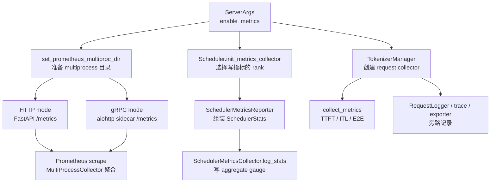

# 可观测性 · 源码走读

## 读者任务

这篇沿四条真实执行线走源码：

- Prometheus 发起一次 `GET /metrics`，HTTP 主服务或 gRPC sidecar 如何把 multiprocess registry 暴露出去。
- Scheduler 经过一次 stats tick，如何把 waiting queue、KV pool、cache hit、spec、LoRA、HiCache 写成 gauge。
- 一个生成请求首次输出、累计 completion token 增长、最终完成时，TokenizerManager 如何写 TTFT、近似 ITL、E2E 和 token counters。
- 同一个请求的 RequestLogger、ReqTimeStats trace、RequestMetricsExporter 如何作为旁路记录单请求事实。

读完后要能判断：某个现象应该查 `/metrics` 挂载、Scheduler stats、Tokenizer request metrics，还是日志/trace/exporter。

## 长文读法

这篇按“四本账”读：HTTP scrape 账负责 `/metrics` 能不能被 Prometheus 拉到；Scheduler 状态账负责队列、KV、cache、spec、LoRA、HiCache；Tokenizer 请求账负责 TTFT、ITL、E2E 和 token counters；单请求旁路账负责 RequestLogger、trace 和 exporter。排障时先判断你要看的现象属于哪本账。

| 读者任务 | 先读 | 要抓住的判断 |
|----------|------|--------------|
| `/metrics` 为空或 404 | 第 1 到第 4 步 | `enable_metrics`、multiprocess 目录、HTTP mount / gRPC sidecar 是 scrape 面，不负责业务指标含义 |
| queue、KV、cache hit、LoRA 指标异常 | 第 5 到第 8 步 | Scheduler 只在指定 rank 或 all-scheduler 模式写状态账，decode 重统计按 interval 执行 |
| TTFT、ITL、E2E 不符合预期 | 第 9、第 10 步 | TokenizerManager 按首次输出、累计 token 增量、完成三个事件写不同 histogram/counter |
| trace 和 per-stage latency 对不上 | 第 11 步 | ReqTimeStats 同时服务 metrics 和 trace，但 trace 是否启用由 TraceReqContext 决定 |
| 想复盘单个请求 payload | 第 12 步 | RequestLogger 和 exporter 是旁路记录，不会出现在 Prometheus 指标里 |
| 做回归验证 | 运行验证 | 先按 scrape、scheduler、tokenizer、旁路四条线分别确认源码入口和预期现象 |

读完整篇后，应该能把“指标没有、指标有但值怪、单请求想复盘”拆成三个问题；不要把 Prometheus scrape 故障误判成 Scheduler 没写指标，也不要把 RequestLogger 当成指标来源。

## 贯穿场景

假设你启动 SGLang：

- `--enable-metrics`
- `--log-requests --log-requests-format json`
- `--tokenizer-metrics-allowed-custom-labels tenant`
- 可选 `--enable-trace`

用户发出一个 generate 请求，Prometheus 同时周期性 scrape `/metrics`。源码主线如下：



这张图先给读法：`/metrics` 无数据先看 A 到 D；系统状态指标异常看 E 到 G；单请求延迟异常看 H 到 I；想复盘 payload 或 stage trace 看 J。

## 第 1 步：启动参数决定哪些账本存在

`enable_metrics` 默认关闭。它旁边的配置告诉我们：gRPC 模式可以有 HTTP sidecar，MFU 是额外估算，all-scheduler metrics 会扩大 rank 维度。

```python
# 来源：python/sglang/srt/server_args.py L1070-L1081
    enable_metrics: A[bool, "Enable log prometheus metrics."] = False
    grpc_http_sidecar_port: A[
        Optional[int],
        "Port for the HTTP sidecar server in gRPC mode (--grpc-mode). Serves Prometheus metrics and profiling endpoints. Defaults to --port + 1. Not used in HTTP mode.",
    ] = None
    enable_mfu_metrics: A[bool, "Enable estimated MFU-related prometheus metrics."] = (
        False
    )
    enable_metrics_for_all_schedulers: A[
        bool,
        "Enable --enable-metrics-for-all-schedulers when you want schedulers on all TP ranks (not just TP 0) to record request metrics separately. This is especially useful when dp_attention is enabled, as otherwise all metrics appear to come from TP 0.",
    ] = False
```

Tokenizer 请求指标还支持 custom labels 和 histogram buckets。custom label 不是请求随便带就能生效，必须先在启动参数里列入允许名单。

```python
# 来源：python/sglang/srt/server_args.py L1086-L1112
    tokenizer_metrics_custom_labels_header: A[
        str,
        "Specify the HTTP header for passing custom labels for tokenizer metrics.",
    ] = "x-custom-labels"
    tokenizer_metrics_allowed_custom_labels: A[
        Optional[List[str]],
        "The custom labels allowed for tokenizer metrics. The labels are specified via a dict in '--tokenizer-metrics-custom-labels-header' field in HTTP requests, e.g., {'label1': 'value1', 'label2': 'value2'} is allowed if '--tokenizer-metrics-allowed-custom-labels label1 label2' is set.",
    ] = None
    extra_metric_labels: A[
        Optional[Dict[str, str]],
        Arg(
            help='The custom labels for metrics. e.g. \'{"label1": "value1", "label2": "value2"}\'',
            type_parser=json.loads,
        ),
    ] = None
    bucket_time_to_first_token: A[
        Optional[List[float]],
        "The buckets of time to first token, specified as a list of floats.",
    ] = None
    bucket_inter_token_latency: A[
        Optional[List[float]],
        "The buckets of inter-token latency, specified as a list of floats.",
    ] = None
    bucket_e2e_request_latency: A[
        Optional[List[float]],
        "The buckets of end-to-end request latency, specified as a list of floats.",
    ] = None
```

这一步的系统压力是 cardinality 控制。label schema 必须在 collector 创建时固定，不能让任意请求头动态制造无限 label。

## 第 2 步：Prometheus multiprocess 目录必须先准备好

SGLang 使用 prometheus client 的 multiprocess mode。源码明确要求在 import `prometheus_client` 前设置 `PROMETHEUS_MULTIPROC_DIR`。

```python
# 来源：python/sglang/srt/utils/common.py L1571-L1586
def set_prometheus_multiproc_dir():
    # Set prometheus multiprocess directory
    # sglang uses prometheus multiprocess mode
    # we need to set this before importing prometheus_client
    # https://prometheus.github.io/client_python/multiprocess/
    global prometheus_multiproc_dir

    if "PROMETHEUS_MULTIPROC_DIR" in os.environ:
        logger.debug("User set PROMETHEUS_MULTIPROC_DIR detected.")
        prometheus_multiproc_dir = tempfile.TemporaryDirectory(
            dir=os.environ["PROMETHEUS_MULTIPROC_DIR"]
        )
    else:
        prometheus_multiproc_dir = tempfile.TemporaryDirectory()
        os.environ["PROMETHEUS_MULTIPROC_DIR"] = prometheus_multiproc_dir.name
    logger.debug(f"PROMETHEUS_MULTIPROC_DIR: {os.environ['PROMETHEUS_MULTIPROC_DIR']}")
```

如果这个目录错了，后面的 collector 即使创建成功，也可能写不到 Prometheus scrape 能聚合的位置。当前仓库只明确展示目录准备和聚合，没有显式 `mark_process_dead`；因此不能把“endpoint 可访问”当成“多进程文件生命周期一定正确”。

gRPC 模式还有一条不同的暴露路径：它在 aiohttp sidecar 里注册 `/metrics`，sidecar 端口默认是主 gRPC 端口加一。旧版 `smg-grpc-servicer` 若不支持 ready hook，sidecar 无法启动；显式开启 metrics 时当前代码会直接报错，而不是静默提供一个没有 `/metrics` 的 gRPC 服务。

```python
# 来源：python/sglang/srt/entrypoints/grpc_server.py L170-L185
    sidecar_port = (
        server_args.grpc_http_sidecar_port
        if server_args.grpc_http_sidecar_port is not None
        else server_args.port + 1
    )

    # Metrics setup: must set PROMETHEUS_MULTIPROC_DIR before scheduler
    # processes import prometheus_client, since the env var is inherited
    # at fork time.
    if server_args.enable_metrics:
        try:
            from sglang.srt.observability.func_timer import enable_func_timer
            from sglang.srt.utils import set_prometheus_multiproc_dir

            set_prometheus_multiproc_dir()
            enable_func_timer()
```

```python
# 来源：python/sglang/srt/entrypoints/grpc_server.py L230-L242
    sidecar_supported = (
        "on_request_manager_ready" in inspect.signature(_serve_grpc).parameters
    )
    if sidecar_supported:
        serve_kwargs["on_request_manager_ready"] = _on_request_manager_ready
    elif server_args.enable_metrics:
        # User explicitly asked for metrics but the installed servicer can't
        # start the sidecar that serves them — fail loud rather than silently
        # produce a server with no /metrics endpoint.
        raise RuntimeError(
            "--enable-metrics requires smg-grpc-servicer ≥ 0.5.3 (the version "
            "that accepts 'on_request_manager_ready'); installed version "
            "lacks the hook so the HTTP sidecar would never start. Upgrade "
```

## 第 3 步：HTTP 模式由 HTTP worker 挂载 scrape 入口

HTTP lifespan 里，只有 `enable_metrics` 为真才挂载 `/metrics` 并启用函数计时。

```python
# 来源：python/sglang/srt/entrypoints/http_server.py L261-L276
@asynccontextmanager
async def lifespan(fast_api_app: FastAPI):
    if getattr(fast_api_app, "is_single_tokenizer_mode", False):
        server_args = fast_api_app.server_args
        warmup_thread_kwargs = fast_api_app.warmup_thread_kwargs
        thread_label = "Tokenizer"
    else:
        # Initialize multi-tokenizer support for worker processes
        server_args = await init_multi_tokenizer()
        warmup_thread_kwargs = dict(server_args=server_args)
        thread_label = f"MultiTokenizer-{_global_state.tokenizer_manager.worker_id}"

    # Add prometheus middleware
    if server_args.enable_metrics:
        add_prometheus_middleware(app)
        enable_func_timer()
```

挂载函数创建 `CollectorRegistry`，用 `MultiProcessCollector` 聚合多进程文件，再把 Prometheus ASGI app mount 到 `/metrics`。

```python
# 来源：python/sglang/srt/utils/common.py L1589-L1599
def add_prometheus_middleware(app):
    # We need to import prometheus_client after setting the env variable `PROMETHEUS_MULTIPROC_DIR`
    from prometheus_client import CollectorRegistry, make_asgi_app, multiprocess

    registry = CollectorRegistry()
    multiprocess.MultiProcessCollector(registry)
    metrics_route = Mount("/metrics", make_asgi_app(registry=registry))

    # Workaround for 307 Redirect for /metrics
    metrics_route.path_regex = re.compile("^/metrics(?P<path>.*)$")
    app.routes.append(metrics_route)
```

这一步只解释 scrape 面。它不会告诉你 `cache_hit_rate` 怎么算，也不会告诉你 TTFT 何时 observe。

## 第 4 步：HTTP response middleware 写 HTTP 层指标

server setup 还会在 `enable_metrics` 时添加 response tracking middleware。它写的是 HTTP endpoint、method、status code、active request、routing key 活跃数。

```python
# 来源：python/sglang/srt/entrypoints/http_server.py L2290-L2295
    # Store watchdog on tokenizer_manager (single source of truth for SIGQUIT handler)
    if tokenizer_manager is not None:
        tokenizer_manager._subprocess_watchdog = subprocess_watchdog

    if server_args.enable_metrics:
        add_prometheus_track_response_middleware(app)
```

middleware 的请求路径很直接：进入时 inc request/active/routing key，返回时 inc response，finally 里 dec active/routing key。

```python
# 来源：python/sglang/srt/utils/common.py L1658-L1684
    @app.middleware("http")
    async def track_http_status_code(request, call_next):
        # With recording all requests, we have the risk of high cardinality if requests have arbitrary unhandled paths.
        # But given that SGLang engines with metrics enabled are usually behind routers this looks safe.
        path, is_handled_path = _get_fastapi_request_path(request)
        method = request.method
        routing_key = request.headers.get("x-smg-routing-key")

        http_request_counter.labels(endpoint=path, method=method).inc()
        http_requests_active.labels(endpoint=path, method=method).inc()
        if routing_key:
            routing_keys_active.inc(routing_key)

        try:
            response = await call_next(request)

            http_response_counter.labels(
                endpoint=path,
                method=method,
                status_code=str(response.status_code),
            ).inc()

            return response
        finally:
            http_requests_active.labels(endpoint=path, method=method).dec()
            if routing_key:
                routing_keys_active.dec(routing_key)
```

这解释了边界：HTTP 5xx、endpoint QPS、routing key 活跃数在 HTTP middleware；GPU KV pool 和 request TTFT 不在这里。

## 第 5 步：Scheduler 初始化时决定哪个 rank 写状态账

Scheduler 先调用 `SchedulerMetricsCollector.init_new`，并把返回的 context 和 collector 保存起来。

```python
# 来源：python/sglang/srt/managers/scheduler.py L590-L603
    def init_metrics_collector(
        self, tp_rank: int, pp_rank: int, dp_rank: Optional[int]
    ) -> None:
        self.metrics_collector_context = SchedulerMetricsCollector.init_new(
            server_args=self.server_args,
            ps=self.ps,
            tp_rank=tp_rank,
            pp_rank=pp_rank,
            dp_rank=dp_rank,
            enable_priority_scheduling=self.enable_priority_scheduling,
            enable_lora=self.enable_lora,
            enable_hierarchical_cache=self.enable_hierarchical_cache,
        )
        self.metrics_collector = self.metrics_collector_context.collector
```

`init_new` 的关键判断是：`attn_tp_rank == 0` 默认写 stats；如果打开 `enable_metrics_for_all_schedulers`，其他 scheduler rank 也可以写。

```python
# 来源：python/sglang/srt/observability/metrics_collector.py L1040-L1051
        enable_metrics = server_args.enable_metrics
        is_stats_logging_rank = ps.attn_tp_rank == 0
        current_scheduler_metrics_enabled = enable_metrics and (
            is_stats_logging_rank or server_args.enable_metrics_for_all_schedulers
        )
        enable_kv_cache_events = bool(
            server_args.kv_events_config
            and ps.pp_rank == 0
            and ps.attn_tp_rank == 0
            and ps.attn_cp_rank == 0
        )
        collector: Optional[SchedulerMetricsCollector] = None
```

创建 collector 时，label 会包含 model、engine type、TP/PP/MoE EP rank，必要时加入 DP rank、priority 和 extra labels。

```python
# 来源：python/sglang/srt/observability/metrics_collector.py L1052-L1078
        if enable_metrics:
            engine_type = DisaggregationMode.to_engine_type(
                server_args.disaggregation_mode
            )
            labels = {
                "model_name": server_args.served_model_name,
                "engine_type": engine_type,
                "tp_rank": tp_rank,
                "pp_rank": pp_rank,
                "moe_ep_rank": ps.moe_ep_rank,
            }
            if enable_priority_scheduling:
                labels["priority"] = ""
            if dp_rank is not None:
                labels["dp_rank"] = dp_rank
            if server_args.extra_metric_labels:
                labels.update(server_args.extra_metric_labels)
            scheduler_collector_cls = resolve_collector_class(
                server_args, STAT_LOGGER_ROLE_SCHEDULER, cls
            )
            collector = scheduler_collector_cls(
                labels=labels,
                enable_lora=enable_lora,
                enable_hierarchical_cache=enable_hierarchical_cache,
                enable_streaming_session=server_args.enable_streaming_session,
                server_args=server_args,
            )
```

这里的系统压力是避免普通 TP 副本重复上报和控制 label 维度。打开 all-scheduler 后，各 rank 由 `tp_rank`、`pp_rank`、可选 `dp_rank` 等标签区分。排查“为什么只有 TP0 有数据”时要回到这一步；设计查询时还要区分普通 TP 的副本状态与 DP-Attention 的分片 scheduler 状态。

## 第 6 步：SchedulerMetricsReporter 组装状态账

Scheduler 创建 reporter，把 context 和 collector 交给它。

```python
# 来源：python/sglang/srt/managers/scheduler.py L1025-L1036
    def init_metrics_reporter(
        self, tp_rank: int, pp_rank: int, dp_rank: Optional[int]
    ) -> None:
        # Override point for deployments that need a specialized reporter.
        self.metrics_reporter = SchedulerMetricsReporter(
            scheduler=self,
            tp_rank=tp_rank,
            pp_rank=pp_rank,
            dp_rank=dp_rank,
            metrics_collector_context=self.metrics_collector_context,
            metrics_collector=self.metrics_collector,
        )
```

Reporter 初始化时把 context 拆成四个开关，并创建 `SchedulerStats()` 作为状态账本。

```python
# 来源：python/sglang/srt/managers/scheduler_components/metrics_reporter.py L100-L128
    def __post_init__(self) -> None:
        self.enable_metrics = self.metrics_collector_context.enable_metrics
        self.is_stats_logging_rank = (
            self.metrics_collector_context.is_stats_logging_rank
        )
        self.current_scheduler_metrics_enabled = (
            self.metrics_collector_context.current_scheduler_metrics_enabled
        )
        self.enable_kv_cache_events = (
            self.metrics_collector_context.enable_kv_cache_events
        )
        self._init_metrics(self.tp_rank, self.pp_rank, self.dp_rank)
        self._install_device_timer_on_runners()

    def _init_metrics(
        self,
        tp_rank: int,
        pp_rank: int,
        dp_rank: Optional[int],
    ):
        # Basic stats
        self.forward_ct_decode = 0
        self.num_generated_tokens = 0
        self.last_decode_stats_tic = time.perf_counter()
        self.last_prefill_stats_tic = time.perf_counter()
        self.last_gen_throughput: float = 0.0
        self.last_input_throughput: float = 0.0
        self.step_time_dict = defaultdict(list)  # Dict[batch size -> step time]
        self.stats = SchedulerStats()
```

这个 reporter 是 Scheduler aggregate stats 的核心，不是 Tokenizer request latency 的写入点。

## 第 7 步：一次 stats tick 把 Scheduler 状态写入 collector

prefill stats 路径里，Reporter 计算 `cache_hit_rate`、队列长度、pool stats、retract、PD 队列、LoRA 和 HiCache，然后调用 `metrics_collector.log_stats`。

注意 `num_paused_reqs` 的当前边界：本文件会把 reporter 字段复制进 `SchedulerStats` 并随后归零，但全库静态搜索未找到该 reporter 字段的递增写入。因此“有这个 gauge”不等于“IPC 热更新会产生可用的 paused-request 计数”。

```python
# 来源：python/sglang/srt/managers/scheduler_components/metrics_reporter.py L606-L660
            priority_enabled = self.scheduler.enable_priority_scheduling
            effective_input_tokens = (
                prefill_stats.log_input_tokens
                - prefill_stats.reprocessed_log_input_tokens
            )
            effective_hit_tokens = (
                prefill_stats.log_hit_tokens - prefill_stats.reprocessed_log_hit_tokens
            )
            total_tokens = effective_input_tokens + effective_hit_tokens
            cache_hit_rate = (
                effective_hit_tokens / total_tokens if total_tokens > 0 else 0.0
            )

            # Basics
            self.stats.num_running_reqs = prefill_stats.num_running_reqs
            self.stats.num_queue_reqs = QueueCount.from_reqs(
                self.scheduler.waiting_queue, priority_enabled
            )
            self.stats.num_grammar_queue_reqs = len(self.scheduler.grammar_manager)
            self.stats.cache_hit_rate = cache_hit_rate

            # Memory pool usage ratios / Absolute token counts
            pool_stats.update_scheduler_stats(self.stats)

            # Retract
            self.stats.num_retracted_reqs = self.num_retracted_reqs
            self.stats.num_paused_reqs = self.num_paused_reqs
            self.num_retracted_reqs = self.num_paused_reqs = 0

            # PD disaggregation
            if self.scheduler.disaggregation_mode == DisaggregationMode.PREFILL:
                self.stats.num_prefill_bootstrap_queue_reqs = QueueCount.from_reqs(
                    self.scheduler.disagg_prefill_bootstrap_queue.queue,
                    priority_enabled,
                )
                self.stats.num_prefill_inflight_queue_reqs = QueueCount.from_reqs(
                    self.scheduler.disagg_prefill_inflight_queue, priority_enabled
                )
                self.stats.kv_transfer_speed_gb_s = self.kv_transfer_speed_gb_s
                self.stats.kv_transfer_latency_ms = self.kv_transfer_latency_ms
            elif self.scheduler.disaggregation_mode == DisaggregationMode.DECODE:
                self.stats.num_decode_prealloc_queue_reqs = QueueCount.from_reqs(
                    self.scheduler.disagg_decode_prealloc_queue.queue, priority_enabled
                )
                self.stats.num_decode_transfer_queue_reqs = QueueCount.from_reqs(
                    self.scheduler.disagg_decode_transfer_queue.queue, priority_enabled
                )

            # Utilization / LoRA / HiCache
            self._calculate_utilization()
            self.stats.fwd_occupancy = self.fwd_occupancy
            self._update_lora_metrics()
            self._log_hicache_stats()
            self.metrics_collector.log_stats(self.stats)
            self.scheduler.kv_events_publisher.emit_kv_metrics()
```

`SchedulerMetricsCollector.log_stats` 再把 `SchedulerStats` 字段映射到 gauge。

```python
# 来源：python/sglang/srt/observability/metrics_collector.py L1260-L1267
    def log_stats(self, stats: SchedulerStats) -> None:
        # Basics
        self._log_gauge_queue_count(self.num_running_reqs, stats.num_running_reqs)
        self._log_gauge_queue_count(self.num_queue_reqs, stats.num_queue_reqs)
        self._log_gauge(self.num_grammar_queue_reqs, stats.num_grammar_queue_reqs)
        self._log_gauge(self.gen_throughput, stats.gen_throughput)
        self._log_gauge(self.cache_hit_rate, stats.cache_hit_rate)
        self._log_gauge(self.decode_sum_seq_lens, stats.decode_sum_seq_lens)
```

所以 `cache_hit_rate` 的读取链是：prefill stats 的 hit/input token 计数 → `SchedulerStats.cache_hit_rate` → collector gauge → multiprocess file → `/metrics` scrape。

## 第 8 步：decode 每轮轻量计数，重统计按 interval 执行

decode 路径每次可以做实时 token 计数；重 stats 则受 `decode_log_interval` 控制。

```python
# 来源：python/sglang/srt/managers/scheduler_components/metrics_reporter.py L671-L678
        # Every-iteration work: realtime token counting + status logger
        if self.current_scheduler_metrics_enabled:
            decode_tokens = batch.batch_size() + num_correct_drafts
            self.metrics_collector.increment_realtime_tokens(
                # TODO unify this w/ the bumping logic in `Scheduler.num_generated_tokens` accumulator
                decode_tokens=decode_tokens,
                dp_cooperation_info=batch.dp_cooperation_info,
            )
```

```python
# 来源：python/sglang/srt/managers/scheduler_components/metrics_reporter.py L695-L707
        # Periodic work: log + heavy metrics at decode_log_interval
        if self.forward_ct_decode % self.scheduler.server_args.decode_log_interval != 0:
            return
        if (
            not self.is_stats_logging_rank
            and not self.current_scheduler_metrics_enabled
        ):
            return

        gap_latency = time.perf_counter() - self.last_decode_stats_tic
        self.last_decode_stats_tic = time.perf_counter()
        self.last_gen_throughput = self.num_generated_tokens / gap_latency
```

这解释了为什么某些 gauge 不是每个 decode step 都变化，而 throughput 又依赖一个时间窗口。

## 第 9 步：TokenizerManager 创建请求级 collector

TokenizerManager 创建 request metrics collector 时，label schema 已经固定。priority 和 custom labels 在这里先占位。

```python
# 来源：python/sglang/srt/managers/tokenizer_manager.py L527-L556
    def init_metric_collector_watchdog(self):
        # Metrics
        if self.enable_metrics:
            engine_type = DisaggregationMode.to_engine_type(
                self.server_args.disaggregation_mode
            )

            labels = {
                "model_name": self.server_args.served_model_name,
                "engine_type": engine_type,
            }
            if self.enable_priority_scheduling:
                labels["priority"] = ""
            if self.server_args.tokenizer_metrics_allowed_custom_labels:
                for label in self.server_args.tokenizer_metrics_allowed_custom_labels:
                    labels[label] = ""
            if self.server_args.extra_metric_labels:
                labels.update(self.server_args.extra_metric_labels)
            tokenizer_collector_cls = resolve_collector_class(
                self.server_args,
                STAT_LOGGER_ROLE_TOKENIZER,
                TokenizerMetricsCollector,
            )
            self.metrics_collector = tokenizer_collector_cls(
                server_args=self.server_args,
                labels=labels,
                bucket_time_to_first_token=self.server_args.bucket_time_to_first_token,
                bucket_e2e_request_latency=self.server_args.bucket_e2e_request_latency,
                bucket_inter_token_latency=self.server_args.bucket_inter_token_latency,
            )
```

每次 `collect_metrics` 都会拿到 request 上的 custom labels，并覆盖默认空值；priority 也在这里写入 label。它不只发生在 finish 事件。

```python
# 来源：python/sglang/srt/managers/tokenizer_manager.py L2396-L2410
    def collect_metrics(self, state: ReqState, recv_obj: BatchStrOutput, i: int):
        completion_tokens = (
            recv_obj.completion_tokens[i]
            if getattr(recv_obj, "completion_tokens", None)
            else 0
        )

        custom_labels = getattr(state.obj, "custom_labels", None)
        labels = dict(self.metrics_collector.labels)
        if custom_labels:
            labels.update(custom_labels)
        if self.enable_priority_scheduling:
            priority = getattr(state.obj, "priority", None)
            if priority is not None:
                labels["priority"] = str(priority)
```

这一步回答 label 排障：请求头提取失败、允许名单未配置、collector label schema 未包含该 label，都会导致最终 metrics 没有你期待的维度。

## 第 10 步：首次输出、token 增量、完成分别写不同指标

TokenizerManager 在第一次满足条件的输出事件观测 TTFT；后续输出根据累计 completion token 增量观测 ITL；请求 finished 时观测 E2E 和 token counters。

```python
# 来源：python/sglang/srt/managers/tokenizer_manager.py L2411-L2457
        if (
            not state.ttft_observed
            and self.disaggregation_mode != DisaggregationMode.PREFILL
        ):
            state.ttft_observed = True
            state.last_completion_tokens = completion_tokens
            self.metrics_collector.observe_time_to_first_token(
                labels, state.time_stats.get_first_token_latency()
            )
        else:
            num_new_tokens = completion_tokens - state.last_completion_tokens
            if num_new_tokens:
                self.metrics_collector.observe_inter_token_latency(
                    labels,
                    state.time_stats.get_interval(),
                    num_new_tokens,
                )
                state.time_stats.set_last_time()
                state.last_completion_tokens = completion_tokens

        if state.finished:
            # Get detailed cache breakdown if available
            cached_tokens_details = None
            if (
                hasattr(recv_obj, "cached_tokens_details")
                and recv_obj.cached_tokens_details
            ):
                cached_tokens_details = recv_obj.cached_tokens_details[i]

            spec_verify_ct = (
                recv_obj.spec_verify_ct[i]
                if hasattr(recv_obj, "spec_verify_ct")
                and recv_obj.spec_verify_ct
                and len(recv_obj.spec_verify_ct) > i
                else 0
            )

            self.metrics_collector.observe_one_finished_request(
                labels,
                recv_obj.prompt_tokens[i],
                completion_tokens,
                recv_obj.cached_tokens[i],
                state.time_stats.get_e2e_latency(),
                self._request_has_grammar(state.obj),
                cached_tokens_details,
                spec_verify_ct=spec_verify_ct,
            )
```

collector 侧把这些事件写入 histogram 和 counter。

```python
# 来源：python/sglang/srt/observability/metrics_collector.py L1676-L1689
        self.num_requests_total.labels(**labels).inc(1)
        if has_grammar:
            self.num_so_requests_total.labels(**labels).inc(1)
        self.histogram_e2e_request_latency.labels(**labels).observe(float(e2e_latency))
        self.prompt_tokens_histogram.labels(**labels).observe(float(prompt_tokens))
        self.uncached_prompt_tokens_histogram.labels(**labels).observe(
            float(prompt_tokens - cached_tokens)
        )
        self.generation_tokens_histogram.labels(**labels).observe(
            float(generation_tokens)
        )

    def observe_time_to_first_token(self, labels: Dict[str, str], value: float):
        self.histogram_time_to_first_token.labels(**labels).observe(value)
```

ITL 使用事件间隔除以新增 token 数得到近似 per-token interval，并一次性增加多个 bucket 计数，避免逐 token observe 的开销。

```python
# 来源：python/sglang/srt/observability/metrics_collector.py L1704-L1718
    def observe_inter_token_latency(
        self, labels: Dict[str, str], internval: float, num_new_tokens: int
    ):
        adjusted_interval = internval / num_new_tokens

        # A faster version of the Histogram::observe which observes multiple values at the same time.
        # reference: https://github.com/prometheus/client_python/blob/v0.21.1/prometheus_client/metrics.py#L639
        his = self.histogram_inter_token_latency.labels(**labels)
        his._sum.inc(internval)

        for i, bound in enumerate(his._upper_bounds):
            if adjusted_interval <= bound:
                his._buckets[i].inc(num_new_tokens)
                break
```

这里的系统压力是请求热路径开销。SGLang 没有保存每个 token 的独立时间戳，而是按一次 `collect_metrics` 更新的累计 token 增量聚合；该更新可能对应内部 IPC/API 输出批次，不能直接等同于网络 streaming chunk。

## 第 11 步：ReqTimeStats 把 stage 同时接给 metrics 和 trace

请求状态初始化时，如果启用 trace，会从 HTTP header 或外部传入的 trace context 初始化 trace。

```python
# 来源：python/sglang/srt/managers/tokenizer_manager.py L2857-L2893
        external_trace_header = None
        if self.server_args.enable_trace:
            if obj.external_trace_header:
                # When the request comes from the rust grpc server or Engine there isn't a
                # real request object but we still need to propagate the trace context from
                # the trace context that is explicitly passed in
                external_trace_header = obj.external_trace_header
            elif request:
                external_trace_header = extract_trace_headers(request.headers)
                obj.external_trace_header = external_trace_header

        # Normalize single/batch into a uniform list of (rid, sub_obj, bootstrap_room)
        if not hasattr(obj, "is_single") or obj.is_single:
            items = [(obj.rid, obj, getattr(obj, "bootstrap_room", None))]
        else:
            items = [
                (
                    obj.rid[i],
                    obj[i],
                    (
                        obj.bootstrap_room[i]
                        if hasattr(obj, "bootstrap_room") and obj.bootstrap_room
                        else None
                    ),
                )
                for i in range(len(obj.rid))
            ]

        for rid, sub_obj, bootstrap_room in items:
            if rid in self.rid_to_state:
                raise ValueError(f"Duplicate request ID detected: {rid}")
            time_stats = APIServerReqTimeStats(disagg_mode=self.disaggregation_mode)
            state = ReqState([], False, asyncio.Event(), sub_obj, time_stats)
            self.rid_to_state[rid] = state
            if self.server_args.enable_trace:
                time_stats.init_trace_ctx(rid, bootstrap_room, external_trace_header)
            time_stats.set_created_time(created_time)
```

`ReqTimeStatsBase` 里，per-stage latency 和 trace slice 共享 stage 配置，但写入不同后端。

```python
# 来源：python/sglang/srt/observability/req_time_stats.py L260-L305
    def set_metrics_collector(
        self, collector: Union[SchedulerMetricsCollector, TokenizerMetricsCollector]
    ):
        if collector:
            self.enable_metrics = True
            self.metrics_collector = collector

    def observe_per_stage_req_latency(self, stage: RequestStageConfig, latency: float):
        if self.enable_metrics and stage.metrics_is_observed:
            self.metrics_collector.observe_per_stage_req_latency(
                stage.stage_name, latency
            )

    def init_trace_ctx(
        self,
        rid: str,
        bootstrap_room: Optional[int],
        external_trace_header: Optional[Dict[str, str]] = None,
    ):
        self.trace_ctx = TraceReqContext(
            rid=rid,
            bootstrap_room=bootstrap_room,
            role=self.disagg_mode_str(),
            module_name="request",
            external_trace_header=external_trace_header,
        )

        if not self.trace_ctx.tracing_enable:
            self.trace_ctx = TraceNullContext()

    def trace_slice(
        self,
        stage: RequestStageConfig,
        start_time: float,
        end_time: float,
        attrs: Optional[Dict] = None,
    ):
        if self.trace_ctx.tracing_enable:
            _slice = TraceSliceContext(
                slice_name=stage.stage_name,
                start_time_ns=convert_time_to_realtime_ns(start_time),
                end_time_ns=convert_time_to_realtime_ns(end_time),
                level=stage.level,
                attrs=attrs,
            )
            self.trace_ctx.trace_slice(_slice)
```

因此 per-stage latency 不等于 OpenTelemetry trace，但它们共用相同 stage 时钟。

## 第 12 步：RequestLogger 和 exporter 不进入 Prometheus

TokenizerManager 在请求入口先初始化 state，再记录 received log。

```python
# 来源：python/sglang/srt/managers/tokenizer_manager.py L589-L617
    async def generate_request(
        self,
        obj: Union[GenerateReqInput, EmbeddingReqInput],
        request: Optional[fastapi.Request] = None,
    ):
        self.auto_create_handle_loop()

        # Normalize the request
        obj.normalize_batch_and_arguments()
        self._set_default_priority(obj)

        if isinstance(obj, GenerateReqInput) and obj.routed_dp_rank is not None:
            dp_size = self.server_args.dp_size
            if dp_size <= 1 and obj.routed_dp_rank == 0:
                logger.debug(
                    f"routed_dp_rank={obj.routed_dp_rank} is ignored because dp_size={dp_size}"
                )
            elif obj.routed_dp_rank < 0 or obj.routed_dp_rank >= dp_size:
                raise ValueError(
                    f"routed_dp_rank={obj.routed_dp_rank} out of range [0, {dp_size})"
                )

        self._init_req_state(obj, request)
        try:
            if self.server_args.language_only:
                self._handle_epd_disaggregation_encode_request(obj)

            # Log the request
            self.request_logger.log_received_request(obj, self.tokenizer, request)
```

finish 时，先记录 response sent time，再写 RequestLogger，必要时异步写 exporter。

```python
# 来源：python/sglang/srt/managers/tokenizer_manager.py L1505-L1521
            if finished:
                # Record response sent time right before we log finished results and metrics.
                if not state.time_stats.response_sent_to_client_time:
                    state.time_stats.set_response_sent_to_client_time()
                    out["meta_info"][
                        "response_sent_to_client_ts"
                    ] = state.time_stats.get_response_sent_to_client_realtime()
                self.request_logger.log_finished_request(
                    obj,
                    out,
                    request=request,
                )

                if self.request_metrics_exporter_manager.exporter_enabled():
                    asyncio.create_task(
                        self.request_metrics_exporter_manager.write_record(obj, out)
                    )
```

RequestLogger 自己根据开关、level、format 和 target 决定写什么。

```python
# 来源：python/sglang/srt/utils/request_logger.py L159-L191
    def log_finished_request(
        self,
        obj: Union[GenerateReqInput, EmbeddingReqInput],
        out: Any,
        request: Optional[fastapi.Request] = None,
    ) -> None:
        if not self.log_requests:
            return

        e2e_latency_ms = out["meta_info"].get("e2e_latency", 0) * 1000
        if self.log_exceeded_ms > 0 and e2e_latency_ms < self.log_exceeded_ms:
            return

        max_length, skip_names, out_skip_names = self.metadata
        headers = _extract_whitelisted_headers(request)
        if self.log_requests_format == "json":
            log_data = {
                "rid": obj.rid,
                "obj": _transform_data_for_logging(obj, max_length, skip_names),
            }
            if headers:
                log_data["headers"] = headers
            log_data["out"] = _transform_data_for_logging(
                out, max_length, out_skip_names
            )
            log_json(self.targets, "request.finished", log_data)
        else:
            obj_str = _dataclass_to_string_truncated(
                obj, max_length, skip_names=skip_names
            )
            out_str = f", out={_dataclass_to_string_truncated(out, max_length, skip_names=out_skip_names)}"
            headers_str = f", headers={headers}" if headers else ""
            self._log(f"Finish: obj={obj_str}{headers_str}{out_str}")
```

这条旁路适合回答“这个 rid 的输入输出是什么”，不适合回答 Prometheus series 为什么不存在。

## 运行验证

| 验证点 | 方法 | 预期 |
|--------|------|------|
| `/metrics` 是否挂载 | 启动时加或去掉 `--enable-metrics`；HTTP 模式访问主端口，gRPC 模式访问 sidecar 端口 | 开启后有 Prometheus 文本；关闭时没有对应 metrics route |
| Scheduler stats 是否写入 | 在 `SchedulerMetricsCollector.log_stats` 打断点 | 只有 stats logging rank 或 all-scheduler 模式进入 |
| `cache_hit_rate` 来源 | 在 `MetricsReporter` 计算 `effective_hit_tokens` 处打断点 | `cache_hit_rate` 来自当前 stats tick 的 token 计数 |
| TTFT/ITL/E2E 时机 | 在 `TokenizerManager.collect_metrics` 打断点，同时记录前后 `completion_tokens` | 首次输出写 TTFT；后续增量用事件间隔除以新增 token 数写 ITL；finish 写 E2E |
| RequestLogger 是否独立 | 关闭 metrics 但开启 `--log-requests` | 仍可写 request received/finished 日志 |
| custom labels | 配置 allowed labels 并发送对应 header | label schema 中有该 label，后续 TTFT、ITL、E2E 等请求级事件使用具体值 |

## 复盘

- `/metrics` 是读取面，Scheduler 和 TokenizerManager 才是主要写入者。
- Scheduler 状态账是按窗口聚合的系统视角，不是单请求视角。
- Tokenizer 请求账按首次输出、累计 token 增量和完成事件写 TTFT、近似 ITL、E2E。
- ReqTimeStats 同时服务 per-stage metrics 和 OpenTelemetry trace，但后端不同。
- RequestLogger 与 RequestMetricsExporter 是单请求旁路，不能替代 Prometheus。

下一篇 [[SGLang-可观测性-数据流]] 会把这些链路按进程边界和数据生命周期再拆细。
