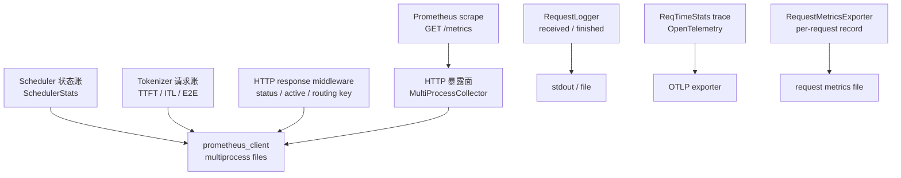

# 可观测性

## 读者任务

这一组笔记解决生产排障里最常见的问题：同一个 SGLang 实例里，哪些信号来自 HTTP 层，哪些来自 Scheduler，哪些来自 TokenizerManager，哪些只是请求日志或 trace 旁路。

读完要能做四件事：

- `/metrics` 抓不到数据时，能判断是没有挂载 scrape 入口、multiprocess 目录不对，还是指标根本没有被写入。
- Grafana 里看到 `cache_hit_rate`、`token_usage`、`num_queue_reqs` 时，能追到 Scheduler stats tick。
- 排查单请求慢时，能区分 TTFT、ITL、E2E、per-stage latency、RequestLogger 和 OpenTelemetry trace。
- 调试热更新、LoRA、HiCache、PD 分离时，知道对应指标是在 aggregate stats 里还是在请求完成时写入。

## 先建立模型

Observability 不是一个单独模块把所有信息收集起来，而是四本账并行写入：



这张图的读法是：`/metrics` 只是 scrape 入口；真正产生指标的是 Scheduler、TokenizerManager 和 HTTP middleware。RequestLogger、trace、request metrics exporter 是旁路，不能拿它们解释 Prometheus series 是否存在。

## 源码范围

| 责任 | 源码入口 |
|------|----------|
| CLI 开关、bucket、label 配置 | `python/sglang/srt/server_args.py` |
| `/metrics` 暴露、HTTP response middleware | `python/sglang/srt/utils/common.py`、`python/sglang/srt/entrypoints/http_server.py`、`python/sglang/srt/entrypoints/grpc_server.py` |
| Scheduler aggregate stats | `python/sglang/srt/managers/scheduler.py`、`python/sglang/srt/managers/scheduler_components/metrics_reporter.py` |
| Prometheus collector 类 | `python/sglang/srt/observability/metrics_collector.py` |
| 单请求时间账与 trace 切片 | `python/sglang/srt/observability/req_time_stats.py`、`python/sglang/srt/observability/trace.py` |
| 请求日志 | `python/sglang/srt/utils/request_logger.py` |
| 请求级离线导出 | `python/sglang/srt/observability/request_metrics_exporter.py` |

## 最小源码证据

HTTP worker 的 lifespan 里只在 `enable_metrics` 为真时挂载 Prometheus middleware，并启用函数计时。这证明 `/metrics` endpoint 本身受开关控制。

```python
# 来源：python/sglang/srt/entrypoints/http_server.py L273-L276
    # Add prometheus middleware
    if server_args.enable_metrics:
        add_prometheus_middleware(app)
        enable_func_timer()
```

真正的 `/metrics` 挂载在 `add_prometheus_middleware`，它使用 `multiprocess.MultiProcessCollector` 聚合多进程指标文件。

```python
# 来源：python/sglang/srt/utils/common.py L1589-L1599
def add_prometheus_middleware(app):
    # We need to import prometheus_client after setting the env variable `PROMETHEUS_MULTIPROC_DIR`
    from prometheus_client import CollectorRegistry, make_asgi_app, multiprocess

    registry = CollectorRegistry()
    multiprocess.MultiProcessCollector(registry)
    metrics_route = Mount("/metrics", make_asgi_app(registry=registry))

    # Workaround for 307 Redirect for /metrics
    metrics_route.path_regex = re.compile("^/metrics(?P<path>.*)$")
    app.routes.append(metrics_route)
```

所以排障时第一步不是问“哪个指标没写”，而是确认 scrape 入口是否存在、Prometheus multiprocess 目录是否在 import 前设置、相关 worker 是否真的写入了指标。还要先分清服务模式：HTTP 模式由 FastAPI 挂载 ASGI `/metrics`；gRPC 模式由独立 aiohttp sidecar 暴露 `/metrics`，端口和依赖兼容性都是额外故障面。

## 阅读顺序

| 目标 | 先读 |
|------|------|
| 第一次建立整体模型 | [[SGLang-可观测性-核心概念]] |
| 沿一次 scrape、一次 stats tick、一次请求完成追源码 | [[SGLang-可观测性-源码走读]] |
| 看跨进程与旁路数据流 | [[SGLang-可观测性-数据流]] |
| 排查 Grafana 无数据、TTFT 异常、label 爆炸、热更新指标 | [[SGLang-可观测性-排障指南]] |
| 自检是否真正读懂 | [[SGLang-可观测性-学习检查]] |

## 关联专题

- Scheduler 状态与 waiting/running batch 见 [[SGLang-Scheduler]]。
- TokenizerManager 请求生命周期见 [[SGLang-TokenizerManager]]。
- Radix cache 命中率语义见 [[SGLang-RadixAttention]]。
- 热更新暂停与权重加载指标见 [[SGLang-CheckpointEngine]]、[[SGLang-ModelLoader]]。
- Gateway 层指标边界见 [[SGLang-model-gateway]]。

## 下一步

先读 [[SGLang-可观测性-核心概念]]。如果你正在排障，直接跳到 [[SGLang-可观测性-排障指南]] 的症状表。
