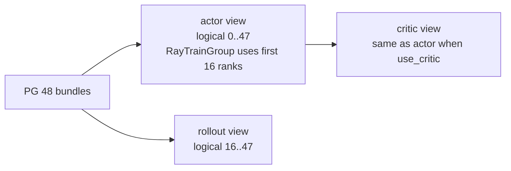
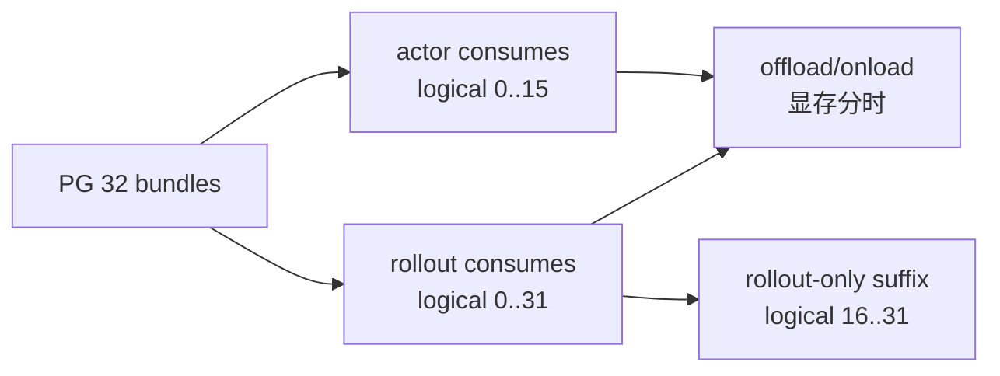
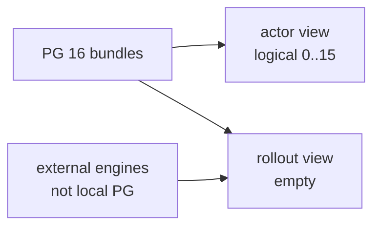

# PlacementGroup · 学习检查

这篇检查你是否能从启动参数推导 Ray 资源座位表。通过标准不是“看过源码”，而是能独立画出布局、解释切片、定位失败。

## 读者能做什么

- [ ] 能画出 `args -> (num_gpus, rollout_offset) -> raw PG -> reordered logical order -> actor/rollout/critic views`。
- [ ] 能解释 `reordered_bundle_indices` 和 `reordered_gpu_ids` 分别给谁消费。
- [ ] 能从 actor/rollout/debug/external/colocate 参数推导本地 PG 申请量。
- [ ] 能说明 colocate 是共享 bundle，但显存生命周期靠 offload/onload。
- [ ] 能算出 colocate 的共同前缀与较大一侧独占后缀，并解释 group 级 offload 判定。
- [ ] 能说明 critic 与 actor 复用 slot，以及当前恢复 id 只检查哪一侧。
- [ ] 能解释 external rollout 为什么本地 rollout view 是空切片。
- [ ] 能说出 3 个失败模式及其源码入口。
- [ ] 能运行或描述 placement group 布局测试，并说出预期结果。

## 手画图验收

普通分离：actor 16 GPU，rollout 32 GPU。



合格解释：

- `_get_placement_group_layout` 返回 `(48, 16)`。
- rollout view 是 `actor_pg_reordered_bundle_indices[16:]`。
- actor view 是完整 reordered list，但 training world size 只消费前 16 个 rank。
- critic view 复用 actor view。

colocate：actor 16 GPU，rollout 32 GPU。



合格解释：

- `_get_placement_group_layout` 返回 `(32, 0)`。
- actor 与 rollout 只在 logical 0..15 共同前缀重叠；16..31 是 rollout-only。
- 重叠前缀不是同时占满显存；需要 offload 生命周期。默认单个 rollout group 跨越边界时，当前 group-start 判定可能让整组一起 offload。

external：actor 16 GPU，外部 rollout server 另行部署。



合格解释：

- `_get_placement_group_layout` 返回 `(16, 16)`。
- rollout view 是从 16 开始的空切片。
- external 的 `rollout_num_gpus` 是外部 serving 容量，不是本地 PG 申请量。

## 场景推导题

### 题 1：普通分离

参数：

```text
actor_num_nodes = 2
actor_num_gpus_per_node = 8
rollout_num_gpus = 32
colocate = False
rollout_external = False
debug_train_only = False
debug_rollout_only = False
```

答案：`(num_gpus, rollout_offset) = (48, 16)`。

解释：actor 16，rollout 32，本地 PG 申请 48；rollout 从 logical 16 开始。

### 题 2：colocate rollout 少于 actor

参数：

```text
actor_num_nodes = 2
actor_num_gpus_per_node = 8
rollout_num_gpus = 8
colocate = True
```

答案：`(16, 0)`。

解释：共享 bundle，申请 max(16, 8)；rollout 从 0 开始。

### 题 3：colocate rollout 多于 actor

参数：

```text
actor_num_nodes = 1
actor_num_gpus_per_node = 8
rollout_num_gpus = 12
colocate = True
```

答案：`(12, 0)`。

解释：本地 PG 要容纳更大的 rollout 侧。actor world size 仍是 8，只消费前 8 个 rank；前 8 个是共同前缀，后 4 个是 rollout-only。

### 题 4：external rollout

参数：

```text
actor_num_nodes = 2
actor_num_gpus_per_node = 8
rollout_external = True
debug_rollout_only = False
```

答案：`(16, 16)`。

解释：本地只申请 actor；rollout view 为空。

### 题 5：zero rollout non-colocate

参数：

```text
actor_num_nodes = 2
actor_num_gpus_per_node = 8
rollout_num_gpus = 0
colocate = False
```

答案：`(16, 16)`。

解释：不是 rollout-only，而是训练侧仍申请 16，rollout view 为空。

## 失败模式验收

| 现象 | 合格解释 | 源码入口 |
|------|----------|----------|
| 一直打印 `Waiting for placement group` | PG pending，Ray 可用 GPU 不足或 autoscaler 还没完成；等待无上限 | `slime/ray/placement_group.py` L51-L67 |
| external 仍想找本地 rollout bundle | external 下 rollout view 应为空；应检查参数校验是否设置了 `rollout_external` | `slime/ray/placement_group.py` L106-L109 |
| colocate OOM | PG 共享不等于显存能同时占满；继续查 offload/onload | `slime/utils/arguments.py` L1885-L1901 |
| SGLang engine 坐错 GPU | 应按 rollout view 的 `reordered_bundle_indices[gpu_index]` 调度 | `slime/ray/rollout.py` L154-L187 |
| Megatron rank 坐错 bundle | RayTrainGroup 应按 `reordered_bundle_indices[rank]` 调度 | `slime/ray/actor_group.py` L105-L116 |
| actor/critic resume id 不一致却未报错 | use_critic 时只选 critic ids 并检查 critic rank 内一致，actor ids 未交叉比较 | `slime/ray/placement_group.py` L189-L208 |
| delta update + colocate 报错 | delta 与 colocate 不兼容，colocate 使用 CUDA IPC handle | `slime/utils/arguments.py` L1988-L1997 |

## 运行验证

布局单测：

```powershell
Set-Location slime
python -m pytest tests/test_placement_group.py -q
```

预期：

- 10 个布局参数化 case 通过。
- 0 GPU PG 返回 `(None, [], [])`。

缺少 Ray 时，用当前源码函数本体做 import-free 静态替代：

```powershell
Set-Location slime
@'
import ast
from argparse import Namespace
from pathlib import Path

path = Path("slime/ray/placement_group.py")
tree = ast.parse(path.read_text(encoding="utf-8"))
fn = next(n for n in tree.body if isinstance(n, ast.FunctionDef) and n.name == "_get_placement_group_layout")
ns = {}
exec(compile(ast.Module(body=[fn], type_ignores=[]), str(path), "exec"), ns)
layout = ns["_get_placement_group_layout"]
base = dict(actor_num_nodes=2, actor_num_gpus_per_node=8, rollout_num_gpus=32,
            debug_train_only=False, debug_rollout_only=False,
            colocate=False, rollout_external=False)
cases = [({}, (48, 16)), ({"debug_train_only": True}, (16, 0)),
         ({"debug_rollout_only": True}, (32, 0)),
         ({"colocate": True, "rollout_num_gpus": 8}, (16, 0)),
         ({"colocate": True, "rollout_num_gpus": 32}, (32, 0)),
         ({"rollout_num_gpus": 0}, (16, 16)),
         ({"rollout_external": True}, (16, 16)),
         ({"rollout_external": True, "debug_rollout_only": True}, (0, 0))]
for overrides, expected in cases:
    assert layout(Namespace(**(base | overrides))) == expected
print(f"{len(cases)} static layout cases passed")
'@ | python -
```

预期打印 `8 static layout cases passed`。这只验证纯布局函数，不证明 Ray 的 PG ready、InfoActor 绑卡或 SGLang child task 调度。

参数校验：

```powershell
Set-Location slime
python -m pytest tests/test_megatron_argument_validation.py -q
```

预期：

- colocate 保留 `rollout_num_gpus=0`。
- colocate 自动打开 `offload_train` 和 `offload_rollout`。
- delta update 在 colocate 下报错。

role config：

```powershell
Set-Location slime
python -m pytest tests/utils/test_megatron_role_config.py -q
```

预期：

- actor role override 能进入 `create_training_models`。
- 未启用 critic 时返回 `critic_model is None`。
- `start_rollout_id` 能从 init 返回值写回 args。

当前环境若缺 `sglang` 或 `ray`，该组会在 import/collection 阶段失败；此时只记录依赖限制，并以完整阅读测试体和 `create_training_models` 源码作为静态证据。

## 通过标准

通过本专题的标准是能完成这四件事：

1. 给一组 args，推导 `(num_gpus, rollout_offset)`。
2. 画出 actor、rollout、critic 三个 view 的关系。
3. 解释 RayTrainGroup 和 ServerGroup 分别如何消费 reordered bundle。
4. 遇到资源卡住、colocate OOM、external 空 view、rank 错位、resume id 不一致时，能回到 [[Slime-PlacementGroup-排障指南]] 找到源码入口。

下一篇建议读 [[Slime-RayTrainGroup]]，把资源座位表接到训练 rank actor 的生命周期。
