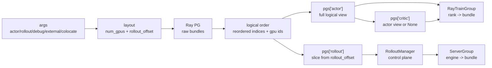

# PlacementGroup · 数据流

## 你为什么要读

这篇回答“PG 字典如何流过系统”。读者不需要记住每个函数名，而要能看懂一个 bundle slot 如何先被 Ray 预订，再被切成 actor、rollout、critic 视图，最后落到 Megatron rank 或 SGLang engine。

## 总览图



关键点：`pgs` 里三个角色通常不是三套 PG，而是同一个 `pg` 加不同的重排列表。

## 启动顺序

`train.py` 先创建 PG，再创建 RolloutManager，再创建训练模型。

```python
# 来源：train.py L9-L20
def train(args):
    configure_logger()
    # allocate the GPUs
    pgs = create_placement_groups(args)
    init_tracking(args)

    # create the rollout manager, with sglang engines inside.
    # need to initialize rollout manager first to calculate num_rollout
    rollout_manager, num_rollout_per_epoch = create_rollout_manager(args, pgs["rollout"])

    # create the actor and critic models
    actor_model, critic_model = create_training_models(args, pgs, rollout_manager)
```

这解释了为什么 PG 专题位于 Ray 编排的入口：后面的 RolloutManager 和 RayTrainGroup 都只消费 PG 产物，不重新决定全局资源布局。

## 布局流：args 到本地 Ray 资源申请量

| 场景 | 本地 PG 申请量 | rollout 视图 |
|------|----------------|--------------|
| 普通分离 | `actor_num_gpus + rollout_num_gpus` | 从 actor 后面开始 |
| colocate | `max(actor_num_gpus, rollout_num_gpus)` | 从 0 开始；仅共同前缀重叠，较大一侧保留独占后缀 |
| external | `actor_num_gpus` | 空切片 |
| debug rollout only | `rollout_num_gpus` | 全部给 rollout |
| debug train only | `actor_num_gpus` | 与 actor 相同，但下游不启动 rollout |
| zero rollout non-colocate | `actor_num_gpus` | 空切片 |

源码入口：

```python
# 来源：slime/ray/placement_group.py L100-L117
def _get_placement_group_layout(args) -> tuple[int, int]:
    actor_num_gpus = args.actor_num_nodes * args.actor_num_gpus_per_node

    if args.debug_train_only:
        return actor_num_gpus, 0

    if args.rollout_external:
        if args.debug_rollout_only:
            return 0, 0
        return actor_num_gpus, actor_num_gpus

    if args.debug_rollout_only:
        return args.rollout_num_gpus, 0

    if args.colocate:
        return max(actor_num_gpus, args.rollout_num_gpus), 0

    return actor_num_gpus + args.rollout_num_gpus, actor_num_gpus
```

测试中的默认参数是 actor 16 张 GPU、rollout 32 张 GPU，所以普通分离结果是 `(48, 16)`。

```python
# 来源：tests/test_placement_group.py L16-L27
def _args(**overrides):
    values = {
        "actor_num_nodes": 2,
        "actor_num_gpus_per_node": 8,
        "rollout_num_gpus": 32,
        "debug_train_only": False,
        "debug_rollout_only": False,
        "colocate": False,
        "rollout_external": False,
    }
    values.update(overrides)
    return Namespace(**values)
```

## 拓扑流：raw bundle 到 logical order

Ray PG 创建的是 raw bundles；Slime 接着用 `InfoActor` 探测每个 bundle 的节点和 GPU，再排序。

```python
# 来源：slime/ray/placement_group.py L47-L67
bundles = [{"GPU": 1, "CPU": 1} for _ in range(num_gpus)]
pg = placement_group(bundles, strategy="PACK")
num_bundles = len(bundles)

# Wait for the placement group to be scheduled. Poll rather than a bare
# ray.get(pg.ready()) so the wait is observable: when it can't be placed yet
# (a node's GPUs haven't registered with the GCS, or an autoscaler is still
# bringing nodes up) log the GPU counts periodically instead of hanging with no
# output. The wait stays unbounded, so autoscaling clusters — where a pending
# placement group is what drives scale-up — are unaffected.
ready_ref = pg.ready()
elapsed = 0
log_interval = 30
while not ray.wait([ready_ref], timeout=log_interval)[0]:
    elapsed += log_interval
    total = ray.cluster_resources().get("GPU", 0)
    available = ray.available_resources().get("GPU", 0)
    logger.info(
        f"Waiting for placement group of {num_gpus} GPUs (elapsed {elapsed}s): "
        f"{total:g} GPUs registered with Ray, {available:g} available."
    )
```

探测和排序后返回两个列表：

```python
# 来源：slime/ray/placement_group.py L69-L88
# use info actor to get the GPU id
info_actors = []
for i in range(num_bundles):
    info_actors.append(
        InfoActor.options(
            scheduling_strategy=PlacementGroupSchedulingStrategy(
                placement_group=pg,
                placement_group_bundle_index=i,
            ),
        ).remote()
    )
gpu_ids = ray.get([actor.get_ip_and_gpu_id.remote() for actor in info_actors])
for actor in info_actors:
    ray.kill(actor)

bundle_infos = [(i, gpu_ids[i][0], gpu_ids[i][1]) for i in range(num_bundles)]
sorted_bundle_infos = sorted(bundle_infos, key=sort_key)
pg_reordered_bundle_indices = [info[0] for info in sorted_bundle_infos]
# Map from logical index -> physical GPU ID
pg_reordered_gpu_ids = [gpu_ids[info[0]][1] for info in sorted_bundle_infos]
```

| 列表 | 谁消费 | 作用 |
|------|--------|------|
| `reordered_bundle_indices` | RayTrainGroup、ServerGroup | 传给 `PlacementGroupSchedulingStrategy` |
| `reordered_gpu_ids` | ServerGroup、日志 | 计算 SGLang `base_gpu_id`，帮助排查拓扑 |

## 视图流：一个 PG 切成三个角色视图

角色视图在 `create_placement_groups` 里形成。

```python
# 来源：slime/ray/placement_group.py L123-L137
num_gpus, rollout_offset = _get_placement_group_layout(args)

logger.info(f"Creating placement group with {num_gpus} GPUs...")
pg, actor_pg_reordered_bundle_indices, actor_pg_reordered_gpu_ids = _create_placement_group(num_gpus)
rollout_pg_reordered_bundle_indices = actor_pg_reordered_bundle_indices[rollout_offset:]
rollout_pg_reordered_gpu_ids = actor_pg_reordered_gpu_ids[rollout_offset:]

result = {
    "actor": (pg, actor_pg_reordered_bundle_indices, actor_pg_reordered_gpu_ids),
    "rollout": (pg, rollout_pg_reordered_bundle_indices, rollout_pg_reordered_gpu_ids),
}

result["critic"] = result["actor"] if args.use_critic else None

return result
```

三种典型形状：

| 模式 | actor view | rollout view | critic view |
|------|------------|--------------|-------------|
| 分离 | `0..A+R-1` 的完整 logical 列表 | 从 `A` 开始的后缀 | actor view 或 None |
| colocate | 长度 `max(A,R)` 的完整列表，但训练只消费前 A | 同一列表，rollout 配置只消费前 R | actor view 或 None |
| external | actor logical 列表 | 空列表 | actor view 或 None |

注意：actor view 是完整 logical 列表，但 RayTrainGroup 只按 `world_size` 消费前 `A=actor_num_nodes * actor_num_gpus_per_node` 个 rank。colocate 的交集因此是前 `min(A,R)`，不是无条件全量重合。critic 的 world size 被参数校验强制等于 actor，并复用同一前缀。

## rollout 消费流：RolloutManager 到 ServerGroup

RolloutManager 本身是控制面 actor，不占 GPU。

```python
# 来源：slime/ray/placement_group.py L220-L230
def create_rollout_manager(args, pg):
    from .rollout import RolloutManager

    rollout_manager_options = {
        "num_cpus": 1,
        "num_gpus": 0,
        "runtime_env": {"env_vars": add_default_ray_env_vars()},
    }
    if getattr(args, "rollout_data_transport", "object-store") == "nixl":
        rollout_manager_options["enable_tensor_transport"] = True
    rollout_manager = RolloutManager.options(**rollout_manager_options).remote(args, pg)
```

SGLang engine actor 才使用 rollout 视图中的 bundle。

```python
# 来源：slime/ray/rollout.py L154-L187
num_gpu_per_engine = min(self.num_gpus_per_engine, self.args.num_gpus_per_node)

pg, reordered_bundle_indices, reordered_gpu_ids = self.pg
validate_server_group_gpu_indices(
    worker_type=self.worker_type,
    gpu_offset=self.gpu_offset,
    num_gpus_per_engine=self.num_gpus_per_engine,
    num_gpu_per_engine=num_gpu_per_engine,
    num_engines=len(self.all_engines),
    num_available_gpus=len(reordered_gpu_ids),
    rollout_num_gpus=self.args.rollout_num_gpus,
    rollout_num_gpus_per_engine=self.args.rollout_num_gpus_per_engine,
)

RolloutRayActor = ray.remote(SGLangEngine)

rollout_engines = []
for i in range(len(self.all_engines)):
    if self.all_engines[i] is not None:
        continue

    global_rank = self.rank_offset + i
    num_gpus = 0.2
    num_cpus = num_gpus

    # Get the base GPU ID from placement group using gpu_offset.
    gpu_index = self.gpu_offset + i * num_gpu_per_engine
    base_gpu_id = int(reordered_gpu_ids[gpu_index])

    scheduling_strategy = PlacementGroupSchedulingStrategy(
        placement_group=pg,
        placement_group_capture_child_tasks=True,
        placement_group_bundle_index=reordered_bundle_indices[gpu_index],
    )
```

## overlap 流：rollout 内部再判断是否与 Megatron 重叠

EngineTopology 需要知道某个 rollout group 是否和 Megatron GPU 范围重叠，用于 `needs_offload`。

```python
# 来源：slime/ray/rollout.py L1073-L1086
def _compute_rollout_offset(args) -> int:
    """Offset (in PG bundle slots) where rollout GPUs start."""
    if args.debug_train_only or args.debug_rollout_only or args.colocate:
        return 0
    offset = args.actor_num_nodes * args.actor_num_gpus_per_node
    return offset


def _compute_megatron_num_gpus(args) -> int:
    """Total number of megatron (actor + critic) GPU slots in the placement group."""
    if args.debug_rollout_only:
        return 0
    num = args.actor_num_nodes * args.actor_num_gpus_per_node
    return num
```

下游用它计算每组 engine 的绝对起点：

```python
# 来源：slime/ray/rollout.py L1113-L1140
# Compute megatron GPU range for per-group offload decisions.
rollout_pg_offset = _compute_rollout_offset(args)
megatron_num_gpus = _compute_megatron_num_gpus(args)

for model_idx, model_cfg in enumerate(config.models):
    model_cfg.resolve(args)

    has_pd = model_cfg.has_pd_disaggregation
    router_ip, router_port = _start_router(args, has_pd_disaggregation=has_pd, force_new=(model_idx > 0))

    # Write back for backward compat (first model only).
    if model_idx == 0:
        args.sglang_router_ip = router_ip
        args.sglang_router_port = router_port

    server_groups: list[ServerGroup] = []
    port_cursors: dict[int, int] = {}

    has_epd = model_cfg.has_encoder_disaggregation

    def _make_group(group_cfg, router_ip, router_port, overrides_extra=None):
        nonlocal engine_offset, gpu_offset
        gpus_per_engine = group_cfg.num_gpus_per_engine
        num_gpu_per_engine_local = min(gpus_per_engine, args.num_gpus_per_node)
        num_engines = group_cfg.num_gpus // num_gpu_per_engine_local

        group_abs_start = rollout_pg_offset + gpu_offset
        needs_offload = args.offload_rollout and group_abs_start < megatron_num_gpus
```

这解释了两个容易混的点：PlacementGroup 切的是 rollout 视图；EngineTopology 再在 rollout 视图内部按 group 切段。`megatron_num_gpus` 虽然 docstring 写 actor+critic，数值只取 actor GPU 数，因为 critic 复用相同 slot，并不相加。`needs_offload` 也只比较 group 的绝对起点，没有计算 group 区间与 Megatron 区间的精确交集；一个跨越边界的 group 会整体被标记。

## training 消费流：RayTrainGroup rank 到 bundle

训练侧拿 actor 或 critic 视图，按 rank 绑定 bundle。

```python
# 来源：slime/ray/actor_group.py L48-L62
def _allocate_gpus_for_actor(self, pg, num_gpus_per_actor):
    world_size = self._num_nodes * self._num_gpus_per_node

    # Use placement group to lock resources for models of same type
    assert pg is not None
    pg, reordered_bundle_indices, _reordered_gpu_ids = pg

    env_vars = {
        # because sglang will always set NCCL_CUMEM_ENABLE to 0
        # we need also set it to 0 to prevent nccl error.
        "NCCL_CUMEM_ENABLE": os.environ.get("NCCL_CUMEM_ENABLE", "0"),
        "NVTE_FP8_BLOCK_SCALING_FP32_SCALES": os.environ.get("NVTE_FP8_BLOCK_SCALING_FP32_SCALES", "1"),
        **{name: "1" for name in NOSET_VISIBLE_DEVICES_ENV_VARS_LIST},
        **self.args.train_env_vars,
    }
```

```python
# 来源：slime/ray/actor_group.py L105-L119
# Create worker actors
self._actor_handlers = []
master_addr, master_port = None, None
for rank in range(world_size):
    actor = TrainRayActor.options(
        num_cpus=num_gpus_per_actor,
        num_gpus=num_gpus_per_actor,
        scheduling_strategy=PlacementGroupSchedulingStrategy(
            placement_group=pg,
            placement_group_bundle_index=reordered_bundle_indices[rank],
        ),
    ).remote(world_size, rank, master_addr, master_port)
    if rank == 0:
        master_addr, master_port = ray.get(actor.get_master_addr_and_port.remote())
    self._actor_handlers.append(actor)
```

如果 actor world size 大于视图长度，这里会在索引或 Ray 调度阶段暴露；因此 `actor_num_nodes * actor_num_gpus_per_node` 必须和 PG 布局匹配。

## 训练初始化流：选择 rollout id 后才进入主循环

`create_training_models` 不只创建资源，还会初始化 actor/critic，并确定 `start_rollout_id`。需要特别注意：启用 critic 时，代码选择 critic 返回列表，只验证 critic 各 rank 一致；actor 返回的 ids 没有与 critic 做交叉比较。

```python
# 来源：slime/ray/placement_group.py L189-L217
        critic_start_rollout_ids = ray.get(critic_model.async_init(critic_model.args, role="critic", with_ref=False))

    actor_start_rollout_ids = ray.get(
        actor_model.async_init(
            actor_args,
            role="actor",
            with_ref=actor_args.kl_coef != 0 or actor_args.use_kl_loss,
            with_opd_teacher=actor_args.use_opd and actor_args.opd_type == "megatron",
        )
    )
    # TODO how to decide rollout start id when critic is involved? For now we just require user to specify it via args.
    if args.use_critic:
        start_rollout_ids = critic_start_rollout_ids
    else:
        start_rollout_ids = actor_start_rollout_ids

    assert len(set(start_rollout_ids)) == 1

    if args.start_rollout_id is None:
        args.start_rollout_id = start_rollout_ids[0]

    actor_model.set_rollout_manager(rollout_manager)
    if args.use_critic:
        critic_model.set_rollout_manager(rollout_manager)

    if args.rollout_global_dataset:
        ray.get(rollout_manager.load.remote(args.start_rollout_id - 1))

    return actor_model, critic_model
```

数据流结论：

- PG 先决定“进程坐哪里”。
- RolloutManager 先于 training models，因为可能要推导 `num_rollout`。
- Training models 初始化后才确定 resume 的 `start_rollout_id`；启用 critic 时默认采用 critic id，不能把当前 assert 误读为 actor/critic 一致性证明。
- global dataset load 要等这个 id 确定。

## 验证抓手

运行：

```powershell
Set-Location slime
python -m pytest tests/test_placement_group.py -q
```

预期看到：

- `normal_non_colocate` 是 `(48, 16)`。
- `external` 是 `(16, 16)`，意味着 rollout 视图为空。
- `colocate_rollout_more_than_actor` 是 `(32, 0)`，意味着本地 PG 按 rollout 较大值申请。
- `test_create_zero_gpu_placement_group_is_empty` 证明 0 GPU 路径返回 `(None, [], [])`。

下一篇 [[Slime-PlacementGroup-排障指南]] 按症状反查这些流。
