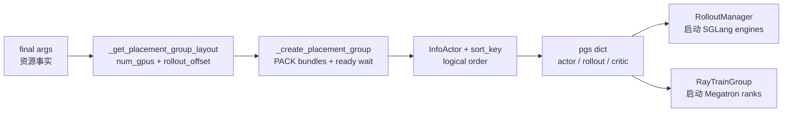
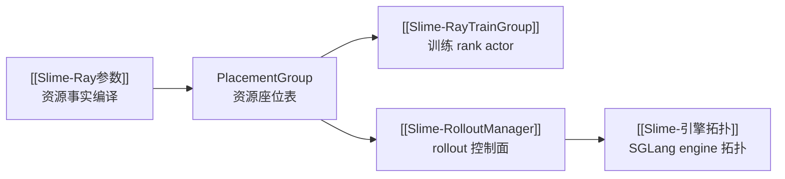

# PlacementGroup

## 你为什么要读

这组文档解决一个具体问题：Slime 启动时已经有了最终 args，Ray 到底会申请多少 GPU、哪些角色看见哪些 bundle、colocate 和 external 为什么不是简单加减 GPU？

读完后，你应该能排查四类问题：

- 启动一直打印 `Waiting for placement group`。
- colocate 下 actor 和 rollout 为什么只共享共同前缀，较大一侧仍可能有独占后缀，以及为什么重叠部分需要 offload 分时使用显存。
- external rollout 为什么不会在本地 Ray PG 里申请 rollout GPU。
- RayTrainGroup 和 SGLang engine 为什么必须使用同一套重排后的 bundle 顺序。

## 主线地图



把 PlacementGroup 当成“资源座位表编译器”：输入是参数校验后的资源事实，输出不是裸 Ray PG，而是同一个 PG 的多个角色视图。每个视图都是 `(pg, reordered_bundle_indices, reordered_gpu_ids)`。

## 阅读顺序

| 文档 | 读者任务 |
|------|----------|
| [[Slime-PlacementGroup-核心概念]] | 建立 PG、bundle、逻辑顺序、角色视图、colocate/external 的模型 |
| [[Slime-PlacementGroup-源码走读]] | 沿 `train.py` 启动主线读资源如何被申请、重排、切片、消费 |
| [[Slime-PlacementGroup-数据流]] | 对照 actor、rollout、critic、SGLang engine、RayTrainGroup 的数据流 |
| [[Slime-PlacementGroup-排障指南]] | 按启动卡住、GPU 数不对、colocate OOM、external 误申请等症状排障 |
| [[Slime-PlacementGroup-学习检查]] | 用场景推导和命令验证自己是否掌握 |

## 源码范围

| 源码入口 | 本专题关注点 |
|----------|--------------|
| `train.py` L9-L20 | PG 在启动链中的位置：先于 RolloutManager 和 Training models |
| `slime/ray/placement_group.py` L42-L97 | 创建 PG、等待 ready、InfoActor 探测、bundle 重排 |
| `slime/ray/placement_group.py` L100-L137 | 资源布局规则、actor/rollout/critic 三元组 |
| `slime/ray/placement_group.py` L140-L217 | actor/critic RayTrainGroup 创建、start rollout id 对齐 |
| `slime/ray/placement_group.py` L220-L246 | RolloutManager 创建、`num_rollout` 推导、权重检查、rollout offload |
| `slime/ray/actor_group.py` L48-L116 | RayTrainGroup 如何按 reordered bundle index 创建训练 rank |
| `slime/ray/rollout.py` L137-L187 | SGLang engine 如何按 rollout 视图绑定 bundle |
| `slime/ray/rollout.py` L1073-L1086 | rollout 侧重新计算 actor/rollout overlap |
| `tests/test_placement_group.py` L30-L50 | 布局矩阵的单测事实 |

## 不变量

| 不变量 | 为什么重要 |
|--------|------------|
| Slime 只创建一个主 PG，再切 actor/rollout/critic 视图 | 下游不能假设 actor、critic、rollout 是三套互不相关的物理资源池 |
| `rollout_offset` 只决定 rollout 视图从哪里开始切 | 它不是物理 GPU id，也不是 SGLang engine id |
| `reordered_bundle_indices` 用于 Ray scheduling | 训练 rank 和 SGLang engine 都必须消费同一套逻辑顺序 |
| `reordered_gpu_ids` 用于调试和 engine base GPU id | 它帮助 Ray bundle 顺序与物理 GPU 对齐 |
| colocate 共享的是 logical 0 起始的共同前缀 | 若两侧 GPU 数不同，较大一侧还有不重叠后缀；重叠部分需要 offload 生命周期 |
| critic 与 actor 复用同一前缀 | 当前二者各以 0.4 GPU 的 Ray 份额绑定同一 bundle，`use_critic` 会强制 `offload_train` |
| external rollout 不占本地 rollout PG | `rollout_num_gpus` 在 external 场景更多是逻辑 serving 容量 |

## 运行验证入口

轻量验证优先跑布局单测：

```powershell
Set-Location slime
python -m pytest tests/test_placement_group.py -q
```

如果本地缺少 Ray，该测试会在 import 阶段失败；这属于环境依赖问题，不代表文档引用错误。本库当前 Windows 环境即因缺 `ray` 在 collection 阶段受阻，已改用从当前源码 AST 抽取 `_get_placement_group_layout` 的静态执行，10 个矩阵 case 全部通过。

参数校验相关的 colocate 边界可跑：

```powershell
Set-Location slime
python -m pytest tests/test_megatron_argument_validation.py -q
```

预期现象：

- colocate 下 `rollout_num_gpus=0` 会保留为 0，但 offload 标志被打开。
- delta weight update 会拒绝 colocate。
- placement group 矩阵固定 normal、debug、external、colocate 的 `(num_gpus, rollout_offset)`。

`tests/utils/test_megatron_role_config.py` 还依赖 `sglang` 与 `ray`；缺依赖时只能做源码交叉核对，不能记录为测试通过。

## 衔接



下一篇先读 [[Slime-PlacementGroup-核心概念]]。
