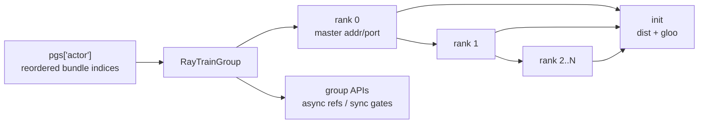

# RayTrainGroup · 学习检查

这篇检查你是否能独立解释 RayTrainGroup 的 rank actor 编排和 API 同步边界。

## 读者能做什么

- [ ] 能画出 `PG 三元组 -> RayTrainGroup -> rank actor -> TrainRayActor.init`。
- [ ] 能解释 rank 0 master addr/port 如何传播到其他 rank。
- [ ] 能说明 `LOCAL_RANK` 为什么要通过 `CUDA_VISIBLE_DEVICES` 映射。
- [ ] 能区分 `async_init`、`async_train` 与 `update_weights`、`save_model`、`onload/offload` 的返回语义。
- [ ] 能解释 critic values refs 如何作为 actor `external_data`。
- [ ] 能说明 offload_train 的 `LD_PRELOAD` 在 actor 创建前注入。
- [ ] 能说出 3 个失败模式及其源码入口。

## 手画图验收



合格解释：

- `world_size = num_nodes * num_gpus_per_node`。
- 每个 rank 用 `reordered_bundle_indices[rank]` 调度。
- rank 0 创建后 driver 取 `get_master_addr_and_port`，再传给后续 rank。
- `init` 才执行 `dist.init_process_group`。

## API 边界验收

| API | 是否内部 `ray.get` | 原因 |
|-----|--------------------|------|
| `async_init` | 否 | API 让 caller 决定等待；当前 caller 仍按 critic 后 actor 的顺序等待 |
| `async_train` | 否 | 让 caller 组合 critic values 和 actor train |
| `save_model` | 是 | 保存必须跨 rank 完成 |
| `update_weights` | 是 | 下一轮 generate 前必须完成 |
| `onload` | 是 | 显存生命周期必须一致 |
| `offload` | 是 | 显存生命周期必须一致 |
| `clear_memory` | 是 | 所有 rank 都要清理完 |
| `set_rollout_manager` | 是 | handle 和 parallel config 要下发完成 |

## 场景推导题

### 题 1：actor 2 节点，每节点 8 卡

答案：

- world size 是 16。
- RayTrainGroup 创建 16 个 actor。
- rank `i` 绑定 `reordered_bundle_indices[i]`。
- rank 0 先返回 master addr/port。

源码入口：`slime/ray/actor_group.py` L48-L119。

### 题 2：PPO 有 critic

答案：

- driver 先 `critic_model.async_train` 得到 `value_refs`。
- 如果 actor 本轮训练，把 `value_refs` 作为 actor `external_data`。
- actor group 按位置把第 `i` 个 critic ref 交给第 `i` 个 actor rank，再返回 actor refs 供 driver `ray.get`。

源码入口：`train.py` L72-L82、`slime/ray/actor_group.py` L131-L149。

### 题 3：异步训练准备 update weights

答案：

- 如果已有预取的 generate future，先 `ray.get` drain。
- 置空 `rollout_data_next_future`。
- 再调用 `actor_model.update_weights()`。

源码入口：`train_async.py` L65-L70。

### 题 4：offload_train 打开但 actor 创建前报错

答案：

- 先查 `torch_memory_saver` 动态库是否在预期路径。
- `LD_PRELOAD` 在 `_allocate_gpus_for_actor` 里写入 runtime env。
- 找不到 `.so` 会直接 `FileNotFoundError`。

源码入口：`slime/ray/actor_group.py` L64-L84。

## 失败模式验收

| 现象 | 合格解释 | 源码入口 |
|------|----------|----------|
| distributed init 卡住 | master addr/port、rank/world env 或端口连通性问题 | `slime/ray/train_actor.py` L28-L70 |
| rank 到 GPU 不符合预期 | 查 PG reordered bundle 与 RayTrainGroup rank 绑定 | `slime/ray/actor_group.py` L105-L116 |
| actor train 没拿到 critic values | `external_data` list 长度或 refs 传递错误 | `slime/ray/actor_group.py` L131-L149 |
| update 后 rollout 仍旧权重 | `update_weights` 必须在 generate 前完成；async train 要先 drain generate | `train.py` L83-L92、`train_async.py` L65-L70 |
| critic routing replay 无效 | env 只给 actor role 注入 | `slime/ray/actor_group.py` L86-L88 |
| `LOCAL_RANK` 错 | Ray CVD 映射和 local ordinal 关系错误 | `slime/ray/train_actor.py` L20-L49 |
| RolloutManager 缺 train parallel config | rank 0 `set_rollout_manager` 未成功 | `slime/ray/train_actor.py` L125-L128 |

## 运行验证

轻量验证：

```powershell
Set-Location slime
python -m pytest tests/test_megatron_argument_validation.py -q
```

依赖完整时再跑：

```powershell
Set-Location slime
python -m pytest tests/utils/test_megatron_role_config.py -q
```

预期：

- 参数校验测试通过，覆盖 colocate/offload/delta 等边界。
- role config 测试在有 `ray`、`sglang` 依赖时验证 `create_training_models` 的 actor override 路径。

当前基线实测：参数校验 `14 passed`；role config 的 6 个用例在 import 阶段失败，其中 5 个缺 `sglang`、1 个缺 `ray`。

缺少运行依赖时，可执行不 import 业务模块的 AST 替代检查：

```powershell
Set-Location slime
@'
import ast
from pathlib import Path

tree = ast.parse(Path("slime/ray/actor_group.py").read_text(encoding="utf-8"))
group = next(node for node in tree.body if isinstance(node, ast.ClassDef) and node.name == "RayTrainGroup")
methods = {node.name: node for node in group.body if isinstance(node, ast.FunctionDef)}
assert "async_train" in methods and "update_weights" in methods
assert not any(isinstance(node, ast.Call) and isinstance(node.func, ast.Attribute) and node.func.attr == "get" for node in ast.walk(methods["async_train"]))
assert any(isinstance(node, ast.Call) and isinstance(node.func, ast.Attribute) and node.func.attr == "get" for node in ast.walk(methods["update_weights"]))
assert any(isinstance(node, ast.Assert) for node in ast.walk(methods["async_train"]))
print("AST_OK")
'@ | python -
```

预期输出：`AST_OK`。它只验证 async/sync 控制边界和 list 长度断言，不能替代有 Ray 集群时的 actor 行为测试。

## 通过标准

通过本专题的标准是能完成四件事：

1. 给一个 PG 三元组和 actor world size，解释 rank actor 如何被创建。
2. 给一段训练循环，指出哪些调用返回 refs，哪些调用已经同步完成。
3. 给一个 master/LOCAL_RANK/distributed init 问题，定位到 actor 构造还是 actor init。
4. 给一个 PPO critic 场景，解释 `value_refs` 如何进入 actor train。

下一篇建议读 [[Slime-Megatron-Actor初始化]]，把 Ray actor 编排接到 Megatron 模型初始化。
