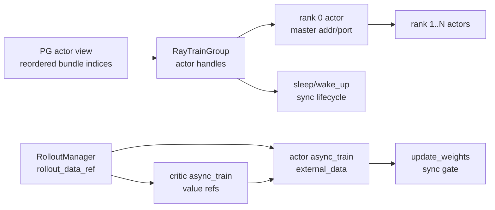

# RayTrainGroup · 数据流

## 你为什么要读

这篇把 RayTrainGroup 放回训练闭环。读者要能回答：driver 发出的一个 `async_train` 怎么到每个 rank，critic values 怎么回到 actor，`update_weights` 为什么是同步闸门，offload/onload 为什么也不能悬空。

## 总览图



关键分界：训练数据流可以用 ObjectRef 异步组织；权重和生命周期流必须同步完成。

## 创建流：PG 到 rank actor

RayTrainGroup 解包 [[Slime-PlacementGroup]] 产出的 PG 三元组，并把每个 rank 调度到对应 bundle。

```python
# 来源：slime/ray/actor_group.py L48-L62
def _allocate_gpus_for_actor(self, pg, num_gpus_per_actor):
    world_size = self._num_nodes * self._num_gpus_per_node

    # Use placement group to lock resources for models of same type
    assert pg is not None
    pg, reordered_bundle_indices, _reordered_gpu_ids = pg

    env_vars = {
        # because sglang will always set NCCL_CUMEM_ENABLE to 0
        # we need also set it to 0 to prevent nccl error.
        "NCCL_CUMEM_ENABLE": os.environ.get("NCCL_CUMEM_ENABLE", "0"),
        "NVTE_FP8_BLOCK_SCALING_FP32_SCALES": os.environ.get("NVTE_FP8_BLOCK_SCALING_FP32_SCALES", "1"),
        **{name: "1" for name in NOSET_VISIBLE_DEVICES_ENV_VARS_LIST},
        **self.args.train_env_vars,
    }
```

真正创建 actor 的地方：

```python
# 来源：slime/ray/actor_group.py L105-L119
# Create worker actors
self._actor_handlers = []
master_addr, master_port = None, None
for rank in range(world_size):
    actor = TrainRayActor.options(
        num_cpus=num_gpus_per_actor,
        num_gpus=num_gpus_per_actor,
        scheduling_strategy=PlacementGroupSchedulingStrategy(
            placement_group=pg,
            placement_group_bundle_index=reordered_bundle_indices[rank],
        ),
    ).remote(world_size, rank, master_addr, master_port)
    if rank == 0:
        master_addr, master_port = ray.get(actor.get_master_addr_and_port.remote())
    self._actor_handlers.append(actor)
```

数据形状：

| 字段 | 流向 | 含义 |
|------|------|------|
| `world_size` | driver -> every actor | 训练组 rank 总数 |
| `rank` | driver -> each actor | 当前 actor 的 global rank |
| `master_addr/master_port` | rank 0 actor -> driver -> other actors | torch distributed rendezvous |
| `reordered_bundle_indices[rank]` | PG view -> Ray scheduling | rank 绑定的 Ray bundle |

## init 流：actor 创建后才初始化 distributed

driver 通过 `create_training_models` 调用 `async_init`，再 `ray.get` 等待结果。

```python
# 定位骨架（据 `slime/ray/placement_group.py` L189-L208 删节）：
        critic_start_rollout_ids = ray.get(critic_model.async_init(critic_model.args, role="critic", with_ref=False))

    actor_start_rollout_ids = ray.get(
        actor_model.async_init(
            actor_args,
            role="actor",
            with_ref=actor_args.kl_coef != 0 or actor_args.use_kl_loss,
            with_opd_teacher=actor_args.use_opd and actor_args.opd_type == "megatron",
        )
    )
    # TODO how to decide rollout start id when critic is involved? For now we just require user to specify it via args.
    if args.use_critic:
        start_rollout_ids = critic_start_rollout_ids
    else:
        start_rollout_ids = actor_start_rollout_ids

    assert len(set(start_rollout_ids)) == 1
```

group 发起远程 init：

```python
# 来源：slime/ray/actor_group.py L121-L129
def async_init(self, args, role, with_ref=False, with_opd_teacher=False):
    """
    Allocate GPU resourced and initialize model, optimzier, local ckpt, etc.
    """
    self.args = args
    return [
        actor.init.remote(args, role, with_ref=with_ref, with_opd_teacher=with_opd_teacher)
        for actor in self._actor_handlers
    ]
```

actor 内部 `init` 才进入 distributed：

```python
# 来源：slime/ray/train_actor.py L58-L70
local_rank = int(os.environ.get("LOCAL_RANK", 0))
torch.cuda.set_device(f"cuda:{local_rank}")

backend = args.distributed_backend

dist.init_process_group(
    backend=backend,
    timeout=timedelta(minutes=args.distributed_timeout_minutes),
)
init_gloo_group()

args.rank = dist.get_rank()
args.world_size = dist.get_world_size()
```

这解释了一个常见误区：Ray actor 进程创建成功，不等于 distributed process group 已经创建成功。当前 caller 先等待 critic init，再发起并等待 actor init；`async_init` 的 API 名称不代表这两组在当前路径中并行初始化。恢复 ID 则由 `MegatronTrainRayActor.init()` 返回，基类 `TrainRayActor.init()` 本身不返回它。

## rollout data 流：一个 ObjectRef 广播给所有 rank

同步训练循环中，RolloutManager 先返回 `rollout_data_ref`，然后 RayTrainGroup 把这个 ref 传给每个训练 rank。

```python
# 来源：train.py L67-L81
rollout_data_ref = ray.get(rollout_manager.generate.remote(rollout_id))

if args.offload_rollout:
    ray.get(rollout_manager.offload.remote())

actor_trains_this_step = (not args.use_critic) or rollout_id >= args.num_critic_only_steps

if args.use_critic:
    value_refs = critic_model.async_train(rollout_id, rollout_data_ref)
    if actor_trains_this_step:
        ray.get(actor_model.async_train(rollout_id, rollout_data_ref, external_data=value_refs))
    else:
        ray.get(value_refs)
else:
    ray.get(actor_model.async_train(rollout_id, rollout_data_ref))
```

RayTrainGroup 不拆数据，只把同一个 ref 发给所有 actor。下面只截取控制分支，不摘录文档字符串：

```python
# 定位骨架（据 `slime/ray/actor_group.py` L131-L149 删去 docstring）：
def async_train(self, rollout_id, rollout_data_ref, external_data=None):
    if isinstance(external_data, list):
        assert len(external_data) == len(self._actor_handlers)
        return [
            actor.train.remote(rollout_id, rollout_data_ref, external_data=ed)
            for actor, ed in zip(self._actor_handlers, external_data, strict=False)
        ]
    return [
        actor.train.remote(rollout_id, rollout_data_ref, external_data=external_data)
        for actor in self._actor_handlers
    ]
```

| 数据 | 谁产生 | 谁消费 | 形态 |
|------|--------|--------|------|
| `rollout_data_ref` | RolloutManager | actor/critic ranks | 单个 Ray ObjectRef |
| `value_refs` | critic RayTrainGroup | actor RayTrainGroup | ObjectRef list；按 rank 位置一一传递 |
| `external_data` dict | driver 或调用方 | all ranks | 广播同一个对象 |
| `external_data` list | driver 或 critic refs | per rank | 长度必须等于 actor 数 |

## 权重流：`update_weights` 是同步闸门

`update_weights` 在 group 内部 `ray.get`，所以调用返回时所有 rank 的 `update_weights.remote()` 都已完成或抛错。源码 docstring 所称“rank 0 广播给其他 ranks”不符合当前默认后端：group 层只是扇出调用，Megatron actor 会取得 rollout engines 与锁，再由 weight updater 向 rollout 侧发布权重。

```python
# 来源：slime/ray/actor_group.py L155-L157
def update_weights(self):
    """Broadcast weights from rank 0 to all other ranks."""
    return ray.get([actor.update_weights.remote() for actor in self._actor_handlers])
```

同步训练循环在每轮训练后调用：

```python
# 来源：train.py L83-L92
if should_run_periodic_action(rollout_id, args.save_interval, num_rollout_per_epoch, args.num_rollout):
    save(rollout_id)

offload_train(actor_trains_this_step)
if args.offload_rollout:
    ray.get(rollout_manager.onload_weights.remote())
actor_model.update_weights()

if args.offload_rollout:
    ray.get(rollout_manager.onload_kv.remote())
```

异步训练循环为了避免生成时更新权重，会先 drain 预取的 rollout：

```python
# 来源：train_async.py L65-L69
if (rollout_id + 1) % args.update_weights_interval == 0:
    # sync generate before update weights to prevent update weight in the middle of generation
    rollout_data_curr_ref = ray.get(x) if (x := rollout_data_next_future) is not None else None
    rollout_data_next_future = None
    actor_model.update_weights()
```

这就是同步边界：训练数据可以异步排队，权重更新不能和正在生成的 rollout 交错。

## 生命周期流：save/onload/offload/clear_memory 都同步

这些 group API 都在内部等待所有 rank。

```python
# 来源：slime/ray/actor_group.py L151-L169
def save_model(self, rollout_id, force_sync=False):
    """Save actor model"""
    return ray.get([actor.save_model.remote(rollout_id, force_sync=force_sync) for actor in self._actor_handlers])

def update_weights(self):
    """Broadcast weights from rank 0 to all other ranks."""
    return ray.get([actor.update_weights.remote() for actor in self._actor_handlers])

def onload(self):
    return ray.get([actor.wake_up.remote() for actor in self._actor_handlers])

def offload(self):
    return ray.get([actor.sleep.remote() for actor in self._actor_handlers])

def clear_memory(self):
    return ray.get([actor.clear_memory.remote() for actor in self._actor_handlers])

def set_rollout_manager(self, rollout_manager):
    return ray.get([actor.set_rollout_manager.remote(rollout_manager) for actor in self._actor_handlers])
```

`clear_memory` 在 actor 里会跳过 debug rollout only，否则打印前后显存并调用通用清理函数；它不等于模型 offload。Megatron `sleep()` 还会清 host memory、按条件断开 rollout engines、销毁 process groups 并暂停 memory saver；`wake_up()` 则恢复 memory saver、重建 process groups，并把 actor 模型切回运行态。

```python
# 来源：slime/ray/train_actor.py L94-L99
def clear_memory(self):
    if self.args.debug_rollout_only:
        return
    print_memory("before TrainRayActor.clear_memory")
    clear_memory()
    print_memory("after TrainRayActor.clear_memory")
```

## parallel config 流：rank 0 上报给 RolloutManager

训练 actor 初始化后，group 会同步调用每个 rank 的 `set_rollout_manager`。每个 rank 都保存 handle，只有 rank 0 将训练并行配置推给 RolloutManager。

```python
# 来源：slime/ray/train_actor.py L125-L128
def set_rollout_manager(self, rollout_manager):
    self.rollout_manager = rollout_manager
    if not self.args.debug_rollout_only and self.args.rank == 0:
        ray.get(self.rollout_manager.set_train_parallel_config.remote(self.train_parallel_config))
```

这条流服务后续 batch 构造：RolloutManager 需要知道训练侧 DP/CP/VPP 等信息。

## 验证抓手

能跑依赖时：

```powershell
Set-Location slime
python -m pytest tests/utils/test_megatron_role_config.py -q
```

轻量环境至少跑：

```powershell
Set-Location slime
python -m pytest tests/test_megatron_argument_validation.py -q
```

当前基线实测：轻量测试 `14 passed`；role config 因缺依赖出现 6 个 import 失败（5 个缺 `sglang`，1 个缺 `ray`）。

可观测日志：

- rank actor 创建阶段如果 master addr/port 失败，错误会出现在 rank 0 actor 创建或 `get_master_addr_and_port`。
- distributed init 失败通常出现在 `TrainRayActor.init`，不是 group 构造。
- `update_weights` hang 要看每个 actor 的 `update_weights.remote()`，不是 `async_train`。

下一篇 [[Slime-RayTrainGroup-排障指南]] 按症状反查这些流。
