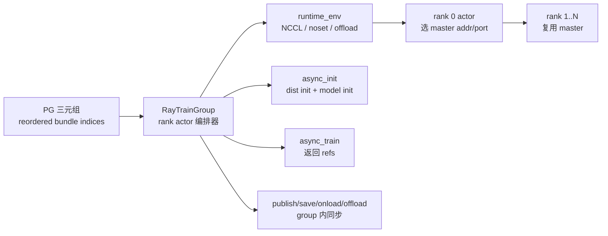
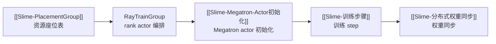

# RayTrainGroup

## 你为什么要读

这组文档讲 Slime 如何把 [[Slime-PlacementGroup]] 产出的资源座位表变成一组真正可调用的训练 Ray actor。PlacementGroup 决定“rank 坐在哪个 bundle”，RayTrainGroup 决定“rank actor 怎么创建、怎么拿 master 地址、哪些调用异步返回 ref、哪些调用必须同步完成”。

读完后，你应该能排查五类问题：

- rank 0 master addr/port 如何传播给其他 rank。
- `async_train` 为什么返回 ObjectRef 列表，而 `update_weights` 在 group 内部 `ray.get`。
- `num_gpus_per_actor=0.4` 为什么不等于多个 rank 随机共享一张 GPU。
- `CUDA_VISIBLE_DEVICES` 与 `LOCAL_RANK` 为什么还要二次映射。
- colocate/offload、routing replay、NIXL transport 的环境变量在哪里注入。

## 主线地图



把 RayTrainGroup 当成“rank actor 编排器”：它不实现 Megatron 训练算法，只负责创建 Ray actor、设置运行环境、维护 actor handles，并把 driver 的方法调用分发到每个 rank。

## 阅读顺序

| 文档 | 读者任务 |
|------|----------|
| [[Slime-RayTrainGroup-核心概念]] | 建立 group、rank actor、master addr、ObjectRef、同步边界的模型 |
| [[Slime-RayTrainGroup-源码走读]] | 沿 group 构造、actor bootstrap、async/sync API 读源码 |
| [[Slime-RayTrainGroup-数据流]] | 看 rollout data、critic values、weight update、offload 如何流过 group |
| [[Slime-RayTrainGroup-排障指南]] | 按 master 端口、LOCAL_RANK、routing replay、external_data、fractional GPU 排障 |
| [[Slime-RayTrainGroup-学习检查]] | 用场景题验证是否能解释 group API |

## 源码范围

| 源码入口 | 本专题关注点 |
|----------|--------------|
| `slime/ray/actor_group.py` L10-L46 | `RayTrainGroup` 构造和职责边界 |
| `slime/ray/actor_group.py` L48-L119 | world size、runtime env、actor class、rank actor 创建、master addr 传播 |
| `slime/ray/actor_group.py` L121-L169 | async API 与同步 API 的边界 |
| `slime/ray/train_actor.py` L20-L49 | `LOCAL_RANK` 映射、MASTER/RANK/WORLD env 注入 |
| `slime/ray/train_actor.py` L50-L99 | distributed init、Gloo group、NUMA affinity、clear memory |
| `slime/ray/train_actor.py` L101-L128 | 训练后端抽象接口与 `set_rollout_manager` |
| `slime/ray/ray_actor.py` L4-L10 | master addr/port 的基础能力 |
| `train.py` L62-L92 | 同步训练循环如何使用 `async_train` 和 `update_weights` |
| `train_async.py` L30-L70 | 异步训练循环为什么在 update 前 drain generate |

## 不变量

| 不变量 | 为什么重要 |
|--------|------------|
| `world_size = num_nodes * num_gpus_per_node` | 决定创建多少 rank actor |
| 每个 rank 用 `reordered_bundle_indices[rank]` 调度 | 保持 [[Slime-PlacementGroup]] 计算出的 logical order |
| rank 0 先创建并返回 master addr/port | 其他 rank 才能写入同一个 distributed rendezvous |
| `async_*` 返回 refs，不在 group 内等待 | API 允许 caller 组织依赖；当前 `create_training_models` 仍先等待 critic init，再等待 actor init |
| `update_weights`、save、onload/offload 在 group 内等待 | 生命周期和训练侧向 rollout 发布权重的完成状态不能悬空 |
| `TrainRayActor.init` 才初始化 torch distributed | Ray actor 创建成功不代表 distributed 已就绪；Megatron 模型由子类 `init` 继续初始化 |

## 运行验证入口

轻量环境常缺 `ray` 和 `sglang`，所以本专题能跑的测试取决于依赖。先尝试：

```powershell
Set-Location slime
python -m pytest tests/utils/test_megatron_role_config.py -q
python -m pytest tests/test_megatron_argument_validation.py -q
```

预期：

- role config 测试需要 `ray` 和 `sglang` 可 import。
- argument validation 测试在轻量环境通常可跑，能覆盖 colocate/offload/delta 的边界。

当前基线实测：参数校验 `14 passed`；role config 的 6 个用例在 import 阶段失败，其中 5 个缺 `sglang`、1 个缺 `ray`。这是环境覆盖限制，不是断言失败。

## 衔接



下一篇先读 [[Slime-RayTrainGroup-核心概念]]。
