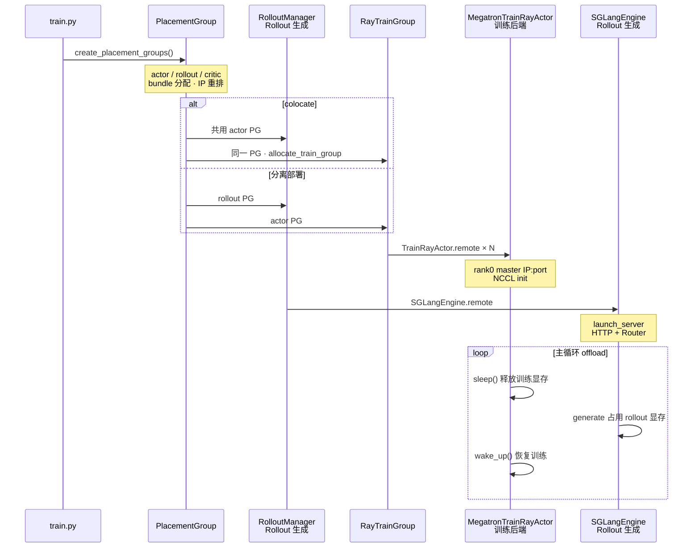

# Ray编排

> **你只需阅读本目录，不必打开 `slime/` 源码。**
> 内嵌代码对应 slime Git commit `22cdc6e1`。

---

## 本目录解决什么问题

启动与入口部分讲清了启动链上谁被创建。本目录回答：**Slime 如何通过 Ray Placement Group 锁定 GPU bundle，并在 `--colocate` / `--offload-rollout` / `--offload-train` 组合下让 actor 与 rollout 分时复用同一张卡？**

两个专题覆盖 Ray 资源编排全链路：

| 模块 | 角色 | 一句话 |
|------|------|--------|
| [[Slime-PlacementGroup]] | GPU 预订 | `create_placement_groups()`、bundle 重排、colocate 共用 PG |
| [[Slime-RayTrainGroup]] | 训练进程组 | TrainRayActor × world_size、NCCL init、`async_train` / `update_weights` |

---

## 端到端时序

这张图用于检查是否能解释 `--colocate` / `--offload-*` 下 PG + RayTrainGroup 如何分时复用 GPU。

这张图的读法是：PG 是 **一次性 GPU 锁定**；colocate 模式下 actor 与 rollout **共享 bundle**，靠 `sleep` / `wake_up` 与 engine pause 分时复用显存，而不是把训练和 rollout 固定切到两组 GPU。

---

## 零基础一句话

**像「订会议室 + 排座位号」：** PlacementGroup 一次性锁定 N 块 GPU 并重排 bundle；RayTrainGroup 按 rank 创建 TrainRayActor 并广播 NCCL；colocate 时 actor 与 rollout 共用同一间“会议室”，靠 offload 轮流上台。

---

## 推荐阅读顺序

建议先读 PlacementGroup，再读 RayTrainGroup。时间紧时至少建立 bundle、rank、colocate 和 offload 的共同模型。

| 顺序 | 文档 | 必读理由 |
|------|------|----------|
| 1 | [[Slime-PlacementGroup-核心概念]] | bundle、colocate、IP 重排术语 |
| 2 | [[Slime-PlacementGroup-源码走读]] | `create_placement_groups` 主路径 |
| 3 | [[Slime-RayTrainGroup-核心概念]] | TrainRayActor、ObjectRef 聚合 |
| 4 | [[Slime-RayTrainGroup-源码走读]] | `async_init` / `async_train` API |
| 5 | [[Slime-PlacementGroup-排障指南]] | colocate 强制 offload 分支 |

---

## 上下游衔接

| 方向 | 模块 | 衔接点 |
|------|------|--------|
| ← 启动与入口 | [[Slime-训练主循环]] | `train()` 调用 `create_placement_groups()` |
| → Rollout 生成 | [[Slime-RolloutManager]] · [[Slime-SGLang-Engine]] | PG bundle 进入 rollout servers |
| → 训练侧 | [[Slime-Megatron-Actor初始化]] | `allocate_train_group` → RayTrainGroup |
| → 权重同步 | [[Slime-分布式权重同步]] | `update_weights` 经 RayTrainGroup 广播到 engine |
| → SGLang 对照 | [[SGLang-Scheduler]] | engine 内 SGLang 调度（推理侧） |

---

## 自测建议（零基础可试）

1. **colocate 组合：** 对照 [[Slime-Ray参数-排障指南]]，列出 `--colocate` 开启时 `--offload-rollout` / `--offload-train` 的强制关系。
2. **bundle 拓扑：** 在 [[Slime-PlacementGroup-数据流]] 的 mermaid 上，口述 actor PG 与 rollout PG 在分离模式下的差异。
3. **Ray 进程：** 启动小规模训练后，用 Ray Dashboard 确认 TrainRayActor 数量 = `--actor-num-gpus-per-node × --actor-num-nodes`。

---

## 模块导航

| 目录 | 状态 |
| ------ | ------ |
| [[Slime-PlacementGroup|PlacementGroup]] | ✅ |
| [[Slime-RayTrainGroup|RayTrainGroup]] | ✅ |

← [[Slime-启动与入口]] · → [[Slime-Rollout生成]]
