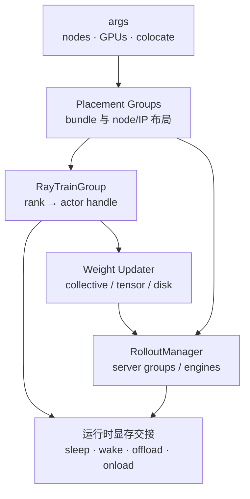

# Ray编排

> **读者任务：** 区分“Ray 预订了哪块资源”和“此刻谁占着显存”，并解释 rank、bundle、actor group 与权重 collective 如何对齐。

## 你为什么要读

Placement Group 解决的是调度所有权：哪些 actor 被允许落到哪些 GPU bundle。colocate 的 sleep/wake、SGLang weight/KV offload 解决的是运行时显存所有权。前者成功不代表后者安全；同一个 bundle 上的两个系统若没有正确交接，仍会 OOM 或互相等待。

RayTrainGroup 则是 driver 侧的 rank 集合代理：它创建一组 TrainRayActor、收集异步结果，并把 `train`、`save`、`update_weights` 等操作 fan-out 到各 rank。真正的 NCCL/tensor/disk 权重传输发生在每个 Megatron actor 的 updater 内，不是 RayTrainGroup 自己“广播模型”。

## 两层资源模型



| 层 | 负责 | 不负责 |
|----|------|--------|
| Ray PG | bundle 预留、placement、colocate/分离拓扑 | 自动清空显存、保证 collective 正确 |
| RayTrainGroup | actor handle、rank fan-out、ObjectRef 聚合 | 模型内部 PP/TP/DP 算法 |
| actor / engine 生命周期 | sleep/wake、weights/KV onload/offload | 重新决定 Ray placement |
| weight updater | rank/engine 连接与版本传输 | Ray driver 的迭代节拍 |

## 分离与共置的真正差别

| 模式 | 调度拓扑 | 显存时序 | 主要风险 |
|------|----------|----------|----------|
| 分离部署 | 同一 PG 预留中的 actor 与 rollout 使用不重叠 bundle 区间 | 通常可同时驻留 | GPU 成本高、跨节点传输与 process group 更复杂 |
| colocate | rollout 与训练指向重叠的 actor bundle | 必须按阶段交接 weights/KV 与训练状态 | offload 不完整、唤醒顺序错误、同卡峰值重叠 |

同步主循环在 rollout 结束后可 offload rollout，训练结束后再清理/睡眠训练侧，更新权重前后重新 onload；这些动作由 driver、RolloutManager 和 actor 共同完成。PG 本身不会观察 PyTorch allocator。来源：`train.py` L64-L94。

## RayTrainGroup 应该怎样读

沿四个问题阅读 [[Slime-RayTrainGroup-源码走读]]：

1. 每个 actor 的 world rank、local rank、node rank 如何确定？
2. 初始化结果如何聚合，单个 rank 失败会如何暴露？
3. `async_train` 返回的是哪些 ObjectRef；driver 在哪里 `ray.get` 形成屏障？
4. `update_weights` 如何 fan-out 到 actor，而 actor 又如何取得 rollout engine 和 lock？

RayTrainGroup 的价值是把“调用全体 rank”封装成一个 driver API；它没有抹掉分布式失败。任一 actor 未返回、collective rank 集不一致或 placement 不满足，group 调用仍可能整体卡住。

## 推荐阅读顺序

| 顺序 | 文档 | 读者任务 |
|------|------|----------|
| 1 | [[Slime-PlacementGroup-核心概念]] | 认识 bundle、PG lifetime、colocate 与 node ordering |
| 2 | [[Slime-PlacementGroup-源码走读]] | 沿 args → bundle → ready → 重排读实现 |
| 3 | [[Slime-RayTrainGroup-核心概念]] | 区分 group proxy 与 rank-local actor |
| 4 | [[Slime-RayTrainGroup-源码走读]] | 跟踪 init/train/save/update fan-out |
| 5 | [[Slime-PlacementGroup-排障指南]] | 按 pending、错位、OOM、offload 失败定位 |

## 可执行验证

静态检查：

```powershell
rg -n "create_placement_groups|placement_group|bundle|colocate" `
  slime/slime/ray/placement_group.py

rg -n "class RayTrainGroup|async_train|update_weights|ray\.get|\.remote" `
  slime/slime/ray/actor_group.py slime/slime/ray/train_actor.py
```

预期：第一组显示 actor/rollout PG 的构造和共置分支；第二组显示 group 通过 actor handles fan-out，而不是在 driver 内执行训练。

真实小规模运行时再用 Ray Dashboard 核对 actor 数量和 placement。Dashboard 只能证明调度位置，显存交接仍要结合 actor/engine 日志与 memory snapshot。

## 上下游衔接

| 方向 | 模块 | 交接对象 |
|------|------|----------|
| ← 启动 | [[Slime-启动与入口]] | 最终 `args` 与 PG 创建顺序 |
| → Rollout | [[Slime-RolloutManager]]、[[Slime-引擎拓扑]] | rollout PG、server groups、engine actors |
| → 训练 | [[Slime-Megatron-Actor初始化]] | RayTrainGroup 与 rank-local model state |
| → 权重 | [[Slime-权重同步]] | engine list、lock、GPU layout、version |
| → 推理内部 | [[SGLang-Scheduler]] | Ray 只到 engine 边界，request 调度属于 SGLang |

← [[Slime-启动与入口]] · → [[Slime-Rollout生成]]
