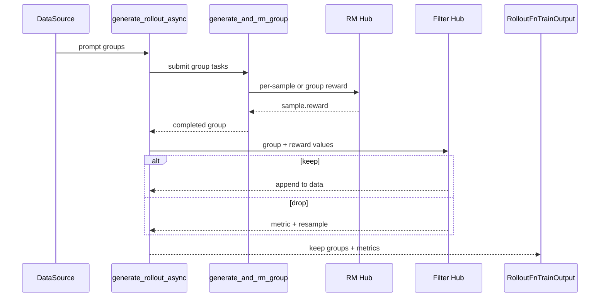
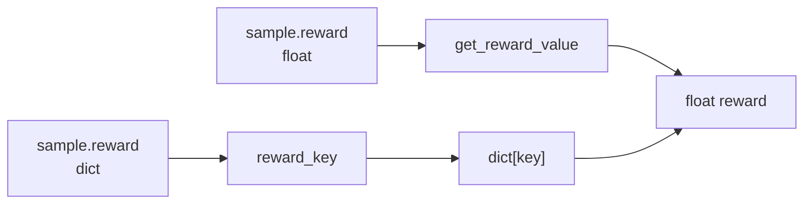

# Reward与过滤 · 数据流

## 读者任务

这篇只看对象如何流动：`Sample` 在生成前后长什么样，reward 何时写入，dict reward 如何变成标量，dynamic filter drop 后哪些计数会变化，最终什么进入训练。

## 总体时序



## `Sample` 字段生命周期

| 阶段 | 字段状态 | 说明 |
|------|----------|------|
| DataSource 输出 | `prompt`、`label`、`metadata` | 还没有 response/reward |
| SGLang generate 后 | `response`、`tokens`、`response_length` | custom generate 也可能填 `reward` |
| RM Hub 后 | `reward` | 标量或 dict |
| Dynamic filter 后 | group keep/drop | drop 的 group 不进 `data` |
| 后置 sample filter | `remove_sample` 可能变化 | 不是 dynamic sampling filter |
| 训练数据转换 | reward 标量被取出 | 见 [[Slime-Advantage计算]] |

关键字段定义：

```python
# 定位骨架（据 `slime/utils/types.py` L114-L144 选取字段）：
response: str = ""
response_length: int = 0
label: str | None = None
reward: float | dict[str, Any] | None = None
loss_mask: list[int] | None = None
weight_versions: list[str] = field(default_factory=list)
...
metadata: dict = field(default_factory=dict)
generate_function_path: str | None = None
custom_rm_path: str | None = None
```

## Reward 写入路径

默认路径下，每条 sample 生成后立即打 reward：

```python
# 定位骨架（据 `slime/rollout/sglang_rollout.py` L278-L286 删节）：
else:
    if sample.status == Sample.Status.ABORTED:
        return sample
    if sample.reward is None:
        with trace_span(sample, "reward_model"):
            sample.reward = await async_rm(args, sample)

return sample
```

list/fan-out 路径只给 reward 为空的子 samples 打分：

```python
# 来源：slime/rollout/sglang_rollout.py L267-L277
if isinstance(sample, list):
    samples = sample
    if any(sample.status == Sample.Status.ABORTED for sample in samples):
        return samples

    samples_need_reward = [sample for sample in samples if sample.reward is None]
    with trace_span(samples_need_reward, "reward_model"):
        rewards = await batched_async_rm(args, samples_need_reward)
    for sample, reward in zip(samples_need_reward, rewards, strict=False):
        sample.reward = reward
    return samples
```

`group_rm=True` 时，写 reward 的位置移到整组生成后：

```python
# 来源：slime/rollout/sglang_rollout.py L327-L331
if not state.aborted and args.group_rm:
    with trace_span(group, "group_reward_model"):
        rewards = await batched_async_rm(args, group)
    for sample, reward in zip(group, rewards, strict=False):
        sample.reward = reward
```

这里有两条没有被类型标注保护的边界：custom batch RM 返回数少于 samples 时，尾部 sample 会继续保持 `reward=None`；返回数更多时，多余结果被静默丢弃。若 custom generate 让 group 中的元素本身变成 `list[Sample]`，`group_rm` 又会把这个嵌套 list 直接交给 `batched_async_rm`；默认 `async_rm` 随后按 leaf `Sample` 访问属性，会触发组合错误。当前实现不能把 fan-out 与 group RM 当作自然可组合能力。

## Reward 形状转换

RM 可以返回 float，也可以返回 dict。训练和 filter 只认标量入口：

```python
# 来源：slime/utils/types.py L246-L247
def get_reward_value(self, args) -> float:
    return self.reward if not args.reward_key else self.reward[args.reward_key]
```

典型流动：



如果 `dapo` 返回 `{"score": -1.0, "acc": false, "pred": "43"}`，训练用 reward 通常应配置为 `--reward-key score`。

## Dynamic filter 的 keep/drop 数据流

`generate_rollout_async` 中有两个列表：

| 列表 | 内容 |
|------|------|
| `data` | keep 的 groups，最终进入训练 |
| `all_data` | 所有已从 done task 取回的 groups，包括 drop 和目标满后同批完成但未使用的 groups；不含随后 abort 才收集的 partial groups |

```python
# 定位骨架（据 `slime/rollout/sglang_rollout.py` L426-L439 删节）：
assert len(group) == args.n_samples_per_prompt
all_data.append(group)

dynamic_filter_output = call_dynamic_filter(dynamic_filter, args, group)
if not dynamic_filter_output.keep:
    metric_gatherer.on_dynamic_filter_drop(reason=dynamic_filter_output.reason)
    state.remaining_batch_size -= 1
    continue

if len(data) < target_data_size:
    data.append(group)
    pbar.update(args.n_samples_per_prompt)
```

drop 的影响：

- 这组样本不进 `data`。
- `remaining_batch_size -= 1`，外层循环会继续提交新 prompt group。
- 如果 filter 返回 reason，metrics 会计数。
- 没有最大 drop/补样轮数；若 filter 永远返回 false，`len(data)` 永远达不到目标，循环不会自行失败退出。

## 过采样粒度

补样不是按 drop 数逐条补，而是按 `over_sampling_batch_size` 从 data source 拉一批 groups：

```python
# 定位骨架（据 `slime/rollout/sglang_rollout.py` L401-L412 删节）：
target_data_size = args.rollout_batch_size

data = []
all_data = []
...
while len(data) < target_data_size:
    while state.remaining_batch_size < target_data_size:
        samples = data_source(args.over_sampling_batch_size)
        state.submit_generate_tasks(samples)
```

参数约束：

```python
# 来源：slime/utils/arguments.py L1925-L1931
if args.over_sampling_batch_size is None:
    args.over_sampling_batch_size = args.rollout_batch_size

assert args.over_sampling_batch_size >= args.rollout_batch_size, (
    f"over_sampling_batch_size {args.over_sampling_batch_size} should be greater than or equal to "
    f"rollout_batch_size {args.rollout_batch_size}"
)
```

读者抓手：filter drop 很多时，rollout 慢不一定是 SGLang 慢，也可能是有效 group 产出率低。

## Metrics 数据流

drop reason 在 `MetricGatherer` 里聚合：

```python
# 来源：slime/rollout/filter_hub/base_types.py L24-L37
class MetricGatherer:
    def __init__(self):
        self._dynamic_filter_drop_reason_count = defaultdict(lambda: 0)

    def on_dynamic_filter_drop(self, reason: str | None):
        if not reason:
            return
        self._dynamic_filter_drop_reason_count[reason] += 1

    def collect(self):
        return {
            f"rollout/dynamic_filter/drop_{reason}": count
            for reason, count in self._dynamic_filter_drop_reason_count.items()
        }
```

最终与 samples 一起返回：

```python
# 定位骨架（据 `slime/rollout/sglang_rollout.py` L456-L467 删节）：
state.reset()
if args.rollout_sample_filter_path is not None:
    filter_func = load_function(args.rollout_sample_filter_path)
    filter_func(args, data)

if args.rollout_all_samples_process_path is not None:
    all_samples_func = load_function(args.rollout_all_samples_process_path)
    all_samples_func(args, all_samples, data_source)

return RolloutFnTrainOutput(samples=data, metrics=metric_gatherer.collect()), aborted_samples
```

## Eval 数据流

Eval 不走 dynamic sampling 的补样环。它对每个 eval dataset 构造 samples，并把 dataset 配置注入 sample：

```python
# 定位骨架（据 `slime/rollout/sglang_rollout.py` L561-L569 删节）：
for _i, prompt_sample in enumerate(dataset.samples):
    for j in range(dataset_cfg.n_samples_per_eval_prompt):
        sample = copy.deepcopy(prompt_sample)
        sample.index = sample_index
        sample_index += 1
        sample.metadata = dataset_cfg.inject_metadata(getattr(sample, "metadata", None))
        sample.custom_rm_path = dataset_cfg.custom_rm_path
        sample.generate_function_path = getattr(dataset_cfg, "custom_generate_function_path", None)
```

Eval 输出时用 `eval_reward_key` 覆盖训练 `reward_key`：

```python
# 来源：slime/rollout/sglang_rollout.py L608-L615
reward_key = args.eval_reward_key or args.reward_key
return {
    dataset_cfg.name: {
        "rewards": [sample.reward if not reward_key else sample.reward[reward_key] for sample in data],
        "truncated": [sample.status == Sample.Status.TRUNCATED for sample in data],
        "samples": data,
    }
}
```

## 三种 filter 不要混淆

| Hook | 位置 | 改变什么 |
|------|------|----------|
| `--dynamic-sampling-filter-path` | rollout 生成环内 | 决定整组 keep/drop，影响是否补样 |
| `--rollout-sample-filter-path` | 已凑满 `data` 后 | 可改 `remove_sample`，影响 loss 参与 |
| `--rollout-all-samples-process-path` | 已收集 `all_data` 后 | 可处理已完成的 drop/keep/unused groups，但不含 abort 阶段才返回的 partial groups |

参数说明中明确 `rollout_sample_filter` 不决定 advantage normalization：

```python
# 来源：slime/utils/arguments.py L1415-L1426
parser.add_argument(
    "--rollout-sample-filter-path",
    type=str,
    default=None,
    help=(
        "Path to the rollout sample filter function. "
        "This function determines whether a sample will participate in loss calculation. "
        "The function should take args and samples (list[Sample]) as input, and return None. "
        "Please directly modify the remove_sample attribute of Sample. "
        "Note: This attribute does not determine whether the sample participates in advantage normalization."
    ),
)
```

## 复盘

- `reward` 在 rollout 侧写入，但训练侧才把它转换成 advantage。
- dict reward 必须通过 `reward_key` 明确选标量。
- dynamic filter drop 后会补样，所以它既影响样本质量，也影响 rollout 吞吐。
- eval 的 RM 配置可以比训练更细，来自 dataset config 注入。
- 后置 sample filter 与 dynamic sampling filter 是不同阶段的 hook。
