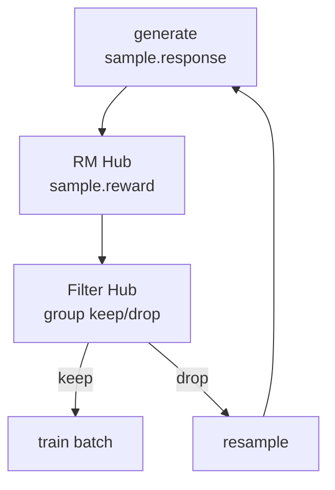

# Reward与过滤 · 核心概念

## 读者任务

这篇先建立 reward 与 filter 的心理模型。读完后应能分清“给单条 response 打分”和“决定整组 response 是否进入训练”是两件事，也能解释为什么 `dapo`、remote RM 和 dynamic filter 经常一起出问题。

## 两道门

Slime rollout 生成后会过两道门：

| 门 | 输入 | 输出 | 决定什么 |
|----|------|------|----------|
| RM Hub | 单条 sample 或一组 samples | `sample.reward` | response 得多少分 |
| Filter Hub | 同一 prompt 的 `n_samples_per_prompt` 条 samples | `keep/drop` | 这组样本是否进入训练 batch |



RM Hub 不负责补样；Filter Hub 不负责判答案对错。把这两个责任混在一起，是读这块源码最常见的误区。

## `Sample.reward` 的形状

`reward` 不一定是 float。源码允许它是标量，也允许它是 dict：

```python
# 来源：slime/utils/types.py L115-L119
response: str = ""
response_length: int = 0
label: str | None = None
reward: float | dict[str, Any] | None = None
loss_mask: list[int] | None = None
```

后续要取训练用标量时，统一走 `get_reward_value`：

```python
# 来源：slime/utils/types.py L246-L247
def get_reward_value(self, args) -> float:
    return self.reward if not args.reward_key else self.reward[args.reward_key]
```

不变量：如果 RM 返回 dict，就必须设置合适的 `--reward-key`。否则 dynamic filter 可能拿到 dict 列表，无法稳定转成 tensor。

## RM Hub 的三层优先级

`async_rm` 的优先级不是 `rm_type` 最大，而是 per-sample 配置最大。注意这张表只描述单条入口；batch 入口有不同边界。

| 优先级 | 来源 | 用途 |
|--------|------|------|
| 1 | `sample.custom_rm_path` | eval 数据集或 per-sample 覆盖 |
| 2 | `args.custom_rm_path` | 全局自定义 RM |
| 3 | `metadata["rm_type"] or args.rm_type` | 内置 rule-based 或 remote RM |

```python
# 定位骨架（据 `slime/rollout/rm_hub/__init__.py` L55-L67 删节）：
async def async_rm(args, sample: Sample, **kwargs):
    if sample.custom_rm_path:
        rm_function = load_function(sample.custom_rm_path)
        return await rm_function(args, sample, **kwargs)

    if args.custom_rm_path is not None:
        rm_function = load_function(args.custom_rm_path)
        return await rm_function(args, sample, **kwargs)

    metadata = sample.metadata if isinstance(sample.metadata, dict) else {}
    rm_type = (metadata.get("rm_type") or args.rm_type or "").strip()
    response = sample.response
    label = sample.label
```

读者抓手：单条入口中，只要命中 sample 或全局 `custom_rm_path`，内置 `math/dapo/remote_rm` 分支就不会走。

## 单条 RM 与整组 RM

`group_rm=False` 时，每条 sample 生成完即可打分；`group_rm=True` 时，先等同一 prompt 的所有 response 都生成完，再进入 batch RM。

| 模式 | 打分时机 | 典型用途 |
|------|----------|----------|
| 默认 | 每条 sample 生成后 | rule-based math、普通 remote RM |
| `group_rm=True` | 整组生成后 | listwise RM、需要同 prompt 多响应上下文的 batch RM |

`batched_async_rm` 的行为要特别注意：没有全局 custom path 时，它并发执行多个 `async_rm`，所以每条 sample 仍可使用自己的 custom RM；有全局 custom path 时，它把整个 `samples` list 直接交给全局函数，不再逐条检查 `sample.custom_rm_path`。因此“per-sample 优先级最高”不能从单条入口外推到 batch custom 分支。

```python
# 定位骨架（据 `slime/rollout/rm_hub/__init__.py` L99-L110 删节）：
async def batched_async_rm(
    args,
    samples: list[Sample],
    **kwargs,
) -> list[int | float]:
    if args.custom_rm_path is not None:
        rm_function = load_function(args.custom_rm_path)
        return await rm_function(args, samples, **kwargs)
    tasks = [async_rm(args, sample, **kwargs) for sample in samples]
    rewards = await asyncio.gather(*tasks)
    return rewards
```

不变量：`--group-rm` 配 `--custom-rm-path` 时，自定义函数签名应是 `(args, samples, **kwargs)`，并且返回长度必须与输入长度一致。调用侧使用 `zip(..., strict=False)`，少返回会留下 `reward=None`，多返回会被忽略，并不会 fail fast。

## 内置 `rm_type`

| `rm_type` | 返回形状 | 关键语义 |
|-----------|----------|----------|
| `math` | `0/1` | 从最后一个 boxed answer 提取答案，再用 mathd/sympy 比较 |
| `dapo` | `{"score", "acc", "pred"}` | 只看最后 300 字符；内置分发使用默认 Minerva `Answer:` 路径，错题 score 为 `-1.0` |
| `deepscaler` | `0/1` | 需要 `</think>` 或 `###Response` 分隔，再复用数学判题 |
| `f1` | float | 抽取式 QA 的 F1 |
| `gpqa` | 标量 | GPQA 多选判分 |
| `ifbench` | 标量 | 指令遵循判分 |
| `remote_rm` | 服务返回值 | HTTP POST，常见为 dict |
| `random` | `0/1` | smoke test |
| `boxed_*` | 取决于后缀 | 只改局部 `response` 变量；并非所有后缀都能正确消费抽取后的纯文本 |

`boxed_` 前缀在 `async_rm` 内部先处理局部变量：

```python
# 定位骨架（据 `slime/rollout/rm_hub/__init__.py` L69-L76 删节）：
if rm_type.startswith("boxed_"):
    response = extract_boxed_answer(response) or ""
    rm_type = rm_type[len("boxed_") :]

if rm_type == "remote_rm":
    return await remote_rm(args, sample)
elif rm_type == "deepscaler":
    return get_deepscaler_rule_based_reward(response, label)
```

这个实现存在必须记住的组合边界：

- `boxed_math` 把 `\boxed{42}` 先变成 `42`，随后 `grade_answer_verl` 又要求输入里存在 `\boxed`，所以会判 0。
- `boxed_deepscaler` 去掉了 DeepScaler 需要的分隔符与 box，同样通常判 0。
- `boxed_remote_rm` 调用 `remote_rm(args, sample)`；HTTP payload 读取原始 `sample.response`，局部抽取结果没有传进去。
- `boxed_dapo` 抽成纯答案后仍走默认 Minerva `Answer:` 提取，因此通常得到 `-1.0`；`boxed_f1/gpqa/ifbench` 是否有意义也要按各 scorer 契约单独验证。

## Dynamic filter 的语义

Dynamic filter 的输入是一组 samples，不是一条 sample。内置 filter `check_reward_nonzero_std` 的判断是：同一 prompt 的多条 response reward 必须有方差。

```python
# 来源：slime/rollout/filter_hub/dynamic_sampling_filters.py L9-L15
def check_reward_nonzero_std(args, samples: list[Sample], **kwargs):
    rewards = [sample.get_reward_value(args) for sample in samples]
    keep = torch.tensor(rewards, dtype=torch.float64).std() > 1e-6
    return DynamicFilterOutput(
        keep=keep,
        reason=None if keep else f"zero_std_{round(rewards[0], 1)}",
    )
```

为什么要这样做：对 GRPO/PPO 类训练，同一 prompt 下全对或全错的 group 往往没有有效相对优势信号。drop 这些 group 可以把训练 batch 留给更有区分度的 prompt。

实现边界：`torch.std()` 默认使用样本标准差。group 只有 1 条时结果为 `nan`，比较 `nan > 1e-6` 为 false，因而会按 `zero_std_*` drop；空 group 还会在 `rewards[0]` 处报错。更重要的是，生成主循环没有最大 drop 次数，若 scorer/filter 组合永远给出相同 reward，补样不会自动终止。

## Filter 返回值和 metrics

新 filter 应返回 `DynamicFilterOutput`，旧 filter 返回 bare bool 也兼容：

```python
# 定位骨架（据 `slime/rollout/filter_hub/base_types.py` L5-L21 删节）：
@dataclass
class DynamicFilterOutput:
    keep: bool
    reason: str | None = None

def call_dynamic_filter(fn, *args, **kwargs):
    if fn is None:
        return DynamicFilterOutput(keep=True)

    output = fn(*args, **kwargs)

    if not isinstance(output, DynamicFilterOutput):
        output = DynamicFilterOutput(keep=output)

    return output
```

`reason` 会进入 rollout metrics：

```python
# 来源：slime/rollout/filter_hub/base_types.py L24-L37
class MetricGatherer:
    def __init__(self):
        self._dynamic_filter_drop_reason_count = defaultdict(lambda: 0)

    def on_dynamic_filter_drop(self, reason: str | None):
        if not reason:
            return
        self._dynamic_filter_drop_reason_count[reason] += 1

    def collect(self):
        return {
            f"rollout/dynamic_filter/drop_{reason}": count
            for reason, count in self._dynamic_filter_drop_reason_count.items()
        }
```

## 参数入口

| 参数 | 作用 |
|------|------|
| `--rm-type` | 选择内置 scorer 或 remote RM |
| `--reward-key` | dict reward 中训练用标量的 key |
| `--eval-reward-key` | eval 输出中使用的 reward key |
| `--group-rm` | 整组生成后再打分 |
| `--rm-url` | remote RM 服务地址 |
| `--custom-rm-path` | 自定义 RM 函数 |
| `--dynamic-sampling-filter-path` | 组级 dynamic filter 函数 |
| `--over-sampling-batch-size` | filter drop 后补样的最小批量粒度 |

`group_rm` 只支持训练 rollout；eval 入口有 `assert not args.group_rm`。另外，`compute_score_dapo` 虽然定义了 `strict_box_verify` 参数，内置 `async_rm` 调用时没有暴露这个开关；要使用 strict-box 路径需自定义 RM 包装函数。

源码入口：来源：slime/utils/arguments.py L427-L450，来源：slime/utils/arguments.py L1316-L1356

## 下一步

带着“两道门”模型读 [[Slime-Reward与过滤-源码走读]]；如果遇到 reward/filter 配置问题，直接看 [[Slime-Reward与过滤-排障指南]]。

## 运行验证

RM 与 filter 的边界可以用源码检索确认：`Sample.reward` 是训练入口，RM Hub 决定 reward 来源，Filter Hub 决定整组样本是否保留，参数层决定默认 key 与补样粒度。

```powershell
rg -n 'class Sample|def get_reward_value|async def remote_rm|async def async_rm|async def batched_async_rm|custom_rm_path|rm_type|class DynamicFilterOutput|class MetricGatherer|check_reward_nonzero_std|--rm-type|--reward-key|--group-rm|--dynamic-sampling-filter-path|over_sampling_batch_size' slime/slime/utils/types.py slime/slime/rollout/rm_hub/__init__.py slime/slime/rollout/filter_hub/base_types.py slime/slime/rollout/filter_hub/dynamic_sampling_filters.py slime/slime/utils/arguments.py
```

读输出时先看 `Sample.get_reward_value`，确认 dict reward 由 `reward_key` 解包；再看 `async_rm/batched_async_rm`，确认单条和整组 reward 的入口不同；最后看 `DynamicFilterOutput` 和 `MetricGatherer`，确认 filter drop 是组级决策并会进入 rollout metrics。
