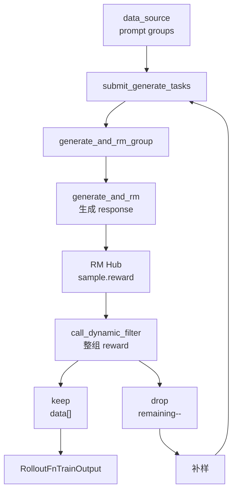

# Reward与过滤 · 源码走读

## 读者任务

这篇沿一组 rollout 样本走：同一个 prompt 生成 `n_samples_per_prompt` 条 response；每条或整组进入 RM Hub 得到 reward；dynamic filter 读取整组 reward 决定 keep/drop；drop 后继续补样；最终只有 keep 的 groups 进入 `RolloutFnTrainOutput`。

读完后应能定位：

- `group_rm` 为什么会改变打分时机。
- `custom_rm_path` 与 `rm_type` 谁优先。
- `math`、`dapo`、`deepscaler` 的关键差异。
- `reward_key` 为什么是 dict reward 的训练入口。
- dynamic filter drop 后，rollout 如何继续补样。

## 长文读法

这篇按“生成先得到 response，RM/filter 决定哪些 group 进入训练”读：默认单条生成后立刻打 reward，`group_rm` 会把打分推迟到整组完成；RM Hub 先看自定义 scorer，再走内置 `rm_type`；dynamic filter 读取整组 reward 做 keep/drop，drop 后继续补样，最终只把 keep 的 groups 交给训练。

| 读者任务 | 先读 | 要抓住的判断 |
|----------|------|--------------|
| 第一次建立主线 | 读者任务、主线地图、1 到 2 | reward 既可以单条打，也可以在整组完成后再打 |
| 排查 RM 选错 | 3 到 5 | per-sample `custom_rm_path`、全局 `custom_rm_path`、`rm_type` 有明确优先级 |
| 对比内置 scorer | 6 到 8 | `math`、`dapo`、`deepscaler` 的答案抽取、返回值和判错方式不同 |
| 排查 dict reward | 3、7、Eval 路径 | `reward_key` 决定从 dict reward 里取哪个数进入训练或 eval 汇总 |
| 排查 dynamic filter | 9 到 11 | filter 看整组 reward；drop 会减少 remaining 并触发补样，keep 才进入输出 |
| 排查 eval RM 注入 | 12 | eval 可以从 dataset 配置把 custom RM 挂到每个 sample 上 |

读的时候不要把 RM Hub 当训练侧 forward。这里处理的是 rollout 后的 scorer 调用和样本过滤，训练侧只消费已经写进 `Sample.reward` 的结果。

## 主线地图



## 1. 单条生成完成后，默认立即打 reward

系统压力：大多数 rule-based RM 不需要同 prompt 的其他 response。越早打分，越早能让 group 进入 filter。

设计选择：`generate_and_rm` 在 SGLang 生成完成后检查 `group_rm`。默认路径下，单条 sample 如果 reward 仍为 `None`，就调用 `async_rm`。

```python
# 定位骨架（据 `slime/rollout/sglang_rollout.py` L263-L286 删节）：
# for the rm that need the whole group, we will not do the rm here
if args.group_rm:
    return sample

if isinstance(sample, list):
    samples = sample
    if any(sample.status == Sample.Status.ABORTED for sample in samples):
        return samples

    samples_need_reward = [sample for sample in samples if sample.reward is None]
    with trace_span(samples_need_reward, "reward_model"):
        rewards = await batched_async_rm(args, samples_need_reward)
    for sample, reward in zip(samples_need_reward, rewards, strict=False):
        sample.reward = reward
    return samples
else:
    if sample.status == Sample.Status.ABORTED:
        return sample
    if sample.reward is None:
        with trace_span(sample, "reward_model"):
            sample.reward = await async_rm(args, sample)

return sample
```

执行逻辑：

- custom generate 可能已经填好 `sample.reward`，此时不会重复打分。
- custom generate 也可能返回 `list[Sample]`，源码会对其中 reward 为空的 samples 批量打分。
- aborted sample 不进入 RM，避免给不完整 response 打 reward。

## 2. `group_rm` 把 reward 推迟到整组生成之后

系统压力：有些 RM 需要同时看到同一 prompt 的多条 response，例如 listwise 排序或 batch remote RM。

设计选择：`generate_and_rm_group` 先并发生成整组 samples；如果 `group_rm=True`，再对整组调用 `batched_async_rm` 并回填 reward。

```python
# 定位骨架（据 `slime/rollout/sglang_rollout.py` L294-L333 删节）：
async def generate_and_rm_group(
    args: Namespace, group: list[Sample], sampling_params: dict[str, Any], evaluation: bool = False
) -> list[Sample] | list[list[Sample]]:
    state = GenerateState(args)
    ...
    tasks = []
    for idx, sample in enumerate(group):
        current_sampling_params = sampling_params.copy()
        if getattr(args, "sglang_enable_deterministic_inference", False):
            seed = state.group_sampling_seeds[idx]
            current_sampling_params["sampling_seed"] = seed
        tasks.append(
            asyncio.create_task(generate_and_rm(args, sample, current_sampling_params, evaluation=evaluation))
        )

    group = await asyncio.gather(*tasks)

    if not state.aborted and args.group_rm:
        with trace_span(group, "group_reward_model"):
            rewards = await batched_async_rm(args, group)
        for sample, reward in zip(group, rewards, strict=False):
            sample.reward = reward

    return group
```

不变量：`group_rm=True` 不是“打开 dynamic filter”；它只改变 RM 打分时机。filter 仍由 `--dynamic-sampling-filter-path` 控制。

组合边界：若 custom generate 对单个输入返回 `list[Sample]`，`asyncio.gather` 产生的 group 就会是嵌套 list。`group_rm` 随后把嵌套结构直接传给 `batched_async_rm`；默认分支中的 `async_rm` 会把内层 list 当作 `Sample` 访问属性，当前实现并不支持这种 fan-out + group RM 组合。

## 3. RM Hub 先看插件，再看内置类型

系统压力：训练可以统一用 `--rm-type`，eval 数据集却可能需要 per-dataset 或 per-sample scorer。源码必须让更局部的配置覆盖全局配置。

设计选择：`async_rm` 的优先级是 `sample.custom_rm_path`、`args.custom_rm_path`、`metadata["rm_type"] or args.rm_type`。

```python
# 定位骨架（据 `slime/rollout/rm_hub/__init__.py` L55-L96 删节）：
async def async_rm(args, sample: Sample, **kwargs):
    if sample.custom_rm_path:
        rm_function = load_function(sample.custom_rm_path)
        return await rm_function(args, sample, **kwargs)

    if args.custom_rm_path is not None:
        rm_function = load_function(args.custom_rm_path)
        return await rm_function(args, sample, **kwargs)

    metadata = sample.metadata if isinstance(sample.metadata, dict) else {}
    rm_type = (metadata.get("rm_type") or args.rm_type or "").strip()
    response = sample.response
    label = sample.label
    if rm_type.startswith("boxed_"):
        response = extract_boxed_answer(response) or ""
        rm_type = rm_type[len("boxed_") :]

    if rm_type == "remote_rm":
        return await remote_rm(args, sample)
    elif rm_type == "deepscaler":
        return get_deepscaler_rule_based_reward(response, label)
    elif rm_type == "dapo":
        return compute_score_dapo(response, label)
    elif rm_type == "math":
        return 1 if grade_answer_verl(response, label) else 0
    elif rm_type == "f1":
        return f1_score(response, label)[0]
    elif rm_type == "gpqa":
        return compute_gpqa_reward(response, label, metadata=metadata)
    elif rm_type == "ifbench":
        from .ifbench import compute_ifbench_reward
        return compute_ifbench_reward(response, label, metadata=metadata)
    elif rm_type == "random":
        return random.randint(0, 1)
    elif rm_type:
        raise NotImplementedError(f"Rule-based RM for {rm_type} is not implemented.")
    else:
        raise NotImplementedError("Rule-based RM type is not specified.")
```

执行逻辑：

- `metadata["rm_type"]` 可以覆盖 CLI，eval 数据集常用。
- `boxed_*` 会先改写局部 `response`，再把后缀当成新的 `rm_type`；但后缀 scorer 是否真的消费这个局部值必须逐项检查。
- 未指定任何 scorer 会显式报 `NotImplementedError`，不会默默给 0 分。

不能把 `boxed_` 当作通用装饰器：`boxed_math` 抽成纯文本后，`grade_answer_verl` 会再次要求 `\boxed`，因而判 0；`boxed_deepscaler` 丢失分隔符和 box，通常也判 0；`boxed_remote_rm` 更直接地把原 `sample` 交给 `remote_rm`，HTTP payload 仍使用未抽取的 `sample.response`。

## 4. Batch RM 默认是并发单条 RM

系统压力：同一组 samples 可能需要一起打分，但默认 rule-based scorer 仍是单条逻辑。

设计选择：`batched_async_rm` 只有在 `args.custom_rm_path` 存在时才把整个 list 交给用户函数；否则并发调用 `async_rm`。

```python
# 定位骨架（据 `slime/rollout/rm_hub/__init__.py` L99-L110 删节）：
async def batched_async_rm(
    args,
    samples: list[Sample],
    **kwargs,
) -> list[int | float]:
    if args.custom_rm_path is not None:
        rm_function = load_function(args.custom_rm_path)
        return await rm_function(args, samples, **kwargs)
    tasks = [async_rm(args, sample, **kwargs) for sample in samples]
    rewards = await asyncio.gather(*tasks)
    return rewards
```

读者抓手：`--group-rm --custom-rm-path` 要求用户函数接收 `samples`，不是 `sample`。而且全局 custom path 在 batch 分支直接短路：即使某个 sample 带 `custom_rm_path`，也不会获得单条入口里的更高优先级。

另一个隐式契约是返回长度。两处回填都使用 `zip(..., strict=False)`：少返回会让尾部 sample 保持 `reward=None`，多返回会静默丢弃。custom RM 应主动断言输出长度等于输入长度。

## 5. remote RM 是 HTTP scorer，不是训练侧模型调用

系统压力：神经网络 RM 或外部业务 scorer 可能独立部署，rollout 进程只负责发请求和接收 JSON。

设计选择：`remote_rm` 复用共享 `aiohttp.ClientSession`，payload 固定为 prompt/response/label，失败时指数退避重试。

```python
# 定位骨架（据 `slime/rollout/rm_hub/__init__.py` L22-L52 删节）：
def _get_shared_session() -> aiohttp.ClientSession:
    global _shared_session
    if _shared_session is None or _shared_session.closed:
        connector = aiohttp.TCPConnector(
            limit=64,
            enable_cleanup_closed=True,
        )
        timeout = aiohttp.ClientTimeout(total=120)
        _shared_session = aiohttp.ClientSession(connector=connector, timeout=timeout)
    return _shared_session

async def remote_rm(args, sample: Sample, max_retries: int = 10):
    payload = {
        "prompt": sample.prompt,
        "response": sample.response,
        "label": sample.label,
    }
    session = _get_shared_session()
    for attempt in range(max_retries):
        try:
            async with session.post(args.rm_url, json=payload) as resp:
                resp.raise_for_status()
                return await resp.json()
        except Exception as e:
            if attempt + 1 >= max_retries:
                logger.warning(f"remote_rm failed after {attempt + 1} attempts: {e}")
                raise
            backoff = min(2**attempt, 30) + random.random()
            logger.info(f"remote_rm: {type(e).__name__}, retrying in {backoff:.1f}s ({attempt + 1}/{max_retries})")
            await asyncio.sleep(backoff)
```

不变量：remote RM 最终失败会 raise，不会把失败样本静默设成 0 分。

时间边界也不能忽略：共享 session 的单次总 timeout 是 120 秒，最多重试 10 次，重试间还有指数退避；持续故障可能让一个 reward 请求占用很久。当前模块没有显式关闭共享 session 的公共生命周期入口，进程退出时还可能看到未关闭 session 警告。

## 6. `math` scorer 只接受可抽取的 boxed answer

系统压力：数学 benchmark 需要把长 CoT 压缩成最终答案，再做等价判断。

设计选择：`grade_answer_verl` 从 response 中抽 boxed answer；ground truth 如果也带 box，先抽；最后用 mathd 规范化或 sympy 等价判断。

```python
# 定位骨架（据 `slime/rollout/rm_hub/math_utils.py` L478-L493 删节）：
def extract_answer(passage: str) -> str:
    if "\\boxed" in passage:
        return extract_boxed_answer(passage)
    return None

def grade_answer_verl(solution_str, ground_truth):
    if not ground_truth:
        return False
    ground_truth = str(ground_truth)
    if "\\boxed" in ground_truth:
        ground_truth = extract_answer(ground_truth)
    given_answer = extract_answer(solution_str)
    if given_answer is None:
        return False
    return grade_answer_mathd(given_answer, ground_truth) or grade_answer_sympy(given_answer, ground_truth)
```

sympy 路径有保护条件：分数未约分和整数/非整数类型不匹配不会被随意 simplify 成正确。

```python
# 定位骨架（据 `slime/rollout/rm_hub/math_utils.py` L451-L465 删节）：
for ground_truth_elem, given_elem in zip(ground_truth_elems, given_elems, strict=False):
    if _is_frac(ground_truth_elem) and _is_frac(given_elem):
        is_correct = ground_truth_elem == given_elem
    elif _str_is_int(ground_truth_elem) != _str_is_int(given_elem):
        is_correct = False
    else:
        is_correct = are_equal_under_sympy(ground_truth_elem, given_elem)
    if not is_correct:
        break

return is_correct
```

## 7. `dapo` scorer 返回 dict，并把错题映射到 -1

系统压力：DAPO 配方需要更强的负反馈信号，并记录 `acc`、`pred` 等附加信息。

设计选择：`compute_score` 只看 response 尾部 300 字符，调用 `verify`，再返回 `{score, acc, pred}`。

```python
# 定位骨架（据 `slime/rollout/rm_hub/math_dapo_utils.py` L262-L292 删节）：
def compute_score(
    solution_str: str,
    ground_truth: str,
    strict_box_verify: bool = False,
    pause_tokens_index: list[int] | None = None,
) -> float:
    solution_str = solution_str[-300:]

    correct, pred = verify(solution_str, ground_truth, strict_box_verify, pause_tokens_index)

    reward = 1.0 if correct else -1.0
    acc = correct

    return {
        "score": reward,
        "acc": acc,
        "pred": pred,
    }
```

测试把这些行为固定下来：

```python
# 来源：tests/test_rm_math_dapo.py L1-L14
"""CPU unit tests for ``slime.rollout.rm_hub.math_dapo_utils``.

Pins the DAPO math scorer (``rm_type=dapo``). Distinct from
``math_utils`` in three ways the tests need to lock down:

  - ``remove_boxed`` here raises ``AssertionError`` on malformed input
    (vs ``math_utils.remove_boxed`` which returns None silently)
  - ``normalize_final_answer`` has its own pipeline (SUBSTITUTIONS list +
    REMOVED_EXPRESSIONS list + per-unit regexes); silent drift here
    causes wrong predicate matches in ``is_correct_minerva``
  - ``compute_score`` only considers the last 300 chars (efficiency
    truncation at line 280) — a regression that drops this would silently
    blow up scoring time on long traces
"""
```

读者抓手：用 `--rm-type dapo` 训练时，通常要配 `--reward-key score`。

函数虽然支持 `strict_box_verify=True`，但 `async_rm` 的内置 `dapo` 分支只传 `response, label`，因此固定使用默认 Minerva `Answer:` 提取。strict-box 需要 custom RM 显式包装；`boxed_dapo` 把答案先压成纯文本，也不会自动切到 strict-box，通常仍判错。

## 8. DeepScaler scorer 先切 CoT 尾段

系统压力：DeepScaler 格式 response 里包含 thinking 和最终作答区域，不能把整个 response 当作答案。

设计选择：先按 `</think>` 或 `###Response` 切出最终段，再复用 `math_utils` 的 answer 提取与判题。

```python
# 定位骨架（据 `slime/rollout/rm_hub/deepscaler.py` L4-L42 删节）：
def get_deepscaler_rule_based_reward(response, label):
    if "</think>" in response:
        model_solution = response.split("</think>")[-1]
    elif "###Response" in response:
        model_solution = response.split("###Response")[1]
    else:
        return 0

    model_answer = extract_answer(model_solution)
    if model_answer is None:
        return 0
    if label == "":
        return 0
    ...
    for ground_truth in processed_ground_truths:
        is_correct = grade_answer_mathd(model_answer, ground_truth) or grade_answer_sympy(model_answer, ground_truth)
        if is_correct:
            return 1

    return 0
```

不变量：没有分隔符或没有可抽取答案时直接 0 分。

## 9. Dynamic filter 决定整组样本是否进入 batch

系统压力：训练 batch 需要足够多有效 groups；但某些 prompt 的多条 response 全对或全错，对相对优势学习贡献很弱。

设计选择：`generate_rollout_async` 等待任意 group 完成后，先放入 `all_data`，再调用 dynamic filter。drop 时不加入 `data`，并减少 `remaining_batch_size`，促使外层继续补样。

```python
# 定位骨架（据 `slime/rollout/sglang_rollout.py` L394-L433 删节）：
dynamic_filter = (
    load_function(args.dynamic_sampling_filter_path) if args.dynamic_sampling_filter_path is not None else None
)

metric_gatherer = MetricGatherer()
target_data_size = args.rollout_batch_size

data = []
all_data = []
do_print = True
pbar = tqdm(total=target_data_size * args.n_samples_per_prompt, desc="Rollout generation")
while len(data) < target_data_size:
    while state.remaining_batch_size < target_data_size:
        samples = data_source(args.over_sampling_batch_size)
        state.submit_generate_tasks(samples)
    ...
    for task in done:
        group: list[Sample] = task.result()
        ...
        all_data.append(group)

        dynamic_filter_output = call_dynamic_filter(dynamic_filter, args, group)
        if not dynamic_filter_output.keep:
            metric_gatherer.on_dynamic_filter_drop(reason=dynamic_filter_output.reason)
            state.remaining_batch_size -= 1
            continue
```

执行逻辑：

- `data` 只保存 keep 的 groups。
- `all_data` 保存已经从 done task 取回的 groups，包括 drop 和同批完成但目标已满后未使用的 keep group；abort 阶段才收集的 partial groups 不在其中。
- drop 不会推进进度条，也不会占训练 batch 名额。
- 主循环没有最大 drop 数或最低有效率门禁；filter 永远拒绝时会持续补样，不能自动 fail fast。

## 10. 内置 filter 用 reward 方差判断

系统压力：filter 要支持标量 reward，也要支持 dict reward 中的某个 key。

设计选择：filter 不直接读 `sample.reward`，而是用 `sample.get_reward_value(args)`。

```python
# 来源：slime/rollout/filter_hub/dynamic_sampling_filters.py L9-L15
def check_reward_nonzero_std(args, samples: list[Sample], **kwargs):
    rewards = [sample.get_reward_value(args) for sample in samples]
    keep = torch.tensor(rewards, dtype=torch.float64).std() > 1e-6
    return DynamicFilterOutput(
        keep=keep,
        reason=None if keep else f"zero_std_{round(rewards[0], 1)}",
    )
```

`get_reward_value` 的标量抽取：

```python
# 来源：slime/utils/types.py L246-L247
def get_reward_value(self, args) -> float:
    return self.reward if not args.reward_key else self.reward[args.reward_key]
```

不变量：`dapo` 或 remote RM 返回 dict 时，`--reward-key` 是 filter 与训练侧共同依赖的配置。

当 `n_samples_per_prompt=1` 时，内置实现的 `torch.std()` 使用样本标准差，结果为 `nan`；`nan > 1e-6` 为 false，因此单样本 group 会被记录为 `zero_std_*` 并 drop。这个 filter 的合理使用前提是 group 至少包含两条可转成数值的 reward。

## 11. 输出阶段把 samples 和 drop metrics 一起交出去

系统压力：下游需要训练样本，也需要知道动态过滤丢了多少、为什么丢。

设计选择：rollout 结束后 abort 未完成请求，排序 keep 的 groups，收集 filter metrics，再返回 `RolloutFnTrainOutput`。

```python
# 定位骨架（据 `slime/rollout/sglang_rollout.py` L447-L467 删节）：
aborted_samples = await abort(args, rollout_id)

assert len(data) == args.rollout_batch_size, f"Got {len(data)} samples, expected {args.rollout_batch_size}"
data = sorted(data, key=lambda group: group[0][0].index if isinstance(group[0], list) else group[0].index)
all_samples = sorted(
    all_data, key=lambda group: group[0][0].index if isinstance(group[0], list) else group[0].index
)

state.reset()
if args.rollout_sample_filter_path is not None:
    filter_func = load_function(args.rollout_sample_filter_path)
    filter_func(args, data)

if args.rollout_all_samples_process_path is not None:
    all_samples_func = load_function(args.rollout_all_samples_process_path)
    all_samples_func(args, all_samples, data_source)

return RolloutFnTrainOutput(samples=data, metrics=metric_gatherer.collect()), aborted_samples
```

边界：`rollout_sample_filter_path` 是后置 sample/loss 过滤，不是本专题讲的 dynamic sampling filter。

## 12. Eval 路径可以 per-dataset 注入 RM

系统压力：eval 通常按数据集切换 RM、custom RM、generation function，而不是用训练全局配置。

设计选择：eval 构造 sample 时写入 metadata 和 `custom_rm_path`，随后仍走 `generate_and_rm`。

入口边界：`eval_rollout` 首先断言 `not args.group_rm`，所以训练侧的 group/listwise RM 不能直接在默认 eval 路径启用。

```python
# 定位骨架（据 `slime/rollout/sglang_rollout.py` L558-L583 删节）：
tasks = []
sample_index = 0
for _i, prompt_sample in enumerate(dataset.samples):
    for j in range(dataset_cfg.n_samples_per_eval_prompt):
        sample = copy.deepcopy(prompt_sample)
        sample.index = sample_index
        sample_index += 1
        sample.metadata = dataset_cfg.inject_metadata(getattr(sample, "metadata", None))
        sample.custom_rm_path = dataset_cfg.custom_rm_path
        sample.generate_function_path = getattr(dataset_cfg, "custom_generate_function_path", None)
        sampling_params = base_sampling_params
        ...
        tasks.append(
            asyncio.create_task(
                generate_and_rm(
                    args,
                    sample,
                    sampling_params=sampling_params,
                    evaluation=True,
                )
            )
        )
```

eval 输出 reward 时使用 eval 专属 key 或训练 reward key：

```python
# 来源：slime/rollout/sglang_rollout.py L606-L615
data.sort(key=lambda sample: sample.index)

reward_key = args.eval_reward_key or args.reward_key
return {
    dataset_cfg.name: {
        "rewards": [sample.reward if not reward_key else sample.reward[reward_key] for sample in data],
        "truncated": [sample.status == Sample.Status.TRUNCATED for sample in data],
        "samples": data,
    }
}
```

## 运行验证

CPU scorer 验证：

```powershell
Set-Location 'F:\源码阅读\slime'
python -m pytest tests/test_rm_math_dapo.py -q
```

插件契约验证：

```powershell
Set-Location 'F:\源码阅读\slime'
python -m pytest tests/plugin_contracts/test_plugin_path_loading_contracts.py -k "custom_rm or dynamic_filter" -q
```

静态文档验证：

```powershell
node maintenance/audit_source_evidence.mjs --note slime_reading/Rollout生成/Reward与过滤/Slime-Reward与过滤-源码走读.md
node maintenance/audit_wikilinks.mjs
```

## 复盘

- RM Hub 给 sample 写 reward；Filter Hub 决定整组是否进入训练。
- `group_rm` 是打分时机开关，不是 filter 开关。
- `custom_rm_path` 会覆盖内置 `rm_type`，batch 模式下签名也会变。
- dict reward 必须通过 `reward_key` 抽成标量。
- dynamic filter drop 会触发补样，影响 rollout 速度和样本分布。
