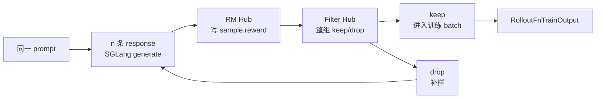

# Reward与过滤

## 你为什么要读

这一组回答：SGLang 已经为同一个 prompt 生成多条 response 之后，Slime 如何给每条 response 打 reward、如何用整组 reward 判断这组样本有没有训练信号、以及 drop 后如何继续补样直到凑满 `rollout_batch_size`。

读完后应能处理三类问题：

- 首次阅读：知道 `generate_and_rm`、`async_rm`、`batched_async_rm`、`call_dynamic_filter` 在 rollout 主线中的位置。
- 排障：reward 不生效、`dapo` 返回 dict 后 filter 报错、dynamic filter 一直 drop、remote RM 卡住时能定位。
- 改代码：新增 RM 类型、接远程 RM、写 batch custom RM、写 dynamic filter 时知道签名和返回值边界。

## 核心模型

Reward 与过滤专题是 rollout 生成阶段的“质量闸门”：

RM Hub 只负责“这条 response 得多少分”；Filter Hub 负责“这组 response 是否值得进入训练”。二者都运行在 rollout 侧，不进入 Megatron backward。

## 阅读顺序

| 文档 | 读者问题 |
|------|----------|
| [[Slime-Reward与过滤-核心概念]] | reward、rm_type、group_rm、reward_key、dynamic filter 各是什么 |
| [[Slime-Reward与过滤-源码走读]] | 一组 rollout 从生成到打分、过滤、补样如何走完 |
| [[Slime-Reward与过滤-数据流]] | `Sample.reward`、dict reward、metrics、eval 配置如何流动 |
| [[Slime-Reward与过滤-排障指南]] | math/dapo、custom RM、remote RM、filter 卡住等排障 |
| [[Slime-Reward与过滤-学习检查]] | 可执行验收 |

## 源码范围

| 模块 | 本专题关注 |
|------|------------|
| `slime/rollout/sglang_rollout.py` | `generate_and_rm`、`generate_and_rm_group`、`generate_rollout_async` 的 reward/filter 主线 |
| `slime/rollout/rm_hub/__init__.py` | `async_rm`、`batched_async_rm`、`remote_rm` 的分发和插件优先级 |
| `slime/rollout/rm_hub/math_utils.py` | `rm_type=math` 的 boxed answer 与 mathd/sympy 判题 |
| `slime/rollout/rm_hub/math_dapo_utils.py` | `rm_type=dapo` 的 dict reward、`score`、tail 截断和 strict box |
| `slime/rollout/rm_hub/deepscaler.py` | DeepScaler CoT 格式的 answer 截取与复用判题 |
| `slime/rollout/filter_hub/base_types.py` | `DynamicFilterOutput`、兼容旧 bool filter、drop reason metrics |
| `slime/rollout/filter_hub/dynamic_sampling_filters.py` | `check_reward_nonzero_std` 的组内 reward 方差过滤 |
| `slime/utils/types.py` | `Sample.reward` 与 `get_reward_value(args)` |
| `slime/utils/arguments.py` | `--rm-type`、`--reward-key`、`--group-rm`、`--dynamic-sampling-filter-path` |

## 与相邻专题的边界

| 边界 | 结论 |
|------|------|
| [[Slime-SGLang-Rollout]] | SGLang 如何生成 response；本专题从 response 已经返回后开始 |
| [[Slime-RolloutManager]] | RolloutManager 如何汇总、后处理和交付训练数据 |
| [[Slime-Advantage计算]] | reward 如何进入 advantage/return 计算 |
| [[Slime-自定义扩展-核心概念]] | 更宽的 plugin/hook 生态在 customization；本专题只讲 RM 与 dynamic sampling filter |

## 首次阅读抓手

先记住七条：

- `async_rm` 是单条 reward 的入口，优先级是 `sample.custom_rm_path -> args.custom_rm_path -> metadata["rm_type"] -> args.rm_type`。
- `batched_async_rm` 在没有全局 custom RM 时并发调用 `async_rm`；一旦设置 `args.custom_rm_path`，它直接把整个 samples list 交给全局函数，此时不会再检查每个 sample 的 `custom_rm_path`。
- `group_rm=True` 改变打分时机：先等同一 prompt 的整组 response 都生成完，再统一打分。
- `dapo` 和很多 remote RM 会返回 dict；dynamic filter 和训练侧取标量时依赖 `--reward-key`。
- `check_reward_nonzero_std` drop 的是一整组 prompt 样本，drop 后 `generate_rollout_async` 会继续补样。
- 当前补样循环没有最大 drop 次数或有效率下限；filter 永远拒绝时，rollout 可以一直运行而无法凑满 batch。
- `boxed_` 只是改写局部变量，不是可靠的通用组合器：当前 `boxed_math` 会二次找 box，`boxed_remote_rm` 仍发送原 response。

## 相关验证

- 从 `slime/` repo 根目录运行 `python -m pytest tests/test_rm_math_dapo.py -q`：CPU 单测，锁定 DAPO scorer 与普通 math scorer 的差异。
- 从 `slime/` repo 根目录运行 `python -m pytest tests/plugin_contracts/test_plugin_path_loading_contracts.py -k "custom_rm or dynamic_filter" -q`：检查 custom RM 与 dynamic filter 插件签名。
- `node maintenance/audit_source_evidence.mjs --note slime_reading/Rollout生成/Reward与过滤/Slime-Reward与过滤-源码走读.md`：检查本专题源码证据。
