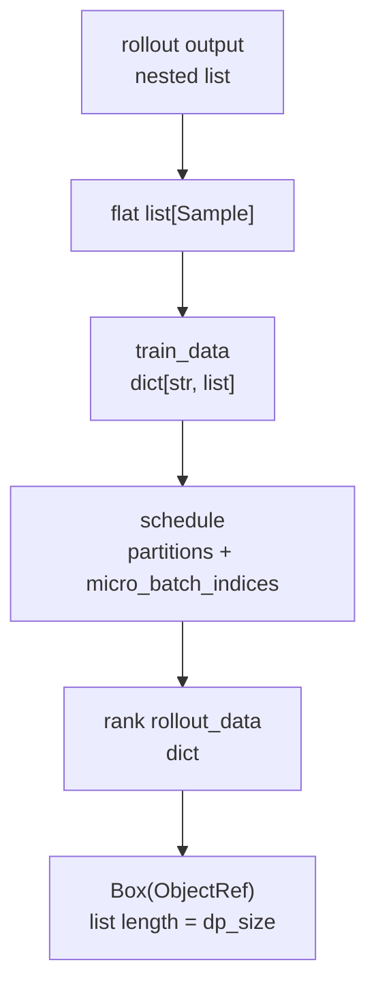
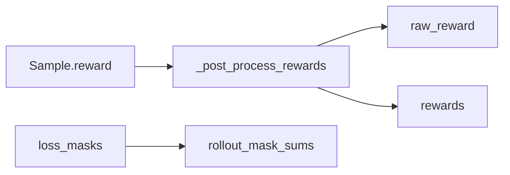

# RolloutManager · 数据流

## 你为什么要读

本页沿一个 rollout batch 的形态变化读：nested rollout output 如何压平成 `Sample`，如何转成列式 `train_data`，再如何按 DP schedule 切成每个 rank 的 ObjectRef。读完后应能定位 reward、mask、rollout_id 和 micro-batch schedule 的错位点。

## 形态总览



每次形态变化都在解决一个问题：

- nested list 保留 prompt、rollout、compact sibling 的结构。
- flat list 方便统一 reward、mask 和列式转换。
- train_data dict 方便按字段切片。
- schedule 把 sample 放到 DP rank 和 micro-batch。
- ObjectRef 避免主进程直接搬运大对象。

## Sample 到 train_data

`Sample` 是任务对象，字段带有任务语义；`train_data` 是训练对象，字段按列排列。

源码入口：来源：slime/utils/types.py L94-L146

源码入口：来源：slime/ray/rollout.py L713-L823

| train_data key | 来源 | 是否按 rank 切片 |
|----------------|------|------------------|
| `tokens` | `sample.tokens` | 是 |
| `response_lengths` | `sample.response_length` | 是 |
| `rewards` | 后处理 reward | 是 |
| `raw_reward` | 原始 reward 或 metadata 覆盖 | 否，保留全局 |
| `truncated` | `sample.status` | 是 |
| `sample_indices` | `sample.index` | 是 |
| `rollout_ids` | `sample.rollout_id` 或自动补齐 | 是 |
| `loss_masks` | `sample.loss_mask` | 是 |
| `rollout_mask_sums` | 按 rollout_id 聚合 | 是 |
| `total_lengths` | `len(tokens)` | 否，保留全局 |

`raw_reward` 和 `total_lengths` 在 RolloutManager 侧不按 rank 切：训练进程先用全局 `total_lengths` 记录整批序列长度，再按 `partition` 切成本 rank 长度；`raw_reward` 保持整批口径供 pass@k 等日志。它们是“延迟处理的全局列”，不是普通 rank-local 样本列。

## rollout_id 的两层含义

| 名称 | 位置 | 语义 |
|------|------|------|
| `generate(rollout_id)` 参数 | 训练主循环 | 全局 rollout step |
| `Sample.rollout_id` 字段 | 每条样本 | loss 聚合和 DP schedule 的 rollout 分组 |

默认 rollout 常常一条 execution 对应一条训练样本，所以两者看起来像同一件事。compact/subagent 场景会打破这个直觉：一次 execution 可以产出多条 Sample，这些 sibling 必须共享 `Sample.rollout_id`。

源码入口：来源：slime/ray/rollout.py L898-L927

## reward 与 mask 的数据流



源码入口：来源：slime/ray/rollout.py L686-L711

源码入口：来源：slime/ray/rollout.py L747-L778

关键点：

- `raw_reward` 总是保留原始口径。
- `rewards` 是训练使用的口径，可能经过 group normalization。
- `loss_mask is None` 时默认全 1。
- `remove_sample=True` 时样本保留，但 loss mask 全 0。
- `rollout_mask_sums` 是同 rollout 所有 sibling 的 mask 总和。
- 默认 reward normalization 只有在固定 fanout 且排列满足 reshape 假设时才按 prompt group 工作；可变 fanout fallback 实际对整批做全局中心化，应改用按 `group_index` 分组的 custom hook。

## DP schedule 的输入输出

源码入口：来源：slime/utils/dp_schedule.py L82-L209

输入：

- `total_lengths`: 每条 sample 的 token 总长度。
- `global_batch_size`: 每个训练 step 包含多少 rollout。
- `rollout_indices`: 每条 sample 的 `rollout_id`。
- `train_parallel_config`: `dp_size/cp_size/vpp_size/microbatch_group_size_per_vp_stage`。

输出：

| 输出 | 含义 |
|------|------|
| `partitions[r]` | rank r 拥有的全局 sample 下标 |
| `micro_batch_indices[r]` | rank r 本地 sample 列表上的 micro-batch 切片 |
| `num_microbatches` | 每个训练 step 的 per-rank micro-batch 数 |
| `global_batch_sizes` | 每个 step 的 rollout 数 |

一个常见误解是把 `micro_batch_indices` 当作全局 sample 下标。它不是；它是 rank-local 下标。全局下标在 `partition` 里。

两个调度边界：unique rollout 数不能整除 `global_batch_size` 时，尾部不足一整 step 的 rollout 会被丢弃；开启 `balance_by_flops` 时，FLOPs 分 bin 不保证 token cap，需单独监控实际 micro-batch token 数。

## Ray ObjectRef 包

源码入口：来源：slime/ray/rollout.py L853-L895

每个 rank 的 `rollout_data` 包含三类字段：

| 字段类型 | 示例 | 说明 |
|----------|------|------|
| rank-local 样本列 | `tokens/rewards/loss_masks/rollout_ids` | 按 partition 取子集 |
| 全局列 | `raw_reward/total_lengths` | 不切分，用全局下标反查 |
| schedule metadata | `partition/micro_batch_indices/num_microbatches/global_batch_sizes` | 训练侧还原 step 和 micro-batch |

`_tensorize_rollout_data_for_training` 会把热路径字段转成 CPU contiguous tensor。

源码入口：来源：slime/ray/rollout.py L39-L102

`Box` 只是 ObjectRef 的薄包装：

源码入口：来源：slime/utils/misc.py L129-L135

```python
# 来源：slime/utils/misc.py L129-L135
class Box:
    def __init__(self, inner):
        self._inner = inner

    @property
    def inner(self):
        return self._inner
```

custom converter 若启用，会跳过默认列式化全过程；它必须自行提供 `_split_train_data_by_dp` 至少需要的 `tokens`、`rollout_ids`，并对希望传入训练侧的字段保持等长。当前没有集中 schema 校验。

## 与训练 actor 的连接

训练 actor 初始化后会把并行配置写回 RolloutManager。之后每次 `async_train` 接收 `list[Box]`，各 rank 按自己的 DP rank 取对应 ObjectRef。

源码入口：来源：slime/ray/train_actor.py L125-L128

源码入口：来源：train.py L63-L81

这个连接有两个不变量：

- `set_train_parallel_config` 必须早于第一次正常 generate。
- `len(rollout_data_refs)` 必须等于 `dp_size`。

## 与权重更新的连接

RolloutManager 还承担权重更新路由点：

源码入口：来源：slime/ray/rollout.py L504-L540

| 数据 | 用途 |
|------|------|
| `engines` | 第一个 `update_weights=True` server 的 node-0 engines |
| `rollout_engine_lock` | 串行化更新，避免多 source rank 并发冲突 |
| `gpu_counts/gpu_offsets` | 训练侧解释 engine 分片 |
| `num_new_engines` | fault tolerance 后补同步新 engine |
| `all_engine_actors` | 完整 engine actor 列表 |

这条连接不参与 Sample 转换，但它让 `generate → train → update_weights` 闭环回到 rollout engines。

## 数据流检查

- `len(tokens) == len(rewards) == len(loss_masks) == len(rollout_ids)`。
- compact sibling 共享同一 `rollout_id`。
- 每个 rank 的 `partition` 并起来覆盖保留样本，无重复。
- 每个 rank 的 `micro_batch_indices` 展平后覆盖本 rank 本地样本。
- Tensor 字段在 CPU 且 contiguous。
- ObjectRef 数量等于 `dp_size`。
- 混合来源 batch 的可选字段不能只在部分 samples 出现；多数列由 `samples[0]` 决定是否启用。

## 运行验证

RolloutManager 数据流要看两条线：样本列式化后如何切给 DP ranks，以及权重更新如何回到可更新 engines。

```powershell
rg -n 'def generate\(|_split_train_data_by_dp|rollout_data_refs|ray\.put|partition|micro_batch_indices|get_updatable_engines_and_lock|rollout_engine_lock|set_train_parallel_config|rollout_id|loss_masks|rewards' slime/slime/ray/rollout.py slime/slime/utils/misc.py slime/slime/utils/types.py
```

读输出时先看 `generate -> _get_rollout_data -> _split_train_data_by_dp`，确认 `Sample` 已经变成列式 `train_data`；再看 `partition`、`micro_batch_indices` 和 `ray.put`，确认每个 DP rank 收到的是自己的 ObjectRef；最后看 `get_updatable_engines_and_lock`，确认 update weights 不走 Sample 数据流。
