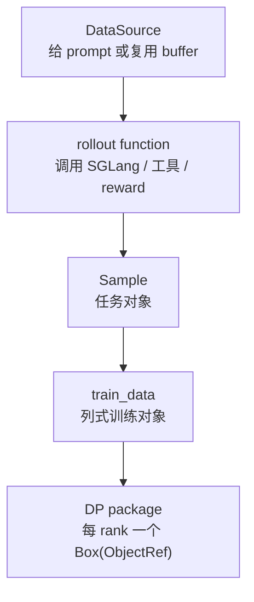
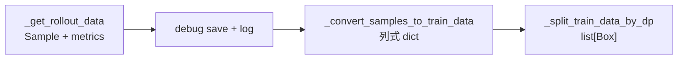

# RolloutManager · 核心概念

本页先建立 RolloutManager 的角色边界。读完后，你应该能说明它为什么是 rollout 样本到训练数据之间的中间层，并能区分 DataSource、rollout function、Sample、train_data 和 DP package 各自负责什么。

## 先建立模型

RolloutManager 是一条样本生产线的线长。它不负责 GPU forward 的细节，也不负责 Megatron loss；它负责让一个 `rollout_id` 经过五个工位：



这条线的核心不变量是：训练侧不应该理解 rollout 函数的细节，rollout 函数也不应该理解 Megatron DP/VPP 的切分细节。RolloutManager 站在中间，把两边的契约固定住。

## 五个对象

| 对象 | 职责 |
|------|------|
| `RolloutManager` | Ray CPU Actor；持有 data source、rollout/eval 函数、SGLang servers、weight-update lock |
| `RolloutFnTrainOutput` | rollout 函数的规范输出，包含 samples 和 metrics；类型注解写二维列表，当前实现也接受 compact 的更深嵌套 |
| `Sample` | 单条训练样本，包含 tokens、reward、loss_mask、rollout_id、可选 logprob/top-p/MoE/多模态字段 |
| `train_data` | 列式 dict，便于按 DP partition 切片 |
| `Box(ray.put(...))` | 每个 DP rank 的 ObjectRef 包装，传给训练 actor |

## RolloutManager 是 CPU Actor

RolloutManager 自身不占 GPU。GPU 资源在 SGLang engine actor 和 Megatron actor 上；manager 只编排、转换、切分和提供锁。

源码入口：来源：slime/ray/placement_group.py L220-L246

```python
# 来源：slime/ray/placement_group.py L220-L230
def create_rollout_manager(args, pg):
    from .rollout import RolloutManager

    rollout_manager_options = {
        "num_cpus": 1,
        "num_gpus": 0,
        "runtime_env": {"env_vars": add_default_ray_env_vars()},
    }
    if getattr(args, "rollout_data_transport", "object-store") == "nixl":
        rollout_manager_options["enable_tensor_transport"] = True
    rollout_manager = RolloutManager.options(**rollout_manager_options).remote(args, pg)
```

`nixl` 只改变 Ray tensor transport 能力，不改变 RolloutManager 的业务职责。

## 初始化挂载四类扩展点

RolloutManager 初始化时加载数据源、训练 rollout 函数、eval 函数、reward post-process hook 和自定义 convert hook。也就是说，自定义任务通常不需要改 RolloutManager，只需要替换函数路径。

源码入口：来源：slime/ray/rollout.py L420-L471

```python
# 来源：slime/ray/rollout.py L437-L449
data_source_cls = load_function(self.args.data_source_path)
self.data_source = data_source_cls(args)

self.generate_rollout = load_function(self.args.rollout_function_path)
self.eval_generate_rollout = load_function(self.args.eval_function_path)
self.custom_reward_post_process_func = None
if self.args.custom_reward_post_process_path is not None:
    self.custom_reward_post_process_func = load_function(self.args.custom_reward_post_process_path)
self.custom_convert_samples_to_train_data_func = None
if self.args.custom_convert_samples_to_train_data_path is not None:
    self.custom_convert_samples_to_train_data_func = load_function(
        self.args.custom_convert_samples_to_train_data_path
    )
```

扩展点的边界：

- `data_source_path` 决定 prompt 和 buffer 来源。
- `rollout_function_path` 决定如何调用 SGLang 或自定义环境生成样本。
- `custom_reward_post_process_path` 只替换 reward 后处理。
- `custom_convert_samples_to_train_data_path` 可以完全替换 Sample 到 train_data 的转换，也因此绕过默认 reward、rollout-id、mask 和可选字段构造；返回值至少要满足后续 split 对 `tokens`、`rollout_ids` 等字段的隐式契约。

## Sample 是默认业务载体

RolloutManager 不关心任务文本怎么构造，也不关心模型内部怎么生成；它只要求 rollout 函数最终交出 `Sample`。

源码入口：来源：slime/utils/types.py L94-L146

```python
# 定位骨架（据 `slime/utils/types.py` L97-L128 选取核心字段）：
group_index: int | None = None
index: int | None = None
rollout_id: int | None = None
prompt: str | list[dict[str, str]] = ""
tokens: list[int] = field(default_factory=list)
multimodal_train_inputs: dict[str, Any] | None = None
response: str = ""
response_length: int = 0
reward: float | dict[str, Any] | None = None
loss_mask: list[int] | None = None
weight_versions: list[str] = field(default_factory=list)
rollout_log_probs: list[float] | None = None
rollout_top_p_token_ids: list[int] | torch.Tensor | None = None
rollout_top_p_token_offsets: list[int] | torch.Tensor | None = None
rollout_routed_experts: list[list[int]] | torch.Tensor | None = None
remove_sample: bool = False
teacher_log_probs: list[float] | None = None
```

这里最重要的是 `rollout_id`：它不是训练循环的全局 step id，而是 loss 聚合和 DP schedule 的 rollout 分组 id。compact/subagent 场景中，一次 rollout execution 可能拆出多条训练样本，这些 sibling 必须共享同一个 `rollout_id`。

边界：正常 rollout 输出会在 flatten 前校验 compact sibling；`load_debug_rollout_data` 直接恢复扁平 Sample，不会重跑这项嵌套结构校验，因此复放文件必须自己保留正确 id。

## generate 的四阶段



源码入口：来源：slime/ray/rollout.py L546-L559

```python
# 来源：slime/ray/rollout.py L546-L559
def generate(self, rollout_id):
    start_time = time.time()
    self.rollout_id = rollout_id
    self.health_monitoring_resume()
    if self.args.ci_test and self.args.use_fault_tolerance and rollout_id >= 2:
        self._try_ci_fault_injection()
    data, metrics = self._get_rollout_data(rollout_id=rollout_id)
    self._save_debug_rollout_data(data, rollout_id=rollout_id, evaluation=False)
    _log_rollout_data(rollout_id, self.args, data, metrics, time.time() - start_time)
    if self.args.debug_rollout_only:
        # if debug rollout only, we don't convert samples to train data and directly return
        return
    data = self._convert_samples_to_train_data(data)
    return self._split_train_data_by_dp(data)
```

这段短代码就是本专题主线：Sample 先被保存和观测，再进入训练数据转换。`debug_rollout_only` 的提前返回是故意的，它让你只看 rollout 生成质量，不把数据送进训练。

默认 `_get_rollout_data` 随后用 `data[0]` 判断是否继续 flatten，所以空样本不是合法的“空 batch”，而会在这里触发 `IndexError`。自定义 rollout 应显式保证非空或在更上层处理空结果。

## 训练并行配置来自 Megatron Actor

`_split_train_data_by_dp` 需要知道 DP/CP/VPP 配置，但这些信息在训练 actor 初始化后才确定。启动链会让 rank 0 把配置回填到 RolloutManager。

源码入口：来源：slime/ray/train_actor.py L125-L128

```python
# 来源：slime/ray/train_actor.py L125-L128
def set_rollout_manager(self, rollout_manager):
    self.rollout_manager = rollout_manager
    if not self.args.debug_rollout_only and self.args.rank == 0:
        ray.get(self.rollout_manager.set_train_parallel_config.remote(self.train_parallel_config))
```

源码入口：来源：slime/ray/rollout.py L826-L827

```python
# 来源：slime/ray/rollout.py L826-L827
def set_train_parallel_config(self, config: dict):
    self.train_parallel_config = config
```

所以如果 `_split_train_data_by_dp` 报 `train_parallel_config` 缺失，问题通常不在 rollout 函数，而在启动顺序或 debug 开关。

## 权重更新通过 manager 取锁

Megatron actor 更新 SGLang 权重时，不直接扫描所有 engine。它从 RolloutManager 取可更新 server 的 engines 和同一把 Ray lock。

源码入口：来源：slime/ray/rollout.py L504-L540

```python
# 定位骨架（据 `slime/ray/rollout.py` L511-L540 删去 docstring）：
def _get_updatable_server(self) -> Any | None:
    for srv in self.servers.values():
        if srv.update_weights:
            return srv
    return None

def get_updatable_engines_and_lock(self):
    srv = self._get_updatable_server()
    engines = srv.engines if srv else []
    gpu_counts = srv.engine_gpu_counts if srv else []
    gpu_offsets = srv.engine_gpu_offsets if srv else []
    num_new = srv.num_new_engines if srv else 0
    all_engine_actors = srv.all_engines if srv else []
    return engines, self.rollout_engine_lock, num_new, gpu_counts, gpu_offsets, all_engine_actors
```

这保证 reference/reward 等 frozen server 不会被误更新；同时多 PP source rank 更新同一组 engine 时能通过同一把锁串行化。若配置了多个 `update_weights=True` 的模型，当前实现按 `servers` 插入顺序只返回第一个，并未实现多模型联合更新。

## 两个容易漏掉的调度边界

- unique rollout 数除以 `global_batch_size` 只取整步，凑不满最后一步的 rollout 及其全部 samples 不进入 partitions；这不是自动缩小最后一个 batch。
- `balance_by_flops` 会先按估算 FLOPs 分 bin，源码明确说明该路径不强制 token cap；极端长度分布下，一个多样本 micro-batch 可能超过 `max_tokens_per_gpu * cp_size`。

## 运行验证

RolloutManager 的最小源码验证是：谁创建 actor，谁保存扩展点，谁产出 `Sample`，谁接收训练并行配置，以及谁把可更新 engine 和锁交给训练侧。

```powershell
rg -n 'class RolloutManager|create_rollout_manager|class Sample|def generate\(|get_updatable_engines_and_lock|_get_updatable_server|train_parallel_config|set_train_parallel_config|_split_train_data_by_dp|rollout_engine_lock|custom_generate_function|custom_rm_path|dynamic_sampling_filter' slime/slime/ray/placement_group.py slime/slime/ray/rollout.py slime/slime/ray/train_actor.py slime/slime/utils/types.py
```

读输出时先看 `create_rollout_manager` 和 `RolloutManager.__init__`，确认它是 Ray CPU actor；再看 `generate` 到 `_split_train_data_by_dp`，确认训练数据切分依赖 Megatron actor 回传的并行配置；最后看 `get_updatable_engines_and_lock`，确认权重更新只作用在可更新 serving 引擎上。
