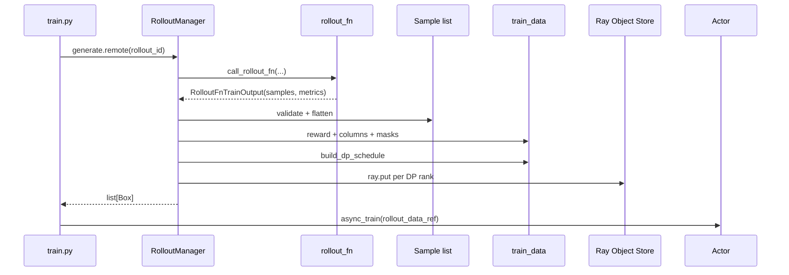

# RolloutManager · 源码走读

## 读者任务

这篇沿一个 `rollout_id` 走：训练主循环远程调用 `generate`，RolloutManager 调 rollout 函数拿到样本，把样本转成训练 dict，按 rollout 分组做 DP schedule，最后给每个 DP rank 一个 Ray ObjectRef。

读完后应能定位：

- rollout 函数返回形态不对。
- compact/subagent 样本的 `rollout_id` 缺失。
- reward normalization 结果不符合预期。
- DP schedule 因 global batch、micro batch 或动态 batch 配置失败。
- 训练 actor 拿到的数据字段缺失或 dtype 不对。
- 可变 fanout 被默认 reward normalization 错当成一个全局组。
- 尾部 rollout 被 step 取整丢弃，或 FLOPs 均衡路径越过 token cap。

## 长文读法

这篇按“rollout 是训练前的数据生产边界”读：训练主循环只拿 `generate.remote` 返回的 Ray ObjectRef，RolloutManager 内部负责启动服务、调用 rollout 函数、校验样本形态、做 reward 后处理、转列式 train_data，再按 DP schedule 切给每个训练 rank。

| 读者任务 | 先读 | 要抓住的判断 |
|----------|------|--------------|
| 第一次建立主线 | 读者任务、主线地图、1 到 4 | `generate` 是短入口，复杂度集中在取样本、转训练数据和 DP split |
| 排查服务或函数路径 | 2 到 3 | RolloutManager 初始化时装载 data source、rollout/eval 函数，并启动 SGLang server 拓扑 |
| 排查 rollout 返回形态 | 5 到 6 | `call_rollout_fn` 兼容旧返回值，但 compact / subagent 形态必须保留 `rollout_id` |
| 排查 reward 与字段缺失 | 7 到 9 | reward normalization、列式字段、loss mask 和 `rollout_mask_sums` 都在 DP split 前定型 |
| 排查 DP schedule | 10 到 11 | 先按 rollout id 分 step，再打包 micro-batch，最后给每个 DP rank 一个 ObjectRef |
| 排查权重更新路由 | 12 | RolloutManager 也是 updatable engines 与 lock 的查询点，不只是数据转换器 |

读的时候把样本形态和训练数据形态分开：rollout 函数返回 `Sample` 组，训练 actor 收到的是按 DP rank 切好的 tensor 化字典。

## 主线地图



## 1. train.py 把 rollout 看成一个远程数据生产步骤

系统压力：训练主循环要在 generate、train、update_weights 之间切换 GPU 使用权；RolloutManager 返回的数据必须足够稳定，训练 actor 不应再回头访问 rollout 函数。

设计选择：`train.py` 在每轮先 `ray.get(rollout_manager.generate.remote(rollout_id))`，再把返回的 `rollout_data_ref` 直接传给 actor/critic。

源码入口：来源：train.py L9-L103

```python
# 来源：train.py L63-L81
for rollout_id in range(args.start_rollout_id, args.num_rollout):
    if args.eval_interval is not None and rollout_id == 0 and not args.skip_eval_before_train:
        ray.get(rollout_manager.eval.remote(rollout_id))

    rollout_data_ref = ray.get(rollout_manager.generate.remote(rollout_id))

    if args.offload_rollout:
        ray.get(rollout_manager.offload.remote())

    actor_trains_this_step = (not args.use_critic) or rollout_id >= args.num_critic_only_steps

    if args.use_critic:
        value_refs = critic_model.async_train(rollout_id, rollout_data_ref)
        if actor_trains_this_step:
            ray.get(actor_model.async_train(rollout_id, rollout_data_ref, external_data=value_refs))
        else:
            ray.get(value_refs)
    else:
        ray.get(actor_model.async_train(rollout_id, rollout_data_ref))
```

执行逻辑：

- `generate` 是训练前的数据生产边界。
- offload 发生在 generate 后，给 Megatron 训练腾显存。
- actor 与 critic 共享同一个 rollout 数据包，critic 可先产生 value refs。

## 2. RolloutManager 初始化服务、数据源和函数路径

系统压力：rollout 侧既要启动 SGLang servers，又要加载用户自定义数据源、生成函数、eval 函数和后处理 hook；这些状态必须留在 Ray actor 进程中。

设计选择：初始化时根据 `debug_train_only` 决定是否启动 server；正常路径调用 `start_rollout_servers`，再动态加载函数路径，最后等待 engine init handles。

源码入口：来源：slime/ray/rollout.py L420-L471

```python
# 定位骨架（据 `slime/ray/rollout.py` L430-L455 删节）：
rollout_init_handles: list[Any] = []
if self.args.debug_train_only:
    self.servers: dict[str, Any] = {}
else:
    init_http_client(args)
    self.servers, rollout_init_handles = start_rollout_servers(args, pg)

data_source_cls = load_function(self.args.data_source_path)
self.data_source = data_source_cls(args)

self.generate_rollout = load_function(self.args.rollout_function_path)
self.eval_generate_rollout = load_function(self.args.eval_function_path)
...
if rollout_init_handles:
    ray.get(rollout_init_handles)
```

这里要注意顺序：RolloutManager 不是每轮临时 import 函数；它在 actor 初始化时挂好插件。路径错误通常启动时就暴露。`debug_train_only` 只保证不创建 servers；真正的磁盘复放通常由 `load_debug_rollout_data` 触发，参数归一化会自动把它改成 train-only。

## 3. start_rollout_servers 把 SGLang 拓扑压成 servers map

系统压力：一个 rollout 配置可以有多个模型，也可以启用 PD/EPD disaggregation。RolloutManager 不应在 `generate` 中临时拼 topology。

设计选择：`start_rollout_servers` 解析 SGLang config，为每个 model 启动 router 和 server groups，返回 `servers` map 与 pending init handles。

源码入口：来源：slime/ray/rollout.py L1089-L1228

```python
# 定位骨架（据 `slime/ray/rollout.py` L1103-L1127 删节）：
if args.rollout_external:
    return start_external_rollout_servers(args, start_router=_start_router)

config = _resolve_sglang_config(args)

servers: dict[str, RolloutServer] = {}
pending_init_handles: list[Any] = []
gpu_offset = 0
engine_offset = 0

for model_idx, model_cfg in enumerate(config.models):
    model_cfg.resolve(args)

    has_pd = model_cfg.has_pd_disaggregation
    router_ip, router_port = _start_router(args, has_pd_disaggregation=has_pd, force_new=(model_idx > 0))

    if model_idx == 0:
        args.sglang_router_ip = router_ip
        args.sglang_router_port = router_port
```

```python
# 定位骨架（据 `slime/ray/rollout.py` L1217-L1228 删节）：
servers[model_cfg.name] = RolloutServer(
    server_groups=server_groups,
    router_ip=router_ip,
    router_port=router_port,
    model_name=model_cfg.name,
    update_weights=model_cfg.update_weights,
)

# Expose per-model router info for custom rollout functions.
args.sglang_model_routers = {name: (srv.router_ip, srv.router_port) for name, srv in servers.items()}

return servers, pending_init_handles
```

运行抓手：自定义 rollout 函数如果要按模型名选择 endpoint，应看 `args.sglang_model_routers`；老函数只用第一个模型时看 `args.sglang_router_ip/port`。

## 4. generate 是短主线，复杂度在四个子步骤

系统压力：生成样本、保存 debug、写日志、训练数据转换和 DP split 需要固定顺序；debug 模式又要允许只跑 rollout。

设计选择：`generate` 把整个步骤串成明确流水线，`debug_rollout_only` 在转换前返回。

源码入口：来源：slime/ray/rollout.py L546-L559

```python
# 来源：slime/ray/rollout.py L546-L559
def generate(self, rollout_id):
    start_time = time.time()
    self.rollout_id = rollout_id
    self.health_monitoring_resume()
    if self.args.ci_test and self.args.use_fault_tolerance and rollout_id >= 2:
        self._try_ci_fault_injection()
    data, metrics = self._get_rollout_data(rollout_id=rollout_id)
    self._save_debug_rollout_data(data, rollout_id=rollout_id, evaluation=False)
    _log_rollout_data(rollout_id, self.args, data, metrics, time.time() - start_time)
    if self.args.debug_rollout_only:
        # if debug rollout only, we don't convert samples to train data and directly return
        return
    data = self._convert_samples_to_train_data(data)
    return self._split_train_data_by_dp(data)
```

不变量：正常训练路径下返回的是 `list[Box]`，不是 `list[Sample]`。如果 debug-only 打开，返回值为空，训练主循环不能继续消费它。

## 5. _get_rollout_data 统一 debug 复放和正常 rollout

系统压力：调试时需要复放磁盘样本；正常训练时需要调用用户函数；用户函数可能返回旧格式、规范格式或嵌套 list。

设计选择：debug 分支从 `torch.load` 恢复 `Sample`；正常分支通过 `call_rollout_fn` 包装返回值，先校验 compact rollout id，再展平嵌套 list。

源码入口：来源：slime/ray/rollout.py L635-L665

```python
# 定位骨架（据 `slime/ray/rollout.py` L635-L665 删节）：
if self.args.load_debug_rollout_data:
    data = torch.load(
        self.args.load_debug_rollout_data.format(rollout_id=rollout_id),
        weights_only=False,
    )["samples"]
    data = [Sample.from_dict(sample) for sample in data]
    if (ratio := self.args.load_debug_rollout_data_subsample) is not None:
        original_num_rows = len(data)
        rough_subsample_num_rows = int(original_num_rows * ratio)
        data = data[: rough_subsample_num_rows // 2] + data[-rough_subsample_num_rows // 2 :]
    metrics = None
else:
    data = call_rollout_fn(self.generate_rollout, self.args, rollout_id, self.data_source, evaluation=False)
    metrics = data.metrics
    data = data.samples
    _validate_rollout_id_annotated(data)
    while isinstance(data[0], list):
        data = list(itertools.chain.from_iterable(data))

return data, metrics
```

源码入口：来源：slime/rollout/base_types.py L7-L26

```python
# 来源：slime/rollout/base_types.py L19-L26
def call_rollout_fn(fn, *args, evaluation: bool, **kwargs):
    output = fn(*args, **kwargs, evaluation=evaluation)

    # compatibility for legacy version
    if not isinstance(output, (RolloutFnTrainOutput, RolloutFnEvalOutput)):
        output = RolloutFnEvalOutput(data=output) if evaluation else RolloutFnTrainOutput(samples=output)

    return output
```

读者抓手：如果 rollout 函数返回裸 list，不一定错；`call_rollout_fn` 会兼容。但如果 compact nested list 的 sibling 没有 `rollout_id`，会在 flatten 前失败。磁盘 debug 复放已是扁平 Sample，绕过该校验；正常路径若返回空列表，则后续 `data[0]` 会 `IndexError`。flatten 也只观察第一个元素的层级，因此自定义输出应保持整批嵌套形态一致。

## 6. compact rollout 必须显式标注 rollout_id

系统压力：一个 rollout execution 可能拆成多条训练样本。如果这些样本没有共享 id，后面的 loss reducer 会把一次 rollout 当成多次 rollout。

设计选择：`_validate_rollout_id_annotated` 只在 depth >= 2 的 compact/subagent leaf list 上强制校验，兼容默认 `prompt × n_samples` 输出。

源码入口：来源：slime/ray/rollout.py L898-L927

```python
# 定位骨架（据 `slime/ray/rollout.py` L898-L927 删去 docstring）：
def _validate_rollout_id_annotated(node, depth=0):
    if isinstance(node, Sample):
        return
    assert isinstance(node, list), f"unexpected rollout output node type: {type(node).__name__}"
    if node and isinstance(node[0], Sample):
        if depth >= 2 and len(node) > 1:
            rids = [s.rollout_id for s in node]
            missing = [i for i, r in enumerate(rids) if r is None]
            assert not missing, (
                f"Compact rollout returned {len(node)} samples but rollout_id is unset on "
                f"positions {missing}. Set Sample.rollout_id on every sibling so the loss "
                "reducer can aggregate them as one rollout instead of N."
            )
            assert len(set(rids)) == 1, f"Sibling samples from one compact rollout must share rollout_id; got {rids}."
        return
    for item in node:
        _validate_rollout_id_annotated(item, depth + 1)
```

不变量：默认二层输出不强制；compact 三层输出必须共享 id。排查 loss 分母异常时，先看这一层。

## 7. reward 后处理在 DP split 前完成

系统压力：GRPO/GSPO/CISPO 等算法需要按 prompt group 做 reward normalization；这个操作必须看到完整 rollout batch，不能在 DP rank 局部做。

设计选择：`_post_process_rewards` 先保留 raw rewards，再按算法和开关生成训练用 rewards；自定义 hook 可完全接管。

源码入口：来源：slime/ray/rollout.py L686-L711

```python
# 定位骨架（据 `slime/ray/rollout.py` L686-L711 删去函数头与注释）：
if self.custom_reward_post_process_func is not None:
    return self.custom_reward_post_process_func(self.args, samples)

raw_rewards = [sample.get_reward_value(self.args) for sample in samples]
if (
    self.args.advantage_estimator in ["grpo", "gspo", "cispo", "reinforce_plus_plus_baseline"]
    and self.args.rewards_normalization
):
    rewards = torch.tensor(raw_rewards, dtype=torch.float)
    if rewards.shape[-1] == self.args.n_samples_per_prompt * self.args.rollout_batch_size:
        rewards = rewards.reshape(-1, self.args.n_samples_per_prompt)
    else:
        rewards = rewards.view(-1, rewards.shape[-1])
    mean = rewards.mean(dim=-1, keepdim=True)
    rewards = rewards - mean

    if self.args.advantage_estimator in ["grpo", "gspo", "cispo"] and self.args.grpo_std_normalization:
        std = rewards.std(dim=-1, keepdim=True)
        rewards = rewards / (std + 1e-6)

    return raw_rewards, rewards.flatten().tolist()

return raw_rewards, raw_rewards
```

失败模式：等量 fanout 时，代码依赖“样本按 prompt group 连续排列”来 reshape；顺序改变会混组。更关键的是，样本总数不等于 `n_samples_per_prompt * rollout_batch_size` 时，fallback `view(-1, rewards.shape[-1])` 对一维 rewards 只形成一行，等价于对整批做全局中心化，而不是按可变大小 prompt group 归一化。可变 fanout 应使用按 `group_index` 分组的 custom reward hook。

## 8. Sample 转成列式 train_data

系统压力：训练侧要按字段批量读取，并按 partition 切片。对象列表不适合直接进入 DP schedule。

设计选择：`_convert_samples_to_train_data` 生成列式 dict，先处理 `rollout_ids`，再处理 `loss_masks`，然后加入可选列。

源码入口：来源：slime/ray/rollout.py L713-L823

```python
# 定位骨架（据 `slime/ray/rollout.py` L720-L745 删节）：
raw_rewards, rewards = self._post_process_rewards(samples)

assert len(raw_rewards) == len(samples)
assert len(rewards) == len(samples)

rollout_ids = [sample.rollout_id for sample in samples]
existed_rollout_id_values = set(rid for rid in rollout_ids if rid is not None)
tmp_id = 0
for i in range(len(rollout_ids)):
    if rollout_ids[i] is None:
        while tmp_id in existed_rollout_id_values:
            tmp_id += 1
        rollout_ids[i] = tmp_id
        existed_rollout_id_values.add(tmp_id)

train_data = {
    "tokens": [sample.tokens for sample in samples],
    "response_lengths": [sample.response_length for sample in samples],
    "rewards": rewards,
    "raw_reward": raw_rewards,
    "truncated": [1 if sample.status == Sample.Status.TRUNCATED else 0 for sample in samples],
    "sample_indices": [sample.index for sample in samples],
    "rollout_ids": rollout_ids,
}
```

```python
# 定位骨架（据 `slime/ray/rollout.py` L747-L761 删节）：
loss_masks = []
for sample in samples:
    if sample.loss_mask is None:
        sample.loss_mask = [1] * sample.response_length

    assert (
        len(sample.loss_mask) == sample.response_length
    ), f"loss mask length {len(sample.loss_mask)} != response length {sample.response_length}"
    if sample.remove_sample:
        sample.loss_mask = [0] * sample.response_length
    loss_masks.append(sample.loss_mask)
train_data["loss_masks"] = loss_masks
```

关键点：

- `remove_sample=True` 不是删除样本，而是把 loss mask 清零。
- `rollout_id=None` 会自动分配临时 id，但 compact sibling 应该提前显式设置同一 id。
- 可选的 rollout logprobs、top-p replay、MoE routed experts、多模态、teacher logprobs 在后续条件块加入。
- 除多模态与 `raw_reward` 外，多数可选列用 `samples[0]` 决定是否整列存在；混合来源 batch 若第一条没有、后续有，字段可能被整体忽略；若第一条有而后续缺失，后端可能在列构造或消费时失败。
- custom converter 在函数开头直接返回，必须自行生成后续 split 需要的字段；当前没有独立 schema validator，缺字段通常表现为稍后的 `KeyError`。

## 9. rollout_mask_sums 固定 loss 分母

系统压力：同一 rollout 的多个样本可能被分到不同 micro-batch；如果每个 micro-batch 只用局部 loss mask 求平均，rollout-level loss 会被拆散。

设计选择：在 split 前按 `rollout_id` 聚合 mask sum，再把总和广播回每个 sample。

源码入口：来源：slime/ray/rollout.py L763-L778

```python
# 来源：slime/ray/rollout.py L773-L778
rollout_id_list = train_data["rollout_ids"]
mask_sums_per_sample = [sum(m) for m in loss_masks]
rollout_total_mask: dict[int, int] = {}
for rid, ms in zip(rollout_id_list, mask_sums_per_sample, strict=True):
    rollout_total_mask[rid] = rollout_total_mask.get(rid, 0) + ms
train_data["rollout_mask_sums"] = [rollout_total_mask[rid] for rid in rollout_id_list]
```

读者抓手：`rollout_mask_sums[i]` 是 sample i 所属 rollout 的总 loss token 数，不是 sample i 自己的 token 数。

## 10. DP schedule 先按 rollout 分 step，再打包 micro-batch

系统压力：训练 step 的 `global_batch_size` 语义是 rollout 数，不是 sample 数；同时每个 DP rank 必须拿到相同数量的 micro-batch，PP/VPP 才能同步。

设计选择：`build_dp_schedule` 按 rollout id 聚合 sample，切 step，pack micro-batch，对齐 micro-batch 数，再分发给 DP rank。

源码入口：来源：slime/utils/dp_schedule.py L82-L209

```python
# 定位骨架（据 `slime/utils/dp_schedule.py` L127-L150 删节）：
rollout_id_to_samples: dict[int, list[int]] = {}
for sample_pos, rid in enumerate(rollout_indices):
    rollout_id_to_samples.setdefault(rid, []).append(sample_pos)
rollout_ids = list(rollout_id_to_samples.keys())

num_steps = len(rollout_ids) // global_batch_size
assert num_steps >= 1, (
    f"num_rollouts ({len(rollout_ids)}) < global_batch_size ({global_batch_size}); "
    f"need at least one rollout per step."
)

for step_i in range(num_steps):
    step_rollouts = rollout_ids[step_i * global_batch_size : (step_i + 1) * global_batch_size]
    sample_indices = [pos for rid in step_rollouts for pos in rollout_id_to_samples[rid]]
    step_lengths = [total_lengths[i] for i in sample_indices]
    global_batch_sizes.append(global_batch_size)
```

```python
# 定位骨架（据 `slime/utils/dp_schedule.py` L167-L208 删节）：
target_K = max(((len(step_mbs) + align_to - 1) // align_to) * align_to, align_to)
if target_K != len(step_mbs):
    if args.use_dynamic_batch_size:
        expand_bins_by_splitting(step_mbs, target_K, step_lengths)
        assert len(step_mbs) == target_K
    else:
        raise AssertionError(...)

K = len(step_mbs)
num_mbs_per_rank = K // dp_size
num_microbatches.append(num_mbs_per_rank)

if args.balance_data:
    rank_mbs_idx = get_seqlen_balanced_partitions(mbs_weights, dp_size, equal_size=True)
else:
    rank_mbs_idx = [list(range(r, K, dp_size)) for r in range(dp_size)]

for r in range(dp_size):
    for mbs_idx in rank_mbs_idx[r]:
        mbs_locals = step_mbs[mbs_idx]
        local_start = len(partitions[r])
        partitions[r].extend(sample_indices[i] for i in mbs_locals)
        micro_batch_indices[r].append(list(range(local_start, local_start + len(mbs_locals))))
```

排障顺序：先看 unique rollout 数是否小于 `global_batch_size`，再看除法余数是否意味着尾部 rollout 被丢弃，再看 step 内 sample 数是否小于 `dp_size`，最后看 static micro-batch 是否满足对齐。动态 `balance_by_flops` 路径要单独检查实际 bin 的 token 总和，因为它不保证 token cap。

## 11. _split_train_data_by_dp 打包每个 rank 的 ObjectRef

系统压力：训练 actor 不应该接收全量 Sample 再自己切分；每个 DP rank 应拿到自己的样本列、局部 micro-batch indices 和必要全局字段。

设计选择：RolloutManager 为每个 rank 构造 `rollout_data`，样本级字段按 partition 切片，`raw_reward/total_lengths` 保留全局列，tensor 化后 `ray.put`。

源码入口：来源：slime/ray/rollout.py L826-L895

```python
# 定位骨架（据 `slime/ray/rollout.py` L841-L895 删节）：
dp_size = self.train_parallel_config["dp_size"]
total_lengths = [len(t) for t in data["tokens"]]
data["total_lengths"] = total_lengths

partitions, micro_batch_indices, num_microbatches, global_batch_sizes = build_dp_schedule(
    self.args,
    self.train_parallel_config,
    total_lengths,
    global_batch_size=self.args.global_batch_size,
    rollout_indices=data["rollout_ids"],
)

rollout_data_refs = []
for r in range(dp_size):
    partition = partitions[r]
    rollout_data = {"partition": partition}
    ...
    rollout_data["global_batch_sizes"] = global_batch_sizes
    rollout_data["num_microbatches"] = num_microbatches
    rollout_data["micro_batch_indices"] = micro_batch_indices[r]
    _tensorize_rollout_data_for_training(rollout_data)
    transport = getattr(self.args, "rollout_data_transport", "object-store")
    if transport == "nixl":
        rollout_data_refs.append(Box(ray.put(rollout_data, _tensor_transport="nixl")))
    elif transport == "object-store":
        rollout_data_refs.append(Box(ray.put(rollout_data)))
    else:
        raise ValueError(f"Unsupported rollout data transport: {transport!r}")
return rollout_data_refs
```

源码入口：来源：slime/ray/rollout.py L39-L102

```python
# 定位骨架（据 `slime/ray/rollout.py` L80-L102 删节）：
def _tensorize_rollout_data_for_training(rollout_data: dict[str, Any]) -> None:
    for key, dtype in _ROLLOUT_DATA_TENSOR_DTYPES.items():
        if key in rollout_data:
            rollout_data[key] = [_cpu_tensor(value, dtype=dtype) for value in rollout_data[key]]

    if "multimodal_train_inputs" in rollout_data:
        rollout_data["multimodal_train_inputs"] = [
            (
                {
                    key: _cpu_tensor(value) if isinstance(value, (np.ndarray, torch.Tensor)) else value
                    for key, value in mm_dict.items()
                }
                if mm_dict is not None
                else None
            )
            for mm_dict in rollout_data["multimodal_train_inputs"]
        ]
```

输出不变量：

- `len(rollout_data_refs) == dp_size`。
- 每个 rank 的 `partition` 是全局 sample 下标列表。
- `micro_batch_indices[r]` 是 rank-local 下标。
- `tokens/loss_masks/logprobs` 等热路径字段是 CPU contiguous tensors。

`total_lengths` 之所以先整列复制到每个 DP 包，是训练进程取包后先把全局长度写入 `Timer().seq_lens`，再依据 `partition` 切成本 rank 的局部长度；`raw_reward` 则保留整批口径供 pass@k 等全局日志使用。二者不是“永远不切”，而是延迟到训练侧按各自用途处理。

## 12. RolloutManager 同时是权重更新的路由点

系统压力：训练结束后要把 actor 权重推回 SGLang；多模型场景下只更新 policy server，fault tolerance 后新 engine 也要补更新。

设计选择：RolloutManager 提供可更新 engines、lock、GPU counts/offsets 和 `num_new_engines`。

源码入口：来源：slime/ray/rollout.py L504-L540

源码入口：来源：slime/ray/rollout.py L595-L616

```python
# 定位骨架（据 `slime/ray/rollout.py` L527-L540 删去 docstring）：
def get_updatable_engines_and_lock(self):
    srv = self._get_updatable_server()
    engines = srv.engines if srv else []
    gpu_counts = srv.engine_gpu_counts if srv else []
    gpu_offsets = srv.engine_gpu_offsets if srv else []
    num_new = srv.num_new_engines if srv else 0
    all_engine_actors = srv.all_engines if srv else []
    return engines, self.rollout_engine_lock, num_new, gpu_counts, gpu_offsets, all_engine_actors
```

这条路径和训练数据路径无关，但它解释了为什么 RolloutManager 是闭环边界对象：它一边生产训练数据，一边把训练后的权重更新目标暴露给 actor。目标是第一个 `update_weights=True` 的 server，不是所有可更新模型。

## 运行验证

- 打开 `debug_rollout_only`：预期 `_get_rollout_data`、debug save、日志执行，但不调用 `_convert_samples_to_train_data`。
- 使用 `load_debug_rollout_data`：预期不请求 SGLang，直接加载 Sample 并进入 convert/split。
- 构造 compact nested output 且缺失 sibling `rollout_id`：预期 `_validate_rollout_id_annotated` 报错。
- 用 `tests/test_dp_schedule.py` 验证 DP schedule：预期 9 项通过，partitions 覆盖 kept samples，尾部不足整 step 的 rollout 被排除，且每个 rank 的 micro-batch 数相同。

```powershell
Set-Location slime
python -m pytest tests/test_dp_schedule.py -q
```

当前基线：`9 passed`。相关 6 个 Python 文件静态编译通过。插件 runtime-hook contracts 在当前环境 collection 失败，直接原因是缺 `httpx`；同时本机 Torch 对 NumPy 2.x 发出 ABI 警告，均未冒充测试通过。

可变 fanout 结论还通过 AST 抽取当前 `_post_process_rewards` 函数体实跑：固定四样本、每 prompt 两条时输出 `[-1, 1, -2, 2]`；三样本触发 fallback 时输出约 `[-3.67, -1.67, 5.33]`，三者只满足整批均值为 0。

## 复盘迁移

- RolloutManager 的核心不是“启动 SGLang”，而是“把 rollout 样本变成训练数据包”。
- `Sample.rollout_id` 是训练语义字段，不是日志字段。
- reward normalization 必须在 DP split 前做。
- DP schedule 按 rollout 数切 step，sample 数只是每个 rollout 的展开结果。
- `Box(ray.put(...))` 是 RolloutManager 和训练 actor 的物理边界。
