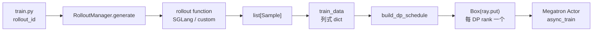

# RolloutManager

> 源码主文件：`slime/ray/rollout.py`。相关边界：`train.py`、`slime/ray/placement_group.py`、`slime/rollout/base_types.py`、`slime/utils/types.py`、`slime/utils/dp_schedule.py`。

## 读者为什么要读

读完训练主循环后，你会看到 `rollout_manager.generate.remote(rollout_id)` 返回一包数据，然后 `actor_model.async_train(...)` 就能训练。这里最容易夹生：RolloutManager 既不像 SGLang Scheduler 那样做 token 级 continuous batching，也不像 Megatron Actor 那样算 loss；它真正负责的是把“推理世界的样本”变成“训练世界能按 DP rank 消费的数据包”。

本专题解决四个问题：

1. 一个 `rollout_id` 如何触发数据源、rollout 函数、SGLang 引擎和奖励后处理。
2. `list[Sample]` 如何变成列式 `train_data`。
3. 为什么 DP schedule 按 rollout id 而不是按 sample 数切 step，以及尾部不足一整 step 时哪些样本会被丢弃。
4. 权重更新为什么从 RolloutManager 取 engines 和 lock，以及多模型时为何只选择第一个 `update_weights=True` 的 server。

## 主线图

这条线只讲训练 rollout 数据如何交付。SGLang engine/router 拓扑见 [[Slime-引擎拓扑]]；`Sample` 字段契约见 [[Slime-Sample数据契约]]；DataSource 见 [[Slime-数据源]]；默认 SGLang rollout 函数见 [[Slime-SGLang-Rollout]]；训练侧消费见 [[Slime-训练数据]]。

## 源码入口

- 训练主循环如何调用 generate：来源：train.py L9-L103
- RolloutManager 创建为 CPU Ray Actor：来源：slime/ray/placement_group.py L220-L246
- RolloutManager 初始化和插件加载：来源：slime/ray/rollout.py L420-L471
- generate 主入口：来源：slime/ray/rollout.py L546-L559
- rollout 函数返回包装：来源：slime/rollout/base_types.py L7-L26
- Sample 训练字段：来源：slime/utils/types.py L94-L146
- reward 后处理与列式转换：来源：slime/ray/rollout.py L686-L823
- DP 切分与 Ray ObjectRef 打包：来源：slime/ray/rollout.py L826-L895
- DP schedule 算法：来源：slime/utils/dp_schedule.py L82-L209
- 可更新引擎和 lock：来源：slime/ray/rollout.py L504-L540

## 阅读顺序

| 文件 | 解决的问题 |
| ------ | ------------ |
| [[Slime-RolloutManager-核心概念]] | 建立“样本生产线”模型，区分 DataSource、rollout fn、Sample、train_data、DP package |
| [[Slime-RolloutManager-源码走读]] | 沿一个 `rollout_id` 走完整源码主线 |
| [[Slime-RolloutManager-数据流]] | 看对象形态如何从 Sample 变成 per-rank ObjectRef |
| [[Slime-RolloutManager-排障指南]] | 用症状定位 debug、rollout_id、reward、DP schedule、offload、权重更新问题 |
| [[Slime-RolloutManager-学习检查]] | 做可执行验收，不以源码摘录数量计分 |

## 运行抓手

- 如果只想验证 rollout 函数和奖励，开 `debug_rollout_only`：预期会生成并保存 Sample，但不会返回训练 ObjectRef。
- 如果想复现训练数据构造，使用 `load_debug_rollout_data`：参数归一化会强制 `debug_train_only=True`，跳过 SGLang，直接从磁盘 Sample 进入 convert/split；这条复放路径不会重新执行 compact rollout-id 校验。
- 如果 DP 切分失败，先看 `rollout_ids`、`global_batch_size`、`dp_size`、`micro_batch_size` 和 `use_dynamic_batch_size`；若开启 `balance_by_flops`，不要再把 `max_tokens_per_gpu` 当硬上限。
- 如果权重更新卡住，先看 `get_updatable_engines_and_lock` 返回的 engines 是否为空，以及是否只有目标 policy server 配 `update_weights=True`；多个可更新 server 当前也只取第一个。

当前基线轻量验证：`tests/test_dp_schedule.py` 为 `9 passed`；从当前 `_post_process_rewards` AST 抽取函数体实跑，固定 fanout 得到逐组中心化 `[-1, 1, -2, 2]`，可变 fanout 得到整批中心化 `[-3.67, -1.67, 5.33]`。
