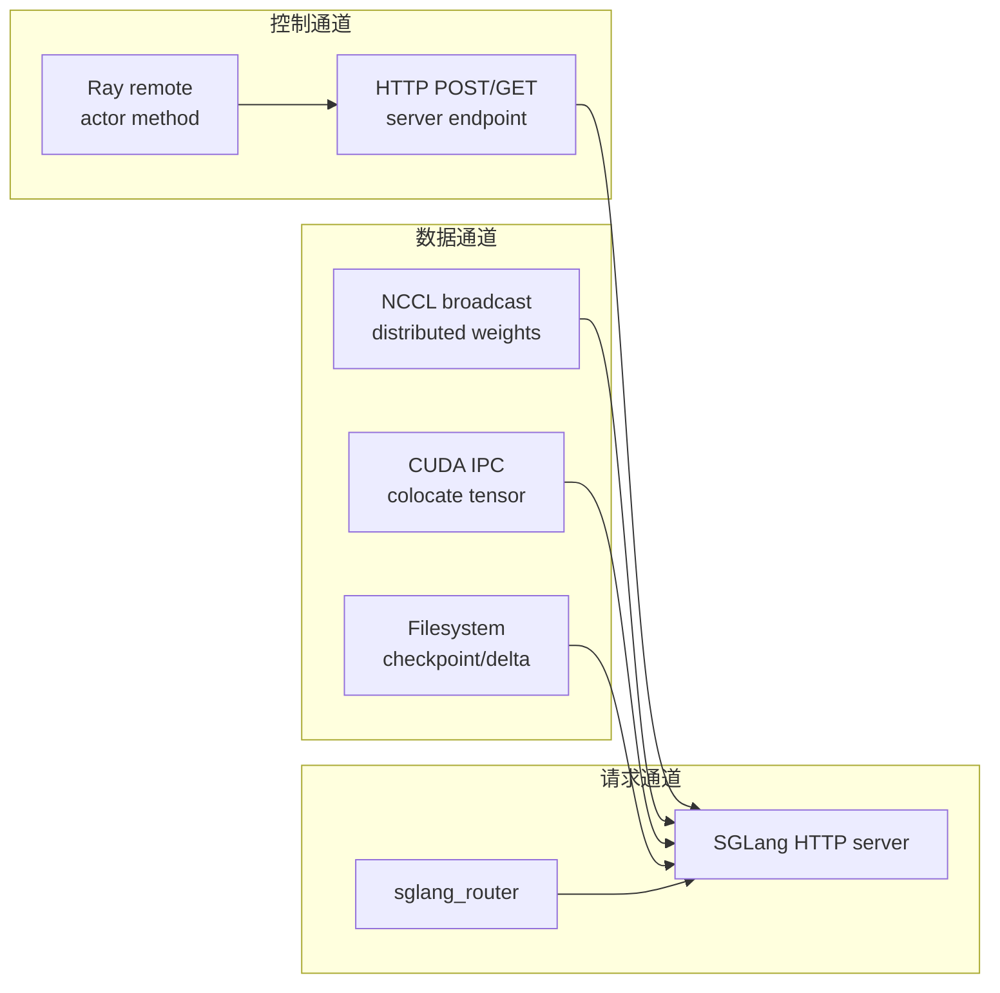
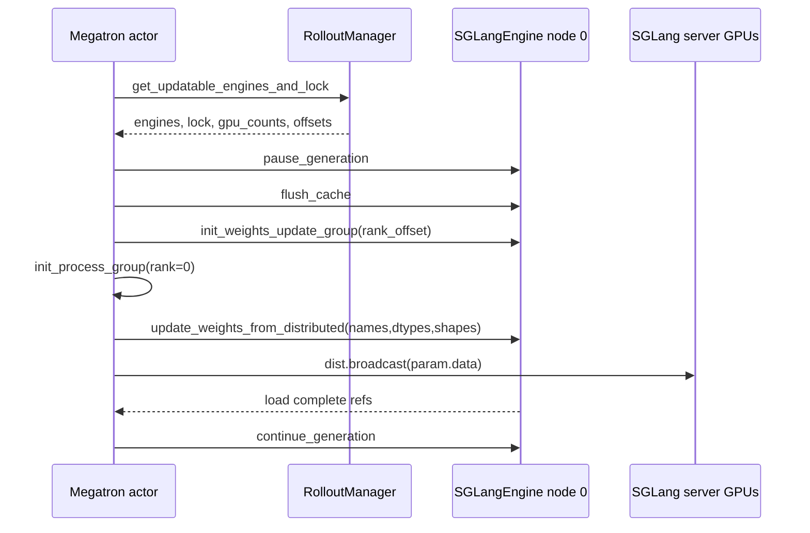
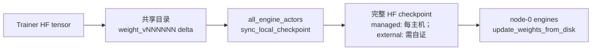
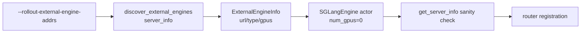

# SGLang-Engine · 数据流

## 你为什么要读

这篇不重复函数走读，而是回答“对象和数据到底穿过哪些边界”。本专题里最容易混淆的是三套坐标：Ray actor 坐标、SGLang HTTP server 坐标、权重同步 rank 坐标。

读完后，读者应该能把一个 engine 从配置、端口、GPU、router worker、权重版本五个视角同时定位出来。

---

## 长文读法

| 你的问题 | 直接阅读 |
|----------|----------|
| actor、node-0 与全部节点怎么对应 | 对象生命周期、Ray actor 集合 |
| GPU id 或端口错位 | GPU 坐标、端口坐标 |
| NCCL 更新卡住 | distributed 路径 |
| tensor/full disk/delta disk 如何选路 | 三种权重更新数据流 |
| 使用预启动 server | external engine 数据流 |

---

## 总览：三条通道



`SGLangEngine` 站在控制通道上。它会发 HTTP，也会间接触发 NCCL、IPC 或磁盘 reload，但不承载大 tensor 本身。

---

## 对象生命周期

| 阶段 | 对象 | 关键字段 | 下游用途 |
|------|------|----------|----------|
| 配置解析 | `SglangConfig` / `ModelConfig` | model name、server groups、worker type、num_gpus | 决定 router 和 group 数量 |
| 资源分配 | `ServerGroup` | `rank_offset`、`gpu_offset`、`num_gpus_per_engine` | 计算 actor rank 和 GPU 槽位 |
| actor 创建 | `SGLangEngine` | `rank`、`worker_type`、`base_gpu_id` | 生成 `ServerArgs` |
| server 初始化 | SGLang HTTP server | `host`、`port`、`nccl_port`、`dist_init_addr` | 服务 generate、更新权重 |
| 控制面集合 | `RolloutServer.engines` | node 0 actor list | 训练侧发 pause/update/continue |
| 全节点集合 | managed `RolloutServer.all_engines` | 每个 managed server node 的 actor list | delta disk 可让每个 managed host 应用本地 checkpoint；external 的同名属性只是一地址一 adapter |

---

## Ray actor 集合：`engines` 与 `all_engines`

多节点 engine 的每个节点都有一个 Ray actor，但只有 node 0 actor 代表该 engine 的 HTTP 控制面。`RolloutServer` 明确提供两种视图。

```python
# 来源：slime/ray/rollout.py L296-L304
@property
def engines(self):
    """All node-0 engines across all groups (placeholder groups contribute nothing)."""
    return [e for g in self.server_groups for e in g.engines]

@property
def all_engines(self):
    """All engines (including non-node-0) across all groups."""
    return [e for g in self.server_groups for e in g.all_engines]
```

```python
# 来源：slime/ray/rollout.py L315-L330
@property
def engine_gpu_counts(self) -> list[int]:
    """Per-engine GPU count for all node-0 engines, parallel to ``engines``."""
    return [g.num_gpus_per_engine for g in self.server_groups for _ in g.engines]

@property
def engine_gpu_offsets(self) -> list[int]:
    """Per-engine GPU offset for all node-0 engines, parallel to ``engines``.

    Accounts for placeholder groups that occupy GPU slots without creating engines.
    """
    offsets = []
    for g in self.server_groups:
        for j in range(len(g.engines)):
            offsets.append(g.gpu_offset + j * g.num_gpus_per_engine)
    return offsets
```

这段代码给了两个关键不变量：

- `engine_gpu_counts[i]` 与 `engines[i]` 对齐，不是与 `all_engines` 对齐。
- `engine_gpu_offsets` 会计入 placeholder group 占位，因此不能用简单的 `i * rollout_num_gpus_per_engine` 替代。

---

## GPU 坐标：从 PG 槽位到 SGLang 本地 id

`ServerGroup.start_engines` 先从 Placement Group 重排后的 GPU 列表里取物理起点，再传给 `SGLangEngine`。

```python
# 来源：slime/ray/rollout.py L175-L187
global_rank = self.rank_offset + i
num_gpus = 0.2
num_cpus = num_gpus

# Get the base GPU ID from placement group using gpu_offset.
gpu_index = self.gpu_offset + i * num_gpu_per_engine
base_gpu_id = int(reordered_gpu_ids[gpu_index])

scheduling_strategy = PlacementGroupSchedulingStrategy(
    placement_group=pg,
    placement_group_capture_child_tasks=True,
    placement_group_bundle_index=reordered_bundle_indices[gpu_index],
)
```

进入 `SGLangEngine` 后，`_compute_server_args` 会把这个起点转换到当前进程的 `CUDA_VISIBLE_DEVICES` 坐标。

```python
# 来源：slime/backends/sglang_utils/sglang_engine.py L578-L599
_gpus_per_engine = num_gpus_per_engine or args.rollout_num_gpus_per_engine
nnodes = max(1, _gpus_per_engine // args.num_gpus_per_node)
node_rank = rank % nnodes
base = base_gpu_id if base_gpu_id is not None else get_base_gpu_id(args, rank)
base = _to_local_gpu_id(base)
kwargs = {
    "model_path": args.hf_checkpoint,
    "trust_remote_code": True,
    "random_seed": args.seed + rank,
    # memory
    "enable_memory_saver": args.offload_rollout,
    # distributed
    "host": host,
    "port": port,
    "nccl_port": nccl_port,
    "nnodes": nnodes,
    "node_rank": node_rank,
    "dist_init_addr": dist_init_addr,
    "gpu_id_step": 1,
    "base_gpu_id": base,
    # parallel
    "tp_size": _gpus_per_engine // args.sglang_pp_size,
```

排障时要沿这个顺序查：

1. `gpu_offset` 是否落在 rollout GPU 区间。
2. `reordered_gpu_ids[gpu_index]` 是否是期望物理卡。
3. Ray actor 的 `CUDA_VISIBLE_DEVICES` 是否重映射。
4. SGLang 日志中的 `base_gpu_id` 是否是本地 id。

---

## 端口坐标：四类端口不要混用

| 端口 | 谁分配 | 谁使用 | 用途 |
|------|--------|--------|------|
| `port` | `_allocate_rollout_engine_addr_and_ports_normal` | SGLang HTTP server | `/generate`、`/flush_cache`、`/update_weights_*` |
| `nccl_port` | 同上 | SGLang server 启动侧 distributed runtime | 与该 engine 自身的分布式初始化相关，不是训练到 serving 的权重组端口 |
| `dist_init_addr` 里的端口 | 同上 | SGLang 多节点 init | 多节点 engine bootstrap |
| 权重 update `master_port` | `connect_rollout_engines_from_distributed` | Megatron rank 0 + SGLang update group | 训练到 serving 的权重 NCCL 组 |

源码里这两类 NCCL 端口来自不同文件、不同时间点。

```python
# 来源：slime/ray/rollout.py L989-L1009
for i in range(num_engines_on_this_node):
    current_rank = rank + i
    addr_and_ports.setdefault(current_rank, {})
    addr_and_ports[current_rank]["host"] = get_addr()
    addr_and_ports[current_rank]["port"] = get_port()
    addr_and_ports[current_rank]["nccl_port"] = get_port()

    if worker_type == "prefill":
        addr_and_ports[current_rank]["disaggregation_bootstrap_port"] = get_port()

if _gpus_per_engine > args.num_gpus_per_node:
    num_node_per_engine = _gpus_per_engine // args.num_gpus_per_node
    if local_rank % num_node_per_engine == 0:
        # this is the first node in the engine, we need to allocate the dist_init_addr port
        dist_init_addr = f"{get_addr()}:{get_port(30 + args.sglang_dp_size)}"
        for i in range(num_node_per_engine):
            addr_and_ports.setdefault(rank + i, {})
            addr_and_ports[rank + i]["dist_init_addr"] = dist_init_addr
else:
    for i in range(num_engines_on_this_node):
        addr_and_ports[rank + i]["dist_init_addr"] = f"{get_addr()}:{get_port(30 + args.sglang_dp_size)}"
```

```python
# 来源：slime/backends/megatron_utils/update_weight/update_weight_from_distributed.py L284-L313
master_address = ray._private.services.get_node_ip_address()
with socket.socket() as sock:
    sock.bind(("", 0))
    master_port = sock.getsockname()[1]
world_size = sum(engine_gpu_counts) + 1  # +1 for training rank 0

# Compute cumulative rank offsets: engine i starts at cumulative[i] + 1.
cumulative = [0]
for c in engine_gpu_counts:
    cumulative.append(cumulative[-1] + c)

refs = [
    engine.init_weights_update_group.remote(
        master_address=master_address,
        master_port=master_port,
        rank_offset=cumulative[i] + 1,
        world_size=world_size,
        group_name=group_name,
        backend="nccl",
    )
    for i, engine in enumerate(rollout_engines)
]
model_update_groups = init_process_group(
    backend="nccl",
    init_method=f"tcp://{_wrap_ipv6(master_address)}:{master_port}",
    world_size=world_size,
    rank=0,
    group_name=group_name,
)
ray.get(refs)
```

---

## 权重更新数据流：distributed 路径



这条路径里有两个顺序约束。

第一，建组时要先向 engine 发 remote，再在训练 rank 0 创建 process group，最后 `ray.get(refs)` 等所有 SGLang GPU 加入。

第二，每个 bucket 要拿 `rollout_engine_lock`，避免两个 broadcast 流交错。

这里还有一个失败边界：当前实现是“acquire → broadcast/`ray.get` → release”的直线代码，没有 `try/finally`。如果 broadcast 或 engine 回包在中间抛异常，锁可能留在占用态；排查后续 bucket 一直等待时，不能只看 NCCL，也要检查前一个 bucket 是否在 release 前失败。

```python
# 来源：slime/backends/megatron_utils/update_weight/update_weight_from_distributed.py L240-L265
def _update_bucket_weights_from_distributed(
    self,
    converted_named_tensors: list[tuple[str, torch.Tensor]],
    pbar: tqdm | None = None,
    load_format: str | None = None,
) -> None:
    """
    Lock → broadcast → clear → unlock → pbar++. Lock prevents NCCL deadlock.
    """
    # lock the rollout engines to prevent dead lock on broadcast.
    while not ray.get(self.rollout_engine_lock.acquire.remote()):
        time.sleep(0.1)

    refs = update_weights_from_distributed(
        self._group_name,
        self._model_update_groups,
        self.weight_version,
        self.rollout_engines,
        converted_named_tensors,
        load_format=load_format,
    )

    ray.get(refs)
    converted_named_tensors.clear()
    ray.get(self.rollout_engine_lock.release.remote())
    pbar.update(1)
```

---

## 权重更新数据流：tensor、full disk 与 delta disk

| 路径 | 控制面动作 | 数据落点 | SGLang 最终加载什么 |
|------|------------|----------|----------------------|
| tensor | `update_weights_from_tensor(serialized_named_tensors, ...)` | GPU IPC 或远端 distributed fallback | tensor payload |
| full + disk | `update_weights_from_disk(model_path=version_dir)` | 共享文件系统中的完整 HF checkpoint | 完整 `version_dir` |
| delta + disk | 先 `sync_local_checkpoint(version)`，再 `update_weights_from_disk(model_path=local_checkpoint_dir)` | 共享 delta 流 + adapter 可写、server 可读的完整 checkpoint | 补丁后的完整 checkpoint；“每主机”只由 managed actor topology 自动表达 |

disk full reload 的训练侧顺序很直观：保存 HF checkpoint，再通知每个 engine reload。

```python
# 来源：slime/backends/megatron_utils/update_weight/update_weight_from_disk.py L70-L98
if dist.get_rank() == 0:
    logger.info("Updating rollout weights from disk checkpoint %s", version_dir)
    ray.get([engine.pause_generation.remote() for engine in self.rollout_engines])
    ray.get([engine.flush_cache.remote() for engine in self.rollout_engines])
dist.barrier(group=get_gloo_group())

save_hf_model_to_path(
    self.args,
    version_dir,
    self.model,
    model_name=self.model_name,
    quantization_config=self.quantization_config,
    progress_desc="Save HF  weights for update from disk",
)
dist.barrier(group=get_gloo_group())

if dist.get_rank() == 0:
    refs = [
        engine.update_weights_from_disk.remote(
            model_path=str(version_dir),
            weight_version=str(self.weight_version),
        )
        for engine in self.rollout_engines
    ]
    ray.get(refs)
    if not self.args.update_weight_disk_keep_files:
        shutil.rmtree(version_dir, ignore_errors=True)
    ray.get([engine.continue_generation.remote() for engine in self.rollout_engines])
dist.barrier(group=get_gloo_group())
```

### Delta disk 不是让 SGLang 直接解释 delta

Delta 模式增加的是“传输前压缩、主机侧还原”阶段，而不是一种新的 SGLang load format。当前 updater 的顺序是：



```python
# 来源：slime/backends/megatron_utils/update_weight/update_weight_from_disk_delta.py L169-L186
    def _reload_engines(self) -> None:
        """Commit the published files, have each host apply the delta, then reload the engines."""
        if self._commit_hook is not None:
            self._commit_hook(self.args, self._version_dir, list(self.rollout_engines))
        dist.barrier(group=get_gloo_group())
        if dist.get_rank() == 0:
            ray.get([actor.sync_local_checkpoint.remote(self.weight_version) for actor in self.all_engine_actors])
            ray.get(
                [
                    engine.update_weights_from_disk.remote(
                        model_path=self.args.update_weight_local_checkpoint_dir,
                        weight_version=str(self.weight_version),
                    )
                    for engine in self.rollout_engines
                ]
            )
            ray.get([engine.continue_generation.remote() for engine in self.rollout_engines])
        dist.barrier(group=get_gloo_group())
```

这里的对象关系要读准：

- `all_engine_actors` 用于对所有需要维护 checkpoint 的 actor 调用补丁；Slime-managed 多节点 engine 的 `ServerGroup.all_engines` 能覆盖各节点，external 的 `ExternalRolloutServer.all_engines` 却只是每个地址对应的 zero-GPU adapter，不能自动证明每个 server host 都执行了补丁。
- `rollout_engines` 是 node-0 HTTP 控制面集合，只负责通知对应 SGLang server reload。
- adapter 方法虽然保留可选 `load_format` 和 `files` 字段，但当前 `UpdateWeightFromDiskDelta` 没有使用它们；不能从通用方法签名反推实际调用链。
- `update_weight_disk_dir` 保存可传输的 delta 版本流；`update_weight_local_checkpoint_dir` 保存 SGLang 真正读取的完整 checkpoint。二者不是同一个角色。

tensor 路径要多一层划分：同机 colocate engine 走 IPC，超出 actor GPU 范围的 engine 再走 distributed。

```python
# 来源：slime/backends/megatron_utils/update_weight/update_weight_from_tensor.py L86-L117
# Compute colocated engine count: engines whose GPUs fall within actor GPU range.
total_actor_gpus = self.args.actor_num_nodes * self.args.actor_num_gpus_per_node
colocate_engine_nums = 0
for gpu_offset, gpu_count in zip(engine_gpu_offsets, engine_gpu_counts, strict=True):
    if gpu_offset + gpu_count > total_actor_gpus:
        break
    colocate_engine_nums += 1

self.use_distribute = len(rollout_engines) > colocate_engine_nums

if self.use_distribute:
    self.rollout_engines = rollout_engines[:colocate_engine_nums]
    self.distributed_rollout_engines = rollout_engines[colocate_engine_nums:]
    distributed_gpu_counts = engine_gpu_counts[colocate_engine_nums:]
    self._is_distributed_src_rank = (
        mpu.get_data_parallel_rank(with_context_parallel=True) == 0
        and mpu.get_tensor_model_parallel_rank() == 0
        and mpu.get_pipeline_model_parallel_rank() == 0
    )
    self._group_name = "slime"
    if self._is_distributed_src_rank:
        if self._model_update_groups is not None:
            disconnect_rollout_engines_from_distributed(
                self.args, self._group_name, self._model_update_groups, self.distributed_rollout_engines
            )

        self._model_update_groups = connect_rollout_engines_from_distributed(
            self.args,
            self._group_name,
            self.distributed_rollout_engines,
            engine_gpu_counts=distributed_gpu_counts,
        )
```

---

## external engine 数据流

external 模式的对象流如下：



`start_external_rollout_servers` 仍然创建 `SGLangEngine` actor，只是不占 Ray GPU，也不启动本地 SGLang 进程。

```python
# 来源：slime/backends/sglang_utils/external.py L178-L217
def start_external_rollout_servers(args, *, start_router) -> tuple[dict[str, ExternalRolloutServer], list]:
    import ray

    from slime.backends.sglang_utils.sglang_engine import SGLangEngine
    from slime.ray.utils import add_default_ray_env_vars

    infos = external_engine_infos_from_args(args)
    router_ip, router_port = start_router(args, has_pd_disaggregation=any(info.is_pd_worker for info in infos))
    args.sglang_router_ip = router_ip
    args.sglang_router_port = router_port

    engines = []
    engine_gpu_counts = []
    engine_gpu_offsets = []
    init_handles = []
    RolloutRayActor = ray.remote(SGLangEngine)
    gpu_offset = 0
    for rank, info in enumerate(infos):
        rollout_engine = RolloutRayActor.options(
            num_cpus=0.2,
            num_gpus=0,
            runtime_env={"env_vars": add_default_ray_env_vars()},
        ).remote(
            args=args,
            rank=rank,
            worker_type=info.worker_type,
            base_gpu_id=0,
            num_gpus_per_engine=info.num_gpus,
        )
        engines.append(rollout_engine)
        engine_gpu_counts.append(info.num_gpus)
        engine_gpu_offsets.append(gpu_offset)
        gpu_offset += info.num_gpus
        init_handles.append(
            rollout_engine.init.remote(
                **external_engine_init_kwargs(info),
                router_ip=router_ip,
                router_port=router_port,
            )
        )
```

external 的不变量：

- 外部 server 必须提供 `/server_info` 或 `/get_server_info`。
- Slime 推导的 `worker_type` 和 bootstrap port 要和实际 server 匹配；GPU 数优先读取显式字段，否则只回退 `tp_size * pp_size`，不会自动计入 `dp_size`。
- zero-GPU adapter 没有按 external host 设置 node affinity；一个地址创建一个 actor，不等于一个多节点 engine 的每台主机都有 actor。
- adapter rank 直接取 external 地址序号，而 `_compute_server_args` 仍按 `rank % nnodes` 推导 node rank；多地址且单 engine 跨节点时，后续公开 HTTP 地址可能被误标为非 node 0并跳过注册/控制请求。
- `_init_external` 的 sanity check 排除了模型路径和 TP/DP/PP/EP，并且不会覆盖随后才合并的一般 `sglang_*` 参数；通过检查不等于完整配置一致。
- `shutdown`、`recover`、`offload` 的语义和本地模式不同，不能用本地模式的日志预期套 external；尤其 `SGLangEngine.shutdown()` 在 external 分支入口直接返回，既不 kill 进程，也不执行后续 router worker 注销。
- 使用 delta disk 时，执行 `sync_local_checkpoint` 的 adapter 必须和 external SGLang 看见同一份 `update_weight_local_checkpoint_dir`，并证明所有 serving host 已推进到同一版本；只有 HTTP 地址和共享 delta 目录还不够。

---

## 可观测数据

| 观测点 | 来源 | 说明 |
|--------|------|------|
| worker 列表 | router `/workers` | 能看到 node 0 worker URL、worker type |
| server health | SGLang `/health_generate` | 本地 node 0 初始化完成条件 |
| request load | SGLang `/v1/loads?include=core` | async abort 判断是否空闲 |
| weight version | SGLang `/get_weight_version` | CI 与排障确认新权重是否装载 |
| rollout perf metrics | `compute_perf_metrics_from_samples` | 从 Sample trace 汇总 SGLang request/prefill/decode 耗时 |

---

## 运行验证

1. 运行 `python -m pytest -q slime/tests/test_empty_colocated_weight_bucket.py`。预期 2 项通过；它验证某个 colocated rank 没有本地 tensor 时仍参与 gather，source rank 会补空 bucket，避免 collective 参与者错位。它不替代真实 CUDA IPC 测试。
2. 运行 `rg -n "world_size = sum\(engine_gpu_counts\)|rank_offset=cumulative\[i\] \+ 1|ray.get\(refs\)" slime/slime/backends/megatron_utils/update_weight/update_weight_from_distributed.py`。预期同时命中异构 engine GPU rank 计数、rank offset 和建组完成等待。
3. 运行 `rg -n "all_engine_actors|sync_local_checkpoint|update_weight_local_checkpoint_dir" slime/slime/backends/megatron_utils/update_weight/update_weight_from_disk_delta.py slime/slime/backends/sglang_utils/external.py`。预期能看到 updater 的每主机假设和 external 的一地址一 actor 构造；静态命中不能证明 external 多机挂载正确。
4. 在完整多 GPU 环境记录 router `/workers`、各 engine `/get_weight_version` 和训练日志中的 `engine_gpu_counts/rank_offset`。预期一次更新后所有 node-0 engine 版本一致；delta 模式还要在每个 serving host 核对本地 checkpoint 的 `.delta_sync/state.json` 版本。缺少任一主机证据时，不能宣称多节点更新闭合。
5. 当前环境直接运行 `test_external_sglang_engines.py` 因缺 `httpx` collection 失败；只 stub 测试未使用的 HTTP client 类型后，原测试 4 passed。另从当前源码 AST 检查健康等待、external shutdown、sanity check 构造时序、flush timeout、skip fields 与 external rank/node-rank 复用共 6 项通过；这不替代真实 SGLang/Ray/NCCL 环境。

---

## 数据流复盘

1. Ray actor handle 是控制面句柄，不是模型权重或请求数据本身。
2. `engines`、`all_engines`、`engine_gpu_counts`、`engine_gpu_offsets` 必须成组理解。
3. `port`、`nccl_port`、`dist_init_addr` 和权重 update `master_port` 是四个不同语义。
4. distributed 权重更新的 metadata 和 tensor 数据不走同一条通道。
5. external 模式只保留 Slime 的部分接入控制面，移走本地进程生命周期且跳过 adapter 侧 router 注销；delta disk 仍要求显式建立文件系统可见性。
6. managed `all_engines` 与 external `all_engines` 形同而语义不同：前者按 server node 展开，后者按地址展开。
