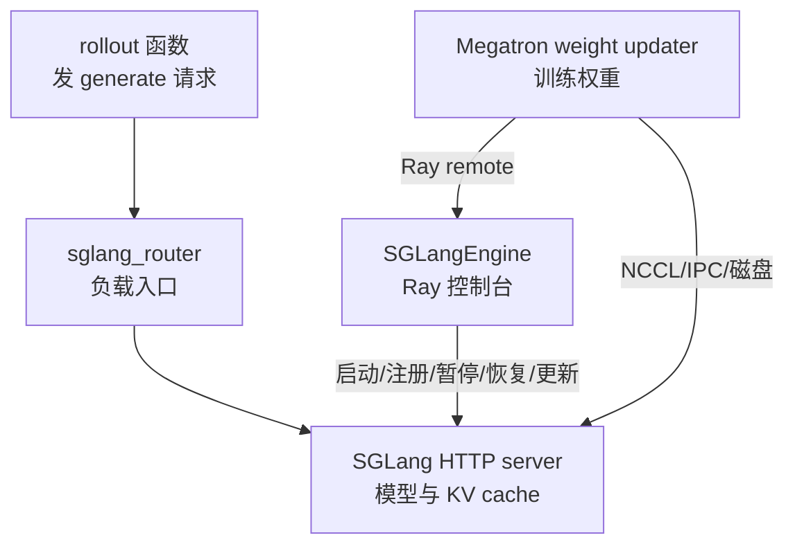
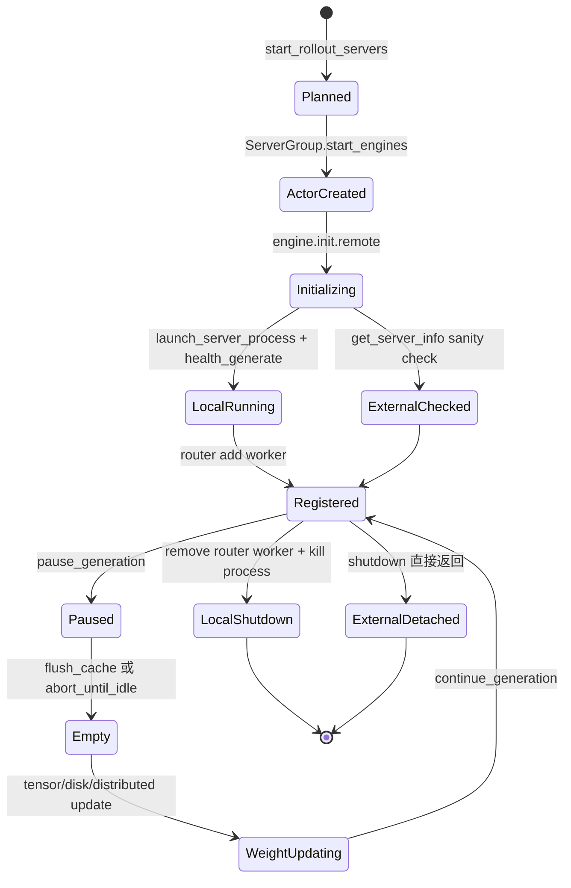

# SGLang-Engine · 核心概念

这篇先不按函数列表背接口，而是建立一个能解释启动、权重更新、外部 engine、offload 和故障恢复的统一模型。

`SGLangEngine` 的核心身份是“控制台 actor”：Ray 调度它，Slime 通过它发控制命令，SGLang HTTP server 在它身后真正加载模型和服务请求。

---

## 先建立模型

把一次 rollout serving 看成四层：



这张图的关键是：generate 的数据面通常走 router 到 SGLang server；权重更新和运行控制走 Megatron/RolloutManager 到 `SGLangEngine`，再由它转成 HTTP 或配合 NCCL。

---

## 五个核心对象

| 对象 | 读者应该记住的职责 | 易错点 |
|------|--------------------|--------|
| `ServerGroup` | 一组同质 engine，负责 Ray actor 创建、Placement Group 绑定和端口分配 | `num_gpus=0.2` 是 Ray 调度占位，不等于 SGLang 实际 TP GPU 数 |
| `RolloutServer` | 一个模型对应的 router 加多个 `ServerGroup` | 上述 node-0/all-node 语义只对 managed 多节点拓扑成立；external 是一地址一 adapter |
| `SGLangEngine` | Ray actor 控制台，维护 server host/port，转发控制面 HTTP | 它不直接做模型 forward |
| `ExternalRolloutServer` | 包装预启动外部 SGLang server | external 不支持 fault tolerance recover/offload |
| `UpdateWeight*` | 训练侧权重同步策略 | 真正发起 pause/flush/update 的是训练侧 updater |

---

## 生命周期状态机



状态机里有两个容易漏掉的分支。

第一，external 模式不会进入 `launch_server_process`，但仍会进入 `SGLangEngine.init` 和 `_register_to_router`；其 `shutdown()` 直接返回，不执行 router 注销。第二，权重更新不是 engine init 的一部分，而是在训练侧需要同步新权重时才由 updater 触发。

---

## 源码证明：node 0 actor 是控制面代表

managed 多节点 engine 会有多个 Ray actor，但对外发通用 `_make_request` HTTP 的只有 node 0。`ServerGroup.engines` 的切片和 `_make_request` 早退共同证明了这个约束；external server 只为每个公开地址创建 adapter，不能据此枚举其内部节点。

```python
# 定位骨架（据 `slime/ray/rollout.py` L129-L135 补属性装饰器）：
@property
def nodes_per_engine(self):
    return max(1, self.num_gpus_per_engine // self.args.num_gpus_per_node)

@property
def engines(self):
    """Node-0 engines only (for multi-node serving)."""
    return self.all_engines[:: self.nodes_per_engine]
```

```python
# 定位骨架（据 `slime/backends/sglang_utils/sglang_engine.py` L234-L254 删节）：
def _make_request(self, endpoint: str, payload: dict | None = None):
    if self.node_rank != 0:
        return

    url = f"http://{self.server_host}:{self.server_port}/{endpoint}"
    response = requests.post(url, json=payload or {})
    try:
        response.raise_for_status()
    except requests.exceptions.HTTPError as e:
        e.add_note(f"{response.text=}")
        raise
    return response.json()
```

因此，调试 distributed 权重同步时不要把“只有 node 0 actor 收到 Ray remote”误解成“只有 node 0 GPU 参与”。非 node 0 的 SGLang 子进程仍在 SGLang 内部分布式组里工作。

---

## 控制面与数据面的分工

| 操作 | 控制面 | 大数据怎么走 |
|------|--------|--------------|
| 启动本地 engine | Ray actor 调 `launch_server_process` | SGLang 子进程加载 checkpoint |
| 注册 router | actor POST `/workers` 或旧版 `/add_worker` | router 只保存 worker URL 与类型 |
| distributed 权重更新 | actor POST names、dtypes、shapes、group | tensor 由训练 rank 0 通过 NCCL broadcast |
| tensor 权重更新 | actor POST serialized tensor metadata | colocate 时走 GPU IPC，远端部分可回退 distributed |
| disk 权重更新 | actor POST checkpoint 路径和 version | 文件系统承载权重文件或 delta |
| offload/onload | actor POST memory saver 端点 | SGLang 侧释放或恢复 weights/KV/CUDA graph |

---

## ServerArgs 是边界契约

`_compute_server_args` 把 Slime 的训练参数翻译成 SGLang 可理解的 `ServerArgs`。这个翻译不是简单透传，它会决定 GPU 起点、多节点 rank、并行尺寸、PD worker 类型、routing replay、dtype 和 per-group override。

```python
# 定位骨架（据 `slime/backends/sglang_utils/sglang_engine.py` L578-L609 选取核心字段）：
_gpus_per_engine = num_gpus_per_engine or args.rollout_num_gpus_per_engine
nnodes = max(1, _gpus_per_engine // args.num_gpus_per_node)
node_rank = rank % nnodes
base = base_gpu_id if base_gpu_id is not None else get_base_gpu_id(args, rank)
base = _to_local_gpu_id(base)
kwargs = {
    "model_path": args.hf_checkpoint,
    "random_seed": args.seed + rank,
    "enable_memory_saver": args.offload_rollout,
    "host": host,
    "port": port,
    "nccl_port": nccl_port,
    "nnodes": nnodes,
    "node_rank": node_rank,
    "dist_init_addr": dist_init_addr,
    "base_gpu_id": base,
    "tp_size": _gpus_per_engine // args.sglang_pp_size,
    "dp_size": args.sglang_dp_size,
    "pp_size": args.sglang_pp_size,
    "ep_size": args.sglang_ep_size,
    "skip_server_warmup": True,
    "enable_metrics": True,
}
```

不变量：

- `base_gpu_id` 传给 SGLang 时必须是当前进程可见的本地 GPU id。
- `tp_size` 与 `pp_size` 的乘积要覆盖 engine 的 GPU 数。
- prefill worker 必须拿到 `disaggregation_bootstrap_port`。
- external engine 只校验一小部分字段，而且 check-list 在通用 `sglang_*` 参数和 per-group overrides 合入前就已生成；host、port、rank、TP/DP/PP/EP 等还被显式跳过，必须另行核对。

---

## external 模式不是旁路

external 模式先通过 `/server_info` 或 `/get_server_info` 发现外部 server，再派生 `rollout_num_engines` 与 `rollout_num_gpus`。之后仍创建 `SGLangEngine` Ray actor，只是 actor 的 `init` 走 `_init_external`。

```python
# 来源：slime/backends/sglang_utils/external.py L107-L119
def apply_external_engine_info_to_args(args, logger=None) -> None:
    """Detect external engines and store the derived topology on ``args``."""
    addrs = args.rollout_external_engine_addrs
    if not addrs:
        raise ValueError("apply_external_engine_info_to_args requires --rollout-external-engine-addrs.")

    infos = discover_external_engines(addrs)
    if not infos:
        raise ValueError("--rollout-external-engine-addrs did not contain any engines.")

    args.rollout_external_engine_infos = [info.to_dict() for info in infos]
    args.rollout_num_engines = len(infos)
    args.rollout_num_gpus = sum(info.num_gpus for info in infos)
```

```python
# 来源：slime/backends/sglang_utils/sglang_engine.py L184-L197
def _init_external(self, expect_server_args, external_engine_need_check_fields):
    logger.info(f"Use external SGLang engine (rank={self.rank}, expect_server_args={expect_server_args})")

    def _sanity_check_server_args(actual_server_args, expect_server_args):
        for name in external_engine_need_check_fields:
            expect_value = expect_server_args.get(name)
            actual_value = actual_server_args.get(name)
            assert (
                actual_value == expect_value
            ), f"{name=} {expect_value=} {actual_value=} {expect_server_args=} {actual_server_args=}"

    actual_server_args = get_server_info(f"http://{self.server_host}:{self.server_port}")
    _sanity_check_server_args(actual_server_args, expect_server_args)
    self._register_to_router(expect_server_args)
```

读者排障时要把 external 看成“进程由别人启动，Slime 只接入部分控制面”。Slime 会发现地址、创建 adapter、做有限 sanity check 并注册 router；但 `shutdown` 既不 kill 进程也不注销 router worker，offload/recover 和多主机本地 checkpoint 也不能套用 managed 假设。

还有一个坐标风险：`start_external_rollout_servers` 按地址 `enumerate` 生成 adapter rank，而 `_compute_server_args` 用 `rank % nnodes` 计算 node rank。每个地址本来就是公开 HTTP 控制端点；若 `info.num_gpus > num_gpus_per_node` 且有多个地址，后续 adapter 可能被标成非 node 0，随后跳过 router 注册和通用 `_make_request`。当前轻量 external 测试只覆盖单节点 GPU 数，不能证明该组合安全。

---

## 和相邻专题的边界

| 问题 | 本专题回答 | 应跳到哪里 |
|------|------------|------------|
| request body 如何变成 Sample | 不展开，只说明 server 已注册可被调用 | [[Slime-SGLang-Rollout]] |
| reward model 与 filter 怎么接入 | 不展开，只说明 rollout 产物已返回 | [[Slime-Reward与过滤]] |
| distributed broadcast 如何分 bucket | 只讲 engine 端点和 rank 入口 | [[Slime-分布式权重同步]] |
| SGLang scheduler 如何分 prefill/decode | 只讲 worker 注册和 server args | [[SGLang-Scheduler]] |
