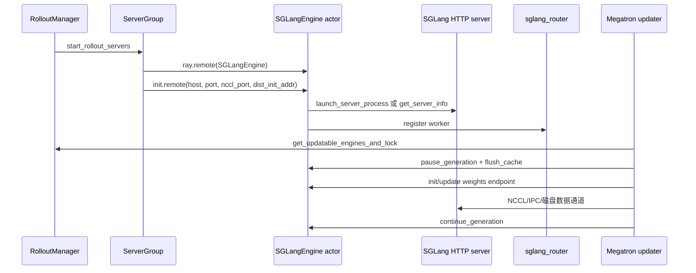

# SGLang-Engine · 源码走读

这篇解决两个问题：一次 rollout serving 是如何从 Slime 配置变成一组可用的 SGLang HTTP server；一次训练后的新权重又如何在不中断整个 Ray 作业的情况下装进这些 server。

读完后，读者应该能从 `RolloutManager`、`SGLangEngine`、SGLang HTTP server、Megatron updater 四个位置解释同一件事，而不是只知道某个函数名。

---

## 读者任务

排障时请把本专题当成一张控制面地图：

| 现象 | 先看哪个阶段 |
|------|--------------|
| Ray actor 存在但 server 没起 | `ServerGroup.start_engines` 和 `SGLangEngine.init` |
| router 没 worker 或 PD 注册失败 | `_start_router` 与 `_register_to_router` |
| 权重更新 hang | `get_updatable_engines_and_lock`、`connect_rollout_engines_from_distributed`、`rollout_engine_lock` |
| update 后输出像旧模型 | `pause_generation`、`flush_cache`、`get_weight_version` |
| external engine 表现异常 | `discover_external_engines`、`_init_external` sanity check |

## 长文读法

这篇不要按 17 个小节顺序硬读，而要按 Slime 对 SGLang server 的三类控制关系读：启动时把 Ray/PG/端口翻译成 HTTP server，训练后把新权重安全装入 server，运行中用 HTTP 控制面释放、恢复、终止和观测 server。

| 读者任务 | 先读 | 要抓住的判断 |
|----------|------|--------------|
| 第一次建立 rollout serving 拓扑 | 先建立主线、第一段主线 1 到 6 | `ServerGroup` 负责 Ray actor 和 GPU 坐标，`SGLangEngine` 负责把它翻译成 SGLang `ServerArgs` |
| 排查 server 没起或绑错卡 | 2 到 5 | Ray actor 只申请少量 GPU 占位，真正绑卡靠 `base_gpu_id`、PG 重排和 SGLang server 日志对齐 |
| 排查 router 或 PD worker 注册 | 1、3、6 | router、server port、NCCL port、dist init、PD bootstrap port 是不同控制面，不应混用 |
| 排查权重更新 hang | 第二段主线 7 到 11 | 更新前要拿 node-0 engines 和锁，暂停 generation，再让 metadata 走 HTTP、tensor 走 NCCL/IPC/disk |
| 排查 update 后仍是旧权重 | 10、12、13、17 | 看 `flush_cache`、`weight_version`、delta disk 的 `all_engine_actors` 是否覆盖每个 host |
| 排查运行期显存或请求残留 | 运行控制 14 到 16 | offload/onload、abort、shutdown 都是 HTTP 控制面；external engine 不由 Slime 杀进程 |

读完整篇后，应该能区分三种“engine”：Ray actor 是控制代理，SGLang HTTP server 是实际 serving 进程，router 是请求入口；权重同步时 Megatron updater 操作的是这些控制代理，而不是直接调用模型 forward。

---

## 先建立主线



---

## 第一段主线：把配置变成可服务的 engine

### 1. `start_rollout_servers` 先决定 router 与 server group

系统压力：一个 Slime 作业可能只启动普通 rollout engine，也可能有多模型、PD disaggregation、encoder disaggregation、external engine。统一入口必须把这些拓扑都变成“模型名 → RolloutServer”。

设计选择：`start_rollout_servers` 先分 external 与本地模式；本地模式解析 `SglangConfig`，每个 model 启动自己的 router，再为每个 group 累积 `gpu_offset` 和 `engine_offset`。

```python
# 定位骨架（据 `slime/ray/rollout.py` L1089-L1128 删节）：
def start_rollout_servers(args, pg) -> tuple[dict[str, Any], list[Any]]:
    if args.rollout_external:
        return start_external_rollout_servers(args, start_router=_start_router)

    config = _resolve_sglang_config(args)

    servers: dict[str, RolloutServer] = {}
    pending_init_handles: list[Any] = []
    gpu_offset = 0
    engine_offset = 0

    rollout_pg_offset = _compute_rollout_offset(args)
    megatron_num_gpus = _compute_megatron_num_gpus(args)

    for model_idx, model_cfg in enumerate(config.models):
        model_cfg.resolve(args)

        has_pd = model_cfg.has_pd_disaggregation
        router_ip, router_port = _start_router(args, has_pd_disaggregation=has_pd, force_new=(model_idx > 0))
```

执行逻辑：

- `rollout_external` 直接改走外部 engine 包装，不分配本地 SGLang 进程。
- `force_new=(model_idx > 0)` 说明多模型场景下，每个后续模型有独立 router。
- `rollout_pg_offset` 和 `megatron_num_gpus` 用来判断某个 group 是否和训练 GPU 重叠，从而决定是否需要 memory saver。

不变量与失败模式：

- `sglang_config` 的总 GPU 数必须等于 `rollout_num_gpus`，否则 `_resolve_sglang_config` 会断言失败。
- 多模型的第一组 router 会写回 `args.sglang_router_ip/port`，自定义 rollout 函数若要区分多模型，应读 `args.sglang_model_routers`。

### 2. `ServerGroup.start_engines` 负责 Ray actor 与物理 GPU 绑定

系统压力：Ray 的资源调度、Placement Group 的 bundle 顺序、SGLang 的 `base_gpu_id` 不是同一个坐标系。这里必须把它们对齐。

设计选择：从 Placement Group 的 `reordered_gpu_ids` 取 `base_gpu_id`，Ray actor 只申请少量 GPU 占位，实际 SGLang GPU 绑定交给 `ServerArgs.base_gpu_id`。

```python
# 定位骨架（据 `slime/ray/rollout.py` L154-L216 选取创建主干）：
num_gpu_per_engine = min(self.num_gpus_per_engine, self.args.num_gpus_per_node)

pg, reordered_bundle_indices, reordered_gpu_ids = self.pg
validate_server_group_gpu_indices(
    worker_type=self.worker_type,
    gpu_offset=self.gpu_offset,
    num_gpus_per_engine=self.num_gpus_per_engine,
    num_gpu_per_engine=num_gpu_per_engine,
    num_engines=len(self.all_engines),
    num_available_gpus=len(reordered_gpu_ids),
    rollout_num_gpus=self.args.rollout_num_gpus,
    rollout_num_gpus_per_engine=self.args.rollout_num_gpus_per_engine,
)

RolloutRayActor = ray.remote(SGLangEngine)

rollout_engines = []
for i in range(len(self.all_engines)):
    if self.all_engines[i] is not None:
        continue

    global_rank = self.rank_offset + i
    num_gpus = 0.2
    num_cpus = num_gpus

    gpu_index = self.gpu_offset + i * num_gpu_per_engine
    base_gpu_id = int(reordered_gpu_ids[gpu_index])
```

```python
# 来源：slime/ray/rollout.py L202-L216
rollout_engine = RolloutRayActor.options(
    num_cpus=num_cpus,
    num_gpus=num_gpus,
    scheduling_strategy=scheduling_strategy,
    runtime_env={
        "env_vars": add_default_ray_env_vars(env_vars),
    },
).remote(
    self.args,
    rank=global_rank,
    worker_type=self.worker_type,
    base_gpu_id=base_gpu_id,
    sglang_overrides=self.sglang_overrides,
    num_gpus_per_engine=self.num_gpus_per_engine,
)
```

执行逻辑：

- `validate_server_group_gpu_indices` 先阻止 group 配置越界。
- `global_rank` 是跨 group 累积的 engine rank；`gpu_index` 是 Placement Group 里的 GPU 槽位。
- actor 的 `base_gpu_id` 会覆盖 `get_base_gpu_id` 默认公式，避免 PG 重排后 SGLang 绑错卡。

读者抓手：看到 OOM 或某个 engine 占错 GPU 时，先比对 `gpu_offset`、`reordered_gpu_ids`、`base_gpu_id` 和 SGLang 日志里的 rank。

### 3. 端口分配把 HTTP、NCCL、dist init 和 PD bootstrap 分开

系统压力：一个节点上可能有多个 engine group，端口不能互相踩；多节点 engine 还需要一个共享的 `dist_init_addr`。

设计选择：`_allocate_rollout_engine_addr_and_ports_normal` 按节点维护 port cursor，为每个 rank 分配 server port、`nccl_port` 和 `dist_init_addr`，prefill worker 额外分配 bootstrap port。

```python
# 来源：slime/ray/rollout.py L930-L946
def _allocate_rollout_engine_addr_and_ports_normal(
    *,
    args,
    rollout_engines,
    worker_type="regular",
    num_gpus_per_engine=None,
    rank_offset=0,
    base_port=15000,
):
    # get ports
    # there are 4 ports we need to allocate
    # 1. server port
    # 2. nccl port
    # 3. dist_init_addr port
    # 4. other ports for dp_attention, which is of size 4 + dp_size
    _gpus_per_engine = num_gpus_per_engine or args.rollout_num_gpus_per_engine
    num_engines_per_node = max(1, args.num_gpus_per_node // _gpus_per_engine)
```

```python
# 定位骨架（据 `slime/ray/rollout.py` L989-L1009 删节）：
for i in range(num_engines_on_this_node):
    current_rank = rank + i
    addr_and_ports.setdefault(current_rank, {})
    addr_and_ports[current_rank]["host"] = get_addr()
    addr_and_ports[current_rank]["port"] = get_port()
    addr_and_ports[current_rank]["nccl_port"] = get_port()

    if worker_type == "prefill":
        addr_and_ports[current_rank]["disaggregation_bootstrap_port"] = get_port()

if _gpus_per_engine > args.num_gpus_per_node:
    num_node_per_engine = _gpus_per_engine // args.num_gpus_per_node
    if local_rank % num_node_per_engine == 0:
        dist_init_addr = f"{get_addr()}:{get_port(30 + args.sglang_dp_size)}"
        for i in range(num_node_per_engine):
            addr_and_ports.setdefault(rank + i, {})
            addr_and_ports[rank + i]["dist_init_addr"] = dist_init_addr
else:
    for i in range(num_engines_on_this_node):
        addr_and_ports[rank + i]["dist_init_addr"] = f"{get_addr()}:{get_port(30 + args.sglang_dp_size)}"
```

不变量与失败模式：

- `server port` 是 HTTP 服务端口。
- `nccl_port` 是 SGLang 内部推理并行通信端口。
- distributed 权重更新另有 `master_port`，它不是这里的 `nccl_port`。
- prefill worker 没有 `disaggregation_bootstrap_port` 会在 router 注册阶段失败。

### 4. `SGLangEngine.init` 翻译地址、rank 和并行参数

系统压力：Ray actor 运行地址、SGLang server 地址、IPv6 表达、SGLang 内部 distributed init 都要被统一成 `ServerArgs`。

设计选择：`init` 先格式化 host 和 `dist_init_addr`，再调用 `_compute_server_args`，最后按 local/external 分支初始化。

```python
# 定位骨架（据 `slime/backends/sglang_utils/sglang_engine.py` L119-L169 删节）：
def init(
    self,
    dist_init_addr,
    port,
    nccl_port,
    host=None,
    disaggregation_bootstrap_port=None,
    router_ip=None,
    router_port=None,
):
    self.router_ip = router_ip if router_ip is not None else self.args.sglang_router_ip
    self.router_port = router_port if router_port is not None else self.args.sglang_router_port

    host = host or get_host_info()[1]

    def _format_v6_uri(addr):
        if not addr or addr.startswith("["):
            return addr
        try:
            if ipaddress.ip_address(addr).version == 6:
                return f"[{addr}]"
        except ValueError:
            pass
        return addr

    host = _format_v6_uri(host)
    ip_part, port_part = dist_init_addr.rsplit(":", 1)
    dist_init_addr = f"{_format_v6_uri(ip_part)}:{port_part}"

    server_args_dict, external_engine_need_check_fields = _compute_server_args(
        self.args,
        self.rank,
        dist_init_addr,
        nccl_port,
        host,
        port,
        self.worker_type,
        disaggregation_bootstrap_port,
        base_gpu_id=self.base_gpu_id,
        sglang_overrides=self.sglang_overrides,
        num_gpus_per_engine=self.num_gpus_per_engine,
    )

    self.node_rank = server_args_dict["node_rank"]
    self.server_host = server_args_dict["host"]
    self.server_port = server_args_dict["port"]

    if self.args.rollout_external:
        self._init_external(server_args_dict, external_engine_need_check_fields=external_engine_need_check_fields)
    else:
        self._init_normal(server_args_dict)
```

执行逻辑：

- `rsplit(":", 1)` 说明端口只从末尾切，IPv6 地址主体可以包含冒号。
- `self.node_rank` 决定后续是否发 HTTP 控制请求。
- local 和 external 都会调用 `_register_to_router`，只是 server 进程来源不同。

external 的 sanity check 不能从这里被读成“完整 ServerArgs 对等”：待检查字段在 `_compute_server_args` 合入通用 `sglang_*` 与 YAML overrides 之前就已固定，且 topology、地址、并行尺寸等大量字段在 skip list 中。

external 还有 rank 复用风险：构造器给每个公开地址传递 `rank=enumerate(infos)`，这里再以 `rank % nnodes` 得出 `node_rank`。当 `num_gpus_per_engine` 跨节点且地址数大于一时，后续地址 adapter 可能不是 node 0，因而 `_register_to_router` 与 `_make_request` 早退。它需要多 external × 多节点的专门测试。

### 5. 本地模式启动 SGLang 子进程并等 node 0 health

系统压力：SGLang 运行时和 Ray driver 隔离，CUDA 相关状态不能被 fork 继承；多节点 engine 只有 node 0 暴露 HTTP 健康端点。

设计选择：普通 server 用 `multiprocessing.Process(target=launch_server)` 并强制 `spawn`，node 0 轮询 `/health_generate`，encoder-only 走 SGLang encode server 的专用启动器。

```python
# 来源：slime/backends/sglang_utils/sglang_engine.py L52-L78
def launch_server_process(server_args: ServerArgs) -> multiprocessing.Process:
    if getattr(server_args, "encoder_only", False):
        from sglang.srt.disaggregation.encode_server import launch_server_process as sglang_launch_server_process

        return sglang_launch_server_process(
            server_args,
            start_method="spawn",
            wait_for_server=True,
        )

    from sglang.srt.entrypoints.http_server import launch_server

    multiprocessing.set_start_method("spawn", force=True)
    server_args.host = server_args.host.strip("[]")
    p = multiprocessing.Process(target=launch_server, args=(server_args,))
    p.start()

    if getattr(server_args, "node_rank", 0) != 0:
        return p

    _wait_server_healthy(
        base_url=server_args.url(),
        api_key=server_args.api_key,
        is_process_alive=lambda: p.is_alive(),
    )

    return p
```

```python
# 来源：slime/backends/sglang_utils/sglang_engine.py L81-L99
def _wait_server_healthy(base_url, api_key, is_process_alive):
    headers = {
        "Content-Type": "application/json; charset=utf-8",
        "Authorization": f"Bearer {api_key}",
    }

    with requests.Session() as session:
        while True:
            try:
                response = session.get(f"{base_url}/health_generate", headers=headers)
                if response.status_code == 200:
                    break
            except requests.RequestException:
                pass

            if not is_process_alive():
                raise Exception("Server process terminated unexpectedly.")

            time.sleep(2)
```

失败模式：

- server 子进程提前退出，`_wait_server_healthy` 会抛异常，Ray `init` ref 失败。
- node 0 没有健康响应，`ray.get(init_handles)` 会卡在初始化阶段。
- 健康循环没有总超时，`session.get` 也没传 timeout；子进程一直存活但端点永久不健康时，不是“等 60 秒失败”，而是可能无限等待。
- 非 node 0 不等待 HTTP health，这不是缺失检查，而是多节点 server 的控制面边界。

### 6. router 注册随版本和 worker type 分叉

系统压力：SGLang router API 版本有差异，PD disaggregation 还要求 prefill worker 提供 bootstrap port。

设计选择：`_register_to_router` 跳过 encoder；旧 router 用 query string 新增 worker，新 router 用 JSON payload；prefill 额外携带 `bootstrap_port`。

```python
# 来源：slime/backends/sglang_utils/sglang_engine.py L204-L232
def _register_to_router(self, server_args_dict):
    if self.worker_type == "encoder":
        return

    if self.node_rank == 0 and self.router_ip and self.router_port:
        worker_url = f"http://{self.server_host}:{self.server_port}"
        if parse(sglang_router.__version__) <= parse("0.2.1"):
            assert self.worker_type == "regular", "pd disaggregation is not supported in old router."
            response = requests.post(
                f"http://{self.router_ip}:{self.router_port}/add_worker?url={worker_url}",
            )
        else:
            payload = {
                "url": worker_url,
                "worker_type": self.worker_type,
            }
            if self.worker_type == "prefill":
                bootstrap_port = server_args_dict.get("disaggregation_bootstrap_port")
                if bootstrap_port is None:
                    raise RuntimeError(
                        f"Prefill worker {worker_url} does not have disaggregation_bootstrap_port; "
                        "cannot register it to the PD router."
                    )
                payload["bootstrap_port"] = bootstrap_port
            response = requests.post(
                f"http://{self.router_ip}:{self.router_port}/workers",
                json=payload,
            )
        response.raise_for_status()
```

读者抓手：PD 注册失败时，不要先怀疑 generate 逻辑；先检查 router 版本、`worker_type`、prefill 的 `disaggregation_bootstrap_port`。

---

## 第二段主线：把训练新权重装进 serving

### 7. 训练侧只拿可更新 server 的 node 0 engine

系统压力：多模型场景可能有 reference/reward/frozen 模型，训练权重只应该推给 `update_weights=True` 的模型。

设计选择：`RolloutManager.get_updatable_engines_and_lock` 返回第一组可更新 server 的控制面 engines、GPU 计数、GPU offset、`all_engines` 以及共享 lock。managed 多节点下前者是 node 0、后者含各节点；external 下通常都是一公开地址一 adapter，不代表外部 server 的每个 host。

```python
# 定位骨架（据 `slime/ray/rollout.py` L511-L540 删节）：
def _get_updatable_server(self) -> Any | None:
    """Return the server with ``update_weights=True``.

    When multiple updatable servers exist, returns the first one
    (multi-model weight update is not yet supported).
    """
    for srv in self.servers.values():
        if srv.update_weights:
            return srv
    return None

def get_updatable_engines_and_lock(self):
    srv = self._get_updatable_server()
    engines = srv.engines if srv else []
    gpu_counts = srv.engine_gpu_counts if srv else []
    gpu_offsets = srv.engine_gpu_offsets if srv else []
    num_new = srv.num_new_engines if srv else 0
    all_engine_actors = srv.all_engines if srv else []
    return engines, self.rollout_engine_lock, num_new, gpu_counts, gpu_offsets, all_engine_actors
```

执行逻辑：

- managed 模式的 `engines` 是 node 0 控制面 actor 列表，适合发 HTTP 更新命令。
- managed 模式的 `all_engine_actors` 可给 disk delta 做“每台 host 应用本地 checkpoint”；external construction 不会自动产生每 host adapter，因此不能外推该保证。
- `rollout_engine_lock` 防止多个 bucket 同时触发 distributed broadcast。

### 8. Megatron actor 决定是否重连 engine

系统压力：fault tolerance 可能恢复出新 engine，offload train + critic 也可能要求重新建立进程组。训练 actor 不能假定初始连接永久有效。

设计选择：`MegatronTrainRayActor` 从 rollout manager 拉取最新 engine 集合；只要 `num_new_engines > 0` 或需要重连，就调用 weight updater 的 `connect_rollout_engines`。

```python
# 定位骨架（据 `slime/backends/megatron_utils/actor.py` L592-L620 删节）：
(
    rollout_engines,
    rollout_engine_lock,
    num_new_engines,
    engine_gpu_counts,
    engine_gpu_offsets,
    all_engine_actors,
) = ray.get(self.rollout_manager.get_updatable_engines_and_lock.remote())

reconnect_rollout_engines = self.args.offload_train and self.args.use_critic and not self.args.colocate

if not rollout_engines and not reconnect_rollout_engines:
    if dist.get_rank() == 0:
        logger.info("No updatable SGLang engines are running; skip weight update.")
    return

if num_new_engines > 0 or reconnect_rollout_engines:
    self.weight_updater.connect_rollout_engines(
        rollout_engines,
        rollout_engine_lock,
        engine_gpu_counts=engine_gpu_counts,
        engine_gpu_offsets=engine_gpu_offsets,
        all_engine_actors=all_engine_actors,
    )
```

不变量与失败模式：

- 恢复出的新 engine 必须重新加入权重同步路径，否则它会继续用 init 权重。
- 如果没有 updatable engine，训练可以跳过权重推送，这常见于 debug train only 或 frozen serving。

### 9. distributed 路径先建 NCCL 组，再用 HTTP 传 metadata

系统压力：大模型权重不能通过 Ray 或 HTTP 序列化传输；但 SGLang server 需要提前知道要接收哪些 tensor。

设计选择：训练 rank 0 加全部 engine GPU 构成一个 NCCL group；`init_weights_update_group` 通过 HTTP 让 SGLang 子进程 join；后续每个 bucket 先发 metadata，再由训练 rank 0 `dist.broadcast` tensor。

```python
# 定位骨架（据 `slime/backends/megatron_utils/update_weight/update_weight_from_distributed.py` L268-L314 删节）：
def connect_rollout_engines_from_distributed(
    args: Namespace,
    group_name: str,
    rollout_engines: Sequence[ActorHandle],
    engine_gpu_counts: Sequence[int] | None = None,
) -> dist.ProcessGroup:
    if engine_gpu_counts is None:
        engine_gpu_counts = [args.rollout_num_gpus_per_engine] * len(rollout_engines)

    master_address = ray._private.services.get_node_ip_address()
    with socket.socket() as sock:
        sock.bind(("", 0))
        master_port = sock.getsockname()[1]
    world_size = sum(engine_gpu_counts) + 1

    cumulative = [0]
    for c in engine_gpu_counts:
        cumulative.append(cumulative[-1] + c)

    refs = [
        engine.init_weights_update_group.remote(
            master_address=master_address,
            master_port=master_port,
            rank_offset=cumulative[i] + 1,
            world_size=world_size,
            group_name=group_name,
            backend="nccl",
        )
        for i, engine in enumerate(rollout_engines)
    ]
    model_update_groups = init_process_group(
        backend="nccl",
        init_method=f"tcp://{_wrap_ipv6(master_address)}:{master_port}",
        world_size=world_size,
        rank=0,
        group_name=group_name,
    )
    ray.get(refs)
    return model_update_groups
```

```python
# 来源：slime/backends/sglang_utils/sglang_engine.py L439-L450
def init_weights_update_group(self, master_address, master_port, rank_offset, world_size, group_name, backend):
    return self._make_request(
        "init_weights_update_group",
        {
            "master_address": master_address,
            "master_port": master_port,
            "rank_offset": rank_offset,
            "world_size": world_size,
            "group_name": group_name,
            "backend": backend,
        },
    )
```

rank 布局例子：

| 场景 | `engine_gpu_counts` | `world_size` | rank 分配 |
|------|----------------------|--------------|-----------|
| 2 个 TP=2 engine | `[2, 2]` | 5 | 0 是 Megatron，1-2 是 engine0，3-4 是 engine1 |
| prefill TP=2 + decode TP=4 | `[2, 4]` | 7 | 0 是 Megatron，1-2 是 prefill，3-6 是 decode |

### 10. distributed updater 的 pause/flush/update/continue

系统压力：decode 中的请求和权重 reload 同时发生，会让 logits、KV cache 和 NCCL 接收状态都变得不可解释。

设计选择：本节的 distributed updater 在 rank 0 上维护 pause/flush/update/continue 顺序；tensor、disk、delta 和 external 路径应分别回到各自 updater 核对，不能由这一段替它们作证，也不能假设混合拓扑中的所有 engine 都受同一闸门覆盖。

```python
# 定位骨架（据 `slime/backends/megatron_utils/update_weight/update_weight_from_distributed.py` L102-L134 删节）：
@torch.no_grad()
def update_weights(self) -> None:
    self.weight_version += 1

    if dist.get_rank() == 0:
        ray.get([engine.pause_generation.remote() for engine in self.rollout_engines])
        ray.get([engine.flush_cache.remote() for engine in self.rollout_engines])

        if self.quantization_config and self.quantization_config["quant_method"] in ["compressed-tensors"]:
            post_process_weights(
                restore_weights_before_load=True,
                post_process_quantization=False,
                rollout_engines=self.rollout_engines,
            )
    dist.barrier(group=get_gloo_group())

    pbar = tqdm(desc=f"[{self._group_name}] Update weights", total=0) if self._is_pp_src_rank else None
    self._send_weights(pbar)

    if dist.get_rank() == 0:
        if self.quantization_config and self.quantization_config["quant_method"] in ["compressed-tensors"]:
            post_process_weights(
                restore_weights_before_load=False,
                post_process_quantization=True,
                rollout_engines=self.rollout_engines,
            )
        ray.get([engine.continue_generation.remote() for engine in self.rollout_engines])
    dist.barrier(group=get_gloo_group())
```

```python
# 来源：slime/backends/sglang_utils/sglang_engine.py L303-L322
def flush_cache(self):
    """Flush the cache of the server."""
    if self.node_rank != 0:
        return
    # flush cache will not return status_code 200 when there are pending requests
    for _ in range(60):
        try:
            response = requests.get(f"http://{self.server_host}:{self.server_port}/flush_cache")
            if response.status_code == 200:
                break
            logger.info(f"Error flushing cache: HTTP {response.status_code} {response.text!r}")
            time.sleep(1)
        except NewConnectionError as e:
            raise e
        except Exception as e:
            logger.info(f"Error flushing cache: {e}")
            time.sleep(1)
            continue
    else:
        raise TimeoutError("Timeout while flushing cache.")
```

执行逻辑：

- `pause_generation` 阻止新请求进入。
- `flush_cache` 最多尝试 60 轮，pending request 会导致非 200；每次 `requests.get` 没有 timeout，因此总时长不受 60 秒硬上限约束，单次连接也可能卡住。
- barrier 保证训练各 rank 在同一个更新阶段。

运行验证：日志中应该看到 pause/flush 先于 `Update weights` 进度；如果 `Timeout while flushing cache` 出现，先查是否有长尾请求未 abort 或 router 仍在派发。

### 11. metadata 走 HTTP，tensor 走 NCCL

系统压力：SGLang 需要 names、dtypes、shapes 来准备接收和加载；真正 tensor 不能通过 HTTP 传。

设计选择：`update_weights_from_distributed` 先向每个 engine actor 发 remote；actor 把 metadata POST 给 SGLang；训练 rank 0 同步 broadcast 每个 tensor。

```python
# 定位骨架（据 `slime/backends/megatron_utils/update_weight/update_weight_from_distributed.py` L326-L355 删节）：
def update_weights_from_distributed(
    group_name: str,
    group: dist.ProcessGroup,
    weight_version: int,
    rollout_engines: Sequence[ActorHandle],
    converted_named_tensors: Sequence[tuple[str, torch.Tensor]],
    load_format: str | None = None,
) -> list[ObjectRef]:
    refs = [
        engine.update_weights_from_distributed.remote(
            names=[name for name, _ in converted_named_tensors],
            dtypes=[param.dtype for _, param in converted_named_tensors],
            shapes=[param.shape for _, param in converted_named_tensors],
            group_name=group_name,
            weight_version=str(weight_version),
            load_format=load_format,
        )
        for engine in rollout_engines
    ]

    handles = []
    for _, param in converted_named_tensors:
        handles.append(dist.broadcast(param.data, 0, group=group, async_op=True))
    for handle in handles:
        handle.wait()

    return refs
```

```python
# 来源：slime/backends/sglang_utils/sglang_engine.py L464-L488
def update_weights_from_distributed(
    self,
    names,
    dtypes,
    shapes,
    group_name,
    flush_cache=False,
    weight_version: str | None = None,
    load_format: str | None = None,
):
    payload = {
        "names": names,
        "dtypes": [str(dtype).replace("torch.", "") for dtype in dtypes],
        "shapes": shapes,
        "group_name": group_name,
        "flush_cache": flush_cache,
    }
    if weight_version is not None:
        payload["weight_version"] = weight_version
    if load_format is not None:
        payload["load_format"] = load_format
    return self._make_request(
        "update_weights_from_distributed",
        payload,
    )
```

不变量与失败模式：

- `names/dtypes/shapes` 的顺序必须和 broadcast tensor 顺序一致。
- `ray.get(refs)` 应在 broadcast 后等待 server 完成加载。
- 并发 bucket 要用 `rollout_engine_lock` 串行，否则可能出现 NCCL 顺序不一致。

### 12. 其他权重路径共享同一个控制台

系统压力：部署形态不同，最佳传输介质不同。SGLangEngine 通过统一 HTTP 控制面暴露多条路径，让训练侧根据配置选择。

```python
# 定位骨架（据 `slime/backends/sglang_utils/sglang_engine.py` L278-L301 删节）：
def update_weights_from_tensor(
    self,
    serialized_named_tensors: list[str],
    load_format: str | None = None,
    flush_cache: bool = False,
    weight_version: str | None = None,
):
    payload = {
        "serialized_named_tensors": serialized_named_tensors,
        "load_format": load_format,
        "flush_cache": flush_cache,
    }
    if weight_version is not None:
        payload["weight_version"] = weight_version
    return self._make_request(
        "update_weights_from_tensor",
        payload,
    )
```

```python
# 定位骨架（据 `slime/backends/sglang_utils/sglang_engine.py` L415-L437 删节）：
def update_weights_from_disk(
    self,
    model_path: str,
    load_format: str | None = None,
    weight_version: str | None = None,
    files: list[str] | None = None,
):
    payload: dict = {"model_path": model_path}
    if load_format is not None:
        payload["load_format"] = load_format
    if weight_version is not None:
        payload["weight_version"] = weight_version
    if files is not None:
        payload["files"] = files
    return self._make_request("update_weights_from_disk", payload)
```

路径选择：

- colocate 同机小模型：tensor/IPC 路径减少文件系统中转。
- 非 colocate 默认 on-policy：distributed/NCCL 路径避免 HTTP 传大 tensor。
- 跨节点或超大模型：disk 路径用共享文件系统承载 checkpoint。
- delta disk：先本地 materialize base，再每次应用差量文件。

### 13. delta disk 需要所有 host actor，而不只是 node 0

系统压力：delta 文件需要在每个 host 的本地 checkpoint 上应用；node 0 actor 只代表 HTTP 控制面，不代表所有 host 的本地文件系统。

设计选择：disk delta updater 保存 `all_engine_actors`，在 reload 前对每个 managed host actor 调 `sync_local_checkpoint`，然后只对控制面 engines 发 `update_weights_from_disk`。

```python
# 来源：slime/backends/megatron_utils/update_weight/update_weight_from_disk_delta.py L60-L72
def connect_rollout_engines(
    self,
    rollout_engines: Sequence[ActorHandle],
    rollout_engine_lock: ActorHandle,
    engine_gpu_counts: Sequence[int] | None = None,
    engine_gpu_offsets: Sequence[int] | None = None,
    all_engine_actors: Sequence[ActorHandle] | None = None,
) -> None:
    # The local checkpoint is host-local, so every host applies its own copy:
    # all_engine_actors is one actor per host, vs rollout_engines (node 0 only). The
    # rollout_engine_lock the NCCL path uses isn't needed — a per-host flock serializes applies.
    self.rollout_engines = rollout_engines
    self.all_engine_actors = list(all_engine_actors or rollout_engines)
```

```python
# 定位骨架（据 `slime/backends/megatron_utils/update_weight/update_weight_from_disk_delta.py` L172-L185 删节）：
dist.barrier(group=get_gloo_group())
if dist.get_rank() == 0:
    ray.get([actor.sync_local_checkpoint.remote(self.weight_version) for actor in self.all_engine_actors])
    ray.get(
        [
            engine.update_weights_from_disk.remote(
                model_path=self.args.update_weight_local_checkpoint_dir,
                weight_version=str(self.weight_version),
            )
            for engine in self.rollout_engines
        ]
    )
    ray.get([engine.continue_generation.remote() for engine in self.rollout_engines])
```

读者抓手：managed 多节点 delta reload 出现某些节点旧权重时，先检查 `all_engine_actors` 是否覆盖每个 host，而不是只看 `rollout_engines`。external 模式的一地址一 adapter 不自动满足这个前提，必须由部署方式证明共享挂载或另建 host-local actor。

---

## 运行控制：offload、abort、profile、shutdown

### 14. offload/onload 也是 HTTP 控制面

系统压力：colocate 或 offload 模式下，训练和 rollout 争用 GPU 显存；释放 KV cache 和权重必须先保证 server 空闲。

设计选择：`release_memory_occupation` 内部先 `flush_cache`，再请求 SGLang 释放；resume 支持按 tag 恢复。

```python
# 来源：slime/backends/sglang_utils/sglang_engine.py L380-L391
def release_memory_occupation(self):
    self.flush_cache()
    return self._make_request("release_memory_occupation")

def resume_memory_occupation(self, tags: list[str] = None):
    """
    Available tags for multi-stage resume: weights, kv_cache
    """
    return self._make_request(
        "resume_memory_occupation",
        {"tags": tags},
    )
```

### 15. async abort 是 flush 的补充，不是替代

系统压力：异步 rollout 可能已有请求排队或运行；只靠 `/flush_cache` 会等到超时。`server_control` 提供主动 abort 并轮询 `/v1/loads` 的工具。

```python
# 定位骨架（据 `slime/backends/sglang_utils/server_control.py` L43-L67 删节）：
async def abort_server_until_idle(url: str, retry_interval: int = ABORT_RETRY_INTERVAL_SECONDS) -> None:
    attempt = 1
    while True:
        logger.info(f"Abort request for SGLang server {url}")
        await _abort_server_once(url)

        try:
            num_requests = await _get_server_num_requests(url)
        except Exception as e:
            logger.warning(f"Failed to get SGLang server load from {url}: {e}")
            return

        if num_requests <= 0:
            return

        logger.info(
            f"SGLang server {url} still has {num_requests} requests after abort attempt {attempt}; "
            f"retrying in {retry_interval} seconds."
        )
        await asyncio.sleep(retry_interval)
        attempt += 1

async def abort_servers_until_idle(urls: list[str]) -> None:
    await asyncio.gather(*(abort_server_until_idle(url) for url in urls))
```

注意：拿不到 load 时函数会记录 warning 后返回，不会无限重试。调用方仍要用后续验证判断 server 是否真的空闲。

### 16. shutdown 只清理本地 engine，external 模式连 router 注销也跳过

系统压力：本地 SGLang 子进程由 Slime 创建，Slime 应负责 router 移除和进程树清理；external engine 由外部系统管理，当前实现从函数入口直接返回。

这意味着 external `shutdown()` 不只“不 kill”：它也不会执行后面的 router worker 删除逻辑。若 Slime router 仍存活，外层生命周期必须负责停 router 或移除陈旧 worker，不能把清理责任算在 adapter 上。

```python
# 定位骨架（据 `slime/backends/sglang_utils/sglang_engine.py` L334-L361 合并分支）：
def shutdown(self):
    if self.args.rollout_external:
        return

    if self.worker_type != "encoder" and self.node_rank == 0:
        worker_url = f"http://{self.server_host}:{self.server_port}"
        response = None
        if parse(sglang_router.__version__) <= parse("0.2.1"):
            response = requests.post(
                f"http://{self.router_ip}:{self.router_port}/remove_worker?url=http://{self.server_host}:{self.server_port}"
            )
        elif parse(sglang_router.__version__) < parse("0.3.0"):
            worker_url = quote(worker_url, safe="")
            response = requests.delete(f"http://{self.router_ip}:{self.router_port}/workers/{worker_url}")
        else:
            try:
                all_workers = requests.get(f"http://{self.router_ip}:{self.router_port}/workers").json()["workers"]
                for worker in all_workers:
                    if worker["url"] == worker_url:
                        worker_id = worker["id"]
                        response = requests.delete(
                            f"http://{self.router_ip}:{self.router_port}/workers/{worker_id}"
                        )
                        break
                else:
                    logger.warning(f"Worker {worker_url} not found in router during shutdown.")
            except Exception as e:
                logger.warning(f"Failed to fetch workers list or remove worker: {e}")

        if response is not None:
            response.raise_for_status()
    kill_process_tree(self.process.pid)
```

### 17. profile 与 weight version 是可观测抓手

系统压力：权重更新是否真的生效、性能瓶颈在哪里，都需要跨进程可观测入口。

```python
# 定位骨架（据 `slime/backends/sglang_utils/sglang_engine.py` L363-L378 删节）：
def get_weight_version(self):
    if self.node_rank != 0:
        return
    url = f"http://{self.server_host}:{self.server_port}/get_weight_version"
    response = requests.get(url)
    response.raise_for_status()
    return response.json()["weight_version"]

def set_weight_version(self, new_version: str):
    return self._make_request("update_weight_version", {"new_version": str(new_version)})
```

```python
# 定位骨架（据 `slime/backends/sglang_utils/sglang_engine.py` L519-L550 删节）：
def start_profile(
    self,
    output_dir: str | None = None,
    start_step: int | None = None,
    num_steps: int | None = None,
    activities: list[str] | None = None,
    profile_by_stage: bool = False,
    with_stack: bool | None = None,
    record_shapes: bool | None = None,
):
    response = requests.post(
        f"http://{self.server_host}:{self.server_port}/start_profile",
        json={
            "output_dir": output_dir,
            "start_step": start_step,
            "num_steps": num_steps,
            "activities": activities,
            "profile_by_stage": profile_by_stage,
            "with_stack": with_stack,
            "record_shapes": record_shapes,
        },
    )
    response.raise_for_status()
    return response
```

## 运行验证

**操作：** 在 CI 或可运行集群中记录 updater 目标版本与至少一个 rollout engine 的 `get_weight_version`，再用 profile 端点采集一次受控 rollout。

**预期：** 权重更新完成后两侧版本一致；profile 中能把 rollout 慢定位到 SGLang 侧阶段，而不是只看到 Slime 外层总耗时。

- CI 检查里随机挑一个 rollout engine 比较 `get_weight_version` 和 updater version。
- 性能问题可以用 profile 端点触发 SGLang 侧 profiler，再对照 rollout metrics。

当前轻量验证：empty colocated bucket 测试 2 passed；`test_external_sglang_engines.py` 直接 collection 缺 `httpx`，只 stub 未被该测试使用的 HTTP client 类型后原测试 4 passed。从当前源码 AST 额外检查 6 项并通过：健康等待无限循环且 GET 无 timeout、external shutdown 提前返回、external check-list 早于通用参数/overrides、flush 60 轮但 GET 无 timeout、并行/地址字段位于 skip list，以及 external 地址序号复用为 node-rank 输入。真实 server 启动、router 注册和权重数据通道仍待完整环境。

---

## 复盘

1. `SGLangEngine` 的主价值不是推理，而是把 SGLang server 变成 Ray 可控资源。
2. node 0 actor 是 HTTP 控制面代表；所有节点是否参与数据通道要看 SGLang 内部分布式或 `all_engine_actors`。
3. distributed 权重同步的顺序是 pause、flush、metadata、数据通道、load 完成、continue；其他 updater 的正确性要按各自 writer/lock、介质、cache/commit 与版本点判断。
4. port 名称不能混用：SGLang 推理 `nccl_port` 和权重 update `master_port` 是两条不同通道。
5. external 模式只接入 Slime 的部分控制面：有限校验、router 注册和服务端点；本地进程、router 注销、recover/offload 与 host-local delta 前提仍属外部部署责任。
