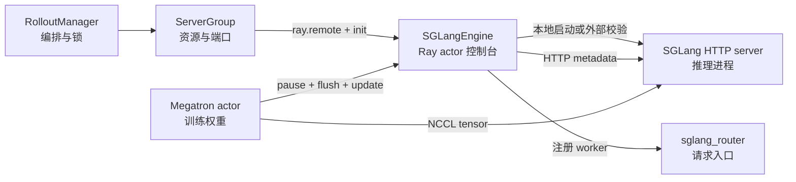

# SGLang-Engine

## 你为什么要读

这组笔记解决一个具体问题：Slime 训练循环里，谁把一组 SGLang 推理服务启动起来、接入 router、在权重更新时停住流量、再把 Megatron 的新权重装进推理 GPU。

读完后，读者应该能排查三类问题：engine 没起来或 router 没 worker、权重更新卡在 NCCL 或版本不一致、colocate/offload/external 模式下 GPU 和进程边界看不清。

---

## 本专题的主线

`SGLangEngine` 不是另一个推理内核。它更像 Slime 放在 Ray 里的推理服务控制台：上游拿到的是 Ray actor handle，下游真正工作的是 SGLang HTTP server，中间用少量 HTTP 端点把生命周期、流量控制、权重更新、profile 和 shutdown 统一起来。



---

## 阅读任务

| 读者状态 | 先读什么 | 读完要能做什么 |
|----------|----------|----------------|
| 第一次读 | [[Slime-SGLang-Engine-核心概念]] → [[Slime-SGLang-Engine-源码走读]] | 画出 Ray actor、HTTP server、router、NCCL 组四个边界 |
| 正在排障 | [[Slime-SGLang-Engine-排障指南]] | 从日志症状定位到 `start_engines`、`init`、`flush_cache` 或 `update_weights_from_distributed` |
| 准备改代码 | [[Slime-SGLang-Engine-数据流]] → [[Slime-SGLang-Engine-学习检查]] | 判断一个新 worker type、权重路径或 offload 策略会影响哪些不变量 |

---

## 六篇文档分工

| 文件 | 新职责 |
|------|--------|
| [[Slime-SGLang-Engine-核心概念]] | 建立“控制台 + HTTP 适配器 + 权重同步闸门”的心理模型 |
| [[Slime-SGLang-Engine-源码走读]] | 按一次 engine 启动和一次权重更新串起源码证据 |
| [[Slime-SGLang-Engine-数据流]] | 拆清 Ray ObjectRef、HTTP payload、NCCL rank、端口和 GPU 映射 |
| [[Slime-SGLang-Engine-排障指南]] | 以症状为入口整理 router、external、flush、PD、版本和 GPU 排障 |
| [[Slime-SGLang-Engine-学习检查]] | 给出可执行验收题，而不是检查是否看过代码片段 |

---

## 源码范围

| 源码文件 | 关注点 |
|----------|--------|
| `slime/ray/rollout.py` | `ServerGroup`、`RolloutServer`、router 启动、engine actor 创建、端口分配、updatable engine 集合 |
| `slime/backends/sglang_utils/sglang_engine.py` | `SGLangEngine` 的生命周期、HTTP 转发、server args、local/external 分支、权重端点 |
| `slime/backends/sglang_utils/external.py` | 预启动 SGLang 的发现、拓扑推导和 Ray adapter 包装 |
| `slime/backends/sglang_utils/server_control.py` | async abort 与 `/v1/loads` 空闲判断 |
| `slime/backends/megatron_utils/update_weight/*.py` | 训练侧如何调用 engine pause、flush、建组、广播或 reload |

---

## 本专题先记住的五个判断

1. Slime 的 generate 请求不是由 `SGLangEngine` 发起，本专题关注 engine 生命周期和控制面；generate 主线见 [[Slime-SGLang-Rollout]]。
2. 本地 managed `RolloutServer.engines` 只返回每个多节点 engine 的 node 0 actor，`all_engines` 才含各节点 actor；external 模式通常是一地址一 adapter，二者不能按“外部 engine 的每个节点”解释。
3. 本地模式会启动 SGLang 子进程；external 模式仍创建 Ray adapter，但只做有限字段校验并注册到 router。通用 `sglang_*` 透传与 YAML overrides 不在这份预先固定的检查集合中。
4. 权重同步是双通道：names、dtypes、shapes 等 metadata 走 Ray + HTTP，tensor 数据走 NCCL、IPC 或磁盘。
5. 每种 updater 都必须定义自己的更新隔离与提交协议；distributed 路径明确使用 pause/flush/continue，full disk 与 colocated tensor 也有相似控制段，但 delta、external 和混合拓扑的覆盖范围不同，不能概括成统一闸门。distributed `flush_cache` 的 60 次循环没有 HTTP timeout，也不能简单等同“最多 60 秒”。

## 生命周期的两个非对称边界

- 本地 node 0 健康等待没有总超时，也没有单次 request timeout；只要子进程仍存活但永远不健康，`engine.init` 可以无限等待。
- external `shutdown()` 在函数入口直接返回：它既不杀外部进程，也不从 Slime 启动的 router 注销 worker。外部服务和 router 的收尾必须由更上层生命周期明确负责。
- external 每个地址只创建一个 adapter，但把地址序号作为 `rank` 传给 `_compute_server_args`；若单个外部 engine 的 GPU 数跨多节点，`rank % nnodes` 可能把后续地址 adapter 算成非 node 0，从而跳过 router 注册与 `_make_request`。多 external × 多节点组合必须显式验收。

---

## 最小源码证据

`start_rollout_servers` 先为每个模型启动 router，再按 `ServerGroup` 创建 engine；真正的 `engine.init.remote` 在 `ServerGroup.start_engines` 中发出，最终由调用方统一 `ray.get` 等待。

```python
# 定位骨架（据 `slime/ray/rollout.py` L1089-L1106 删节）：
def start_rollout_servers(args, pg) -> tuple[dict[str, Any], list[Any]]:
    """Start rollout servers without waiting for final engine initialization.

    Each model defined in the sglang config gets its own router and set
    of server groups.  Server groups within a model may have different
    ``num_gpus_per_engine`` (e.g. for PD disaggregation where prefill
    and decode use different TP sizes).

    Returns ``(servers, init_handles)`` where servers maps model name to
    ``RolloutServer`` and init_handles contains pending ``engine.init`` refs.
    """
    if args.rollout_external:
        return start_external_rollout_servers(args, start_router=_start_router)
```

```python
# 来源：slime/ray/rollout.py L238-L245
init_handles = [
    engine.init.remote(
        **(addr_and_ports[rank]),
        router_ip=self.router_ip,
        router_port=self.router_port,
    )
    for rank, engine in rollout_engines
]
```

---

## 运行验证入口

| 要验证什么 | 看哪里 | 预期现象 |
|------------|--------|----------|
| engine 是否启动 | Ray dashboard 或日志 `Launch HttpServerEngineAdapter` | actor 数量与 active server group 的 engine 数匹配 |
| router 是否接入 | router `/workers` 或日志 `Router launched` | 每个 node 0 worker 都有 URL，encoder 不注册到 router |
| 权重更新是否推进 | 日志 `Update weights`、`pause_generation`、`continue_generation` | pause/flush 在 broadcast 或 reload 前后成对出现 |
| 版本是否一致 | CI 路径中的 `get_weight_version` | engine version 等于 updater `weight_version` |

当前轻量证据：empty colocated bucket 测试 2 passed；external discovery 测试直接 collection 缺 `httpx`，最小 stub 后原测试 4 passed。当前源码的 6 项 AST 检查同时钉住健康等待无 timeout、external shutdown 不清 router、有限 sanity check、flush 非 60 秒硬上限、topology skip fields，以及 external 地址 rank/node-rank 复用风险。真实启动与权重同步仍需 Ray/SGLang/GPU 环境。

---

## 相邻专题

| 方向 | 专题 | 关系 |
|------|------|------|
| 上游 | [[Slime-RolloutManager]] | RolloutManager 负责生成 rollout，并持有 engine lock |
| 生成 | [[Slime-SGLang-Rollout]] | 真正的 `/generate` 请求和 Sample 回填在这里 |
| 打分过滤 | [[Slime-Reward与过滤]] | rollout 生成后接 reward model 与 dynamic filter |
| 权重同步 | [[Slime-分布式权重同步]] | Megatron 侧 distributed 权重广播的完整专题 |
| SGLang 对照 | [[SGLang-HTTP-Server]] | SGLang server HTTP 端点语义 |
