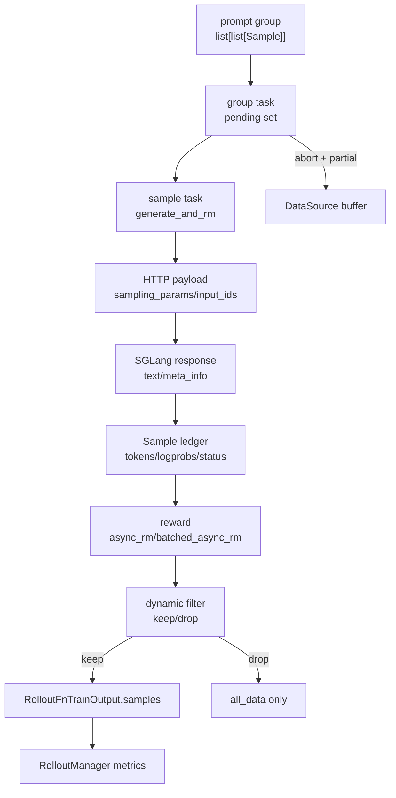
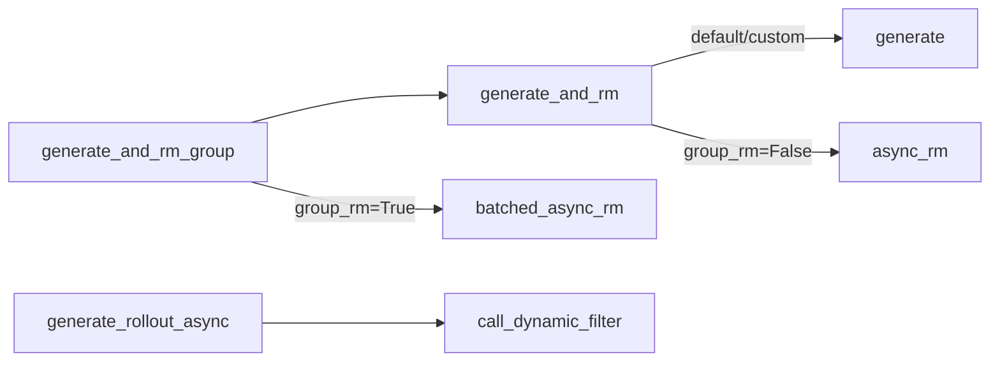
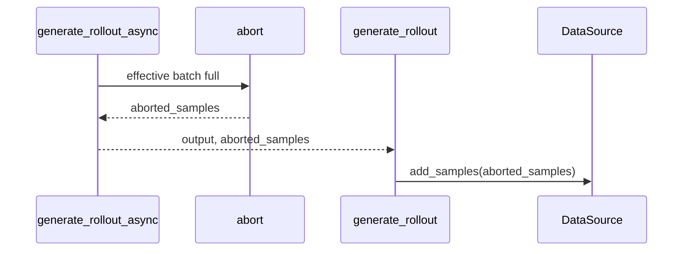

# SGLang-Rollout · 数据流

## 你为什么要读

这篇只关心对象如何跨边界变化：DataSource 交出 prompt group，SGLang Router 返回 HTTP JSON，Sample 账本把 JSON 变成训练字段，RM 和 filter 决定是否保留，RolloutManager 再把输出统计和 tensor 化。

## 对象生命周期



关键变化：

| 阶段 | 数据形状 | 读者要盯住 |
|------|----------|------------|
| DataSource 输出 | `list[list[Sample]]` | group 长度等于 `n_samples_per_prompt` |
| pending task | `asyncio.Task[group]` | pending 集合保存未收割 task；`remaining_batch_size` 另记未被 filter 否决的已提交容量 |
| SGLang 请求 | JSON payload | `return_logprob=True`、多模态字段、路由 header |
| Sample 写回 | `Sample` 字段 | `tokens/loss_mask/log_probs/top_p/status` 对齐 |
| filter 后 | `data` 与 `all_data` | 有效 group 与全部完成 group 分开 |
| RolloutManager | flattened samples + metrics | rollout 内 metrics 与 Sample 派生 metrics 合并 |

## RolloutManager 边界：输出先包装，再拆开

RolloutManager 调用 rollout function 后，先拿到 `RolloutFnTrainOutput`，再取出 `metrics` 和 `samples`。所以默认 rollout 返回的 metrics 只是一半；另一半由 RolloutManager 根据 Sample 字段计算。

```python
# 来源：slime/ray/rollout.py L635-L654
    def _get_rollout_data(self, rollout_id):
        if self.args.load_debug_rollout_data:
            data = torch.load(
                self.args.load_debug_rollout_data.format(rollout_id=rollout_id),
                weights_only=False,
            )["samples"]
            data = [Sample.from_dict(sample) for sample in data]
            if (ratio := self.args.load_debug_rollout_data_subsample) is not None:
                original_num_rows = len(data)
                rough_subsample_num_rows = int(original_num_rows * ratio)
                data = data[: rough_subsample_num_rows // 2] + data[-rough_subsample_num_rows // 2 :]
                logger.info(
                    f"Subsample loaded debug rollout data using {ratio=} and change num rows {original_num_rows} -> {len(data)}"
                )
            metrics = None
        else:
            data = call_rollout_fn(self.generate_rollout, self.args, rollout_id, self.data_source, evaluation=False)
            metrics = data.metrics
            data = data.samples
            # Enforce the rollout_id contract before flattening: any list[Sample]
```

这说明：

- rollout function 负责产出 group 和可选 metrics。
- RolloutManager 负责 flatten、校验 `rollout_id` 契约、转换训练数据。
- debug rollout 数据会绕开默认生成主线。

## HTTP 边界：payload 是训练契约的一部分

默认 SGLang 请求不是随便发 prompt。它必须显式请求 logprob；当 routing replay 开启时还要请求 routed experts；多模态路径不能只发 input ids。

```python
# 定位骨架（据 `slime/rollout/sglang_rollout.py` L174-L203 删节）：
    # Prepare payload for sglang server
    payload = {
        "sampling_params": sampling_params,
        "return_logprob": True,
    }

    if args.use_rollout_routing_replay:
        payload["return_routed_experts"] = True

    images = sample.multimodal_inputs.get("images") if sample.multimodal_inputs else None
    if images:
        payload["image_data"] = [encode_image_for_rollout_engine(image) for image in images]
        # For single-turn multimodal requests, send text so SGLang expands the
        # image placeholders with its own processor rules.
        payload["text"] = sample.prompt
    else:
        payload["input_ids"] = prompt_ids

    if not sample.tokens:
        sample.tokens = prompt_ids

    # Use session_id for consistent hashing routing (SGLang Model Gateway)
    headers = None
    if sample.session_id:
        if getattr(args, "router_policy", None) == "consistent_hashing":
            headers = {"X-SMG-Routing-Key": sample.session_id}

    with trace_span(sample, "sglang_generate", attrs={"max_new_tokens": sampling_params["max_new_tokens"]}) as span:
        output = await post(url, payload, headers=headers)
```

字段映射：

| 请求字段 | 来源 | 作用 |
|----------|------|------|
| `sampling_params` | `GenerateState.sampling_params` + per sample seed | 控制采样 |
| `return_logprob` | 固定 True | 训练需要 rollout logprob |
| `return_routed_experts` | `use_rollout_routing_replay` | MoE routing replay |
| `input_ids` | `_prepare_prompt_ids` | 纯文本或已有 token 路径 |
| `text` + `image_data` | `sample.prompt` + multimodal inputs | 让 SGLang 展开多模态 |
| `X-SMG-Routing-Key` | `sample.session_id` | consistent hashing 路由 |

`GenerateState.dp_rank_context()` 没有出现在这张 HTTP 映射表里是有意的：默认请求仍发往统一 router URL，rank 只保存在进程内 `state.dp_rank`，没有直接进入 payload/header。不能据此声称默认路径已经按该值定向某个 DP worker。

## 响应边界：meta_info 不能绕过 Sample 账本

SGLang 返回的是 text 和 meta_info，训练需要的是 Sample 上的一组对齐字段。默认路径只把 token/logprob 抽出来，然后把所有状态交给 `append_response_tokens`。

```python
# 来源：slime/rollout/sglang_rollout.py L205-L218
    if "output_token_logprobs" in output["meta_info"]:
        new_response_tokens = [item[1] for item in output["meta_info"]["output_token_logprobs"]]
        new_response_log_probs = [item[0] for item in output["meta_info"]["output_token_logprobs"]]
    else:
        new_response_tokens, new_response_log_probs = [], []

    sample.append_response_tokens(
        args,
        tokens=new_response_tokens,
        log_probs=new_response_log_probs,
        trainable=True,
        meta_info=output["meta_info"],
        text=output["text"],
    )
```

这样后续模块只看 Sample，不再关心 SGLang JSON：

| meta_info 内容 | Sample 结果 |
|----------------|-------------|
| `output_token_logprobs` | response token 和 `rollout_log_probs` |
| `finish_reason` | `COMPLETED` / `TRUNCATED` / `ABORTED` |
| top-p token ids/offsets | `rollout_top_p_token_ids` / `rollout_top_p_token_offsets` |
| `routed_experts` | `rollout_routed_experts` |
| prefix/spec 字段 | `prefix_cache_info` / `spec_info` |

危险边界：若响应缺少 `output_token_logprobs`，默认代码会把 token 与 logprob 都置为空，但仍把 `output["text"]` 和 `meta_info` 交给 Sample。于是可能出现“response 文本非空、`response_length=0`、状态已终结”的对象；HTTP 成功和有文本都不能替代 token/logprob 契约验收。

## Metrics 边界：rollout 内 metrics 与 Sample 派生 metrics 合并

默认 rollout 主循环只收集 dynamic filter drop 这类“生成过程指标”。RolloutManager 还会根据最终 Sample 计算 response length、zero std、top-p kept vocab、truncated ratio 等。

```python
# 来源：slime/ray/rollout.py L1291-L1321
def _log_rollout_data(rollout_id, args, samples, rollout_extra_metrics, rollout_time):
    if args.custom_rollout_log_function_path is not None:
        custom_log_func = load_function(args.custom_rollout_log_function_path)
        if custom_log_func(rollout_id, args, samples, rollout_extra_metrics, rollout_time):
            return

    if args.load_debug_rollout_data:
        return

    log_dict = {**(rollout_extra_metrics or {})}
    log_dict |= dict_add_prefix(compute_metrics_from_samples(args, samples), "rollout/")
    log_dict |= dict_add_prefix(compute_perf_metrics_from_samples(args, samples, rollout_time), "perf/")
    logger.info(f"perf {rollout_id}: {log_dict}")
    step = compute_rollout_step(args, rollout_id)
    log_dict["rollout/step"] = step
    logging_utils.log(args, log_dict, step_key="rollout/step")


def compute_metrics_from_samples(args, samples):
    response_lengths = [sample.effective_response_length for sample in samples]

    log_dict = {}
    log_dict |= dict_add_prefix(compute_statistics(response_lengths), "response_len/")
    log_dict |= _compute_zero_std_metrics(args, samples)
    log_dict |= _compute_spec_metrics(args, samples)
    log_dict |= _compute_prefix_cache_metrics(args, samples)
    log_dict |= _compute_reward_cat_metrics(args, samples)
    log_dict |= _compute_top_p_kept_vocab_metrics(args, samples)
    log_dict["repetition_frac"] = np.mean([int(has_repetition(s.response)) for s in samples]).item()
    log_dict["truncated_ratio"] = np.mean([int(s.status == Sample.Status.TRUNCATED) for s in samples]).item()
    return log_dict
```

top-p metric 进一步证明 Sample 字段要对齐：它依赖 offsets 和 loss mask，而不是只读 SGLang 原始 JSON。

```python
# 来源：slime/ray/rollout.py L1427-L1454
def _compute_top_p_kept_vocab_metrics(args, all_samples: list[Sample]):
    total_kept = 0
    total_tokens = 0
    for sample in all_samples:
        offsets = sample.rollout_top_p_token_offsets
        if offsets is None or sample.response_length == 0:
            continue
        offsets = torch.as_tensor(offsets, dtype=torch.int64)
        if offsets.numel() == 0:
            continue
        assert (
            offsets.numel() == sample.response_length + 1
        ), f"top-p token offsets length {offsets.numel()} != response length + 1 {sample.response_length + 1}"
        if sample.remove_sample:
            continue
        if sample.loss_mask is None:
            total_kept += int(offsets[-1] - offsets[0])
            total_tokens += sample.response_length
            continue
        loss_mask = torch.as_tensor(sample.loss_mask, dtype=torch.bool, device=offsets.device)
        assert (
            loss_mask.numel() == sample.response_length
        ), f"loss mask length {loss_mask.numel()} != response length {sample.response_length}"
        total_kept += int(torch.diff(offsets)[loss_mask].sum())
        total_tokens += int(loss_mask.sum())
    if total_tokens == 0:
        return {}
    return {"top_p_kept_vocab_per_token": total_kept / total_tokens}
```

## RM 与 Filter 边界



边界规则：

- 非 group RM：sample 完成后立刻 `async_rm`，custom generate 已填 reward 时跳过。
- fan-out list：在 `group_rm=False` 时，缺 reward 的 sibling 走 `batched_async_rm`。
- group RM：普通 `list[Sample]` group 会统一 `batched_async_rm`；若单个 custom generate 又 fan-out，外层会成为 `list[list[Sample]]`，当前组级赋值循环仍把内层 list 当 Sample，不能视为端到端已支持。
- dynamic filter：reward 已就绪后按 group 判断 keep/drop。

`all_data` 不只包含被 drop 的 group，也包含同一批 `done` 中“通过 filter 但目标 `data` 已满”的多余完成 group。它们不会自动回到 DataSource；只有 `rollout_all_samples_process_path` 能在本轮结束前看到这批 filter 前完成结果。该 hook 收到的第三个参数实际是 bound `get_samples` callable，而不是完整 DataSource 对象，因此不能仅凭参数名调用 `add_samples`。

## DataSource 与 partial 回灌边界

默认训练主循环只拿 `data_source.get_samples`，所以它不能直接保存 partial group。回灌发生在同步入口收到 `aborted_samples` 后。



这就是为什么 [[Slime-数据源]] 里强调默认 data source 必须支持 `add_samples`，否则 partial rollout 没法回收。还要注意：abort 收集代码按 `for sample in group` 访问 `sample.response/metadata`；fan-out 让 leaf 变成 list 后，这条 partial 回灌路径也没有自动适配更深嵌套。

## Eval 边界

Eval 和 train 共用 `generate_and_rm`，但不共用训练水位控制：

| 维度 | Train | Eval |
|------|-------|------|
| 数据来源 | DataSource `get_samples` | `EvalDatasetConfig` 对应 Dataset |
| 目标 | 凑满有效 `rollout_batch_size` group | 覆盖固定 eval samples |
| filter | dynamic filter | 不走训练 dynamic filter |
| group RM | 可配置 | 显式不支持 |
| 输出 | `RolloutFnTrainOutput.samples` | `RolloutFnEvalOutput.data` |

多个 eval dataset 并发完成后通过 `results.update()` 合并；dataset name 重复会静默覆盖。单 dataset 汇总时若 `eval_reward_key or reward_key` 非空，则假定每个 `sample.reward` 都是含该 key 的 dict，字段类型或 key 不一致会在列表推导处晚失败。

源码中的 eval 返回形状：

```python
# 定位骨架（据 `slime/rollout/sglang_rollout.py` L608-L615 删节）：
    return {
        dataset_cfg.name: {
            "rewards": [sample.reward if not reward_key else sample.reward[reward_key] for sample in data],
            "truncated": [sample.status == Sample.Status.TRUNCATED for sample in data],
            "samples": data,
        }
    }
```

## 运行验证

| 验证目标 | 命令 | 预期 |
|----------|------|------|
| Sample 字段与 metrics 契约 | `python -m pytest slime/tests/test_rollout_metrics.py -q` | top-p、loss mask、routed experts、trainable token 约束通过 |
| custom generate 扩展点 | `python -m pytest slime/tests/plugin_contracts/test_plugin_generate_contracts.py -q` | per-sample override 优先级、async 签名、fan-out 返回通过 |
| rollout function 包装 | `python -m pytest slime/tests/plugin_contracts/test_plugin_rollout_contracts.py -q` | 默认签名、legacy 包装、train/eval 返回形状通过 |

这些测试都偏契约，不会启动真实 SGLang server；其中 generate contract 只证明 `generate_and_rm` 能返回 fan-out list，不证明 fan-out 与 group RM、partial abort、filter/hook 的组合闭合。真实服务排障还要结合 router 日志、`sglang_generate` trace、`perf/` metrics 和 `rollout/` metrics。

当前环境直接 collection 受缺 `httpx`/`ray` 阻塞；最小 stub `httpx` 后仍受缺 `pylatexenc` 和 PyArrow/Torch—NumPy ABI 阻塞。本轮对当前 `sglang_rollout.py` 做了 5 项 AST/隔离执行检查并通过，其中 fan-out + group RM 的隔离执行按现实现稳定复现 `AttributeError: 'list' object has no attribute 'reward'`。这是一条实现边界证据，不是对完整服务链的动态验收。
