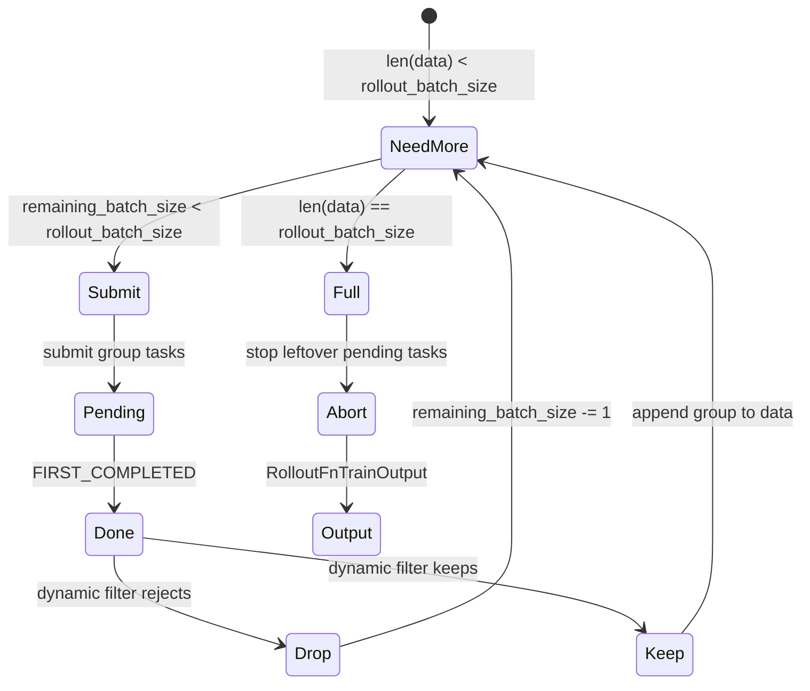

# SGLang-Rollout · 核心概念

## 你为什么要读

这篇先建立读源码所需的六个模型：有效 batch 容量账、进程内单例状态、group 边界、两层扩展点、Sample 账本，以及 train/eval 分流。理解这些对象的所有权后，后面的源码走读才不会变成函数逐段翻译。

## 模型一：有效 batch 水位控制器

默认训练 rollout 的目标不是“提交固定数量请求”，而是“得到固定数量有效 group”。dynamic filter 可能丢弃完成的 group，所以主循环要边生成、边过滤、边补样。



源码中的 `data`、`all_data`、`remaining_batch_size` 分别服务不同问题：

| 名称 | 含义 | 错用后果 |
|------|------|----------|
| `data` | 最终进入训练的有效 group | 多收或少收会破坏训练 batch |
| `all_data` | 已完成、filter 前的 group | 用于后处理和观察被 drop 的样本 |
| `remaining_batch_size` | 已提交且尚未被 filter 否决的容量：pending 与已 keep group 都包含在内 | 把它当 pending 数会误判；drop 后不下降才会卡住补样 |

`FIRST_COMPLETED` 只保证“至少一个 task 已完成”，返回的 `done` 可能有多个。若处理这批结果时 `data` 已达到目标，后续通过 dynamic filter 的完成 group 仍会进入 `all_data`，但不会追加到 `data`，也不会自动放回 DataSource。这是 oversampling 的完成结果丢弃边界，不是 pending abort 回灌的一部分。

## 模型二：GenerateState 是进程内控制台

`GenerateState` 使用 `SingletonMeta`，把 tokenizer、processor、并发 semaphore、pending task 集合和 abort 标志放在同一个 Ray rollout worker 进程里复用。

```python
# 来源：slime/rollout/sglang_rollout.py L84-L118
class GenerateState(metaclass=SingletonMeta):
    """
    The global state for the generation process.
    """

    def __init__(self, args: Namespace) -> None:
        # persistent state for the generation process
        self.args = args
        self.tokenizer = load_tokenizer(args.hf_checkpoint, trust_remote_code=True)
        self.processor = load_processor(args.hf_checkpoint, trust_remote_code=True)

        self.semaphore = asyncio.Semaphore(args.sglang_server_concurrency * get_rollout_num_engines(args))
        self.sampling_params: dict[str, Any] = dict(
            temperature=args.rollout_temperature,
            top_p=args.rollout_top_p,
            top_k=args.rollout_top_k,
            max_new_tokens=args.rollout_max_response_len,
            stop=args.rollout_stop,
            stop_token_ids=args.rollout_stop_token_ids,
            skip_special_tokens=args.rollout_skip_special_tokens,
            no_stop_trim=True,
            spaces_between_special_tokens=False,
        )
        if args.rollout_top_p != 1.0:
            self.sampling_params["custom_params"] = {"return_top_p_token_ids": True}

        if getattr(args, "sglang_enable_deterministic_inference", False):
            sampling_seed_base = args.rollout_seed
            self.group_sampling_seeds = [sampling_seed_base + i for i in range(args.n_samples_per_prompt)]

        # dp rank balancing
        self.dp_counts = [0] * (args.sglang_dp_size or 1)
        self.dp_rank = 0

        self.reset()
```

为什么这么设计：

- tokenizer/processor 初始化成本高，进程内复用比每个 sample 重建更合理。
- semaphore 容量由 `sglang_server_concurrency * get_rollout_num_engines(args)` 决定，限制同时压向 SGLang 的请求。
- `sampling_params` 是每个 group task 的模板，提交时复制，避免任务之间互相污染。
- `reset()` 清空本轮 pending、水位和 abort 标志，防止下一轮 rollout 被上一轮状态影响。

单例也带来一个边界：`SingletonMeta` 只在第一次构造时执行 `__init__`。同一进程后续即使传入另一份 args，tokenizer、processor、semaphore、采样模板和 DP 计数也不会自动重建；测试或动态改配置时需要显式清理单例，生产路径则应把这些参数视为进程生命周期配置。`reset()` 只是丢弃集合引用，不会取消 task，因此只能在 pending 已由 `abort()` drain 完之后调用。

`dp_rank_context()` 选择当前计数最小的 rank 并暂存到 `state.dp_rank`，但默认 `generate()` 仍访问统一 router URL，也没有把 rank 写进 payload/header。它为读取该进程内状态的扩展路径提供软提示，不等于默认 HTTP 请求已被强制定向到某个 DP rank。

## 模型三：group 是并发单位，也是 reward/filter 单位

DataSource 交给 rollout 的形状是 `list[list[Sample]]`。外层是 prompt group，内层是同一个 prompt 的多条 response。默认主循环把每个 group 变成一个 task，组内再并发执行 sample 级生成。

```python
# 来源：slime/rollout/sglang_rollout.py L137-L150
    def submit_generate_tasks(self, samples: list[list[Sample]]) -> None:
        for group in samples:
            self.pendings.add(
                asyncio.create_task(
                    # submit a group of samples as a single task.
                    generate_and_rm_group(
                        self.args,
                        group,
                        sampling_params=self.sampling_params.copy(),
                        evaluation=False,
                    )
                )
            )
        self.remaining_batch_size += len(samples)
```

group 边界承担三种语义：

| 语义 | 源码位置 | 原因 |
|------|----------|------|
| 并发 | `generate_and_rm_group` 内 `asyncio.gather` | 同 prompt 多次采样可以并行 |
| reward | `args.group_rm` 时 group 级 `batched_async_rm` | 组级 RM 需要看到完整 group |
| filter | `call_dynamic_filter(dynamic_filter, args, group)` | dynamic filter 判断是否保留整组 |

## 模型四：两层扩展点不要混用

Slime 提供两种不同粒度的替换：

| 参数 | 替换范围 | 保留什么 |
|------|----------|----------|
| `--rollout-function-path` | 整个 rollout 函数 | 不保留默认 oversampling、filter、abort，除非你自己实现 |
| `--custom-generate-function-path` | 单个输入 sample 如何生成 response，返回值可 fan-out 为 `list[Sample]` | 保留默认外层编排，但组合能力仍受下游嵌套形状假设约束 |
| `sample.generate_function_path` | 单个 sample 或 eval dataset 覆盖 | 优先级高于全局 custom generate |

源码中的优先级在 `generate_and_rm` 里：

```python
# 来源：slime/rollout/sglang_rollout.py L249-L261
        with state.dp_rank_context() as _:
            # Check sample.generate_function_path for per-sample custom_generate_function_path (e.g., from eval dataset config)
            custom_func_path = getattr(sample, "generate_function_path", None) or args.custom_generate_function_path

            if custom_func_path is not None:
                custom_generate_func = load_function(custom_func_path)
                # if signature has evaluation, pass evaluation
                if "evaluation" in inspect.signature(custom_generate_func).parameters:
                    sample = await custom_generate_func(args, sample, sampling_params, evaluation=evaluation)
                else:
                    sample = await custom_generate_func(args, sample, sampling_params)
            else:
                sample = await generate(args, sample, sampling_params)
```

大多数 agent、多轮对话、tool calling 先从 `custom_generate_function_path` 接入。如果直接替换 `rollout_function_path`，就要自己重新实现补样、filter、abort、metrics 和返回包装。这里的“保留默认编排”不等于任意组合都已闭合：fan-out 与 `group_rm`、partial abort、dynamic filter 或后处理 hook 组合时，要逐层检查叶子到底是 `Sample` 还是 `list[Sample]`。

## 模型五：Sample 是响应时间轴账本

默认 HTTP `generate` 不直接手写 response 侧 `loss_mask`、top-p offsets 和状态，而是先在默认调用路径补 prompt tokens，再调用 `Sample.append_response_tokens`。这个函数维护 response token、logprob、loss mask、top-p replay 和终态；routed experts 使用另一套 `len(tokens)-1` 整序列 next-token 坐标，并由 meta 快照覆盖。

```python
# 定位骨架（据 `slime/utils/types.py` L253-L314 选取入口校验）：
    def append_response_tokens(
        self,
        args=None,
        *,
        tokens=None,
        log_probs=None,
        trainable: bool = True,
        meta_info: dict | None = None,
        text: str | None = None,
        update_terminal_info: bool = True,
    ):
        """
        Append response-side tokens and keep training metadata aligned.

        Model-generated tokens should pass ``trainable=True`` plus SGLang
        ``meta_info`` and log probabilities. Tool/environment tokens should pass
        ``trainable=False``; they receive loss-mask zeros and empty top-p spans
        when top-p replay is active.
        """
        tokens = _to_int_list(tokens)
        log_probs = _to_float_list(log_probs)
        if log_probs is not None and len(log_probs) != len(tokens):
            raise ValueError(f"log_probs length {len(log_probs)} != tokens length {len(tokens)}")
        if tokens and trainable and log_probs is None:
            raise ValueError("trainable response tokens require rollout log probabilities.")
        if tokens and not trainable:
            if log_probs is not None:
                raise ValueError("non-trainable response tokens should not pass rollout log probabilities.")
            log_probs = [0.0] * len(tokens)

        if text is not None:
            self.response += text

        previous_response_length = self.response_length
        if tokens:
            self.tokens += tokens
            self.response_length += len(tokens)
            if self.loss_mask is None:
                self.loss_mask = [1] * previous_response_length
            self.loss_mask += [1 if trainable else 0] * len(tokens)
```

读本模块时要记住：`generate` 的输出可信，不是因为 HTTP 成功，而是因为响应被写进了这个账本，并通过长度校验守住训练字段对齐。

## 模型六：评估复用单样本生成，但不复用训练水位

训练路径的核心是有效 batch 水位；评估路径的核心是固定覆盖 eval dataset。评估会展开每个 eval prompt 的多次采样任务，但不走 oversampling 和 dynamic filter 主循环。

```python
# 来源：slime/rollout/sglang_rollout.py L473-L483
async def eval_rollout(args: Namespace, rollout_id: int) -> tuple[dict[str, dict[str, list[Any]]], list[list[Sample]]]:
    assert not args.group_rm, "Group RM is not supported for eval rollout"

    coros = []
    for dataset_cfg in getattr(args, "eval_datasets", []) or []:
        coros.append(eval_rollout_single_dataset(args, rollout_id, dataset_cfg))
    results_list = await asyncio.gather(*coros)
    results = {}
    for r in results_list:
        results.update(r)
    return RolloutFnEvalOutput(data=results), []
```

评估还有两个集合级边界：多个 dataset 先并发执行，再用 `results.update()` 按名称合并，重名会被后一个结果静默覆盖；`EVAL_PROMPT_DATASET` 是进程级缓存，cache key 纳入路径、checkpoint、chat template 和多模态配置，但不会在每轮 eval 后清空。

## 常见误解

| 误解 | 正确模型 |
|------|----------|
| 默认 rollout 一次只取 `rollout_batch_size` 组 | 它按 `over_sampling_batch_size` 补样，直到有效 group 满 |
| `remaining_batch_size` 是 pending 数或最终 batch 大小 | 它是已提交且尚未被 filter 否决的容量，包含 pending 与已 keep group |
| custom generate 只要返回文本就行 | 必须返回维护好字段的 `Sample` 或 `list[Sample]` |
| fan-out 能单测返回 list，就能与所有默认能力组合 | 当前 contract test 只钉住 `generate_and_rm` 的 list 返回；group RM 赋值、partial abort 和部分 hook 仍可能把内层 list 当 Sample |
| top-p 指标由 SGLang 直接统计 | SGLang 返回 replay 数据，Sample 合并后由 RolloutManager 计算 |
| abort 只发停止请求 | 还要 drain pending task，并在 partial 模式下回收 group |

下一步读 [[Slime-SGLang-Rollout-源码走读]]，沿一次训练 rollout 把这些模型和源码顺序对齐。
