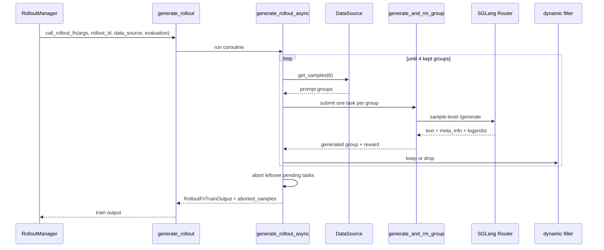

# SGLang-Rollout · 源码走读

这篇解决一个具体问题：一次训练 rollout 如何从 DataSource 的 prompt group，变成固定数量的有效训练 group。读完后应能定位 batch 不足、custom generate 形状错误、SGLang 返回字段缺失、partial abort 回收异常、eval 与 train 路径混用等问题。

## 长文读法

这篇按 rollout 生产线读：`RolloutManager` 只负责加载并调用 rollout 函数，默认 `generate_rollout` 用同步入口桥接 async 主循环，`GenerateState` 维护并发和目标 batch 水位，group 级任务再拆成 sample 级 SGLang 请求，最后把响应字段、reward、dynamic filter、abort 回收和 eval 输出重新装回 Slime 的 `Sample` 契约。

| 读者任务 | 先读 | 要抓住的判断 |
|----------|------|--------------|
| 首次建立训练 rollout 主线 | 贯穿场景、步骤一到二 | Ray actor 边界是同步函数，默认 rollout 内部才进入 async 生成循环 |
| 排查 batch 不足或 dynamic filter 丢太多 | 步骤三到四 | `remaining_batch_size` 记未被 filter 否决的已提交容量，不是 pending 数；真正保留数量由 `data` 决定 |
| 排查 group / sample 并发形状 | 步骤五到六 | 外层一个 task 对应一个 prompt group，组内每个 `Sample` 再独立 generate 和 reward |
| 排查 SGLang 请求字段 | 步骤七 | 文本、多模态、session routing、logprob、top-p replay、routed experts 都在 payload / meta_info 边界上 |
| 排查 Sample 账本和训练字段 | 步骤八 | `append_response_tokens` 后要保持 token、logprob、loss mask、top-p offsets、finish status 长度一致 |
| 排查 partial abort 和收尾副作用 | 步骤九 | 未完成请求先 abort，aborted samples 回灌 DataSource，hook 只在排序和过滤后运行 |
| 区分 train 和 eval 路径 | 步骤十、运行验证 | eval 展开固定数据集，不走训练水位和 dynamic filter，输出形状也不是 train samples |

读的时候不要把三类“数量”混在一起：`over_sampling_batch_size` 是取样和提交量，`rollout_batch_size` 是最终保留 group 数，`n_samples_per_prompt` 是每个 group 内的 sample 数。

## 贯穿场景

假设配置如下：

- `rollout_batch_size=4`
- `over_sampling_batch_size=6`
- `n_samples_per_prompt=2`
- `rollout_top_p=0.95`
- 开启默认 `sglang_rollout.generate_rollout`
- dynamic filter 会 drop 一部分 group

主线不是“发 4 个请求”，而是：



## 步骤一：RolloutManager 用兼容包装调用默认函数

系统压力：RolloutManager 要支持默认 rollout、用户插件和历史上返回裸 list 的旧插件，因此不能假设所有函数都直接返回 dataclass。

设计选择：`RolloutManager` 动态加载函数，调用时用 `call_rollout_fn` 包一层；如果函数返回裸数据，包装成 `RolloutFnTrainOutput` 或 `RolloutFnEvalOutput`。

```python
# 来源：slime/ray/rollout.py L440-L441
        self.generate_rollout = load_function(self.args.rollout_function_path)
        self.eval_generate_rollout = load_function(self.args.eval_function_path)
```

```python
# 定位骨架（据 `slime/ray/rollout.py` L650-L653 补充 debug 分支上下文）：
        if self.args.load_debug_rollout_data:
            data = self._load_debug_rollout_data(rollout_id)
        else:
            data = call_rollout_fn(self.generate_rollout, self.args, rollout_id, self.data_source, evaluation=False)
            metrics = data.metrics
```

```python
# 来源：slime/rollout/base_types.py L7-L26
@dataclass
class RolloutFnTrainOutput:
    samples: list[list[Sample]]
    metrics: dict[str, Any] = None


@dataclass
class RolloutFnEvalOutput:
    data: dict[str, dict[str, Any]]
    metrics: dict[str, Any] = None


def call_rollout_fn(fn, *args, evaluation: bool, **kwargs):
    output = fn(*args, **kwargs, evaluation=evaluation)

    # compatibility for legacy version
    if not isinstance(output, (RolloutFnTrainOutput, RolloutFnEvalOutput)):
        output = RolloutFnEvalOutput(data=output) if evaluation else RolloutFnTrainOutput(samples=output)

    return output
```

执行逻辑：

- `--rollout-function-path` 决定训练路径函数。
- `evaluation=False` 时返回训练输出，`evaluation=True` 时返回 eval 输出。
- legacy 裸 list 仍能工作，但新文档和插件应明确返回 dataclass。

不变量与失败模式：

- 函数签名必须与默认 `generate_rollout(args, rollout_id, data_source, evaluation=False)` 对齐。
- 返回裸 list 只能表达 samples，无法附带 metrics。
- `call_rollout_fn` 只按外层类型包装，不验证 train/eval dataclass 是否与 `evaluation` 一致，也不验证 payload shape；错误类型会晚到 `.samples`/`.data` 消费处失败。
- eval 路径的 data 字典必须包含后续 logging 所需字段。

## 步骤二：同步入口只负责分派和回灌

系统压力：Ray actor 的调用边界是同步函数，但 rollout 内部大量使用 async；训练和评估路径也不同。

设计选择：`generate_rollout` 用 `run()` 桥接 async。训练路径把 `data_source.get_samples` 交给 async 主循环，若 abort 收到 partial group，再回写 DataSource。

```python
# 来源：slime/rollout/sglang_rollout.py L618-L640
def generate_rollout(
    args: Namespace, rollout_id: int, data_source: Any, evaluation: bool = False
) -> RolloutFnTrainOutput | RolloutFnEvalOutput:
    """An example to implement the generate_rollout function for an rule based rm rollout generation.

    Args:
        args: the whole args
        rollout_id: int, the id of the rollout, used for deterministic data generation
        data_source: the data source to get and store samples
        evaluation: bool, whether the rollout is for evaluation or not

    Returns:
        RolloutFnTrainOutput | RolloutFnEvalOutput: the output of the rollout
    """
    assert args.rollout_global_dataset
    if evaluation:
        output, _ = run(eval_rollout(args, rollout_id))
        return output

    output, aborted_samples = run(generate_rollout_async(args, rollout_id, data_source.get_samples))
    if aborted_samples:
        data_source.add_samples(aborted_samples)
    return output
```

执行逻辑：

- 默认函数只支持 global dataset。
- 训练路径传入的是 bound method `data_source.get_samples`。
- 只有 `generate_rollout_async` 返回 aborted groups 后，入口才调用 `add_samples`。

不变量与失败模式：

- 如果 data source 不支持 `add_samples`，partial 回灌会失败。
- 如果关闭 global dataset 仍用默认 rollout，会在入口 assert。
- eval 不应把样本写回 DataSource。

## 步骤三：GenerateState 建立并发和采样模板

系统压力：每个 sample 都要用 tokenizer/processor、sampling params、并发闸门和 pending task 管理；这些不适合散落在各个函数中。

设计选择：`GenerateState` 初始化一次昂贵对象和 semaphore，并用 `reset()` 管理每轮动态状态。

```python
# 来源：slime/rollout/sglang_rollout.py L95-L118
        self.semaphore = asyncio.Semaphore(args.sglang_server_concurrency * get_rollout_num_engines(args))
        self.sampling_params: dict[str, Any] = dict(
            temperature=args.rollout_temperature,
            top_p=args.rollout_top_p,
            top_k=args.rollout_top_k,
            max_new_tokens=args.rollout_max_response_len,
            stop=args.rollout_stop,
            stop_token_ids=args.rollout_stop_token_ids,
            skip_special_tokens=args.rollout_skip_special_tokens,
            no_stop_trim=True,
            spaces_between_special_tokens=False,
        )
        if args.rollout_top_p != 1.0:
            self.sampling_params["custom_params"] = {"return_top_p_token_ids": True}

        if getattr(args, "sglang_enable_deterministic_inference", False):
            sampling_seed_base = args.rollout_seed
            self.group_sampling_seeds = [sampling_seed_base + i for i in range(args.n_samples_per_prompt)]

        # dp rank balancing
        self.dp_counts = [0] * (args.sglang_dp_size or 1)
        self.dp_rank = 0

        self.reset()
```

```python
# 来源：slime/rollout/sglang_rollout.py L132-L135
    def reset(self) -> None:
        self.remaining_batch_size = 0
        self.pendings = set()
        self.aborted = False
```

执行逻辑：

- semaphore 控制同时执行的生成请求数。
- `rollout_top_p != 1.0` 时要求 SGLang 返回 top-p replay 数据。
- deterministic inference 时为同组不同 sample 准备不同 seed。
- `reset()` 清理本轮动态状态。

不变量与失败模式：

- `GenerateState` 是真正的进程级单例，第一次 args 决定 tokenizer、processor、semaphore 和采样模板；后续构造不会自动重跑 `__init__`。
- `state.reset()` 必须在一轮结束后执行，但它只清空 pending 集合引用，不取消 task；调用前必须已由 abort drain。
- custom generate 仍在 semaphore 内执行，不能绕开并发闸门。
- 如果请求 top-p replay，custom generate 也要维护对应的 Sample 字段不变量。
- `dp_rank_context()` 只维护进程内 `state.dp_rank`/计数；默认 HTTP payload 与 header 不携带该 rank，不能据此推断请求已定向某个 DP worker。

## 步骤四：async 主循环维护有效 batch 水位

系统压力：dynamic filter 可能丢弃样本，异步任务完成顺序也不稳定；主循环必须同时保持吞吐和最终 batch 大小。

设计选择：`generate_rollout_async` 先设置目标有效 group 数，然后在水位低时补样，收到完成任务后按 filter 决定 keep/drop。

```python
# 来源：slime/rollout/sglang_rollout.py L390-L407
    assert args.rollout_global_dataset

    state = GenerateState(args)

    # instantiate data filters
    dynamic_filter = (
        load_function(args.dynamic_sampling_filter_path) if args.dynamic_sampling_filter_path is not None else None
    )

    metric_gatherer = MetricGatherer()

    # target_data_size is the total number of valid samples to get
    target_data_size = args.rollout_batch_size

    data = []
    all_data = []
    do_print = True
    pbar = tqdm(total=target_data_size * args.n_samples_per_prompt, desc="Rollout generation")
```

```python
# 来源：slime/rollout/sglang_rollout.py L408-L439
    while len(data) < target_data_size:
        while state.remaining_batch_size < target_data_size:
            # get samples from the buffer and submit the generation requests.
            samples = data_source(args.over_sampling_batch_size)
            state.submit_generate_tasks(samples)

        # wait for the generation to finish
        done, state.pendings = await asyncio.wait(state.pendings, return_when=asyncio.FIRST_COMPLETED)
        for task in done:
            group: list[Sample] = task.result()

            if do_print:
                sample = group[0][0] if isinstance(group[0], list) else group[0]
                logger.info(
                    f"First rollout sample: {[str(sample.prompt) + sample.response]}, label: {str(sample.label)[:100]}, reward: {sample.reward}",
                )
                do_print = False

            assert len(group) == args.n_samples_per_prompt
            all_data.append(group)

            dynamic_filter_output = call_dynamic_filter(dynamic_filter, args, group)
            if not dynamic_filter_output.keep:
                metric_gatherer.on_dynamic_filter_drop(reason=dynamic_filter_output.reason)
                state.remaining_batch_size -= 1
                continue

            # add the samples to the data
            # NOTE: here we have not stored all the unused samples back to the data buffer.
            if len(data) < target_data_size:
                data.append(group)
                pbar.update(args.n_samples_per_prompt)
```

执行逻辑：

- 外层循环直到 `len(data)` 达到 `rollout_batch_size`。
- 内层循环按 `over_sampling_batch_size` 从 DataSource 补样。
- `FIRST_COMPLETED` 让至少一个 group 完成后立刻处理；同一轮 `done` 可能含多个已完成 task。
- filter drop 后降低 `remaining_batch_size`，触发继续补样。
- filter 前所有完成 group 进入 `all_data`，有效 group 进入 `data`。

`remaining_batch_size` 的准确含义是“已提交且尚未被 filter 否决的容量”。keep 后它不下降，因此同时包含已进入 `data` 的 group 和仍 pending 的 group；它不是 `len(state.pendings)` 的别名。

不变量与失败模式：

- `group` 长度必须等于 `n_samples_per_prompt`。
- dynamic filter 丢弃的 group 默认不会写回 buffer。
- 同一批 `done` 中若目标已被前面的 keep group 填满，后续 keep group 只进入 `all_data`，同样不会自动写回 buffer。
- 如果 filter 过严且 DataSource 持续提供不可通过样本，主循环可能长时间补样。

## 步骤五：按 group 提交任务，组内再并发 sample

系统压力：同一个 prompt 的多条 response 要作为一组做 filter 或 group RM，但组内 sample 又应该并发生成。

设计选择：主循环提交 group task；`generate_and_rm_group` 为每个 sample 分配 session id、可选 deterministic seed，然后 `asyncio.gather`。

```python
# 来源：slime/rollout/sglang_rollout.py L137-L150
    def submit_generate_tasks(self, samples: list[list[Sample]]) -> None:
        for group in samples:
            self.pendings.add(
                asyncio.create_task(
                    # submit a group of samples as a single task.
                    generate_and_rm_group(
                        self.args,
                        group,
                        sampling_params=self.sampling_params.copy(),
                        evaluation=False,
                    )
                )
            )
        self.remaining_batch_size += len(samples)
```

```python
# 来源：slime/rollout/sglang_rollout.py L309-L333
    # Generate a unique session_id for each sample in the group
    for sample in group:
        if sample.session_id is None:
            sample.session_id = str(uuid.uuid4())

    tasks = []
    for idx, sample in enumerate(group):
        current_sampling_params = sampling_params.copy()
        if getattr(args, "sglang_enable_deterministic_inference", False):
            seed = state.group_sampling_seeds[idx]
            current_sampling_params["sampling_seed"] = seed
        tasks.append(
            asyncio.create_task(generate_and_rm(args, sample, current_sampling_params, evaluation=evaluation))
        )

    group = await asyncio.gather(*tasks)

    # for the rm that need the whole group, we will do the rm here
    if not state.aborted and args.group_rm:
        with trace_span(group, "group_reward_model"):
            rewards = await batched_async_rm(args, group)
        for sample, reward in zip(group, rewards, strict=False):
            sample.reward = reward

    return group
```

执行逻辑：

- pending set 保存 group task。
- `session_id` 用于一致性路由。
- 每个 sample 复制自己的 sampling params。
- group RM 开启时，单 sample 路径不打 reward，等全组完成后批量打。

不变量与失败模式：

- `group_rm=True` 不支持 eval rollout。
- custom generate fan-out 后 group 形状可能成为 `list[list[Sample]]`，日志和最终排序只对首元素做了有限兼容；dynamic filter、group RM 赋 reward、partial abort 和 hook 是否支持必须分别核对。当前 group RM 循环会把内层 list 当作 Sample 设置 `.reward`，并非端到端闭合。
- session id 缺失时自动生成，已有 session id 会保留。

## 步骤六：单 sample 路径处理扩展优先级和 RM

系统压力：sample 可能已经是 partial/完成状态，也可能走默认 HTTP、自定义生成、eval dataset 特化生成；reward 可能由 custom generate 直接填，也可能需要 RM 补。

设计选择：先处理 partial off-policy mask 和终态短路；然后在 semaphore 内选择 sample 级 custom、全局 custom 或默认 `generate`；最后按 group RM、fan-out 或普通 sample 路径补 reward。

```python
# 来源：slime/rollout/sglang_rollout.py L230-L286
    # mask previous off-policy generation for partial rollout
    if args.partial_rollout and args.mask_offpolicy_in_partial_rollout and sample.response_length > 0:
        sample.loss_mask = [0] * sample.response_length

    # For samples with existing response, check if they're complete
    if sample.status == Sample.Status.COMPLETED or sample.status == Sample.Status.TRUNCATED:
        assert sample.response is not None
        if not args.group_rm:
            assert sample.reward is not None
        return sample

    state = GenerateState(args)

    # generate
    async with state.semaphore:
        if state.aborted:
            sample.status = Sample.Status.ABORTED
            return sample

        with state.dp_rank_context() as _:
            # Check sample.generate_function_path for per-sample custom_generate_function_path (e.g., from eval dataset config)
            custom_func_path = getattr(sample, "generate_function_path", None) or args.custom_generate_function_path

            if custom_func_path is not None:
                custom_generate_func = load_function(custom_func_path)
                # if signature has evaluation, pass evaluation
                if "evaluation" in inspect.signature(custom_generate_func).parameters:
                    sample = await custom_generate_func(args, sample, sampling_params, evaluation=evaluation)
                else:
                    sample = await custom_generate_func(args, sample, sampling_params)
            else:
                sample = await generate(args, sample, sampling_params)

    # for the rm that need the whole group, we will not do the rm here
    if args.group_rm:
        return sample

    if isinstance(sample, list):
        samples = sample
        if any(sample.status == Sample.Status.ABORTED for sample in samples):
            return samples

        samples_need_reward = [sample for sample in samples if sample.reward is None]
        with trace_span(samples_need_reward, "reward_model"):
            rewards = await batched_async_rm(args, samples_need_reward)
        for sample, reward in zip(samples_need_reward, rewards, strict=False):
            sample.reward = reward
        return samples
    else:
        if sample.status == Sample.Status.ABORTED:
            return sample
        # Some custom generate paths may have already filled the reward.
        if sample.reward is None:
            with trace_span(sample, "reward_model"):
                sample.reward = await async_rm(args, sample)

    return sample
```

执行逻辑：

- partial 旧 token 可以被置为 `loss_mask=0`。
- `COMPLETED` 或 `TRUNCATED` 样本不会重复生成。
- abort 状态在 semaphore 内检查，避免排队中的请求继续发出。
- sample 级 `generate_function_path` 优先于全局 `custom_generate_function_path`。
- custom generate 返回 list 时，使用 batched RM 补缺失 reward。

不变量与失败模式：

- trainable 旧 token 与新 token 的 loss 语义要区分。
- custom generate 必须是 async callable。
- group RM 模式不能在单 sample 层提前写 reward。
- custom generate 如果返回 list，所有 sibling 的字段也要满足 Sample 合约。
- 现有 contract test 只证明 `generate_and_rm` 在 `group_rm=True` 时能返回 list，没有继续覆盖 `generate_and_rm_group` 的组级 reward、filter 与 abort。

## 步骤七：默认 HTTP generate 把 Sample 翻译成 SGLang 请求

系统压力：默认路径要兼容纯文本、多模态、routing replay、consistent hashing，同时训练需要返回 token logprob。

设计选择：先准备 prompt ids；构造 payload；多模态发 `text + image_data`，纯文本发 `input_ids`；session id 可变成 router header；返回后提取 token/logprob 并调用 `append_response_tokens`。

```python
# 来源：slime/rollout/sglang_rollout.py L43-L62
def _prepare_prompt_ids(sample: Sample, tokenizer, processor: Any) -> list[int]:
    raw_multimodal_inputs = sample.multimodal_inputs or {}
    has_multimodal_inputs = any(value is not None for value in raw_multimodal_inputs.values())
    reuse_existing_input_ids = bool(sample.tokens) and (
        sample.multimodal_train_inputs is not None or not has_multimodal_inputs
    )

    if processor and has_multimodal_inputs and not reuse_existing_input_ids:
        processor_output = processor(text=sample.prompt, **build_processor_kwargs(raw_multimodal_inputs))
        prompt_ids = processor_output["input_ids"][0]
        if sample.multimodal_train_inputs is None:
            sample.multimodal_train_inputs = {
                k: v for k, v in processor_output.items() if k not in _PROCESSOR_PROMPT_KEYS
            } or None
        return prompt_ids

    if reuse_existing_input_ids:
        return sample.tokens

    return tokenizer.encode(sample.prompt, add_special_tokens=False)
```

```python
# 来源：slime/rollout/sglang_rollout.py L174-L218
    # Prepare payload for sglang server
    payload = {
        "sampling_params": sampling_params,
        "return_logprob": True,
    }

    if args.use_rollout_routing_replay:
        payload["return_routed_experts"] = True

    images = sample.multimodal_inputs.get("images") if sample.multimodal_inputs else None
    if images:
        payload["image_data"] = [encode_image_for_rollout_engine(image) for image in images]
        # For single-turn multimodal requests, send text so SGLang expands the
        # image placeholders with its own processor rules.
        payload["text"] = sample.prompt
    else:
        payload["input_ids"] = prompt_ids

    if not sample.tokens:
        sample.tokens = prompt_ids

    # Use session_id for consistent hashing routing (SGLang Model Gateway)
    headers = None
    if sample.session_id:
        if getattr(args, "router_policy", None) == "consistent_hashing":
            headers = {"X-SMG-Routing-Key": sample.session_id}

    with trace_span(sample, "sglang_generate", attrs={"max_new_tokens": sampling_params["max_new_tokens"]}) as span:
        output = await post(url, payload, headers=headers)
        span.update(build_sglang_meta_trace_attrs(output["meta_info"]))

    if "output_token_logprobs" in output["meta_info"]:
        new_response_tokens = [item[1] for item in output["meta_info"]["output_token_logprobs"]]
        new_response_log_probs = [item[0] for item in output["meta_info"]["output_token_logprobs"]]
    else:
        new_response_tokens, new_response_log_probs = [], []

    sample.append_response_tokens(
        args,
        tokens=new_response_tokens,
        log_probs=new_response_log_probs,
        trainable=True,
        meta_info=output["meta_info"],
        text=output["text"],
    )
```

执行逻辑：

- `_prepare_prompt_ids` 的复用是条件化的：已有 tokens 且“没有有效多模态输入”或“已有 multimodal_train_inputs”时复用；否则有 processor 的多模态路径会重新处理 prompt，最后才是 tokenizer。
- `return_logprob=True` 固定打开。
- `use_rollout_routing_replay` 时请求 routed experts。
- `append_response_tokens` 接收 text、tokens、log_probs 和 meta_info。

不变量与失败模式：

- 默认 `generate` 只接受 `PENDING` 或 `ABORTED` 状态。
- trainable token 必须有 logprob。
- 多模态请求走 text + image_data，让 SGLang 按自身 processor 展开。
- 如果 SGLang 不返回 `output_token_logprobs`，默认路径会追加空 token/logprob，后续训练可能拿不到有效 response。

## 步骤八：Sample 账本合并响应字段

系统压力：一次 sample 可能分多段 append，可能有 trainable token、tool token、top-p ragged replay、routed experts、finish reason。字段一旦错位，训练 loss 和 metrics 都会错。

设计选择：`append_response_tokens` 统一维护 response、tokens、response_length、loss_mask、rollout_log_probs 和 meta_info；内部 `_apply_meta_info` 处理 top-p/routing/status。

```python
# 定位骨架（据 `slime/utils/types.py` L316-L381 删节）：
    def _apply_meta_info(
        self,
        args,
        meta_info: dict,
        *,
        new_token_count: int = 0,
        pad_missing_top_p: bool = False,
        update_terminal_info: bool = True,
    ) -> None:
        applied_top_p_data = False
        if new_token_count:
            top_p_data = _extract_rollout_top_p_token_data(meta_info, expected_num_tokens=new_token_count)
            if top_p_data is not None:
                applied_top_p_data = True
                base_token_ids, base_offsets = self.rollout_top_p_token_ids, self.rollout_top_p_token_offsets
                if base_token_ids is None and base_offsets is None:
                    self.rollout_top_p_token_ids, self.rollout_top_p_token_offsets = top_p_data
                else:
                    self.rollout_top_p_token_ids, self.rollout_top_p_token_offsets = _merge_rollout_top_p_token_data(
                        base_token_ids,
                        base_offsets,
                        *top_p_data,
                    )

        if (
            pad_missing_top_p
            and new_token_count
            and self.rollout_top_p_token_offsets is not None
            and not applied_top_p_data
        ):
            self.rollout_top_p_token_ids, self.rollout_top_p_token_offsets = _pad_rollout_top_p_offsets(
                self.rollout_top_p_token_ids,
                self.rollout_top_p_token_offsets,
                new_token_count,
            )

        routed_experts = decode_int32_meta_array(meta_info, "routed_experts")
        if routed_experts is not None:
            if args is None:
                raise ValueError("args is required to decode routed experts metadata.")
            self.rollout_routed_experts = routed_experts.reshape(
                len(self.tokens) - 1,
                args.num_layers,
                args.moe_router_topk,
            )

        if not update_terminal_info or "finish_reason" not in meta_info:
            return
```

```python
# 来源：slime/utils/types.py L383-L408
    def _validate_response_metadata_lengths(self):
        if self.loss_mask is not None and len(self.loss_mask) != self.response_length:
            raise ValueError(f"loss_mask length {len(self.loss_mask)} != response_length {self.response_length}")

        if self.rollout_log_probs is not None and len(self.rollout_log_probs) != self.response_length:
            raise ValueError(
                f"rollout_log_probs length {len(self.rollout_log_probs)} != response_length {self.response_length}"
            )

        if self.rollout_top_p_token_ids is None and self.rollout_top_p_token_offsets is None:
            return
        if self.rollout_top_p_token_ids is None or self.rollout_top_p_token_offsets is None:
            raise ValueError("rollout top-p replay must include both token ids and offsets.")

        offsets = torch.as_tensor(self.rollout_top_p_token_offsets, dtype=torch.int32).reshape(-1)
        if offsets.numel() != self.response_length + 1:
            raise ValueError(
                "rollout_top_p_token_offsets length must equal response_length + 1: "
                f"len(offsets)={offsets.numel()}, response_length={self.response_length}."
            )
        token_id_count = _numel(self.rollout_top_p_token_ids)
        if int(offsets[-1]) != token_id_count:
            raise ValueError(
                "rollout top-p token ids/offsets mismatch: "
                f"offsets[-1]={int(offsets[-1])}, len(token_ids)={token_id_count}."
            )
```

执行逻辑：

- top-p offsets 必须和新 token 数对齐。
- routed experts 需要 args 中的 layer/topk 信息，并按整条 `tokens` 的 `len(tokens)-1` next-token 坐标 reshape；每次 meta 到来覆盖旧快照，不走 top-p 的增量 merge。
- `finish_reason` 决定 `COMPLETED`、`TRUNCATED` 或 `ABORTED`。
- response 侧 loss mask、logprob 与 top-p offsets 最后做长度校验；routed experts 不在该校验函数中按 `response_length` 检查。

不变量与失败模式：

- `loss_mask` 长度必须等于 `response_length`。
- `rollout_log_probs` 长度必须等于 `response_length`。
- top-p offsets 长度必须等于 `response_length + 1`。
- custom generate 不走 `append_response_tokens` 时最容易破坏这些不变量。

## 步骤九：收尾 abort、排序、hook、返回

系统压力：有效 batch 满时，仍可能有多余请求正在 SGLang 里跑；异步完成顺序也和数据顺序不同。

设计选择：先 abort 剩余请求并收集 partial group，再断言 batch 大小、排序、reset state、调用可选 hook，最后返回 `RolloutFnTrainOutput`。

```python
# 来源：slime/rollout/sglang_rollout.py L447-L467
    # there are still some unfinished requests, abort them
    aborted_samples = await abort(args, rollout_id)

    assert len(data) == args.rollout_batch_size, f"Got {len(data)} samples, expected {args.rollout_batch_size}"
    data = sorted(data, key=lambda group: group[0][0].index if isinstance(group[0], list) else group[0].index)
    all_samples = sorted(
        all_data, key=lambda group: group[0][0].index if isinstance(group[0], list) else group[0].index
    )

    # reset the global state to prevent effects on the next rollout or eval.
    state.reset()
    if args.rollout_sample_filter_path is not None:
        filter_func = load_function(args.rollout_sample_filter_path)
        filter_func(args, data)

    # There can be circumstances where users want to process all samples including filtered ones.
    if args.rollout_all_samples_process_path is not None:
        process_func = load_function(args.rollout_all_samples_process_path)
        process_func(args, all_samples, data_source)

    return RolloutFnTrainOutput(samples=data, metrics=metric_gatherer.collect()), aborted_samples
```

执行逻辑：

- `abort` 向 router 当前 workers 发终止请求并等待 server idle，然后 drain pending task；它不等于卸载模型或释放 serving 进程资源。
- sorted 恢复按 sample index 的确定性顺序。
- `rollout_sample_filter_path` 只处理有效 groups，正式契约是原地设置叶子 Sample 的 `remove_sample`，后续转训练数据时把 loss mask 置零。
- `rollout_all_samples_process_path` 能看到 filter 前的全部完成样本。
- 这里传给 all-samples hook 的 `data_source` 是 `generate_rollout_async` 收到的 bound `get_samples` callable，不是拥有 `add_samples` 的完整 DataSource 对象；hook 不能凭参数名假定可直接回灌。

不变量与失败模式：

- `state.reset()` 不能省。
- `aborted_samples` 返回给同步入口后才会写回 DataSource。
- hook 修改样本时必须保持 group 形状和 Sample 字段不变量。
- `rollout_sample_filter_path` 发生在 batch 已凑满且 state reset 之后；它不应删除 group。即使标记 `remove_sample`，该样本仍已参与此前的 group reward/advantage normalization，只在训练 loss 阶段被 mask。
- partial abort 的回收循环按 leaf 是 Sample 访问 `.response/.metadata`，custom fan-out 的更深嵌套需要额外适配。

## 步骤十：eval 展开固定数据集，不走训练水位

系统压力：评估需要固定覆盖 eval datasets，不能被 dynamic filter 或训练 batch 水位改变。

设计选择：eval 先按数据集并发，再在每个 dataset 内复制 prompt sample、注入 eval metadata/custom path、提交 `generate_and_rm` task。

```python
# 定位骨架（据 `slime/rollout/sglang_rollout.py` L561-L582 删节）：
    for _i, prompt_sample in enumerate(dataset.samples):
        for j in range(dataset_cfg.n_samples_per_eval_prompt):
            # use the same prompt for multiple samples
            sample = copy.deepcopy(prompt_sample)
            sample.index = sample_index
            sample_index += 1
            sample.metadata = dataset_cfg.inject_metadata(getattr(sample, "metadata", None))
            sample.custom_rm_path = dataset_cfg.custom_rm_path
            sample.generate_function_path = getattr(dataset_cfg, "custom_generate_function_path", None)
            sampling_params = base_sampling_params
            if getattr(args, "sglang_enable_deterministic_inference", False):
                sampling_params = base_sampling_params.copy()
                sampling_params["sampling_seed"] = args.rollout_seed + j
            tasks.append(
                asyncio.create_task(
                    generate_and_rm(
                        args,
                        sample,
                        sampling_params=sampling_params,
                        evaluation=True,
                    )
                )
            )
```

执行逻辑：

- 每个 eval prompt 可采样多次。
- eval dataset 可注入 metadata、custom RM、custom generate path。
- evaluation 标志传到 `generate_and_rm`，custom generate 可据此分支。

不变量与失败模式：

- eval 不支持 `group_rm`。
- eval 不走 dynamic filter 和 oversampling。
- 不 deepcopy 会让同一 prompt 的多次采样互相覆盖字段。
- 多个 dataset 用 `results.update()` 按 name 合并，重名会静默覆盖；dataset cache 是进程级全局缓存。
- 配置 reward key 时，汇总默认假定每条 reward 都是包含该 key 的 dict，否则会在最终列表推导处失败。

## 运行验证

先跑不需要 GPU 的契约测试：

```powershell
$env:PYTHONPATH='F:\源码阅读\slime'
python -m pytest slime/tests/test_rollout_metrics.py -q
python -m pytest slime/tests/plugin_contracts/test_plugin_generate_contracts.py -q
```

预期现象：

- `test_rollout_metrics.py` 覆盖 top-p offset 合并、non-trainable token padding、routed experts 解码、logprob 必填等不变量。
- plugin generate 契约测试覆盖被 monkeypatch 的默认分支、sample 级 custom generate 优先级、全局 custom generate 和 `generate_and_rm` 的 fan-out list 返回；不覆盖真实 HTTP，也不覆盖 fan-out 进入 group RM/partial abort/filter/hook 的组合。

当前环境的直接结果不是通过：plugin contracts 先因缺 `httpx` collection 失败，最小 stub 后继续缺 `pylatexenc` 并触发 PyArrow/Torch—NumPy ABI 问题；rollout metrics 还缺 `ray`。本轮从当前源码 AST/函数体做 5 项隔离检查并通过：默认 HTTP 未消费 `state.dp_rank`、hook 顺序、eval update 合并、abort 的 Sample-leaf 假设，以及 fan-out + group RM 的真实 AttributeError。完整 router/HTTP/RM/Ray 行为仍需合格环境。
