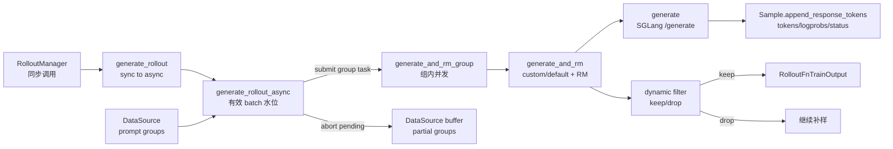

# SGLang-Rollout

## 你为什么要读

SGLang Rollout 是 Slime 默认的样本生成控制器。它不是单个 HTTP 调用函数，而是一个以“凑满有效训练 batch”为目标的异步水位系统：从 DataSource 拉 prompt group，按 group 提交并发任务，把每个 sample 变成 SGLang `/generate` 请求，补 reward，经过 dynamic filter，最后只把通过过滤的 group 交给训练。

读完本专题，读者应该能排查四类问题：rollout 卡住不收敛、custom generate 接入后形状错、partial rollout 没有回收半成品、top-p/routing replay 指标和训练字段对不上。

## 主线模型



把它想成一个水槽：

| 部件 | 源码对象 | 作用 |
|------|----------|------|
| 进水口 | `data_source(args.over_sampling_batch_size)` | 一次补入一批 prompt group |
| 容量账 | `GenerateState.remaining_batch_size` | 记录“已提交且尚未被 filter 否决”的 group 数；它包含已 keep 的 group，并不等于 pending task 数 |
| 过滤网 | `call_dynamic_filter` | 完成后判断 group 是否进入训练 |
| 排水口 | `RolloutFnTrainOutput.samples` | 只排出 `rollout_batch_size` 个有效 group |
| 泄压阀 | `abort` | 有效 batch 满后停止剩余请求，partial 模式下回收半成品 |

## 阅读顺序

| 文档 | 读者任务 |
|------|----------|
| [[Slime-SGLang-Rollout-核心概念]] | 建立异步水位、group 任务、Sample 账本、扩展点边界 |
| [[Slime-SGLang-Rollout-源码走读]] | 沿一次训练 rollout 追踪从取样到训练输出的完整路径 |
| [[Slime-SGLang-Rollout-数据流]] | 看清 DataSource、SGLang Router、RM、metrics、eval 的对象边界 |
| [[Slime-SGLang-Rollout-排障指南]] | 按症状反查 custom generate、top-p、partial、filter、eval 等问题 |
| [[Slime-SGLang-Rollout-学习检查]] | 用可执行清单验收自己是否能排障和改代码 |

## 源码范围

| 文件 | 作用 |
|------|------|
| `slime/rollout/sglang_rollout.py` | 默认 rollout 主循环、SGLang HTTP 请求、custom generate、RM、abort、eval |
| `slime/rollout/base_types.py` | rollout 函数返回值包装与 legacy 兼容 |
| `slime/utils/types.py` | `Sample.append_response_tokens` 维护训练字段不变量 |
| `slime/ray/rollout.py` | RolloutManager 调用、metrics 汇总、top-p kept vocab 指标 |
| `slime/tests/test_rollout_metrics.py` | top-p、routed experts、loss mask、append 契约测试 |
| `slime/tests/plugin_contracts/test_plugin_generate_contracts.py` | custom generate 扩展点测试 |
| `slime/tests/plugin_contracts/test_plugin_rollout_contracts.py` | rollout function 路径与返回形状测试 |

## 核心入口

```python
# 来源：slime/rollout/sglang_rollout.py L618-L640
def generate_rollout(
    args: Namespace, rollout_id: int, data_source: Any, evaluation: bool = False
) -> RolloutFnTrainOutput | RolloutFnEvalOutput:
    """An example to implement the generate_rollout function for an rule based rm rollout generation.

    Args:
        args: the whole args
        rollout_id: int, the id of the rollout, used for deterministic data generation
        data_source: the data source to get and store samples
        evaluation: bool, whether the rollout is for evaluation or not

    Returns:
        RolloutFnTrainOutput | RolloutFnEvalOutput: the output of the rollout
    """
    assert args.rollout_global_dataset
    if evaluation:
        output, _ = run(eval_rollout(args, rollout_id))
        return output

    output, aborted_samples = run(generate_rollout_async(args, rollout_id, data_source.get_samples))
    if aborted_samples:
        data_source.add_samples(aborted_samples)
    return output
```

这段证明三件事：

- 默认路径要求全局 DataSource，训练走 `generate_rollout_async`，评估走 `eval_rollout`。
- 训练异步主循环只拿到 `data_source.get_samples`，不是整个 DataSource 对象。
- partial/abort 回收发生在同步入口收尾阶段，由 `data_source.add_samples` 执行。

## 上下游衔接

| 方向 | 模块 | 为什么相关 |
|------|------|------------|
| 上游 | [[Slime-RolloutManager]] | RolloutManager 动态加载并同步调用 rollout function |
| 上游 | [[Slime-Sample数据契约]] | SGLang 输出必须通过 `append_response_tokens` 写入 Sample 时间轴 |
| 上游 | [[Slime-数据源]] | 默认主循环按 `over_sampling_batch_size` 拉 prompt group |
| 下游 | [[Slime-Reward与过滤]] | reward 与 dynamic filter 决定哪些 group 进入训练 |
| 对照 | [[SGLang-HTTP-Server]] | SGLang `/generate` 请求和返回结构 |
| 变体 | [[Slime-其他Rollout路径]] | fully-async、streaming、SFT 等替换或复用本模块不同层级 |

## 本专题的不变量

- `rollout_batch_size` 是有效 prompt group 数，不是所有已提交 group 数。
- `GenerateState.remaining_batch_size` 按 group 计数，只在 filter drop 时下降；keep 后不下降，因为已保留 group 仍占目标容量。
- `generate_and_rm_group` 的任务粒度是 group，单个 sample 的生成在组内并发。
- 默认 `generate` 必须请求 `return_logprob=True`，训练 token 才有 rollout logprob。
- custom generate 可以返回 `Sample` 或 `list[Sample]`，但必须维护 Sample 字段不变量。
- `abort` 不只是停服务，还要 drain pending task；partial 模式下才会回收半成品。

## 四个容易被“接口支持”掩盖的边界

- fan-out 的单层接口确实允许 custom generate 返回 `list[Sample]`，但 `group_rm` 的组级赋 reward、partial abort 的 `for sample in group` 和部分 filter/hook 仍按叶子是 `Sample` 编写；组合启用前必须做端到端嵌套形状测试。
- `dp_rank_context()` 会维护 `GenerateState.dp_rank` 的最小负载计数，但默认 HTTP `generate()` 仍请求统一 router URL，payload/header 没有携带这个 rank；它不是默认路径的强制 DP 定向路由。
- `rollout_sample_filter_path` 在有效 batch 已凑满、state 已 reset 后执行；其正式契约是原地设置 `Sample.remove_sample`，让样本不参与 loss，而不是从 group 中删除。它也不改变更早发生的 advantage normalization。
- 一次 `asyncio.wait(FIRST_COMPLETED)` 可能同时收割多个 done task。若 `data` 在处理这批 done 的中途已满，后续 keep group 只进入 `all_data`，不会进入训练，也不会自动回灌 DataSource；`rollout_all_samples_process_path` 是观察/处理它们的最后 hook。

## 验证抓手

```powershell
$env:PYTHONPATH='F:\源码阅读\slime'
python -m pytest slime/tests/test_rollout_metrics.py -q
python -m pytest slime/tests/plugin_contracts/test_plugin_generate_contracts.py -q
```

预期覆盖如上，但当前环境不能把 collection 失败写成通过：`test_rollout_metrics.py` 缺 `ray`；三份 plugin contract 直接运行均先缺 `httpx`，最小 stub `httpx` 后又暴露缺 `pylatexenc` 与 PyArrow/Torch 对 NumPy 2.x 的 ABI 问题。本轮因此补做当前源码 AST 行为检查，5 项通过：默认 HTTP 不消费 `state.dp_rank`、最终 hook 位于 abort/reset 之后、eval 以 `results.update` 合并、partial abort 假定 leaf 是 Sample、fan-out + group RM 真实触发 list 无 `.reward`。AST 证据不替代完整依赖环境。
