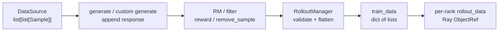

# Sample数据契约 · 数据流

## 你为什么要读

这篇只看对象如何流动。`Sample` 在 Slime 里先是 prompt 容器，随后变成生成结果账本，再被 RM/filter 修改，最后被 RolloutManager 转成列式 `train_data` 并按 DP rank 放入 Ray object store。

## 总览



## 1. rollout 函数输出是分组批

训练路径不是单条 `Sample`。默认形状是 `list[list[Sample]]`；compact/subagent 可以再增加 sibling 层。新版返回值是 `RolloutFnTrainOutput`，legacy 裸列表会被 `call_rollout_fn` 包装。

```python
# 定位骨架（据 `slime/rollout/base_types.py` L7-L26 删节）：
@dataclass
class RolloutFnTrainOutput:
    samples: list[list[Sample]]
    metrics: dict[str, Any] = None

@dataclass
class RolloutFnEvalOutput:
    data: dict[str, dict[str, Any]]
    metrics: dict[str, Any] = None

def call_rollout_fn(fn, *args, evaluation: bool, **kwargs):
    output = fn(*args, **kwargs, evaluation=evaluation)

    if not isinstance(output, (RolloutFnTrainOutput, RolloutFnEvalOutput)):
        output = RolloutFnEvalOutput(data=output) if evaluation else RolloutFnTrainOutput(samples=output)

    return output
```

流动结果：RolloutManager 后面看到的永远是统一包装后的对象，插件作者可以逐步迁移到 dataclass 返回值，但旧 list 仍能工作。

## 2. 进入 RolloutManager 前先保住结构语义

`RolloutManager._get_rollout_data` 先拿到 rollout 函数输出，再在 flatten 前检查 compact/subagent 结构的 `rollout_id`。这个检查必须在 flatten 前做，因为 flatten 后 sibling 关系就丢了。

```python
# 定位骨架（据 `slime/ray/rollout.py` L635-L665 删节）：
if self.args.load_debug_rollout_data:
    data = torch.load(
        self.args.load_debug_rollout_data.format(rollout_id=rollout_id),
        weights_only=False,
    )["samples"]
    data = [Sample.from_dict(sample) for sample in data]
    metrics = None
else:
    data = call_rollout_fn(self.generate_rollout, self.args, rollout_id, self.data_source, evaluation=False)
    metrics = data.metrics
    data = data.samples
    _validate_rollout_id_annotated(data)
    while isinstance(data[0], list):
        data = list(itertools.chain.from_iterable(data))

return data, metrics
```

这里有两条路径：

| 路径 | 输入 | 输出 |
|------|------|------|
| debug load | 磁盘 dict | `Sample.from_dict` 恢复后的扁平列表 |
| 正常 rollout | `RolloutFnTrainOutput.samples` | 校验后 flatten 的 `list[Sample]` |

debug load 已丢失嵌套 sibling 结构，不会重跑 compact id 校验；正常路径还要求非空且批内嵌套层级一致，因为 flatten 循环只观察 `data[0]`。

## 3. compact rollout 的 sibling 必须共享 rollout_id

默认形状 `list[list[Sample]]` 不强制每个 leaf 都写 `rollout_id`；compact/subagent 多一层，表示一次 rollout execution 拆成多个训练样本，这时 sibling 必须共享同一个 `rollout_id`。

```python
# 定位骨架（据 `slime/ray/rollout.py` L898-L925 删节）：
def _validate_rollout_id_annotated(node, depth=0):
    if isinstance(node, Sample):
        return
    assert isinstance(node, list), f"unexpected rollout output node type: {type(node).__name__}"
    if node and isinstance(node[0], Sample):
        if depth >= 2 and len(node) > 1:
            rids = [s.rollout_id for s in node]
            missing = [i for i, r in enumerate(rids) if r is None]
            assert not missing, (
                f"Compact rollout returned {len(node)} samples but rollout_id is unset on "
                f"positions {missing}. Set Sample.rollout_id on every sibling so the loss "
                "reducer can aggregate them as one rollout instead of N."
            )
            assert len(set(rids)) == 1, f"Sibling samples from one compact rollout must share rollout_id; got {rids}."
        return
```

数据语义：`group_index` 表示同 prompt 多采样，`rollout_id` 表示同一次 rollout execution 的 loss 聚合单位。两者不要混用。

## 4. 行对象转成列式 train_data

`Sample` 是行对象；训练侧需要列式 batch。`_convert_samples_to_train_data` 把每个字段抽成一列，并补齐默认 `rollout_id`。

```python
# 定位骨架（据 `slime/ray/rollout.py` L713-L745 删节）：
raw_rewards, rewards = self._post_process_rewards(samples)

rollout_ids = [sample.rollout_id for sample in samples]
existed_rollout_id_values = set(rid for rid in rollout_ids if rid is not None)
tmp_id = 0
for i in range(len(rollout_ids)):
    if rollout_ids[i] is None:
        while tmp_id in existed_rollout_id_values:
            tmp_id += 1
        rollout_ids[i] = tmp_id
        existed_rollout_id_values.add(tmp_id)

train_data = {
    "tokens": [sample.tokens for sample in samples],
    "response_lengths": [sample.response_length for sample in samples],
    "rewards": rewards,
    "raw_reward": raw_rewards,
    "truncated": [1 if sample.status == Sample.Status.TRUNCATED else 0 for sample in samples],
    "sample_indices": [sample.index for sample in samples],
    "rollout_ids": rollout_ids,
}
```

注意 `rollout_id is None` 的样本不是直接失败，而是分配一个不会冲突的临时 id。这样默认 rollout 仍保持兼容。

## 5. loss_mask 是进入训练前的最后过滤器

filter 或 RM 可以设置 `remove_sample=True`。这不会删除行，而是在转换阶段把这条 sample 的 `loss_mask` 全部改成 0。

```python
# 定位骨架（据 `slime/ray/rollout.py` L747-L778 删节）：
loss_masks = []
for sample in samples:
    if sample.loss_mask is None:
        sample.loss_mask = [1] * sample.response_length

    assert (
        len(sample.loss_mask) == sample.response_length
    ), f"loss mask length {len(sample.loss_mask)} != response length {sample.response_length}"
    if sample.remove_sample:
        sample.loss_mask = [0] * sample.response_length
    loss_masks.append(sample.loss_mask)
train_data["loss_masks"] = loss_masks

rollout_id_list = train_data["rollout_ids"]
mask_sums_per_sample = [sum(m) for m in loss_masks]
rollout_total_mask: dict[int, int] = {}
for rid, ms in zip(rollout_id_list, mask_sums_per_sample, strict=True):
    rollout_total_mask[rid] = rollout_total_mask.get(rid, 0) + ms
train_data["rollout_mask_sums"] = [rollout_total_mask[rid] for rid in rollout_id_list]
```

这段建立训练分母：同一个 `rollout_id` 下多个 Sample 的 mask sum 会先聚合，再广播回每条样本。即使这些样本后续落入不同 micro-batch，loss reducer 也能用同一个 rollout 级分母。

## 6. 可选字段按实际存在进入 train_data

`rollout_log_probs`、top-p replay、routed experts、teacher logprobs、多模态训练输入都不是每个任务都有。Slime 只在需要时写入列式 batch。

```python
# 定位骨架（据 `slime/ray/rollout.py` L792-L824 删节）：
if samples[0].rollout_log_probs is not None:
    train_data["rollout_log_probs"] = [sample.rollout_log_probs for sample in samples]

if getattr(self.args, "rollout_top_p", 1.0) != 1.0:
    for sample in samples:
        assert sample.rollout_top_p_token_ids is not None
        assert sample.rollout_top_p_token_offsets is not None
        assert len(sample.rollout_top_p_token_offsets) == sample.response_length + 1
        offset_end = int(sample.rollout_top_p_token_offsets[-1])
        assert offset_end == len(sample.rollout_top_p_token_ids)
    train_data["rollout_top_p_token_ids"] = [sample.rollout_top_p_token_ids for sample in samples]
    train_data["rollout_top_p_token_offsets"] = [sample.rollout_top_p_token_offsets for sample in samples]

if samples[0].rollout_routed_experts is not None:
    train_data["rollout_routed_experts"] = [sample.rollout_routed_experts for sample in samples]
```

排障抓手：这些字段很多用 `samples[0]` 作为存在性哨兵。混合 batch 里如果第一条没有字段、后面有字段，训练侧可能看不到这列。

`rollout_routed_experts` 与 top-p/logprob 使用不同坐标系：首维对应 `len(tokens)-1`，不是 response token 数。默认路径的 `tokens` 在生成前已放入 prompt ids；该字段是完整序列快照，`_apply_meta_info` 不做增量合并。

## 7. per-rank rollout_data 是 train_data 的切片

列式 `train_data` 还不是最终训练输入。`_split_train_data_by_dp` 根据 DP schedule 给每个 rank 切片，并把对应列放进 `rollout_data`。

```python
# 定位骨架（据 `slime/ray/rollout.py` L829-L895 删节）：
dp_size = self.train_parallel_config["dp_size"]
total_lengths = [len(t) for t in data["tokens"]]
data["total_lengths"] = total_lengths

partitions, micro_batch_indices, num_microbatches, global_batch_sizes = build_dp_schedule(
    self.args,
    self.train_parallel_config,
    total_lengths,
    global_batch_size=self.args.global_batch_size,
    rollout_indices=data["rollout_ids"],
)

rollout_data_refs = []
for r in range(dp_size):
    partition = partitions[r]
    rollout_data = {"partition": partition}
    for key in [
        "tokens",
        "multimodal_train_inputs",
        "response_lengths",
        "rewards",
        "truncated",
        "loss_masks",
        "rollout_ids",
        "rollout_mask_sums",
        "rollout_log_probs",
        "rollout_top_p_token_ids",
        "rollout_top_p_token_offsets",
        "rollout_routed_experts",
        "teacher_log_probs",
    ]:
        if key not in data:
            continue
        rollout_data[key] = [data[key][j] for j in partition]
```

`raw_reward` 和 `total_lengths` 这类全局字段不按 rank 切同样的方式处理。真正进入 Ray object store 之前，`_tensorize_rollout_data_for_training` 会把部分字段转成 tensor。

## 8. top-p metric 读取同一套 offsets 和 loss_mask

top-p replay 不只服务训练，也服务可观测指标。metric 计算时只统计 `loss_mask=True` 的 token，并跳过 `remove_sample`。

```python
# 定位骨架（据 `slime/ray/rollout.py` L1427-L1448 删节）：
def _compute_top_p_kept_vocab_metrics(args, all_samples: list[Sample]):
    total_kept = 0
    total_tokens = 0
    for sample in all_samples:
        offsets = sample.rollout_top_p_token_offsets
        if offsets is None or sample.response_length == 0:
            continue
        offsets = torch.as_tensor(offsets, dtype=torch.int64)
        if offsets.numel() == 0:
            continue
        assert (
            offsets.numel() == sample.response_length + 1
        ), f"top-p token offsets length {offsets.numel()} != response length + 1 {sample.response_length + 1}"
        if sample.remove_sample:
            continue
        if sample.loss_mask is None:
            total_kept += int(offsets[-1] - offsets[0])
            total_tokens += sample.response_length
            continue
```

这说明 `loss_mask` 不只是训练 loss 的开关，也会影响 rollout 指标解释。tool token 如果 mask 为 0，就不应该抬高 top-p kept vocab 统计。

## 数据流复盘

| 形态 | 类型 | 谁消费 |
|------|------|--------|
| prompt group | `list[list[Sample]]` | rollout 函数 |
| rollout output | `RolloutFnTrainOutput.samples` | RolloutManager |
| flattened samples | `list[Sample]` | reward post-process、train_data 转换 |
| train_data | `dict[str, list]` | DP schedule 和 tensorize |
| rollout_data | per-rank dict | TrainRayActor |
| ObjectRef | `Box(ray.put(rollout_data))` | 异步训练入口 |
