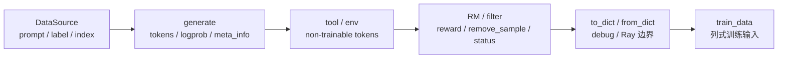

# Sample数据契约 · 核心概念

## 你为什么要读

这篇先建立 `Sample` 的读法。不要把它当成“所有字段的集合”，而要把它当成 rollout 和训练之间的可变合同：字段可以被 DataSource、generate、RM、filter、debug loader 和训练转换共同修改，但必须保持几组不变量。

## 一张图



在这条线上，`Sample` 的职责不是“保存所有东西”，而是把不同来源的字段压到同一条 response 时间轴上。

## 身份层：同 prompt 分组和同 rollout 聚合不是一回事

`group_index` 和 `index` 主要服务 prompt 分组与样本编号；`rollout_id` 服务训练 loss 聚合。默认 rollout 常常一条 execution 只产出一条 training sample，所以读起来像同一件事；compact/subagent 路径会把一次 execution 拆出多条 training sample，这些 sibling 必须共享同一个 `rollout_id`。

```python
# 定位骨架（据 `slime/utils/types.py` L93-L149 选取核心字段）：
@dataclass
class Sample:
    group_index: int | None = None
    index: int | None = None
    rollout_id: int | None = None
    prompt: str | list[dict[str, str]] = ""
    tokens: list[int] = field(default_factory=list)
    multimodal_inputs: dict[str, Any] | None = None
    multimodal_train_inputs: dict[str, Any] | None = None
    response: str = ""
    response_length: int = 0
    reward: float | dict[str, Any] | None = None
    loss_mask: list[int] | None = None
    weight_versions: list[str] = field(default_factory=list)
    rollout_log_probs: list[float] | None = None
```

读者抓手：看到 `rollout_id is None` 不一定是错，RolloutManager 后面会 fallback；但 compact/subagent 返回多条 sibling 时必须显式设置。

## response 层：四个字段必须共用同一根尺子

`response_length`、`loss_mask`、`rollout_log_probs` 和 top-p offsets 按 response token 对齐；`rollout_routed_experts` 使用另一套坐标系，首维必须等于整条 `tokens` 的 next-token 长度 `len(tokens)-1`。

```python
# 定位骨架（据 `slime/utils/types.py` L253-L314 选取追加主干）：
tokens = _to_int_list(tokens)
log_probs = _to_float_list(log_probs)
if log_probs is not None and len(log_probs) != len(tokens):
    raise ValueError(f"log_probs length {len(log_probs)} != tokens length {len(tokens)}")
if tokens and trainable and log_probs is None:
    raise ValueError("trainable response tokens require rollout log probabilities.")
if tokens and not trainable:
    if log_probs is not None:
        raise ValueError("non-trainable response tokens should not pass rollout log probabilities.")
    log_probs = [0.0] * len(tokens)

previous_response_length = self.response_length
if tokens:
    self.tokens += tokens
    self.response_length += len(tokens)
    if self.loss_mask is None:
        self.loss_mask = [1] * previous_response_length
    self.loss_mask += [1 if trainable else 0] * len(tokens)
```

这段代码给出最重要的不变量：训练 token 必须有 rollout logprob；非训练 token 不允许带真实 logprob；`loss_mask` 负责告诉训练哪些 response token 参与 loss。

## metadata 层：top-p 与 routed experts 使用不同坐标系

top-p replay 不是一个矩阵，而是 `token_ids + offsets` 的 ragged 表。第 `i` 个 response token 对应 `token_ids[offsets[i]:offsets[i+1]]`。所以 offsets 长度必须等于 `response_length + 1`，最后一个 offset 必须等于 token id 数量。

```python
# 定位骨架（据 `slime/utils/types.py` L13-L36 删节）：
def _extract_rollout_top_p_token_data(
    meta_info: dict[str, Any],
    *,
    expected_num_tokens: int | None = None,
) -> tuple[torch.Tensor, torch.Tensor] | None:
    token_ids = decode_int32_meta_array(meta_info, _TOP_P_TOKEN_ID_META_KEYS)
    offsets = decode_int32_meta_array(meta_info, _TOP_P_TOKEN_OFFSET_META_KEYS)
    if token_ids is None and offsets is None:
        return None
    if token_ids is None or offsets is None:
        raise ValueError("SGLang top-p token replay must include both token ids and offsets.")
    if offsets.numel() == 0 or int(offsets[0]) != 0:
        raise ValueError(f"SGLang top-p token offsets must start with 0, got {offsets[:1].tolist()}.")
```

routed experts 也通过 `decode_int32_meta_array` 转成 int32 tensor，但它不是 response ragged 表：源码按 `[len(tokens)-1, num_layers, moe_router_topk]` reshape，训练侧再次断言首维等于 token 序列长度减一。默认 SGLang 路径会先把 prompt ids 放进 `sample.tokens`，再追加 response，因此这里覆盖整条 prompt+response 的 next-token 位置。它依赖 args，且多段调用会覆盖旧值，不会像 top-p offsets 那样增量 merge；上游 meta 必须提供与当前完整 `tokens` 匹配的快照。

## 状态层：finish_reason 只在 Sample 边界翻译一次

SGLang 返回的 `finish_reason.type` 在 `_apply_meta_info` 中被映射成 Slime 的 `Sample.Status`。

```python
# 定位骨架（据 `slime/utils/types.py` L362-L381 删节）：
if not update_terminal_info or "finish_reason" not in meta_info:
    return

if getattr(args, "sglang_speculative_algorithm", False):
    self.spec_info.add(meta_info=meta_info)

self.prefix_cache_info.add(meta_info=meta_info)

if "weight_version" in meta_info:
    self.weight_versions.append(meta_info["weight_version"])

match meta_info["finish_reason"]["type"]:
    case "length":
        self.status = Sample.Status.TRUNCATED
    case "abort":
        self.status = Sample.Status.ABORTED
    case "stop":
        self.status = Sample.Status.COMPLETED
```

多轮 streaming 或 partial rollout 可以用 `update_terminal_info=False` 暂不更新终态，最后一段再让样本进入 completed/truncated/aborted。

未知 `finish_reason.type` 没有 default case，会保持原 status；`FAILED` 也不是 SGLang finish reason 映射结果，而要由 rollout/tool 逻辑显式设置。

## 边界层：Sample 必须能跨 debug/Ray 边界

`to_dict/from_dict` 是 debug rollout 数据和跨版本兼容的边界。`status` 要从 enum 变成字符串再变回 enum，嵌套统计对象要转成 dict，未知字段还要保留下来。

```python
# 定位骨架（据 `slime/utils/types.py` L222-L244 删节）：
def to_dict(self):
    value = self.__dict__.copy()
    value["status"] = self.status.value
    value["spec_info"] = self.spec_info.to_dict()
    value["prefix_cache_info"] = self.prefix_cache_info.to_dict()
    return value

@staticmethod
def from_dict(data: dict):
    data = dict(data)
    data["status"] = Sample.Status(data["status"])
    data["spec_info"] = Sample.SpecInfo.from_dict(data.get("spec_info", {}))
    data["prefix_cache_info"] = Sample.PrefixCacheInfo.from_dict(data.get("prefix_cache_info", {}))

    field_names = set(Sample.__dataclass_fields__.keys())
    init_data = {k: v for k, v in data.items() if k in field_names}
    sample = Sample(**init_data)
```

`tests/test_sample.py` 明确把这个行为钉住：未知字段会作为动态属性保留，避免新旧 rollout/trainer 之间因为扩展字段直接丢信息。但 `to_dict()` 是浅拷贝，`from_dict()` 也不会调用 response 长度校验；它们证明“保真”，不证明对象本身合法或任意外部对象都适合持久化。

## 函数返回层：rollout 函数返回的是批，而不是单条样本

训练 rollout 函数应返回 `RolloutFnTrainOutput`。类型注解写 `list[list[Sample]]`，但 compact/subagent 当前可返回更深嵌套，随后由 RolloutManager 在 flatten 前校验。legacy 路径仍可返回裸列表，`call_rollout_fn` 会包装；它只判断外层类型，不验证 train/eval payload 形状。

```python
# 定位骨架（据 `slime/rollout/base_types.py` L7-L26 删节）：
@dataclass
class RolloutFnTrainOutput:
    samples: list[list[Sample]]
    metrics: dict[str, Any] = None

@dataclass
class RolloutFnEvalOutput:
    data: dict[str, dict[str, Any]]
    metrics: dict[str, Any] = None

def call_rollout_fn(fn, *args, evaluation: bool, **kwargs):
    output = fn(*args, **kwargs, evaluation=evaluation)

    if not isinstance(output, (RolloutFnTrainOutput, RolloutFnEvalOutput)):
        output = RolloutFnEvalOutput(data=output) if evaluation else RolloutFnTrainOutput(samples=output)

    return output
```

一句话记忆：`Sample` 是行对象，`RolloutFnTrainOutput` 是分组批，`train_data` 是列式批。三者不能混。

## 运行验证

Sample 契约的验证要覆盖字段对齐、动态字段保留、finish reason 翻译和 rollout 函数返回包装。

```powershell
rg -n 'class Sample|tokens|response_length|loss_mask|rollout_log_probs|routed_experts|finish_reason|def to_dict|def from_dict|RolloutFnTrainOutput|RolloutFnEvalOutput|call_rollout_fn|unknown|dynamic' slime/slime/utils/types.py slime/slime/rollout/base_types.py slime/tests/test_sample.py
```

读输出时先看 `Sample` 的核心字段，再看 `append_response_tokens` 附近的长度校验和 `finish_reason` 映射；跨 Ray/debug 边界看 `to_dict/from_dict`，确认未知字段不会丢；最后看 `call_rollout_fn`，确认 legacy 返回会被包装成 `RolloutFnTrainOutput` 或 `RolloutFnEvalOutput`。
