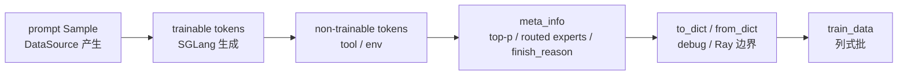

# Sample数据契约 · 源码走读

## 读者任务

这篇解决一个具体问题：一条 rollout 生成结果如何在 `Sample` 里变成训练可消费的数据，而且在多轮追加、tool token、top-p replay、MoE replay、debug dump 和 compact rollout 下仍然不乱。

读完后，你应该能判断：

- 自定义 generate 是否正确填充了 `Sample`。
- `tokens`、`response_length`、`loss_mask`、`rollout_log_probs`、top-p offsets 是否对齐。
- `finish_reason`、`weight_version`、prefix cache、spec metrics 如何进入 Sample。
- rollout 函数返回值为什么必须是 `RolloutFnTrainOutput` 或兼容的嵌套 `list[Sample]`。
- `Sample` 到 `train_data` 时哪些字段变成列，哪些字段被 DP rank 分片。

## 长文读法

这篇不要按字段清单读，而要按“一条 response 时间轴如何保持对齐”来读：`decode_int32_meta_array` 先把外部 metadata 统一成 CPU int32 tensor，`Sample.append_response_tokens` 负责追加 token、logprob、loss mask 和 top-p replay，`_apply_meta_info` 接收 SGLang 运行时事件，`RolloutManager` 最后把样本行转成训练列式 batch。

| 读者任务 | 先读 | 要抓住的判断 |
|----------|------|--------------|
| 第一次理解 Sample 契约 | 先建立模型、1 到 3 | `Sample` 是 response 侧对齐账本，不只是 rollout 结果容器 |
| 排查 token / mask / logprob 长度错误 | 3 到 5、8 | `response_length` 是主轴，`loss_mask`、`rollout_log_probs`、top-p offsets 都要贴着它校验 |
| 接入 tool 或环境 token | 4 到 6 | 不可训练 token 要补 loss mask 0、logprob 0，并在已有 top-p replay 上追加空 span |
| 排查 top-p 或 MoE replay | 1、2、6、7、13 | top-p 按 response ragged offsets 增量合并；routed experts 按整条 tokens 减一的完整快照覆盖 |
| 做 debug dump 或跨 Ray 传输 | 9 到 10 | `to_dict` / `from_dict` 保留 enum、嵌套统计和未知字段，rollout 输出会被兼容包装 |
| 接 compact rollout / subagent 输出 | 10 到 11 | 深层 `list[Sample]` 的 sibling 必须共享 `rollout_id`，否则损失聚合会把一次 rollout 算成多次 |
| 看训练 batch 字段来源 | 12 到 13 | 行式 Sample 在这里转成列式 `train_data`，可选字段按首样本或配置进入 batch |

如果只想排故，先定位是哪条账本断了：外部 metadata 格式、追加 token 的 trainable 分支、终态信息、嵌套 rollout 输出，还是转训练 batch 时的可选字段。

## 先建立模型

`Sample` 的核心不是字段数量，而是“同一条 response 时间轴上的对齐账本”。



贯穿场景：一个 prompt 先由 DataSource 变成 `Sample(index=sample_id)`；默认 SGLang rollout 调用 `append_response_tokens` 写入 response token 和 logprob；agent 或 tool 路径可能再追加一段不可训练 token；最后 `RolloutManager` 把一批 Sample 转成列式 `train_data`。

## 主线走读

### 1. metadata 数组先被统一成 CPU int32 tensor

**系统压力：** SGLang meta 里的 top-p token ids、offsets、routed experts 可能以 base64 字符串、bytes、torch tensor、numpy array 或 Python list 出现。后续 Sample 不能让格式差异扩散到训练链路。

**设计选择：** `decode_int32_meta_array` 在 `misc.py` 做统一解码；`Sample` 只消费一维 CPU int32 tensor。

**源码证据：**

```python
# 来源：slime/utils/misc.py L12-L34
def decode_int32_meta_array(meta_info: dict[str, Any], keys: str | Iterable[str]) -> torch.Tensor | None:
    if isinstance(keys, str):
        keys = (keys,)
    for key in keys:
        if key in meta_info:
            value = meta_info[key]
            break
    else:
        return None

    if value is None:
        return None
    if isinstance(value, str):
        import pybase64

        value = pybase64.b64decode(value.encode("ascii"))
    if isinstance(value, bytes | bytearray | memoryview):
        return torch.frombuffer(bytearray(value), dtype=torch.int32)
    if torch.is_tensor(value):
        return value.detach().to(device="cpu", dtype=torch.int32).reshape(-1)
    if hasattr(value, "flags") and not value.flags.writeable:
        value = value.copy()
    return torch.as_tensor(value, dtype=torch.int32).reshape(-1)
```

**执行逻辑：**

- `keys` 可以是单个字符串，也可以是一组兼容 key。
- base64 字符串会先解码成 bytes，再按 int32 视图读入。
- torch tensor 会 detach 到 CPU，并 reshape 成一维。
- 只读 numpy buffer 会 copy，避免后续 tensor 构造踩 writeable 限制。

**失败模式：**

- 如果上游发来的 bytes 不是 int32 对齐，后续值会错。
- 如果 top-p ids 和 offsets 只给一边，Sample 会在下一步直接报错，而不是 silently ignore。

### 2. top-p replay 是 ragged 表，必须成对出现

**系统压力：** top-p replay 需要保存每个生成 token 当时保留的候选 token 集，长度不固定，不能用普通二维矩阵表达。

**设计选择：** `Sample` 使用 `rollout_top_p_token_ids` 加 `rollout_top_p_token_offsets`。offsets 从 0 开始，最后一个 offset 等于 token ids 总数，长度等于 generated token 数 + 1。

**源码证据：**

```python
# 来源：slime/utils/types.py L13-L36
def _extract_rollout_top_p_token_data(
    meta_info: dict[str, Any],
    *,
    expected_num_tokens: int | None = None,
) -> tuple[torch.Tensor, torch.Tensor] | None:
    token_ids = decode_int32_meta_array(meta_info, _TOP_P_TOKEN_ID_META_KEYS)
    offsets = decode_int32_meta_array(meta_info, _TOP_P_TOKEN_OFFSET_META_KEYS)
    if token_ids is None and offsets is None:
        return None
    if token_ids is None or offsets is None:
        raise ValueError("SGLang top-p token replay must include both token ids and offsets.")
    if offsets.numel() == 0 or int(offsets[0]) != 0:
        raise ValueError(f"SGLang top-p token offsets must start with 0, got {offsets[:1].tolist()}.")
    if int(offsets[-1]) != token_ids.numel():
        raise ValueError(
            "SGLang top-p token ids/offsets mismatch: "
            f"offsets[-1]={int(offsets[-1])}, len(token_ids)={token_ids.numel()}."
        )
    if expected_num_tokens is not None and offsets.numel() != expected_num_tokens + 1:
        raise ValueError(
            "SGLang top-p token offsets length must equal generated token count + 1: "
            f"len(offsets)={offsets.numel()}, generated={expected_num_tokens}."
        )
    return token_ids, offsets
```

**执行逻辑：**

- 没有 top-p 数据时返回 `None`，允许 `rollout_top_p == 1.0` 的路径不携带 replay。
- ids 和 offsets 必须成对出现。
- offsets 本身先证明 ragged 表合法，再和本次新增 token 数对齐。

**不变量：** 对任意 token `i`，该 token 的 top-p 候选集合是 `token_ids[offsets[i]:offsets[i + 1]]`。

### 3. Sample 字段是四层账本

**系统压力：** 同一个对象要同时服务 prompt、生成结果、训练控制、观测统计、插件路径和多模态输入。字段多，但不是同一个层次。

**设计选择：** `Sample` 是一个 dataclass，核心字段按身份、prompt、response、状态、扩展 metadata 分组。

**源码证据：**

```python
# 定位骨架（据 `slime/utils/types.py` L93-L149 选取核心字段）：
@dataclass
class Sample:
    group_index: int | None = None
    index: int | None = None
    rollout_id: int | None = None
    prompt: str | list[dict[str, str]] = ""
    tokens: list[int] = field(default_factory=list)
    multimodal_inputs: dict[str, Any] | None = None
    multimodal_train_inputs: dict[str, Any] | None = None
    response: str = ""
    response_length: int = 0
    label: str | None = None
    reward: float | dict[str, Any] | None = None
    loss_mask: list[int] | None = None
    weight_versions: list[str] = field(default_factory=list)
    rollout_log_probs: list[float] | None = None
    rollout_top_p_token_ids: list[int] | torch.Tensor | None = None
    rollout_top_p_token_offsets: list[int] | torch.Tensor | None = None
    rollout_routed_experts: list[list[int]] | torch.Tensor | None = None
    remove_sample: bool = False
    teacher_log_probs: list[float] | None = None
```

**执行逻辑：**

- 默认 SGLang 路径在请求前把 prompt ids 写入 `tokens`，`append_response_tokens` 再追加 response；`Sample` 数据类本身不自动保证这一步。
- `response_length` 只统计 response 侧 token 数，不包含 prompt。
- `loss_mask`、`rollout_log_probs`、top-p offsets 按 response 侧长度对齐；routed experts 例外地按 `len(tokens)-1` 对齐。
- `remove_sample` 不删除对象，而是在转换训练数据时把 loss mask 置零。

### 4. trainable 与 non-trainable token 走不同分支

**系统压力：** agent/tool 场景会把环境返回、工具调用结果、格式化 token 追加到同一个 Sample，但这些 token 不应参与 policy loss，也没有 rollout engine logprob。

**设计选择：** `append_response_tokens` 用 `trainable` 分支强制区分模型生成 token 和环境 token。

**源码证据：**

```python
# 定位骨架（据 `slime/utils/types.py` L253-L314 选取追加主干）：
tokens = _to_int_list(tokens)
log_probs = _to_float_list(log_probs)
if log_probs is not None and len(log_probs) != len(tokens):
    raise ValueError(f"log_probs length {len(log_probs)} != tokens length {len(tokens)}")
if tokens and trainable and log_probs is None:
    raise ValueError("trainable response tokens require rollout log probabilities.")
if tokens and not trainable:
    if log_probs is not None:
        raise ValueError("non-trainable response tokens should not pass rollout log probabilities.")
    log_probs = [0.0] * len(tokens)

previous_response_length = self.response_length
if tokens:
    self.tokens += tokens
    self.response_length += len(tokens)
    if self.loss_mask is None:
        self.loss_mask = [1] * previous_response_length
    self.loss_mask += [1 if trainable else 0] * len(tokens)
```

**执行逻辑：**

- 可训练 token 没有 logprob 会立刻报错。
- 不可训练 token 如果传入 logprob 也会报错，防止伪 logprob 污染 PPO ratio。
- 不可训练 token 仍增加 `response_length`，但 `loss_mask` 追加 0。
- 如果已有 response 但之前没有 `loss_mask`，会先用 1 补齐旧 response。

**测试证据：** `tests/test_rollout_metrics.py` 覆盖了不可训练 token 的 top-p offset padding；`tests/test_sample.py` 覆盖了缺 logprob 和错误传 logprob 的异常。

### 5. logprob 初始化保护历史 response

**系统压力：** 多段追加时，如果前面已经有可训练 response token，却没有历史 logprob，再追加新 logprob 会让新旧 token 对齐不明。

**设计选择：** 如果 `rollout_log_probs` 为空且当前是可训练追加，历史 `previous_response_length` 必须为 0，否则抛错。

**源码证据：**

```python
# 来源：slime/utils/types.py L286-L302
previous_response_length = self.response_length
if tokens:
    self.tokens += tokens
    self.response_length += len(tokens)
    if self.loss_mask is None:
        self.loss_mask = [1] * previous_response_length
    self.loss_mask += [1 if trainable else 0] * len(tokens)

if log_probs is not None:
    if self.rollout_log_probs is None:
        if trainable and previous_response_length:
            raise ValueError(
                "Cannot append trainable rollout log probabilities to a sample with existing response "
                "tokens but no existing rollout_log_probs."
            )
        self.rollout_log_probs = [0.0] * previous_response_length
    self.rollout_log_probs += log_probs
```

**执行逻辑：**

- 首段可训练 response 可以初始化 logprob 列表。
- 如果之前只有不可训练 token，初始化时会用 0.0 为旧 token 补位。
- 如果之前已有可训练 token 但没有 logprob，直接失败。

**失败模式：** 自定义 generate 手写 `sample.tokens` 和 `response_length`，但不写 `rollout_log_probs`，后续再调用 `append_response_tokens` 时容易触发这个保护。

### 6. top-p 多段追加要合并 offsets

**系统压力：** streaming、多轮 agent 或 partial rollout 会多次追加 response token。每段 top-p replay 的 offsets 都从 0 开始，合并时必须整体平移。

**设计选择：** `_merge_rollout_top_p_token_data` 使用已有 offsets 的最后一项作为 base offset，把新 offsets 的尾部加上 base。

**源码证据：**

```python
# 定位骨架（据 `slime/utils/types.py` L39-L70 删节）：
def _merge_rollout_top_p_token_data(
    base_token_ids: list[int] | torch.Tensor | None,
    base_offsets: list[int] | torch.Tensor | None,
    token_ids: torch.Tensor,
    offsets: torch.Tensor,
) -> tuple[torch.Tensor, torch.Tensor]:
    base_token_ids = torch.as_tensor([] if base_token_ids is None else base_token_ids, dtype=torch.int32).reshape(-1)
    base_offsets = torch.as_tensor([0] if base_offsets is None else base_offsets, dtype=torch.int32).reshape(-1)
    base_offset = int(base_offsets[-1])
    return (
        torch.cat([base_token_ids, token_ids]),
        torch.cat([base_offsets, offsets[1:] + base_offset]),
    )

def _pad_rollout_top_p_offsets(
    token_ids: list[int] | torch.Tensor | None,
    offsets: list[int] | torch.Tensor | None,
    num_tokens: int,
) -> tuple[torch.Tensor, torch.Tensor]:
    if offsets is None or token_ids is None:
        raise ValueError("Cannot append empty top-p spans without existing token ids and offsets.")
    empty_offsets = offsets.new_full((num_tokens,), int(offsets[-1]))
    return token_ids, torch.cat([offsets, empty_offsets])
```

**执行逻辑：**

- 可训练追加且 meta 有 top-p 数据时，走 merge。
- 不可训练追加没有 top-p 候选集合时，走 pad，让 offsets 对每个不可训练 token 增加一个空 span。
- 空 span 的含义是：这个 response token 存在，但没有训练用 top-p replay 候选。

### 7. _apply_meta_info 是 Sample 的外部事件入口

**系统压力：** SGLang meta 不只包含 token 级信息，还包含 routed experts、finish reason、weight version、prefix cache、speculative decoding 指标。它们进入 Sample 的时机必须集中。

**设计选择：** `append_response_tokens` 只在需要时调用 `_apply_meta_info`，并把 top-p、routed experts、终态、统计信息都集中处理。

**源码证据：**

```python
# 定位骨架（据 `slime/utils/types.py` L316-L381 删节）：
def _apply_meta_info(
    self,
    args,
    meta_info: dict,
    *,
    new_token_count: int = 0,
    pad_missing_top_p: bool = False,
    update_terminal_info: bool = True,
) -> None:
    applied_top_p_data = False
    if new_token_count:
        top_p_data = _extract_rollout_top_p_token_data(meta_info, expected_num_tokens=new_token_count)
        if top_p_data is not None:
            applied_top_p_data = True
            base_token_ids, base_offsets = self.rollout_top_p_token_ids, self.rollout_top_p_token_offsets
            if base_token_ids is None and base_offsets is None:
                self.rollout_top_p_token_ids, self.rollout_top_p_token_offsets = top_p_data
            else:
                self.rollout_top_p_token_ids, self.rollout_top_p_token_offsets = _merge_rollout_top_p_token_data(
                    base_token_ids,
                    base_offsets,
                    *top_p_data,
                )
```

```python
# 定位骨架（据 `slime/utils/types.py` L352-L381 删节）：
routed_experts = decode_int32_meta_array(meta_info, "routed_experts")
if routed_experts is not None:
    if args is None:
        raise ValueError("args is required to decode routed experts metadata.")
    self.rollout_routed_experts = routed_experts.reshape(
        len(self.tokens) - 1,
        args.num_layers,
        args.moe_router_topk,
    )

if not update_terminal_info or "finish_reason" not in meta_info:
    return

if getattr(args, "sglang_speculative_algorithm", False):
    self.spec_info.add(meta_info=meta_info)

self.prefix_cache_info.add(meta_info=meta_info)

if "weight_version" in meta_info:
    self.weight_versions.append(meta_info["weight_version"])
```

**执行逻辑：**

- top-p 先按本次新增 token 数校验。
- routed experts 需要 `args.num_layers` 和 `args.moe_router_topk` reshape，首维为 `len(self.tokens)-1`；每次赋值覆盖旧快照，不做增量 merge。
- `update_terminal_info=False` 时，不更新终态和统计，适合 streaming 中间 chunk。
- speculative metrics 只有启用 `sglang_speculative_algorithm` 时才累加。
- prefix cache stats 和 weight version 在终态 metadata 中进入 Sample。

### 8. 终态映射和最终长度校验是最后防线

**系统压力：** 训练侧只认识 `Sample.Status`，不应该散落理解 SGLang 的 `finish_reason`。同时所有 response 侧数组必须在离开 Sample 前自检。

**设计选择：** `_apply_meta_info` 映射终态；`_validate_response_metadata_lengths` 在每次 append 末尾校验长度。

**源码证据：**

```python
# 定位骨架（据 `slime/utils/types.py` L375-L409 删节）：
match meta_info["finish_reason"]["type"]:
    case "length":
        self.status = Sample.Status.TRUNCATED
    case "abort":
        self.status = Sample.Status.ABORTED
    case "stop":
        self.status = Sample.Status.COMPLETED

def _validate_response_metadata_lengths(self):
    if self.loss_mask is not None and len(self.loss_mask) != self.response_length:
        raise ValueError(f"loss_mask length {len(self.loss_mask)} != response_length {self.response_length}")

    if self.rollout_log_probs is not None and len(self.rollout_log_probs) != self.response_length:
        raise ValueError(
            f"rollout_log_probs length {len(self.rollout_log_probs)} != response_length {self.response_length}"
        )
```

```python
# 来源：slime/utils/types.py L392-L408
if self.rollout_top_p_token_ids is None and self.rollout_top_p_token_offsets is None:
    return
if self.rollout_top_p_token_ids is None or self.rollout_top_p_token_offsets is None:
    raise ValueError("rollout top-p replay must include both token ids and offsets.")

offsets = torch.as_tensor(self.rollout_top_p_token_offsets, dtype=torch.int32).reshape(-1)
if offsets.numel() != self.response_length + 1:
    raise ValueError(
        "rollout_top_p_token_offsets length must equal response_length + 1: "
        f"len(offsets)={offsets.numel()}, response_length={self.response_length}."
    )
token_id_count = _numel(self.rollout_top_p_token_ids)
if int(offsets[-1]) != token_id_count:
    raise ValueError(
        "rollout top-p token ids/offsets mismatch: "
        f"offsets[-1]={int(offsets[-1])}, len(token_ids)={token_id_count}."
    )
```

**测试证据：** `tests/test_sample.py` 参数化覆盖 `length → TRUNCATED`、`abort → ABORTED`、`stop → COMPLETED`；`tests/test_rollout_metrics.py` 覆盖 top-p offsets 与 loss mask 的关系。

未知 finish reason 没有 default case，会保持原 status；`FAILED` 需要 rollout 逻辑显式赋值。

### 9. 序列化边界保留 enum、嵌套统计和未知字段

**系统压力：** Sample 会被保存到 debug rollout 文件，也可能穿过 Ray 边界。跨版本时新字段可能被旧代码读到，不能默默丢失。

**设计选择：** `to_dict` 把 enum 和嵌套 dataclass 转成普通 dict；`from_dict` 用 dataclass 字段构造 Sample，并把未知 key 作为动态属性挂回去。

**源码证据：**

```python
# 来源：slime/utils/types.py L222-L244
def to_dict(self):
    value = self.__dict__.copy()
    value["status"] = self.status.value
    value["spec_info"] = self.spec_info.to_dict()
    value["prefix_cache_info"] = self.prefix_cache_info.to_dict()
    return value

@staticmethod
def from_dict(data: dict):
    data = dict(data)
    data["status"] = Sample.Status(data["status"])
    data["spec_info"] = Sample.SpecInfo.from_dict(data.get("spec_info", {}))
    data["prefix_cache_info"] = Sample.PrefixCacheInfo.from_dict(data.get("prefix_cache_info", {}))

    field_names = set(Sample.__dataclass_fields__.keys())
    init_data = {k: v for k, v in data.items() if k in field_names}
    sample = Sample(**init_data)

    for key, value in data.items():
        if key not in field_names:
            setattr(sample, key, value)

    return sample
```

**执行逻辑：**

- `status` 保存为字符串，恢复为 `Sample.Status`。
- `spec_info` 和 `prefix_cache_info` 保存为普通 dict，恢复为对应嵌套对象。
- 未知字段不参与 dataclass 初始化，但会通过 `setattr` 保留。

边界：这里没有调用 `_validate_response_metadata_lengths`。序列化可以忠实保存一个本来就不一致的对象；`to_dict` 还是浅拷贝，动态字段能否真正落盘取决于后续序列化器。

**运行验证：** `tests/test_sample.py` 中 `test_from_dict_preserves_unknown_fields_as_attributes` 覆盖了这个兼容边界。

### 10. rollout 函数输出先包装，再校验 compact rollout_id

**系统压力：** 插件 rollout 可能返回新版 dataclass，也可能返回 legacy 裸列表。RolloutManager 需要统一形态后才能展平；compact/subagent 额外要求 sibling `rollout_id` 一致。

**设计选择：** `call_rollout_fn` 先做输出包装；`RolloutManager._get_rollout_data` 再校验 `rollout_id` 并展平。

**源码证据：**

```python
# 定位骨架（据 `slime/rollout/base_types.py` L7-L26 删节）：
@dataclass
class RolloutFnTrainOutput:
    samples: list[list[Sample]]
    metrics: dict[str, Any] = None

@dataclass
class RolloutFnEvalOutput:
    data: dict[str, dict[str, Any]]
    metrics: dict[str, Any] = None

def call_rollout_fn(fn, *args, evaluation: bool, **kwargs):
    output = fn(*args, **kwargs, evaluation=evaluation)

    if not isinstance(output, (RolloutFnTrainOutput, RolloutFnEvalOutput)):
        output = RolloutFnEvalOutput(data=output) if evaluation else RolloutFnTrainOutput(samples=output)

    return output
```

```python
# 定位骨架（据 `slime/ray/rollout.py` L635-L665 删节）：
if self.args.load_debug_rollout_data:
    data = torch.load(
        self.args.load_debug_rollout_data.format(rollout_id=rollout_id),
        weights_only=False,
    )["samples"]
    data = [Sample.from_dict(sample) for sample in data]
    metrics = None
else:
    data = call_rollout_fn(self.generate_rollout, self.args, rollout_id, self.data_source, evaluation=False)
    metrics = data.metrics
    data = data.samples
    _validate_rollout_id_annotated(data)
    while isinstance(data[0], list):
        data = list(itertools.chain.from_iterable(data))

return data, metrics
```

**执行逻辑：**

- debug load 路径直接从 dict 恢复 Sample，不走 generate。
- 正常路径先得到 `RolloutFnTrainOutput`，再拿 `samples`。
- `_validate_rollout_id_annotated` 在展平前检查 compact 结构。
- 展平后进入 `_convert_samples_to_train_data`。
- debug load 已失去嵌套 sibling 结构，不会重跑 compact id 校验；正常空输出会在 `data[0]` 处失败。

### 11. compact rollout_id 只在深层 sibling 上强校验

**系统压力：** 默认 rollout 的形状是 prompt 到 samples 的二层列表；compact/subagent 会多一层，把一次 execution 拆成多个训练 Sample。不能破坏默认路径，也不能让 compact 路径重复计数。

**设计选择：** `_validate_rollout_id_annotated` 只在深度大于等于 2 且 sibling 数量大于 1 时要求 `rollout_id` 非空且一致。

**源码证据：**

```python
# 定位骨架（据 `slime/ray/rollout.py` L898-L925 删节）：
def _validate_rollout_id_annotated(node, depth=0):
    if isinstance(node, Sample):
        return
    assert isinstance(node, list), f"unexpected rollout output node type: {type(node).__name__}"
    if node and isinstance(node[0], Sample):
        if depth >= 2 and len(node) > 1:
            rids = [s.rollout_id for s in node]
            missing = [i for i, r in enumerate(rids) if r is None]
            assert not missing, (
                f"Compact rollout returned {len(node)} samples but rollout_id is unset on "
                f"positions {missing}. Set Sample.rollout_id on every sibling so the loss "
                "reducer can aggregate them as one rollout instead of N."
            )
            assert len(set(rids)) == 1, f"Sibling samples from one compact rollout must share rollout_id; got {rids}."
        return
```

**执行逻辑：**

- 普通 `list[list[Sample]]` 到 leaf 时 depth 为 1，不强制。
- compact `list[list[list[Sample]]]` 到 leaf 时 depth 大于等于 2，强制 sibling 共享 rollout_id。
- 这个校验发生在 flatten 前，结构信息还没有丢。

### 12. Sample 到 train_data 是行转列

**系统压力：** 训练后端不消费对象列表，而消费列式 batch。字段必须统一抽取、补默认、处理 remove_sample、保留 rollout 分组分母。

**设计选择：** `_convert_samples_to_train_data` 先做 reward 后处理，再构造列式 dict，随后补 `loss_masks`、`rollout_mask_sums` 和可选字段。

**源码证据：**

```python
# 定位骨架（据 `slime/ray/rollout.py` L713-L778 删节）：
raw_rewards, rewards = self._post_process_rewards(samples)

rollout_ids = [sample.rollout_id for sample in samples]
existed_rollout_id_values = set(rid for rid in rollout_ids if rid is not None)
tmp_id = 0
for i in range(len(rollout_ids)):
    if rollout_ids[i] is None:
        while tmp_id in existed_rollout_id_values:
            tmp_id += 1
        rollout_ids[i] = tmp_id
        existed_rollout_id_values.add(tmp_id)

train_data = {
    "tokens": [sample.tokens for sample in samples],
    "response_lengths": [sample.response_length for sample in samples],
    "rewards": rewards,
    "raw_reward": raw_rewards,
    "truncated": [1 if sample.status == Sample.Status.TRUNCATED else 0 for sample in samples],
    "sample_indices": [sample.index for sample in samples],
    "rollout_ids": rollout_ids,
}
```

```python
# 定位骨架（据 `slime/ray/rollout.py` L747-L778 删节）：
loss_masks = []
for sample in samples:
    if sample.loss_mask is None:
        sample.loss_mask = [1] * sample.response_length

    assert (
        len(sample.loss_mask) == sample.response_length
    ), f"loss mask length {len(sample.loss_mask)} != response length {sample.response_length}"
    if sample.remove_sample:
        sample.loss_mask = [0] * sample.response_length
    loss_masks.append(sample.loss_mask)
train_data["loss_masks"] = loss_masks

rollout_id_list = train_data["rollout_ids"]
mask_sums_per_sample = [sum(m) for m in loss_masks]
rollout_total_mask: dict[int, int] = {}
for rid, ms in zip(rollout_id_list, mask_sums_per_sample, strict=True):
    rollout_total_mask[rid] = rollout_total_mask.get(rid, 0) + ms
train_data["rollout_mask_sums"] = [rollout_total_mask[rid] for rid in rollout_id_list]
```

**执行逻辑：**

- `rollout_id is None` 的样本会被分配不冲突的临时 id。
- `loss_mask is None` 时默认全 1。
- `remove_sample=True` 不删除行，而是把该行 loss mask 全置 0。
- `rollout_mask_sums` 按 rollout_id 汇总，解决一个 rollout 被拆到不同 micro-batch 后 loss 分母仍一致的问题。

### 13. 可选训练字段按首样本或配置决定是否进入 batch

**系统压力：** top-p replay、routed experts、teacher logprobs、多模态 train inputs 不是每个任务都有。训练 batch 要保持稀疏，不该无条件塞空字段。

**设计选择：** `_convert_samples_to_train_data` 对可选字段逐项检查，只有存在时才写入。

**源码证据：**

```python
# 定位骨架（据 `slime/ray/rollout.py` L792-L824 删节）：
if samples[0].rollout_log_probs is not None:
    train_data["rollout_log_probs"] = [sample.rollout_log_probs for sample in samples]

if getattr(self.args, "rollout_top_p", 1.0) != 1.0:
    for sample in samples:
        assert sample.rollout_top_p_token_ids is not None
        assert sample.rollout_top_p_token_offsets is not None
        assert len(sample.rollout_top_p_token_offsets) == sample.response_length + 1
        offset_end = int(sample.rollout_top_p_token_offsets[-1])
        assert offset_end == len(sample.rollout_top_p_token_ids)
    train_data["rollout_top_p_token_ids"] = [sample.rollout_top_p_token_ids for sample in samples]
    train_data["rollout_top_p_token_offsets"] = [sample.rollout_top_p_token_offsets for sample in samples]

if samples[0].rollout_routed_experts is not None:
    train_data["rollout_routed_experts"] = [sample.rollout_routed_experts for sample in samples]
```

```python
# 来源：slime/ray/rollout.py L815-L824
if samples[0].train_metadata is not None:
    train_data["metadata"] = [sample.train_metadata for sample in samples]

if any(sample.multimodal_train_inputs is not None for sample in samples):
    train_data["multimodal_train_inputs"] = [sample.multimodal_train_inputs for sample in samples]

if samples[0].teacher_log_probs is not None:
    train_data["teacher_log_probs"] = [sample.teacher_log_probs for sample in samples]

return train_data
```

**不变量与失败模式：**

- `rollout_top_p != 1.0` 时，每条 sample 都必须带 top-p ids 和 offsets。
- `samples[0]` 被用作若干字段是否存在的哨兵；混合 batch 要避免第一条缺字段而后面有字段。
- routed experts 必须对每条 sample 满足首维 `len(tokens)-1`；它不按 `response_length` 校验。

## 运行验证

优先跑纯 CPU 的 Sample 单测：

```powershell
$env:PYTHONPATH='F:\源码阅读\slime'
python -m pytest slime/tests/test_sample.py slime/tests/test_rollout_metrics.py -q
```

预期覆盖：

- `to_dict/from_dict` 保留 status、nested info、未知扩展字段。
- `finish_reason` 映射为 `Sample.Status`。
- prefix cache 跨调用累加，spec info 只在 speculative flag 开启时累加。
- top-p offsets 合并、不可训练 token padding、remove sample 跳过 metric。
- trainable token 缺 logprob 或 non-trainable token 带 logprob 时抛错。

直接运行时两组都在 collection 阶段受依赖阻塞：`test_sample.py` 缺 `httpx`，`test_rollout_metrics.py` 缺 `ray`。本轮只 stub 未被 Sample 使用的 `http_utils.is_port_available` 后，原样执行 `test_sample.py` 得到 `12 passed`；从当前 `rollout.py` AST 抽取 top-p metric 函数的两项行为检查通过。两条路径仍有 Torch/NumPy ABI 警告，且 AST 替代不等同完整 Ray/SGLang import 环境。

## 复盘

- `Sample` 是 response 时间轴的账本，不是静态字段表。
- `append_response_tokens` 是最重要的写入口；自定义 generate 应优先用它，而不是手写多个字段。
- top-p replay 与 teacher logprobs 依赖 response 侧长度；routed experts 依赖整条 `tokens` 的 next-token 长度。
- `to_dict/from_dict` 是 debug、Ray 和跨版本兼容边界。
- rollout 函数返回的是嵌套 batch，RolloutManager 会先校验 compact `rollout_id`，再行转列成 `train_data`。
