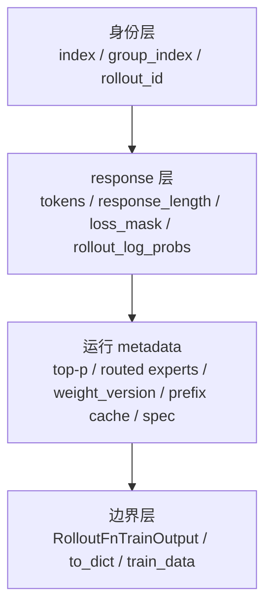

# Sample数据契约

`Sample` 是 Slime 从 rollout 到训练后端的最小数据合同。它不是普通字段表，而是一份会在生成、工具调用、RM、filter、debug dump、Ray object store 和 Megatron 训练之间持续被修改和搬运的“样本账本”。本专题回答三个问题：一个 response token 追加时哪些数组必须一起增长，哪些字段决定训练是否计算 loss，哪些返回值形状能被 RolloutManager 接收。

读完本专题后，读者应该能排查这些问题：

- 自定义 generate 返回了 `Sample`，但训练侧缺 `rollout_log_probs`、`loss_mask` 或 reward。
- 多轮 tool call 中一部分 token 不该训练，却错误进入 loss。
- top-p replay、routed experts、teacher logprobs 这类 ragged metadata 形状错位。
- compact/subagent rollout 一次 execution 拆出多条 training sample 后，loss 分母重复计数。
- debug rollout 数据保存后再加载，`status`、`spec_info`、`prefix_cache_info` 或扩展字段丢失。

## 首次阅读路径

| 读者任务 | 建议入口 | 读完能做什么 |
|----------|----------|--------------|
| 先建立字段模型 | [[Slime-Sample数据契约-核心概念]] | 分清身份字段、response 对齐字段、运行统计和扩展 hook |
| 沿源码看核心不变量 | [[Slime-Sample数据契约-源码走读]] | 追 `append_response_tokens` 如何维护 token/mask/logprob/top-p/status |
| 看跨模块流动 | [[Slime-Sample数据契约-数据流]] | 解释 `Sample → train_data → per-rank rollout_data` |
| 遇到错位或插件问题 | [[Slime-Sample数据契约-排障指南]] | 按症状定位 rollout_id、logprob、reward_key、top-p、动态加载 |
| 做验收 | [[Slime-Sample数据契约-学习检查]] | 用单测和口头复述验证自己真的掌握契约 |

## 心理模型

把 `Sample` 看成四层叠在一起的账本：



每一层都有对应失败模式：

| 层 | 主要字段 | 破坏后会怎样 |
|----|----------|--------------|
| 身份层 | `index`、`group_index`、`rollout_id` | compact rollout 的 loss 聚合分母错 |
| response 层 | `tokens`、`response_length`、`loss_mask`、`rollout_log_probs` | PPO ratio、mask、dynamic batch 出错 |
| metadata 层 | `rollout_top_p_*`、`rollout_routed_experts`、`teacher_log_probs` | top-p replay、MoE replay、OPD 蒸馏错位 |
| 边界层 | `to_dict/from_dict`、`RolloutFnTrainOutput`、`train_data` | Ray/debug/插件边界丢字段或返回形状不兼容 |

## 核心源码锚点

**判断：`Sample` 的核心压力是 response 侧多数组对齐，同时 routed-experts 例外地按整条 token 序列的 next-token 位置对齐。**

```python
# 定位骨架（据 `slime/utils/types.py` L253-L314 选取入口校验）：
def append_response_tokens(
    self,
    args=None,
    *,
    tokens=None,
    log_probs=None,
    trainable: bool = True,
    meta_info: dict | None = None,
    text: str | None = None,
    update_terminal_info: bool = True,
):
    tokens = _to_int_list(tokens)
    log_probs = _to_float_list(log_probs)
    if log_probs is not None and len(log_probs) != len(tokens):
        raise ValueError(f"log_probs length {len(log_probs)} != tokens length {len(tokens)}")
    if tokens and trainable and log_probs is None:
        raise ValueError("trainable response tokens require rollout log probabilities.")
    if tokens and not trainable:
        if log_probs is not None:
            raise ValueError("non-trainable response tokens should not pass rollout log probabilities.")
        log_probs = [0.0] * len(tokens)
```

这段源码说明 `Sample` 不是“填字段即可”。每次追加 response token，Slime 都在维护同一个 response 时间轴：训练 token 必须带 rollout logprob，非训练 token 必须带 `loss_mask=0`，top-p offsets 要跟 `response_length` 对齐。`rollout_routed_experts` 是另一根尺子：其首维必须等于 `len(tokens)-1`，训练侧也按这个契约断言。

## 源码范围

| 文件 | 角色 |
|------|------|
| `slime/utils/types.py` | `Sample`、top-p/routed metadata 解码、append 状态机、序列化、`RolloutBatch` |
| `slime/rollout/base_types.py` | rollout 函数返回契约与 legacy 包装 |
| `slime/utils/misc.py` | `decode_int32_meta_array`、`load_function` |
| `slime/ray/rollout.py` | rollout 输出校验、Sample 到列式 train_data、DP 切分 |
| `slime/tests/test_sample.py` | `Sample` 序列化、状态映射、prefix/spec 统计的单测契约 |
| `slime/tests/test_rollout_metrics.py` | top-p metrics、非训练 token 与 remove sample 行为 |

## 相邻专题

| 方向 | 专题 | 关系 |
|------|------|------|
| 上游 | [[Slime-RolloutManager]] | RolloutManager 接收 rollout 函数返回的嵌套 `Sample` |
| 上游 | [[Slime-引擎拓扑]] | Router 和 engine ready 后，generate 才能填充 Sample |
| 下游 | [[Slime-数据源]] | DataSource 生产 prompt Sample，也回收 partial Sample |
| 下游 | [[Slime-SGLang-Rollout]] | 默认 SGLang rollout 如何调用 `append_response_tokens` |
| 下游 | [[Slime-训练数据]] | `Sample` 被转成列式 `train_data` 并按 DP rank 分发 |
| 下游 | [[Slime-Advantage计算]] | reward、mask、rollout_id 如何影响 advantage 和 loss 分母 |
