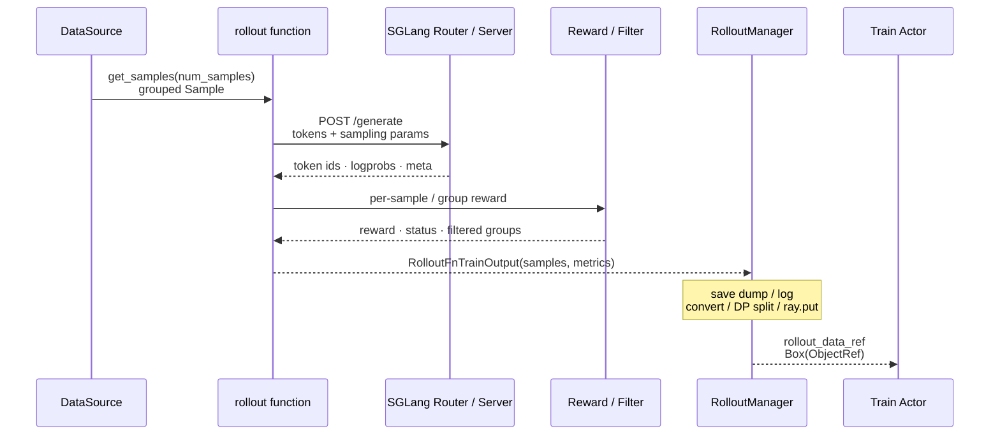

# Rollout生成

> **读者任务：** 沿一组 prompt 追踪 `Sample group → HTTP generation → reward/filter → train dict → ObjectRef`，并在每个边界说清对象形状与失败归属。
> **推理侧前置：** [[SGLang-HTTP-Server]]、[[SGLang-Scheduler]]。

## 你为什么要读

Rollout 不是一次 `model.generate()`。Slime 要同时管理 prompt buffer、并发与 partial 状态、SGLang HTTP 服务、token/logprob、reward、group normalization、过滤、debug trace，以及训练后端需要的 tensor/list 字段。任何一次静默截短或错误拍平，都可能让“样本能训练”却语义已错。

最重要的对象边界是：

```text
DataSource: list[list[Sample]]
        ↓
generate_and_rm: Sample 或 list[Sample]
        ↓
RolloutFnTrainOutput.samples: list[Sample]
        ↓
RolloutManager convert: RolloutBatch 风格 dict
        ↓
DP split + ray.put: list[Box(ObjectRef)]
```

`Sample` 是生成阶段的核心语义对象，但不是 Rollout 与 Train 之间“唯一载体”；真正跨 Ray 交给训练 actor 的是 DP 分片后的数据 dict ObjectRef。

## 端到端数据流



来源：`slime/rollout/data_source.py` L1-L35；`slime/rollout/sglang_rollout.py` L193-L334、L369-L467、L618-L641；`slime/ray/rollout.py` L543-L560、L713-L892。

## 本目录按职责分层

| 层 | 专题 | 核心问题 |
|----|------|----------|
| 编排出口 | [[Slime-RolloutManager]] | 外层 rollout、debug、convert、DP split、engine 生命周期 |
| 服务拓扑 | [[Slime-引擎拓扑]]、[[Slime-SGLang-Engine]]、[[Slime-外部推理引擎]] | server group、router、本地/外部 engine 与更新能力 |
| 语义对象 | [[Slime-Sample数据契约]]、[[Slime-数据源]] | group、index、tokens、mask、reward、buffer 身份 |
| 默认生成 | [[Slime-SGLang-Rollout]] | async group、custom generate、partial abort、train/eval |
| 质量控制 | [[Slime-Reward与过滤]] | per-sample/group RM、normalization、filter 与长度契约 |
| 替代协议 | [[Slime-其他Rollout路径]] | streaming、fully async、SFT、OPD 等外层替换 |

## 三类经常混淆的“引擎”

| 名称 | Slime 侧职责 | 请求内部职责 |
|------|---------------|--------------|
| `SGLangEngine` Ray wrapper | 启停 server、offload/onload、权重更新、健康和地址 | 不等于每个 token 的 scheduler |
| SGLang Router / HTTP server | 接收 HTTP、选择后端、暴露推理协议 | 请求进入后交给 SGLang runtime |
| SGLang Scheduler/ModelRunner | batch、KV、forward、decode | 不管理 Slime reward、DataSource 或训练 batch |

因此“rollout 卡住”要先判断卡在 Slime semaphore/RM、HTTP/router，还是 SGLang scheduler；三处日志不同。

## 读默认路径时保留四本账

- **数量账：** prompt group 数、fan-out sibling 数、aborted/filtered 数、最终 train sample 数。
- **token 账：** prompt/response token、loss mask、logprob、truncation 与 observation 是否等长。
- **身份账：** `index`、`group_index`、`rollout_id`、dataset name 和 weight version 各自含义。
- **状态账：** pending、completed、truncated、aborted、buffer 回填与 eval 聚合。

这四本账中，`zip(..., strict=False)`、变量 fan-out 和拍平时点尤其容易制造静默错误；详见 [[Slime-自定义扩展]] 与 [[Slime-插件与示例]]。

## 推荐阅读顺序

| 顺序 | 文档 | 读者任务 |
|------|------|----------|
| 1 | [[Slime-Sample数据契约-核心概念]] | 先认识对象字段和 group 身份 |
| 2 | [[Slime-数据源-源码走读]] | 看 group 如何取出、回填、保存 |
| 3 | [[Slime-SGLang-Rollout-源码走读]] | 沿 generate/RM/filter 生命周期读默认路径 |
| 4 | [[Slime-RolloutManager-源码走读]] | 看 samples 如何变成 train ObjectRef |
| 5 | [[Slime-引擎拓扑-数据流]]、[[Slime-SGLang-Engine-源码走读]] | 补服务与权重更新拓扑 |
| 6 | [[Slime-其他Rollout路径-核心概念]] | 最后比较外层 contract 的替代方案 |

## 可执行最小验证

```powershell
rg -n "def get_samples|def generate_rollout|def generate_and_rm|RolloutFnTrainOutput" `
  slime/slime/rollout/data_source.py slime/slime/rollout/sglang_rollout.py

rg -n "def generate\(|_convert_samples_to_train_data|_split_train_data_by_dp|ray.put" `
  slime/slime/ray/rollout.py
```

预期：第一组显示 grouped Sample 的生产边界；第二组显示原始 samples 先保存/记录，再转换、DP split 和放入 object store。静态命中不证明真实 SGLang、RM 或 GPU 环境已跑通。

## 阶段衔接

| 方向 | 模块 | 交接对象 |
|------|------|----------|
| ← Ray 编排 | [[Slime-Ray编排]] | engine actors 与 placement |
| → 训练 | [[Slime-训练后端]] | DP 分片后的 `rollout_data_ref` |
| → 权重 | [[Slime-权重同步]] | updatable engines、lock 与 version |
| → 高级扩展 | [[Slime-Agent轨迹]]、[[Slime-自定义扩展]] | custom generate、fan-out、外部 agent |
| → 推理内部 | [[SGLang-TokenizerManager]] | HTTP 进入 SGLang 后的请求生命周期 |

← [[Slime-Ray编排]] · → [[Slime-训练后端]]
