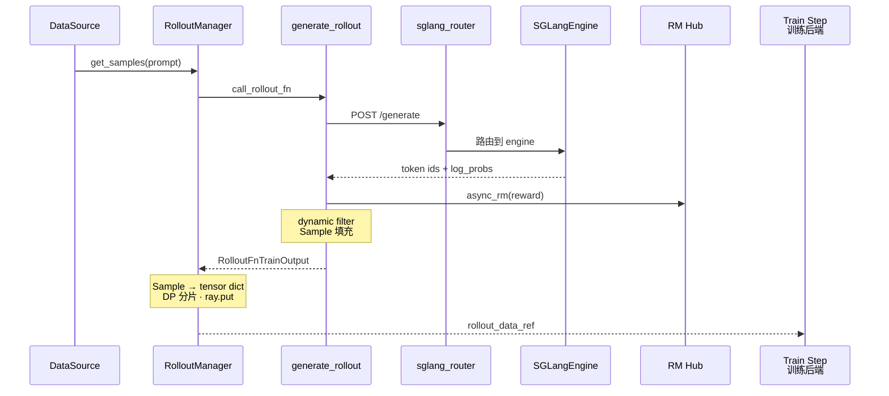

# Rollout生成

> **你只需阅读本目录，不必打开 `slime/` 源码。**
> 内嵌代码对应 slime Git commit `22cdc6e1`。
> SGLang 推理侧建议前置阅读 [[SGLang-HTTP-Server]]、[[SGLang-Scheduler]]。

---

## 本目录解决什么问题

Ray 编排部分讲清了 GPU 如何分给 Rollout 子系统。本目录回答：**prompt 如何经 SGLang Router 生成 response、计算 reward、封装为 `Sample`，再 tensor 化为 `rollout_data_ref` 交给训练侧？**

九个专题覆盖 Rollout 子系统全链路：

| 模块 | 角色 | 一句话 |
|------|------|--------|
| [[Slime-RolloutManager]] | 编排中枢 | `generate(rollout_id)`、DP 分片、`ray.put` |
| [[Slime-引擎拓扑]] | 引擎拓扑 | SglangConfig、ServerGroup、Router 启动 |
| [[Slime-Sample数据契约]] | 数据契约 | `Sample` / `RolloutBatch` 字段语义 |
| [[Slime-数据源]] | 数据源 | prompt 加载、buffer 优先策略 |
| [[Slime-SGLang-Rollout]] | 默认 rollout | `generate_rollout` 异步批量生成 |
| [[Slime-Reward与过滤]] | 奖励与过滤 | custom RM、dynamic filter、rm_type 分支 |
| [[Slime-其他Rollout路径]] | 替代路径 | fully-async / streaming / SFT / OPD 等 |
| [[Slime-SGLang-Engine]] | 引擎封装 | Ray Actor 薄封装、HTTP generate、权重更新接口 |
| [[Slime-外部推理引擎]] | 外部引擎 | 独立部署 SGLang、HTTP 发现与 Router 注册 |

---

## 端到端时序

这张图用于检查是否能复述 prompt → SGLangEngine.generate → Sample → rollout_data tensor 化。

这张图的读法是：Rollout 侧是 **三角架构** 的一角。DataSource 供 prompt，RolloutManager 控制 rollout_id 与 DP 分片，SGLangEngine 执行推理；`Sample` 是 Rollout 与 Train 之间的 **唯一数据载体**。

---

## 零基础一句话

**像「工厂采样线」：** DataSource 是原料仓，引擎拓扑与 SGLangEngine 是产线布局，generate_rollout 是默认流水线，Reward 与过滤是质检，Sample 契约是包装规格，RolloutManager 是车间主任，把成品按 DP 装箱发给训练车间。

---

## 推荐阅读顺序

建议先读 RolloutManager 与 Sample 数据契约，再进入默认 SGLang Rollout、Reward 与过滤、引擎拓扑和替代路径。时间紧时至少走通 RolloutManager → Sample → generate_rollout → SGLangEngine。

| 顺序 | 文档 | 必读理由 |
|------|------|----------|
| 1 | [[Slime-RolloutManager-核心概念]] | 三角架构、Ray Actor 角色 |
| 2 | [[Slime-Sample数据契约-核心概念]] | Sample 字段与 RolloutBatch |
| 3 | [[Slime-SGLang-Rollout-源码走读]] | 默认 `generate_rollout` 主路径 |
| 4 | [[Slime-SGLang-Engine-源码走读]] | HTTP generate 与权重更新接口 |
| 5 | [[Slime-引擎拓扑-数据流]] | 多模型 × ServerGroup 拓扑 |
| 6 | [[Slime-Reward与过滤-排障指南]] | custom RM / dynamic filter 挂载 |

---

## 阶段衔接

| 方向 | 模块 | 衔接点 |
|------|------|--------|
| ← Ray 编排 | PlacementGroup 与 RayTrainGroup | PG bundle → `start_rollout_servers` |
| → 训练后端 | [[Slime-训练步骤]] | `rollout_data_ref` → `async_train` |
| → 权重同步 | [[Slime-分布式权重同步]] · [[Slime-磁盘权重同步]] | `update_weights` → SGLangEngine NCCL/disk |
| → SGLang 对照 | [[SGLang-TokenizerManager]] | engine 内 tokenize → schedule → decode |
| → 高级 | [[Slime-Agent轨迹]] · [[Slime-自定义扩展]] | Agent trajectory、custom generate |

---

## 自测建议（零基础可试）

1. **Sample 字段：** 对照 [[Slime-Sample数据契约-核心概念]]，手写一个最小 `Sample` dict 并说明哪些字段参与 loss。
2. **Rollout 路径：** 在 [[Slime-SGLang-Rollout-数据流]] 时序图上，追踪一次 HTTP `/generate` 往返。
3. **替代 rollout：** 对比 [[Slime-其他Rollout路径-核心概念]] 中 `fully_async_rollout` 与默认 `generate_rollout` 的适用场景。

---

## 模块导航

| 目录 | 状态 |
| ------ | ------ |
| [[Slime-RolloutManager|RolloutManager]] | ✅ |
| [[Slime-引擎拓扑|EngineTopology]] | ✅ |
| [[Slime-Sample数据契约|Sample-Contracts]] | ✅ |
| [[Slime-数据源|DataSource]] | ✅ |
| [[Slime-SGLang-Rollout|SGLang-Rollout]] | ✅ |
| [[Slime-Reward与过滤|RM-FilterHub]] | ✅ |
| [[Slime-其他Rollout路径|Alt-Rollout]] | ✅ |
| [[Slime-SGLang-Engine|SGLang-Engine]] | ✅ |
| [[Slime-外部推理引擎|External-Engines]] | ✅ |

← [[Slime-Ray编排]] · → [[Slime-训练后端]]
