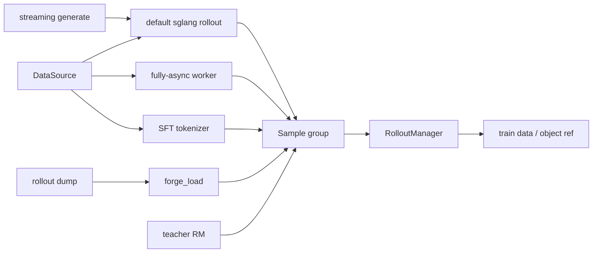
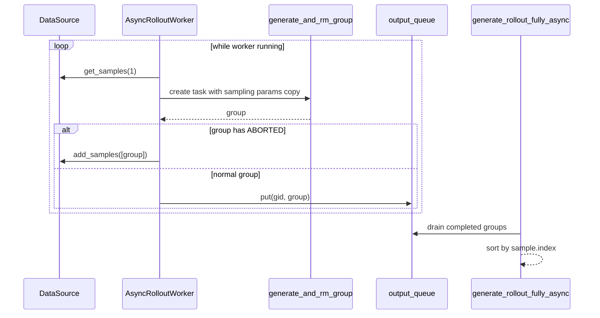
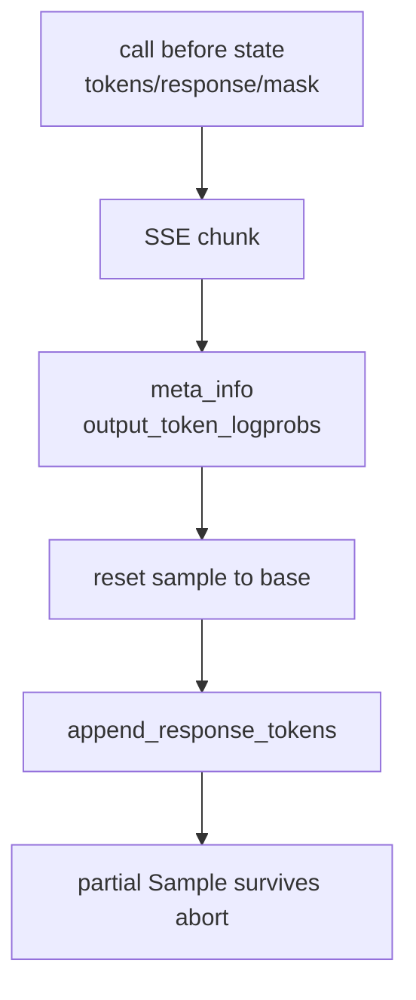
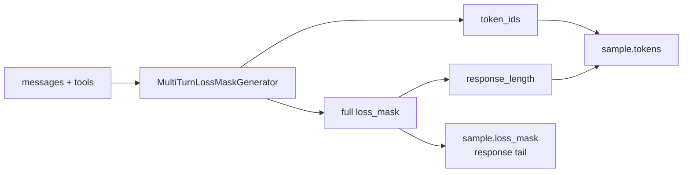
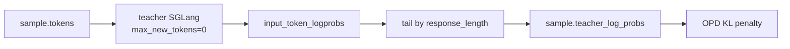
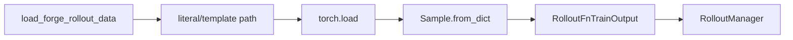

# 其他Rollout路径 · 数据流

## 你为什么要读

这篇只看对象如何跨边界变化。Alt Rollout 的核心差异不是“有没有 Sample”，而是 Sample 是从在线生成、SSE chunk、messages tokenization、teacher scorer，还是磁盘 dump 来的。

## 总览：同一个出口，多种入口



| 路径 | Sample 从哪里来 | 出口形状 | 关键风险 |
|------|-----------------|----------|----------|
| 默认 RL | SGLang 完整 JSON | `RolloutFnTrainOutput.samples` | filter/drop/abort 水位 |
| fully-async | 后台 worker output queue | 裸 `list[list[Sample]]` 后被包装 | queue 不增长、异常丢组、超额 drain 丢组 |
| streaming | SSE chunk 写入同一个 Sample | 仍走默认 rollout 输出 | cumulative SSE 假设 |
| SFT | messages 生成 tokens/loss mask | 裸 samples 后被包装 | response_length 与 mask 不对齐 |
| OPD | teacher server logprob | 写入已有 Sample | teacher logprob 长度不对齐 |
| forge | `torch.load` dump | `RolloutFnTrainOutput` | 覆盖 rollout_id 或 eval fallback 误用 |

## sync、train_async、fully-async 的时间边界

```mermaid
gantt
    title Rollout 与训练重叠边界
    dateFormat X
    axisFormat %s
    section sync train.py
    generate 0 :0, 20
    train 0 :20, 40
    generate 1 :40, 60
    train 1 :60, 80
    section train_async.py
    generate 0 :0, 20
    generate 1 :20, 40
    train 0 :20, 40
    train 1 :40, 60
    section fully-async worker
    in-flight pool :0, 80
```



`train_async.py` 管 step 间重叠；fully-async worker 管 rollout 内 group 生产是否持续保温。

```python
# 来源：train_async.py L9-L11
# The framework supports other asynchronous approaches such as fully async (which is shown in examples/full_async).
def train(args):
    assert not args.colocate, "Colocation is not supported for async training."
```

这条断言决定了数据流边界：colocate 场景不要把训练和生成跨 step 异步化。

## fully-async 的对象流



关键边界：

- DataSource 在 fully-async 下同时是取样口和 ABORTED 回灌口。
- output queue 只放正常完成 group。
- `gid` 是 worker 内顺序号，最终交给训练前还会按 `sample.index` 排序。
- 完成队列不是可靠队列：callback 异常路径会丢组；有界队列满时阻塞 event loop；前台一次 drain 全部完成项后只返回 target，多余项不会回队列。

```python
# 来源：slime/rollout/fully_async_rollout.py L182-L189
            # Aborted group → requeue, don't ship to training.
            if any(getattr(s, "status", None) == Sample.Status.ABORTED for s in result):
                try:
                    self.data_buffer.add_samples([result])
                except Exception:  # noqa: BLE001
                    logger.exception("fully-async: failed to requeue aborted group")
                return
            self.output_queue.put((gid, result))
```

## streaming 的对象流

streaming 的对象没有离开默认 rollout 主线，只是单 sample 的生成变成 chunk 驱动。



源码里的 snapshot 是为了处理 SGLang cumulative streaming：每个 chunk 代表“本次调用到目前为止的完整输出”，所以不能简单 append chunk delta。

如果 server 改成 incremental streaming，这条 reset+append 流会只保留最新 delta；如果 chunk 没有 `output_token_logprobs`，文本流仍可能前进而 token 流为空。两种情况都要求在集成测试中同时比较 text、tokens、logprobs 和 response_length。

```python
# 定位骨架（非逐行摘录）：slime/rollout/sglang_streaming_rollout.py L91-L105
    # Snapshot pre-call sample state. sglang's SSE chunks are cumulative
    # *within this call*; on each chunk we rebuild the post-call view of the
    # sample = prior state + chunk delta. That way a mid-stream break leaves
    # the sample exactly at the boundary of the last chunk we observed.
    base_tokens = list(sample.tokens)
    base_response = sample.response or ""
    base_response_length = sample.response_length
    base_log_probs = None if sample.rollout_log_probs is None else list(sample.rollout_log_probs)
    base_top_p_token_ids = sample.rollout_top_p_token_ids
    base_top_p_token_offsets = sample.rollout_top_p_token_offsets
    base_loss_mask = list(sample.loss_mask) if sample.loss_mask is not None else None
```

## SFT 的对象流

SFT 输入不是 prompt string，而是 messages 列表。DataSource 给出的每个 group 里通常只有一个 sample；SFT rollout 解包后把 messages 转成 token 序列。



测试从读者角度说明了契约：assistant 内容应该出现在被 mask 的 response 尾部，user/system 内容不应该进入 SFT loss。

测试没有覆盖 `response_length=0`。此时当前 `loss_mask[-response_length:]` 实际返回完整 mask，因此数据流必须要求至少存在一个可训练 assistant span，不能把零长度当作天然空尾部。

```python
# 定位骨架（非逐行摘录）：tests/gemma4/test_gemma4_sft_rollout.py L45-L64
def test_tokens_full_mask_is_tail():
    messages = [
        {"role": "system", "content": "You are helpful."},
        {"role": "user", "content": "What is 2+2?"},
        {"role": "assistant", "content": "It is 4."},
    ]
    samples, tok = _run_rollout([messages])
    sample = samples[0]

    assert len(sample.tokens) > 0
    assert sample.response_length > 0
    assert len(sample.loss_mask) == sample.response_length
    assert len(sample.loss_mask) <= len(sample.tokens)
```

## OPD 的对象流

OPD 把 reward response 当作 teacher logprob 容器。`reward_func` 的返回先暂存在 sample reward 相关字段中，`post_process_rewards` 再抽出 teacher logprob 并裁剪到 response 侧。



```python
# 来源：slime/rollout/on_policy_distillation.py L48-L59
    # Extract teacher log-probs from the sglang response
    teacher_log_probs = [
        torch.tensor([item[0] for item in reward["meta_info"]["input_token_logprobs"][1:]], dtype=torch.float32)
        for reward in raw_rewards
    ]
    teacher_log_probs = [
        t_log_prob[-response_length:]
        for t_log_prob, response_length in zip(teacher_log_probs, response_lengths, strict=False)
    ]

    for sample, t_log_probs in zip(samples, teacher_log_probs, strict=False):
        sample.teacher_log_probs = t_log_probs
```

这条流没有长度门禁：teacher 返回过短会静默留下短 tensor，零 response 会因 `[-0:]` 留下完整 tensor。训练前应验证每条 `teacher_log_probs` 长度与 response token 数完全相等。

## forge load 的对象流

forge load 直接从磁盘构造 Sample。它和 `load_debug_rollout_data` 的区别在系统边界：forge 不把 serving 关闭，因此可用于测量 server 与训练并存时的资源。



```python
# 定位骨架（非逐行摘录）：slime/rollout/forge_load.py L69-L91
def generate_rollout(args, rollout_id, data_source, evaluation: bool = False):
    path = _resolve_path(args, rollout_id, evaluation)

    if evaluation:
        # Eval is optional for a memory-test run. If no eval dump, no-op.
        if path is None:
            logger.info("forge_load: no eval dump found; returning empty eval result")
            return RolloutFnEvalOutput(data={})
        logger.info("forge_load: loading eval samples from %s", path)
        blob = torch.load(path, weights_only=False)
        samples = [Sample.from_dict(s) for s in blob["samples"]]
        # See train-path note: don't overwrite rollout_id.
        reward_key = args.eval_reward_key or args.reward_key
        rewards = [s.reward if (not reward_key or s.reward is None) else s.reward[reward_key] for s in samples]
        return RolloutFnEvalOutput(
            data={
                "forge_eval": {
                    "rewards": [r if r is not None else 0.0 for r in rewards],
```

## 测试与示例边界

| 路径 | 证据 | 能证明什么 | 不能证明什么 |
|------|------|------------|--------------|
| fully-async smoke | `test_qwen2.5_0.5B_fully_async_short.py` | 配置能接上 `train_async.py` 和 fully-async path | 本机无模型/GPU时不能运行 |
| streaming partial smoke | `test_qwen3_4B_streaming_partial_rollout.py` | oversampling + partial 会触发 abort 场景 | 不覆盖 incremental streaming server 模式 |
| SFT unit | `test_gemma4_sft_rollout.py` | messages mask 与 response tail | 依赖 Gemma4 checkpoint 才执行 |
| plugin contracts | `tests/plugin_contracts` | 函数签名和返回形状 | 不验证真实吞吐 |

```python
# 定位骨架（非逐行摘录）：tests/test_qwen2.5_0.5B_fully_async_short.py L30-L39
    rollout_args = (
        # The only line that differs from test_qwen2.5_0.5B_async_short.py:
        # use the public fully-async rollout function.
        "--rollout-function-path slime.rollout.fully_async_rollout.generate_rollout_fully_async "
        "--prompt-data /root/datasets/dapo-math-17k/dapo-math-17k.jsonl "
        "--input-key prompt "
        "--label-key label "
        "--apply-chat-template "
        "--rollout-shuffle "
```

```python
# 定位骨架（非逐行摘录）：tests/test_qwen3_4B_streaming_partial_rollout.py L34-L50
    rollout_args = (
        # Streaming generate at the per-sample level — the outer rollout
        # loop is still the stock sglang one (semaphore, abort orchestration).
        "--custom-generate-function-path slime.rollout.sglang_streaming_rollout.generate_streaming "
        "--prompt-data /root/datasets/dapo-math-17k/dapo-math-17k.jsonl "
        "--input-key prompt "
        "--label-key label "
        "--apply-chat-template "
        "--rollout-shuffle "
        "--rm-type deepscaler "
        "--num-rollout 2 "
        "--rollout-batch-size 4 "
        # Over-sample 2x so half of every rollout's in-flight groups must
        # be aborted, then partial-rollout recycles them.
        "--over-sampling-batch-size 8 "
        "--partial-rollout "
```

## 运行验证

在本地轻量环境里优先跑契约测试；端到端路径需要完整训练环境。

```powershell
$env:PYTHONPATH='F:\源码阅读\slime'
python -m pytest slime/tests/plugin_contracts/test_plugin_rollout_contracts.py -q
python -m pytest slime/tests/plugin_contracts/test_plugin_generate_contracts.py -q
python -m pytest slime/tests/gemma4/test_gemma4_sft_rollout.py -q
```

预期：契约测试不需要真实 SGLang server；SFT 测试如果缺 `GEMMA4_CKPT` 会被 skip，而不是失败。
