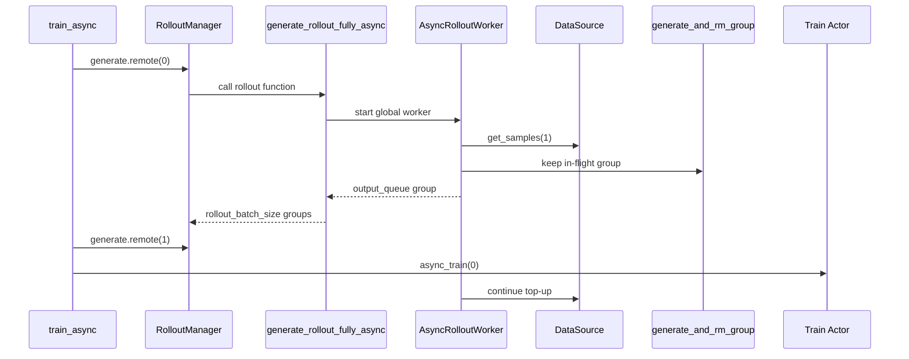

# 其他Rollout路径 · 源码走读

这篇解决一个具体问题：当你准备接一个替代 rollout 时，应该读哪些入口，怎样判断它保留了默认链路的哪些能力。主线选择 fully-async，因为它改动最大；随后用 streaming、SFT、OPD、forge 对照几种更小或不同方向的替换。

## 长文读法

这篇按“替代 rollout 到底替换了哪一层”读：RolloutManager 只认函数契约；`train_async.py` 改 step 间重叠；fully-async 改 rollout 内部调度；streaming、SFT、OPD、forge 分别改生成调用、样本字段、teacher logprob 和样本来源。

| 读者任务 | 先读 | 要抓住的判断 |
|----------|------|--------------|
| 第一次判断替代层级 | 贯穿场景、步骤一 | 只要保留 rollout function 契约，RolloutManager 不关心内部实现 |
| 理解 fully-async | 步骤二到七 | step 级重叠来自 `train_async.py`，rollout 内部持续 top-up 来自全局 worker |
| 排查 aborted group | 步骤六 | aborted group 回灌 data buffer，不进入训练输出 |
| 接 streaming generate | 对照一 | streaming 只替换内层 `/generate`，必须维护 partial sample 状态 |
| 接 SFT rollout | 对照二 | SFT 不走生成服务，而是直接填 tokens、response_length、reward、loss_mask |
| 接 OPD 或 forge | 对照三到四 | OPD 把 teacher logprob 写入 Sample，forge load 保留服务栈但样本来自磁盘 |

读的时候先问“替换了外层训练循环、rollout 调度、HTTP 生成、样本字段，还是数据来源”。这个问题比先看具体函数名更稳。

## 贯穿场景

假设一次 RL 训练希望同时做到两件事：

- step N 训练时，step N+1 的生成已经提前开始。
- rollout 内部不等最慢的 group 才启动下一批，而是后台一直保持 in-flight 池。

对应配置是 `train_async.py` 加 `--rollout-function-path slime.rollout.fully_async_rollout.generate_rollout_fully_async`。



## 步骤一：RolloutManager 只看函数契约

系统压力：Slime 要允许默认 RL、fully-async、SFT、forge、用户插件共存，所以 RolloutManager 不能硬编码某个类。

设计选择：初始化阶段加载函数路径；调用结果再由 `call_rollout_fn` 兼容 dataclass 和 legacy 返回值。

```python
# 来源：slime/ray/rollout.py L440-L441
        self.generate_rollout = load_function(self.args.rollout_function_path)
        self.eval_generate_rollout = load_function(self.args.eval_function_path)
```

```python
# 来源：slime/rollout/base_types.py L19-L26
def call_rollout_fn(fn, *args, evaluation: bool, **kwargs):
    output = fn(*args, **kwargs, evaluation=evaluation)

    # compatibility for legacy version
    if not isinstance(output, (RolloutFnTrainOutput, RolloutFnEvalOutput)):
        output = RolloutFnEvalOutput(data=output) if evaluation else RolloutFnTrainOutput(samples=output)

    return output
```

执行逻辑：

- `--rollout-function-path` 控制训练 rollout。
- `--eval-function-path` 控制 eval rollout。
- 新替代路径可以返回 `RolloutFnTrainOutput`，但 fully-async 仍返回裸 `list[list[Sample]]`，由包装层补成 train output。

失败边界：如果整段 rollout 替换后没有保留 group 形状，后续 flatten、rollout_id contract 和 train data 构造会在 RolloutManager 或训练后端报错。

## 步骤二：`train_async.py` 提前启动下一次 generate

系统压力：默认 `train.py` 是 generate 完再 train。模型训练和 rollout serving 分属不同 Ray actor 和 GPU 资源时，完全串行会浪费等待时间。

设计选择：`train_async.py` 保存下一个 `generate.remote` future，当前 step 拿到数据后立即启动下一步 generate，再开始训练当前 step。

```python
# 来源：train_async.py L30-L49
    # async train loop.
    rollout_data_next_future = rollout_manager.generate.remote(args.start_rollout_id)
    for rollout_id in range(args.start_rollout_id, args.num_rollout):
        # Sync the last generation
        if rollout_data_next_future is not None:
            rollout_data_curr_ref = ray.get(rollout_data_next_future)

        # Start the next rollout early.
        if rollout_id + 1 < args.num_rollout:
            rollout_data_next_future = rollout_manager.generate.remote(rollout_id + 1)

        if args.use_critic:
            actor_trains_this_step = rollout_id >= args.num_critic_only_steps
            value_refs = critic_model.async_train(rollout_id, rollout_data_curr_ref)
            if actor_trains_this_step:
                ray.get(actor_model.async_train(rollout_id, rollout_data_curr_ref, external_data=value_refs))
            else:
                ray.get(value_refs)
        else:
            ray.get(actor_model.async_train(rollout_id, rollout_data_curr_ref))
```

不变量与失败模式：

- `train_async.py` 明确 `assert not args.colocate`，colocate 下不要使用。
- update weights 前必须 `ray.get` 还在跑的 generate future。
- eval interval 仍是显式 `rollout_manager.eval.remote`，不要指望 fully-async 支持 evaluation。

## 步骤三：fully-async 创建全局 worker

系统压力：如果每个 rollout 调用都新建 worker，队列无法保温，长尾收益会消失。

设计选择：模块级 `_global_worker` 被锁保护；首次调用或线程死亡时创建 `AsyncRolloutWorker`，并用 `atexit` 做兜底停止。

```python
# 定位骨架（非逐行摘录）：slime/rollout/fully_async_rollout.py L48-L73
# Global worker, shared across rollout calls so the queue stays warm.
_global_worker: AsyncRolloutWorker | None = None
_worker_lock = threading.Lock()


def _get_global_worker(args, data_buffer) -> AsyncRolloutWorker:
    global _global_worker
    with _worker_lock:
        if _global_worker is None or not _global_worker.worker_thread.is_alive():
            logger.info("starting fully-async rollout worker")
            _global_worker = AsyncRolloutWorker(
                args, data_buffer, concurrency=args.sglang_server_concurrency * get_rollout_num_engines(args)
            )
            _global_worker.start()
        return _global_worker
```

执行逻辑：

- 并发上限来自 `sglang_server_concurrency * get_rollout_num_engines(args)`。
- worker 存在于当前 rollout worker 进程中，不是新的 Ray actor。
- `GenerateState(args)` 仍提供采样参数模板。

## 步骤四：worker 用线程安全队列跨 async 边界

系统压力：Rollout function 是同步 Ray 调用包一层 async；后台 worker 自己有 event loop；完成结果要安全地交给主调用。

设计选择：worker 在 daemon thread 里 `asyncio.run(self._loop())`，完成 group 进入 `queue.Queue`。

```python
# 定位骨架（非逐行摘录）：slime/rollout/fully_async_rollout.py L76-L111
class AsyncRolloutWorker:
    """Background thread + asyncio loop that continuously consumes groups
    from ``data_buffer`` and runs :func:`generate_and_rm_group` on each."""

    def __init__(self, args, data_buffer, concurrency: int = 10):
        self.args = args
        self.data_buffer = data_buffer
        self.concurrency = concurrency
        self.running = True
        self.output_queue: queue.Queue[tuple[int, list[Sample]]] = queue.Queue(maxsize=1000)
        self.worker_thread: threading.Thread | None = None
        self.state = GenerateState(args)

    # -- public --------------------------------------------------------------

    def start(self) -> None:
        if self.worker_thread is None or not self.worker_thread.is_alive():
            self.worker_thread = threading.Thread(target=self._thread_main, name="fully-async-rollout", daemon=True)
            self.worker_thread.start()

    def stop(self) -> None:
        self.running = False
        if self.worker_thread and self.worker_thread.is_alive():
            self.worker_thread.join(timeout=5)
```

失败边界：

- `output_queue` 只是完成队列，不是 dynamic filter。
- worker stop 只等线程 join，不负责训练语义上的 flush。
- 如果后台 task 崩溃，只记录日志并继续，调用方可能表现为队列长期不增长。
- `stop()` 只 join 5 秒，而 `_loop` 退出后允许 active tasks 再等 30 秒；调用方可把全局引用清空时旧 daemon thread 仍活着，形成短暂 orphan worker。
- done callback 使用有界队列的阻塞 `put`；队列达到 1000 且前台未 drain 时，callback 会阻塞后台 event-loop 线程。

## 步骤五：worker 持续 top-up，不等 rollout step

系统压力：默认水位控制以 `rollout_batch_size` 为目标；fully-async 要让 in-flight 数量由并发上限决定。

设计选择：`_loop` 持续清理 done tasks，再从 DataSource 每次取一个 group 补到 `max_concurrent`。

```python
# 定位骨架（非逐行摘录）：slime/rollout/fully_async_rollout.py L118-L152
    async def _loop(self) -> None:
        active_tasks: set[asyncio.Task] = set()
        max_concurrent = self.concurrency
        gid_counter = 0

        while self.running:
            try:
                # Reap done tasks
                if active_tasks:
                    done = {t for t in active_tasks if t.done()}
                    for t in done:
                        try:
                            t.result()  # results already handled in callback
                        except Exception as e:  # noqa: BLE001
                            logger.warning("fully-async task crashed: %r", e)
                    active_tasks -= done

                # Top up.
                while len(active_tasks) < max_concurrent and self.running:
                    groups = self.data_buffer.get_samples(1)
                    if not groups:
                        break
                    for group in groups:
                        gid = gid_counter
                        gid_counter += 1
                        task = asyncio.create_task(
                            generate_and_rm_group(
                                self.args,
                                group,
                                sampling_params=self.state.sampling_params.copy(),
                                evaluation=False,
                            )
                        )
```

这段证明 fully-async 仍复用默认 `generate_and_rm_group`：custom generate、sample RM、group RM 还在同一条内层链路里。但“复用内层函数”不等于复用默认外层控制面；dynamic filter、drop metrics、all-samples hook、最大补样策略都没有进入这条 worker loop。并发若因 engine 数为 0 算成 0，top-up 永远不创建 task，前台也没有 deadline。

## 步骤六：ABORTED group 回灌，不进训练

系统压力：权重更新或 abort 可能让 in-flight group 只生成到一半。这样的 group 不能进训练，但也不该直接丢掉。

设计选择：done callback 发现任意 sample 是 `ABORTED`，就把整个 group 通过 `data_buffer.add_samples([result])` 回灌；正常 group 才进入输出队列。

```python
# 来源：slime/rollout/fully_async_rollout.py L169-L189
    def _make_done_cb(self, gid: int):
        def _cb(done_task: asyncio.Task) -> None:
            try:
                result = done_task.result()
            except Exception:  # noqa: BLE001
                logger.exception("fully-async: process task raised")
                return
            if not isinstance(result, list):
                logger.warning(
                    "fully-async: generate_and_rm_group returned %r, expected list[Sample]; dropping",
                    type(result).__name__,
                )
                return
            # Aborted group → requeue, don't ship to training.
            if any(getattr(s, "status", None) == Sample.Status.ABORTED for s in result):
                try:
                    self.data_buffer.add_samples([result])
                except Exception:  # noqa: BLE001
                    logger.exception("fully-async: failed to requeue aborted group")
                return
            self.output_queue.put((gid, result))
```

不变量：fully-async 的回灌逻辑和默认 `sglang_rollout.abort` 的 partial 收集不是同一个路径。这里是 worker callback 级别的 ABORTED 重入队。

失败语义要说得更严谨：task 抛异常、结果不是 list、`add_samples` 抛异常时，原 group 都没有可靠回收；日志是诊断证据，不是交付保证。

## 步骤七：rollout function 只 drain 到目标数量

系统压力：外部 RolloutManager 仍希望一次调用返回一个训练 batch。

设计选择：`_generate_rollout_async` 从 worker output queue drain group，直到收集到 `rollout_batch_size`，再按 `sample.index` 排序后返回。

```python
# 定位骨架（非逐行摘录）：slime/rollout/fully_async_rollout.py L194-L256
async def _generate_rollout_async(args, rollout_id: int, data_buffer) -> list[list[Sample]]:
    assert args.rollout_global_dataset
    worker = _get_global_worker(args, data_buffer)

    target = args.rollout_batch_size
    logger.info(
        "fully-async rollout %d: target=%d queue_warm=%d",
        rollout_id,
        target,
        worker.queue_size(),
    )

    collected: dict[int, list[Sample]] = {}
    started = time.time()
    last_log = started
    LOG_EVERY = 30.0
```

```python
# 来源：slime/rollout/fully_async_rollout.py L241-L256
    out = sorted(collected.values(), key=_key)[:target]
    logger.info(
        "fully-async rollout %d: done in %.1fs, queue_left=%d",
        rollout_id,
        time.time() - started,
        worker.queue_size(),
    )
    return out


def generate_rollout_fully_async(args, rollout_id, data_buffer, evaluation: bool = False):
    """Slime ``--rollout-function-path`` entrypoint."""

    if evaluation:
        raise ValueError("fully-async rollout doesn't support evaluation mode")
    return run(_generate_rollout_async(args, rollout_id, data_buffer))
```

失败边界：如果 DataSource 枯竭、并发为 0 或 worker task 全部报错，调用会一直等队列；排障时看 `fully-async rollout <id>: collected` 日志和 worker crash warning。还有一个更隐蔽的数据丢失点：`get_completed_groups()` 每次把队列全部取空，若一次 drain 后 `collected` 超过 target，末尾 `[:target]` 只返回目标数量，多出的 group 不会放回队列，下一 step 永久看不到它们。

## 对照一：streaming 只替换内层 `/generate`

系统压力：默认 generate 等完整 JSON 返回；partial rollout 在 abort 时希望 Sample 已经保存尽可能多的中间状态。

设计选择：streaming 请求加 `"stream": True`，读取 SSE chunk，每个 chunk 都调用 `append_response_tokens` 重建 Sample。

```python
# 来源：slime/rollout/sglang_streaming_rollout.py L69-L89
    payload: dict[str, Any] = {
        "sampling_params": sampling_params,
        "return_logprob": True,
        "stream": True,
    }
    if args.use_rollout_routing_replay:
        payload["return_routed_experts"] = True

    images = sample.multimodal_inputs.get("images") if sample.multimodal_inputs else None
    if images:
        payload["image_data"] = [encode_image_for_rollout_engine(image) for image in images]
        payload["text"] = sample.prompt
    else:
        payload["input_ids"] = prompt_ids

    if not sample.tokens:
        sample.tokens = prompt_ids

    headers = None
    if sample.session_id and getattr(args, "router_policy", None) == "consistent_hashing":
        headers = {"X-SMG-Routing-Key": sample.session_id}
```

```python
# 定位骨架（非逐行摘录）：slime/rollout/sglang_streaming_rollout.py L136-L165
                # Surface partial state on the sample immediately. If the
                # outer abort path cuts us, whatever we've written so far is
                # what survives — no /abort_request round-trip needed.
                sample.tokens = list(base_tokens)
                sample.response = base_response
                sample.response_length = base_response_length
                sample.rollout_log_probs = None if base_log_probs is None else list(base_log_probs)
                sample.rollout_top_p_token_ids = base_top_p_token_ids
                sample.rollout_top_p_token_offsets = base_top_p_token_offsets
                sample.loss_mask = None if base_loss_mask is None else list(base_loss_mask)
                sample.append_response_tokens(
                    args,
                    tokens=call_tokens,
                    log_probs=call_log_probs,
                    trainable=True,
                    meta_info=meta,
                    text=call_text,
                    update_terminal_info=bool(meta.get("finish_reason")),
                )

                if state.aborted:
                    break
```

读者抓手：streaming 的正确性仍然落在 `Sample.append_response_tokens`，不是落在 SSE 本身。

它同时依赖两个 wire-level 前提：chunk 是本次调用的累计输出，且 `meta_info.output_token_logprobs` 与 text 同步出现。前者被 incremental streaming 破坏；后者缺失时 `call_tokens=[]`、`call_text` 却可能增长，Sample 的文本、token、response length 会失去同一性。

## 对照二：SFT rollout 直接填训练字段

系统压力：SFT 数据已经有 assistant answer，不需要 SGLang 生成；但训练后端希望还是拿到 Sample。

设计选择：从 `data_buffer.get_samples` 取 messages，生成 `token_ids`、`loss_mask` 和 `response_length`，把 reward 设为 0。

```python
# 来源：slime/rollout/sft_rollout.py L17-L30
def generate_rollout(args, rollout_id, data_buffer, evaluation=False):
    """An example to implement the generate_rollout function for an rule based rm rollout generation.

    Args:
        args: the whole args
        rollout_id: int, the id of the rollout, used for deterministic data generation
        data_buffer: the data buffer to store the generated samples
        evaluation: bool, whether the rollout is for evaluation or not

    Returns:
        list[Sample]: a list of samples generated by the rollout
    """
    assert not evaluation
    assert args.rollout_global_dataset
```

```python
# 来源：slime/rollout/sft_rollout.py L49-L60
        token_ids, loss_mask = MASK_GENERATOR.get_loss_mask(messages, tools=tools)
        if len(token_ids) != len(loss_mask):
            raise ValueError(
                f"SFT rollout produced mismatched token_ids/loss_mask lengths: {len(token_ids)=}, {len(loss_mask)=}"
            )

        response_length = MASK_GENERATOR.get_response_lengths([loss_mask])[0]

        sample.tokens = token_ids
        sample.response_length = response_length
        sample.reward = 0
        sample.loss_mask = loss_mask[-response_length:]
```

这里必须补一个零长度门禁：当 `response_length=0` 时，`[-0:]` 返回完整 mask。当前 Gemma4 测试只覆盖含 assistant answer 的正长度输入，没有覆盖纯 user/system 样本。

## 对照三：OPD 把 teacher logprob 接入训练

系统压力：on-policy distillation 需要教师模型对同一条 response 的 token logprob，而不是只要一个最终 reward。

设计选择：reward 函数向 `args.rm_url` 请求全序列 logprob，后处理裁剪 response 段并写入 `sample.teacher_log_probs`。

```python
# 来源：slime/rollout/on_policy_distillation.py L8-L29
async def reward_func(args, sample, **kwargs):
    payload = {
        # "text": sample.prompt + sample.response,
        "input_ids": sample.tokens,
        "sampling_params": {
            "temperature": 0,
            "max_new_tokens": 0,
            "skip_special_tokens": False,
        },
        "return_logprob": True,
        "logprob_start_len": 0,
    }

    if sample.multimodal_inputs and sample.multimodal_inputs.get("images"):
        image_data = sample.multimodal_inputs["images"]
        payload["image_data"] = [encode_image_for_rollout_engine(image) for image in image_data]

    session_kwargs = {}
    async with aiohttp.ClientSession(**session_kwargs) as session:
        async with session.post(args.rm_url, json=payload) as resp:
            resp.raise_for_status()
            return await resp.json()
```

```python
# 来源：slime/rollout/on_policy_distillation.py L53-L67
    teacher_log_probs = [
        t_log_prob[-response_length:]
        for t_log_prob, response_length in zip(teacher_log_probs, response_lengths, strict=False)
    ]

    for sample, t_log_probs in zip(samples, teacher_log_probs, strict=False):
        sample.teacher_log_probs = t_log_probs

    # Return scalar rewards for GRPO/PPO advantage estimator
    # For pure on-policy distillation, we use 0.0 as the task reward.
    # The learning signal comes entirely from the OPD KL penalty.
    # If you have task rewards, you can add them here.
    scalar_rewards = [0.0] * len(samples)

    return scalar_rewards, scalar_rewards
```

当前后处理没有验证 `len(teacher_log_probs)==response_length`；`response_length=0` 又会因 `[-0:]` 保留整段输入 logprob。teacher 响应 schema、首 token `[1:]` 约定和长度对齐都属于插件调用方必须验证的契约。

## 对照四：forge load 保留服务栈但样本来自磁盘

系统压力：长上下文显存测试需要 SGLang server、router、权重更新、offload/onload 都启动，但不想被实时生成质量和耗时干扰。

设计选择：rollout function 从 `.pt` dump 反序列化 Sample；train path 缺当前 rollout 文件时可 fallback 到 `0.pt`；eval 没有训练 fallback。

```python
# 定位骨架（非逐行摘录）：slime/rollout/forge_load.py L52-L67
    if evaluation and "{rollout_id}" not in tpl:
        return None
    rid_str = ("eval_" if evaluation else "") + str(rollout_id)
    path = tpl.format(rollout_id=rid_str)
    if os.path.exists(path):
        return path
    # Fallback only for the training path: many memory tests have just 0.pt
    # but want --num-rollout > 1. Eval has no equivalent fallback (we don't
    # want to silently feed training samples to the eval pipeline).
    if not evaluation:
        fallback = tpl.format(rollout_id="0")
        if os.path.exists(fallback):
            logger.info("forge_load: %s missing, falling back to %s", path, fallback)
            return fallback
    return None
```

```python
# 来源：slime/rollout/forge_load.py L99-L114
    logger.info("forge_load: loading samples from %s", path)
    blob = torch.load(path, weights_only=False)
    samples = [Sample.from_dict(s) for s in blob["samples"]]
    # IMPORTANT: do NOT overwrite sample.rollout_id with the current rollout_id.
    # Default-shape rollouts leave rollout_id=None and slime falls back to
    # sample.index in slime/ray/rollout.py (the dp-schedule grouping key).
    # Forcing all samples to share one rollout_id collapses them into a single
    # "rollout", which trips the num_rollouts >= global_batch_size assert in
    # slime/utils/dp_schedule.py.
    logger.info(
        "forge_load: loaded %d samples for rollout_id=%d from %s",
        len(samples),
        rollout_id,
        Path(path).name,
    )
    return RolloutFnTrainOutput(samples=samples)
```

这段有一个文档写作上的反直觉点：不要把 forge load 解释成 debug data 的同义词。它的价值恰恰是“不跳过 serving 生命周期”。

补充两个数据边界：`.pt` 使用 `torch.load(..., weights_only=False)`，只能加载可信 dump；空 `samples` 会在 RolloutManager 后续读取 `data[0]` 时失败。literal path 的 eval 则无条件返回空结果，不会复用同一个训练 dump。

## 运行验证

| 验证目标 | 命令或入口 | 预期现象 |
|----------|------------|----------|
| rollout function 契约 | `python -m pytest slime/tests/plugin_contracts/test_plugin_rollout_contracts.py -q` | 签名、train/eval dataclass、legacy 包装通过 |
| custom generate 契约 | `python -m pytest slime/tests/plugin_contracts/test_plugin_generate_contracts.py -q` | per-sample override、fan-out 返回、evaluation 参数通过 |
| SFT mask | `python -m pytest slime/tests/gemma4/test_gemma4_sft_rollout.py -q` | 有 checkpoint 时验证 assistant token 被 mask 到 response 侧 |
| fully-async smoke | `tests/test_qwen2.5_0.5B_fully_async_short.py` | 日志出现 `fully-async rollout <id>: target=<count>` 和 done |
| streaming partial smoke | `tests/test_qwen3_4B_streaming_partial_rollout.py` | oversampling + partial rollout 下 chunk 状态可回收 |

轻量契约测试不启动真实 SGLang。fully-async 和 streaming 的真实性能与 abort 行为，需要完整模型、数据、GPU 和 server。
