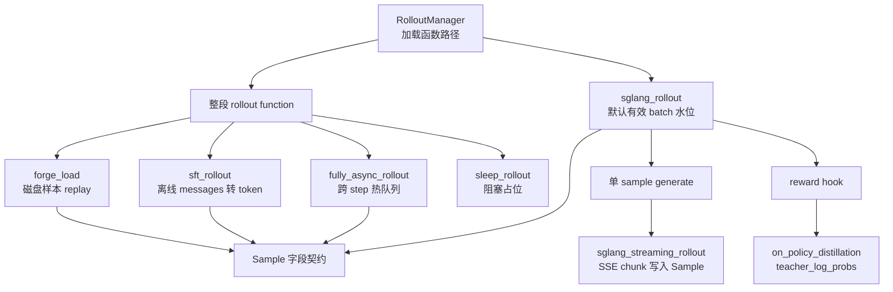

# 其他Rollout路径

## 你为什么要读

Alt Rollout 不是一套新的 rollout 架构，而是一组替换点：有的替换整段 rollout function，有的只替换单个 sample 的生成函数，有的替换 reward hook，有的从磁盘 replay 样本，有的只用于 profiling。读这个专题的关键不是记住文件名，而是判断“它替换哪一层、保留默认路径的哪些能力、丢掉哪些默认能力”。

读完本专题，读者应该能回答四类问题：什么时候用 fully-async，什么时候只接 streaming generate；SFT 为什么也走 rollout function；OPD 的学习信号为什么不是标量 reward；forge load 与 debug rollout data 为什么不是一回事。

## 替换层级地图



## 先选替换层

| 目标 | 应该替换 | 还保留什么 | 主要代价 |
|------|----------|------------|----------|
| 让 rollout 与训练 step 重叠 | `train_async.py` + `fully_async_rollout.generate_rollout_fully_async` | `generate_and_rm_group`、custom generate、custom RM | 不支持 eval/colocate；不继承默认 filter/metrics；当前超额 drain 会丢 group |
| 在 abort 前保存流式 partial token | `--custom-generate-function-path generate_streaming` | 默认水位、semaphore、dynamic filter、partial 回灌 | 依赖 SGLang cumulative SSE 语义 |
| 做 SFT | `sft_rollout.generate_rollout` | RolloutManager、训练后端、checkpoint/logging | 不走在线生成和 RM |
| 做 OPD | custom RM + reward post-process | 默认生成主线 | reward 里要写入 `teacher_log_probs` |
| 复用磁盘样本测显存 | `forge_load.generate_rollout` | SGLang server 生命周期、权重更新/offload | 不评估生成质量 |
| 单独 profile train 等待 | `sleep_rollout.sleep` | Ray 调用形状 | 永不返回，不能用于训练完成路径 |

## 阅读顺序

| 文档 | 读者任务 |
|------|----------|
| [[Slime-其他Rollout路径-核心概念]] | 建立替换层级、热队列、SSE partial、SFT 数据转换、OPD teacher logprob、forge replay 的心理模型 |
| [[Slime-其他Rollout路径-源码走读]] | 沿一次 fully-async 训练和几个替代分支看源码如何保持 Sample 契约 |
| [[Slime-其他Rollout路径-数据流]] | 对比 sync、train_async、fully-async、streaming、SFT、OPD、forge 的对象边界 |
| [[Slime-其他Rollout路径-排障指南]] | 按症状排查配置选错、eval 报错、partial 丢失、SFT mask、OPD reward、forge rollout_id |
| [[Slime-其他Rollout路径-学习检查]] | 用可执行清单验收是否能选择和改造替代 rollout |

## 源码范围

| 文件 | 作用 |
|------|------|
| `slime/ray/rollout.py` | RolloutManager 加载 rollout function 并消费返回值 |
| `slime/rollout/base_types.py` | rollout function 返回契约与 legacy 包装 |
| `train_async.py` | step 间 generate/train 重叠驱动 |
| `slime/rollout/fully_async_rollout.py` | 跨 rollout 调用保温的后台 worker |
| `slime/rollout/sglang_streaming_rollout.py` | 单 sample SSE streaming generate |
| `slime/rollout/sft_rollout.py` | SFT messages 到 tokens/loss mask 转换 |
| `slime/rollout/on_policy_distillation.py` | teacher server logprob reward hook 与后处理 |
| `slime/rollout/forge_load.py` | 从磁盘加载 forged rollout dump |
| `slime/rollout/sleep_rollout.py` | profiling 用阻塞 rollout |
| `tests/test_qwen2.5_0.5B_fully_async_short.py` | fully-async 端到端 smoke test 配置 |
| `tests/test_qwen3_4B_streaming_partial_rollout.py` | streaming + partial rollout smoke test 配置 |
| `tests/gemma4/test_gemma4_sft_rollout.py` | SFT loss mask 契约测试 |

## 核心入口

```python
# 来源：slime/rollout/base_types.py L7-L26
@dataclass
class RolloutFnTrainOutput:
    samples: list[list[Sample]]
    metrics: dict[str, Any] = None


@dataclass
class RolloutFnEvalOutput:
    data: dict[str, dict[str, Any]]
    metrics: dict[str, Any] = None


def call_rollout_fn(fn, *args, evaluation: bool, **kwargs):
    output = fn(*args, **kwargs, evaluation=evaluation)

    # compatibility for legacy version
    if not isinstance(output, (RolloutFnTrainOutput, RolloutFnEvalOutput)):
        output = RolloutFnEvalOutput(data=output) if evaluation else RolloutFnTrainOutput(samples=output)

    return output
```

这段是所有替代路径的共同合同：训练最终要产出 `list[list[Sample]]`，评估最终要产出 dataset 维度的字典；旧插件可以返回裸对象，但新替代路径最好显式返回 dataclass。

## 本专题的不变量

- 整段 rollout 替换必须满足 `generate_rollout(args, rollout_id, data_source, evaluation=False)` 形状。
- 单 sample generate 替换只应该改变生成方式，不应该绕过默认 semaphore、RM、filter、abort 主线。
- fully-async 保留 `generate_and_rm_group`，但不复制默认 dynamic filter 和 oversampling 主循环。
- fully-async 的全局 worker 固定首份 args/DataSource；异常结果、失败回灌和超目标 drain 当前都可能丢 group，不能把“热队列”理解成可靠消息队列。
- streaming 只替换 HTTP 层，partial 回灌仍由默认 `sglang_rollout` 负责。
- SFT rollout 是数据转换器，不是在线生成器。
- OPD 把 teacher logprob 写到 Sample，标量 reward 可以只是兼容接口。
- SFT 与 OPD 都必须显式处理 `response_length==0`；Python 的 `seq[-0:]` 返回全序列而不是空序列。
- forge load 不能覆盖样本 `rollout_id`，否则会破坏下游 DP schedule 分组。

## 验证抓手

```powershell
$env:PYTHONPATH='F:\源码阅读\slime'
python -m pytest slime/tests/plugin_contracts/test_plugin_rollout_contracts.py -q
python -m pytest slime/tests/plugin_contracts/test_plugin_generate_contracts.py -q
python -m pytest slime/tests/gemma4/test_gemma4_sft_rollout.py -q
```

预期现象：前两组验证插件入口契约；Gemma4 SFT 测试在本机有对应 checkpoint 时验证多轮 messages 的 loss mask。fully-async 和 streaming smoke test 需要真实模型、数据、GPU 与 SGLang server，不能用轻量单测替代。
