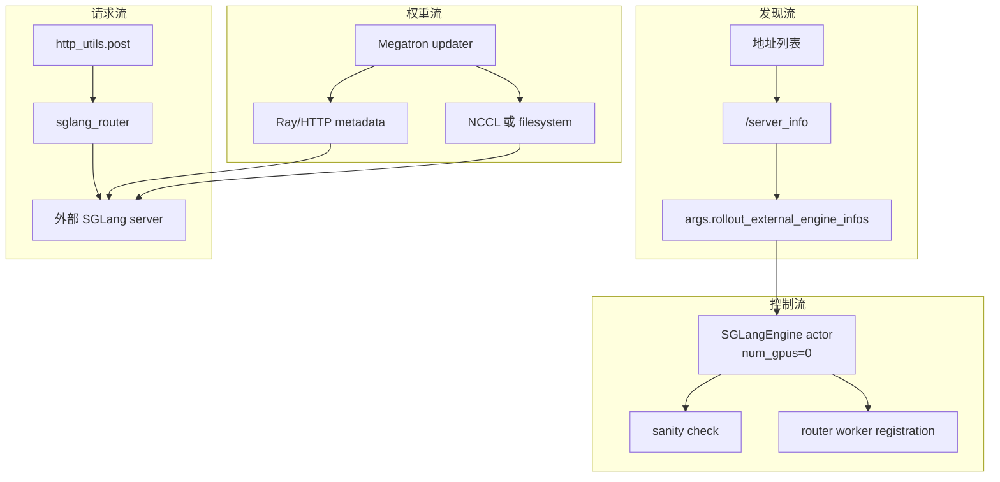

# 外部推理引擎 · 数据流

## 你为什么要读

这篇只看数据和对象穿过哪些边界。external 模式里最容易混淆的是：`rollout_num_gpus` 是发现出的逻辑容量，Ray PG 不预留这些 GPU；`SGLangEngine` actor 是控制面代理，不是外部 server 进程；generate 请求打 router，权重数据走 NCCL 或磁盘。

---

## 四条数据流



---

## 发现流：从地址到拓扑事实

| 输入 | 转换 | 输出 |
|------|------|------|
| `host:port` 或 `http://host:port` | `normalize_external_engine_addr` | HTTP base URL |
| base URL | `get_server_info` | 原始 server info dict |
| server info | `_infer_worker_type`、`tp_size * pp_size` | `ExternalEngineInfo` |
| infos | `apply_external_engine_info_to_args` | `rollout_num_engines`、`rollout_num_gpus`、`rollout_external_engine_infos` |

这个流的源码入口是 `apply_external_engine_info_to_args`。

```python
# 来源：slime/backends/sglang_utils/external.py L107-L131
def apply_external_engine_info_to_args(args, logger=None) -> None:
    """Detect external engines and store the derived topology on ``args``."""
    addrs = args.rollout_external_engine_addrs
    if not addrs:
        raise ValueError("apply_external_engine_info_to_args requires --rollout-external-engine-addrs.")

    infos = discover_external_engines(addrs)
    if not infos:
        raise ValueError("--rollout-external-engine-addrs did not contain any engines.")

    args.rollout_external_engine_infos = [info.to_dict() for info in infos]
    args.rollout_num_engines = len(infos)
    args.rollout_num_gpus = sum(info.num_gpus for info in infos)

    if logger is not None:
        summary = [
            {
                "url": info.url,
                "worker_type": info.worker_type,
                "num_gpus": info.num_gpus,
                "disaggregation_bootstrap_port": info.disaggregation_bootstrap_port,
            }
            for info in infos
        ]
        logger.info(f"Detected external SGLang engines: {summary}")
```

不变量：

- 后续模块读 `args.rollout_external_engine_infos`，不应再次猜测拓扑。
- `rollout_num_gpus` 不是 PG 资源申请量，而是 external fleet 的逻辑 serving 容量。
- server_info 不可达时应在启动早期失败。

---

## 资源流：Ray PG 不拥有 rollout GPU

external 的 PG 布局由 `rollout_external` 分支决定。普通 external 只需要训练 actor 的 GPU；纯 external rollout 调试甚至可以创建空 PG。

```python
# 来源：slime/ray/placement_group.py L100-L128
def _get_placement_group_layout(args) -> tuple[int, int]:
    actor_num_gpus = args.actor_num_nodes * args.actor_num_gpus_per_node

    if args.debug_train_only:
        return actor_num_gpus, 0

    if args.rollout_external:
        if args.debug_rollout_only:
            return 0, 0
        return actor_num_gpus, actor_num_gpus

    if args.debug_rollout_only:
        return args.rollout_num_gpus, 0

    if args.colocate:
        return max(actor_num_gpus, args.rollout_num_gpus), 0

    return actor_num_gpus + args.rollout_num_gpus, actor_num_gpus


def create_placement_groups(args):
    """Create placement groups for actor, critic, and rollout engines."""

    num_gpus, rollout_offset = _get_placement_group_layout(args)

    logger.info(f"Creating placement group with {num_gpus} GPUs...")
```

测试把两种 external 资源语义固定下来。

```python
# 来源：slime/tests/test_placement_group.py L30-L50
@pytest.mark.parametrize(
    ("overrides", "expected"),
    [
        pytest.param({}, (48, 16), id="normal_non_colocate"),
        pytest.param({"rollout_external": True}, (16, 16), id="external"),
        pytest.param({"rollout_external": True, "debug_rollout_only": True}, (0, 0), id="external_debug_rollout"),
    ],
)
def test_placement_group_layout(overrides, expected):
    assert _get_placement_group_layout(_args(**overrides)) == expected


def test_create_zero_gpu_placement_group_is_empty():
    assert _create_placement_group(0) == (None, [], [])
```

排障时，如果 Ray 在等 rollout GPU，说明你看的不是 external PG 分支，或参数还没正确设置 `rollout_external`。

---

## 控制流：zero GPU actor 接管外部 server

`start_external_rollout_servers` 创建的是控制面 actor。它不占 GPU，只保存每个 external engine 的逻辑 GPU 数和 offset，再调用 `engine.init.remote` 完成 sanity check 与 router 注册。

```python
# 来源：slime/backends/sglang_utils/external.py L184-L217
infos = external_engine_infos_from_args(args)
router_ip, router_port = start_router(args, has_pd_disaggregation=any(info.is_pd_worker for info in infos))
args.sglang_router_ip = router_ip
args.sglang_router_port = router_port

engines = []
engine_gpu_counts = []
engine_gpu_offsets = []
init_handles = []
RolloutRayActor = ray.remote(SGLangEngine)
gpu_offset = 0
for rank, info in enumerate(infos):
    rollout_engine = RolloutRayActor.options(
        num_cpus=0.2,
        num_gpus=0,
        runtime_env={"env_vars": add_default_ray_env_vars()},
    ).remote(
        args=args,
        rank=rank,
        worker_type=info.worker_type,
        base_gpu_id=0,
        num_gpus_per_engine=info.num_gpus,
    )
    engines.append(rollout_engine)
    engine_gpu_counts.append(info.num_gpus)
    engine_gpu_offsets.append(gpu_offset)
    gpu_offset += info.num_gpus
    init_handles.append(
        rollout_engine.init.remote(
            **external_engine_init_kwargs(info),
            router_ip=router_ip,
            router_port=router_port,
        )
    )
```

这条流里有两个对象容易混：

- `engine_gpu_counts` 用于权重同步和逻辑容量。
- `num_gpus=0` 是 Ray actor 资源申请，不是 external server 的实际 GPU 数。

---

## router 流：PD worker 由 discovery 驱动

external server 的 `worker_type` 来自 `server_info`。只要任一 worker 是 prefill 或 decode，Slime 启动 router 时就启用 PD 模式。

```python
# 来源：slime/backends/sglang_utils/external.py L24-L29
@property
def is_pd_worker(self) -> bool:
    return self.worker_type in ("prefill", "decode")

def to_dict(self) -> dict:
    return dataclasses.asdict(self)
```

```python
# 来源：slime/ray/rollout.py L1048-L1056
if has_pd_disaggregation:
    router_args.pd_disaggregation = True
    # Disable circuit breaker to prevent RDMA transfer timeouts from
    # marking decode workers as dead. Timeouts are transient (PCIe
    # contention under high load) and do not indicate a dead server.
    router_args.disable_circuit_breaker = True

# We will not use the health check from router.
router_args.disable_health_check = True
```

prefill worker 注册还要依赖 discovery 得到的 bootstrap port。

```python
# 来源：slime/backends/sglang_utils/external.py L46-L55
def external_engine_init_kwargs(info: ExternalEngineInfo) -> dict:
    init_kwargs = {
        "dist_init_addr": f"{info.host}:{info.port}",
        "nccl_port": None,
        "host": info.host,
        "port": info.port,
    }
    if info.worker_type == "prefill":
        init_kwargs["disaggregation_bootstrap_port"] = info.disaggregation_bootstrap_port
    return init_kwargs
```

---

## generate 流：请求走 router，不走 actor forward

external 模式下，`SGLangEngine` actor 不是 generate 数据面。rollout 函数通过 `http_utils.post` 发 HTTP 请求，目标通常是 router。

```python
# 来源：slime/utils/http_utils.py L165-L198
async def _post(client, url, payload, max_retries=60, headers=None):
    retry_count = 0
    while retry_count < max_retries:
        response = None
        try:
            response = await client.post(url, json=payload or {}, headers=headers)
            response.raise_for_status()
            content = await response.aread()
            try:
                output = json.loads(content)
            except json.JSONDecodeError:
                output = content.decode() if isinstance(content, bytes) else content
        except Exception as e:
            retry_count += 1

            if isinstance(e, httpx.HTTPStatusError):
                response_text = e.response.text
            else:
                response_text = None

            logger.info(
                f"Error: {e}, retrying... (attempt {retry_count}/{max_retries}, url={url}, response={response_text})"
            )
            if retry_count >= max_retries:
                logger.info(f"Max retries ({max_retries}) reached, failing... (url={url})")
                raise e
            await asyncio.sleep(1)
            continue
        finally:
            if response is not None:
                await response.aclose()
        break

    return output
```

HTTP client 的连接池按 discovery 得到的 engine 数扩容。

```python
# 来源：slime/utils/http_utils.py L201-L226
def get_rollout_num_engines(args) -> int:
    """Return the number of rollout HTTP engines behind the router."""
    if (num_engines := getattr(args, "rollout_num_engines", None)) is not None:
        return int(num_engines)

    rollout_num_gpus = getattr(args, "rollout_num_gpus", None) or 0
    rollout_num_gpus_per_engine = getattr(args, "rollout_num_gpus_per_engine", None) or 1
    if rollout_num_gpus <= 0:
        return 0
    return max(1, rollout_num_gpus // rollout_num_gpus_per_engine)


def init_http_client(args):
    """Initialize HTTP client and optionally enable distributed POST via Ray."""
    global _http_client, _client_concurrency, _distributed_post_enabled
    num_engines = get_rollout_num_engines(args)
    if num_engines <= 0:
        return

    _client_concurrency = args.sglang_server_concurrency * num_engines
    if _http_client is None:
        _http_client = httpx.AsyncClient(
            limits=httpx.Limits(max_connections=_client_concurrency),
            timeout=httpx.Timeout(None),
            trust_env=False,
        )
```

---

## 权重流：metadata 仍经 adapter，数据通道按部署选

| 路径 | 控制面 | 数据通道 | external 部署含义 |
|------|--------|----------|-------------------|
| full + nccl | actor POST update metadata | NCCL group | 训练和 serving 必须网络/NCCL 互通 |
| full + disk | actor POST checkpoint path | 共享文件系统 | 最简单兜底，写完整 HF checkpoint |
| delta + disk | actor POST patched local checkpoint | 共享 delta 目录 + host 本地 checkpoint | 大模型跨集群更常用 |

官方文档给出的部署规则强调共享路径和 external lifecycle。

```markdown
# 来源：slime/docs/en/advanced/external-rollout-engines.md L95-L101
- External engine HTTP addresses must be reachable from the training job.
- External engines can use an independent SGLang environment; they do not need the slime or Megatron training environment.
- Disk transport supports different GPU models or vendors between training and rollout, as long as SGLang supports the target hardware and model format.
- Disk transport requires trainer and SGLang engines to see the same `--update-weight-disk-dir` path; a path visible only to the trainer is not enough.
- External engines are not recovered by slime fault tolerance; their lifecycle belongs to the external deployment system.
- `--sglang-config` and `--rollout-external-engine-addrs` are mutually exclusive.
- Delta mode does not support `--colocate`, because colocated sync uses CUDA IPC handles and delta encoding does not reduce the actual transfer.
```

E2E external PD 测试选择 delta + disk，因为预启动 worker 和 trainer 没有可用的 NCCL 组。

```python
# 来源：slime/tests/test_qwen3_4B_external_pd.py L322-L328
delta_args = (
    "--update-weight-mode delta "
    "--update-weight-transport disk "
    "--update-weight-encoding deltas "
    f"--update-weight-disk-dir {delta_dir} "
    "--update-weight-delta-keep-files "
)
```

---

## 健康与恢复流：external 是空操作边界

`ExternalRolloutServer` 不填 server groups，所以 `RolloutManager` 不会为它创建 `RolloutHealthMonitor`；recover/offload/onload 也都是 no-op 或 warning。

```python
# 来源：slime/backends/sglang_utils/external.py L152-L165
def recover(self):
    logger.warning("Fault tolerance is not supported for external rollout engines; skip recover.")

def offload(self):
    return []

def onload(self, tags: list[str] | None = None):
    return []

def onload_weights(self):
    return []

def onload_kv(self):
    return []
```

健康检查类仍然存在，但它服务的是 Slime-owned server group。

```python
# 来源：slime/utils/health_monitor.py L145-L158
def _check_engine_health(self, rollout_engine_id, engine) -> None:
    if engine is None:
        logger.info(f"Skipping health check for engine {rollout_engine_id} (None)")
        return

    try:
        ray.get(engine.health_generate.remote(timeout=self._check_timeout))
    except Exception as e:
        logger.error(
            f"Health check failed for rollout engine {rollout_engine_id} (ray timeout or error). Killing actor. Exception: {e}"
        )
        self._kill_engine(rollout_engine_id=rollout_engine_id)
    else:
        logger.debug(f"Health check passed for rollout engine {rollout_engine_id}")
```

排障结论：external server 的进程健康要接外部监控；Slime 的 retry 只能缓冲短暂 HTTP 抖动。

---

## 网络流：proxy 和 host 地址

external server 与训练 job 常跨节点或跨集群，proxy 环境很容易劫持内部 HTTP。E2E 测试显式给 external host 加 `no_proxy`。

```python
# 来源：slime/tests/test_qwen3_4B_external_pd.py L355-L364
U.execute_train(
    train_args=train_args,
    num_gpus_per_node=NUM_TRAIN_GPUS,
    megatron_model_type=MODEL_TYPE,
    before_ray_job_submit=launch_external_engines,
    extra_env_vars={
        "no_proxy": f"127.0.0.1,localhost,{external_host}",
        "NO_PROXY": f"127.0.0.1,localhost,{external_host}",
    },
)
```

Slime 侧 `httpx.AsyncClient` 也禁用了 `trust_env`，用于内部 SGLang 通信。

---

## 数据流复盘

1. discovery 产物是 external 模式的拓扑事实，后续模块只消费它。
2. Ray PG 资源流和 external serving 容量是两套账。
3. zero GPU adapter 让 Slime 复用 engine 控制接口，但不拥有 server 进程。
4. generate 数据面走 router；权重数据通道根据 NCCL 或 disk 单独选择。
5. recover/offload/onload 在 external server 上没有 Slime-owned 实现。
