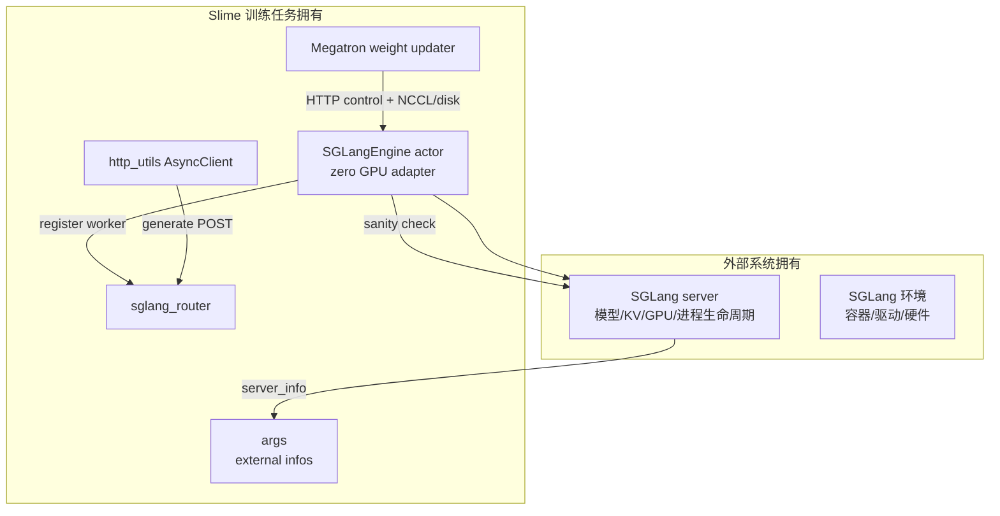
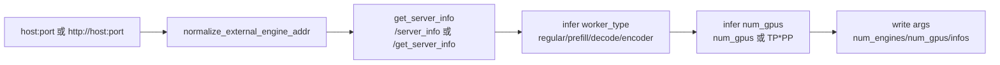

# 外部推理引擎 · 核心概念

本页先回答 external engine 解决什么部署问题。读完后，你应该能判断什么时候让 Slime 启动 SGLang，什么时候只连接外部已经运行的 engine，以及这种拆分会如何影响 router、Ray adapter、generate HTTP 和权重同步。

external engine 的核心不是“少启动几个进程”，而是把训练系统和推理系统的所有权拆开：外部系统拥有 SGLang server 的进程、环境、GPU 和重启；Slime 只保留发现、router、Ray adapter、generate HTTP 与权重同步控制面。

---

## 先建立模型



这张图里最重要的分界线是：Slime 通过 HTTP 和可选的数据通道控制外部 server，但不负责创建、杀掉、offload 或 recover 这些外部进程。

---

## 与 `--sglang-config` 的选择

| 需求 | 用 external engine | 用 `--sglang-config` |
|------|--------------------|----------------------|
| SGLang 已由另一个平台预启动 | 适合 | 不适合 |
| Slime 需要 launch 和 recover engine | 不适合 | 适合 |
| 推理环境和训练环境不同 | 适合，尤其 disk transport | 不适合 |
| 需要多模型、冻结 reference/reward、复杂 server groups | 当前 external 只按 default server 包装，优先不用 | 适合 |
| trainer 与 serving 不能建 NCCL | external + disk/delta | 也可 disk，但仍由 Slime 管 server |
| 想复用 PD prefill/decode 外部 server | 适合，但要 server_info 暴露正确 worker type 和 bootstrap port | 适合，YAML 明确声明 |

官方路线图也把 external 定位为：server 已经在训练任务外部运行，Slime 连接它们、注册 router，并按选定权重同步方式推新权重。

```markdown
# 来源：slime/docs/en/advanced/external-rollout-engines.md L3-L5
An external rollout engine is an SGLang engine that is not launched by the slime training job. Another system deploys and owns the engine lifecycle; slime connects to those engines during training, registers a router, and syncs updated actor weights when needed.

This page is a roadmap. Use it to decide when to use `--rollout-external-engine-addrs`, when to stay with `--sglang-config`, and which weight-update path to pick for external deployments.
```

---

## 五个核心对象

| 对象 | 职责 | 不归它管的事 |
|------|------|--------------|
| `ExternalEngineInfo` | 保存单个外部 server 的 URL、host、port、worker type、GPU 数和原始 `server_info` | 不验证权重路径是否可见 |
| `apply_external_engine_info_to_args` | 把发现结果写回 `args.rollout_num_engines`、`args.rollout_num_gpus` 等字段 | 不启动 router 或 actor |
| `ExternalRolloutServer` | 以 `RolloutServer` 近似接口暴露 engines、GPU counts、router 地址 | 不 recover、不 offload、不 onload |
| `SGLangEngine` actor | zero GPU 控制面 adapter，做 sanity check 和 router 注册 | 不 launch 外部 server |
| `http_utils` | generate/RM 等请求的共享异步 HTTP 通道 | 不决定 worker 拓扑 |

源码中的 `ExternalEngineInfo` 是不可变 dataclass，说明 discovery 结果被当作拓扑事实使用。

```python
# 来源：slime/backends/sglang_utils/external.py L14-L29
@dataclasses.dataclass(frozen=True)
class ExternalEngineInfo:
    url: str
    host: str
    port: int
    worker_type: str
    num_gpus: int
    disaggregation_bootstrap_port: int | None = None
    server_info: dict = dataclasses.field(default_factory=dict)

    @property
    def is_pd_worker(self) -> bool:
        return self.worker_type in ("prefill", "decode")

    def to_dict(self) -> dict:
        return dataclasses.asdict(self)
```

---

## discovery 的心理模型

external discovery 像一次入场验票：用户给的是地址，Slime 不能信任地址背后一定是期望的 SGLang 角色，所以要请求 `server_info`，再推导 worker 类型和 GPU 数。



`discover_external_engines` 的推导规则很窄：GPU 数优先读 `num_gpus` 或 `num_gpus_per_engine`，否则用 `tp_size * pp_size`。fallback 不乘 `dp_size`，也不根据 `ep_size` 修正，所以它只是当前代码的缺省计数规则，不是复杂并行拓扑的物理 GPU 总数证明。生产部署应显式返回总 GPU 数。

```python
# 来源：slime/backends/sglang_utils/external.py L79-L104
def discover_external_engines(addrs: list[str], timeout: float = 30.0) -> list[ExternalEngineInfo]:
    infos = []
    for addr in addrs:
        url = normalize_external_engine_addr(addr)
        parsed = urlparse(url)
        assert parsed.hostname is not None and parsed.port is not None
        server_info = get_server_info(url, timeout=timeout)

        pp_size = int(server_info.get("pp_size") or server_info.get("pipeline_parallel_size") or 1)
        tp_size = int(server_info.get("tp_size") or server_info.get("tensor_parallel_size") or 1)
        num_gpus = int(server_info.get("num_gpus") or server_info.get("num_gpus_per_engine") or tp_size * pp_size)
        bootstrap_port = server_info.get("disaggregation_bootstrap_port")
        bootstrap_port = int(bootstrap_port) if bootstrap_port is not None else None

        infos.append(
            ExternalEngineInfo(
                url=url,
                host=parsed.hostname,
                port=parsed.port,
                worker_type=_infer_worker_type(server_info),
                num_gpus=num_gpus,
                disaggregation_bootstrap_port=bootstrap_port,
                server_info=server_info,
            )
        )
    return infos
```

测试把这个模型固定下来：`tp_size=4`、`pp_size=2` 时，如果 server 没显式给 `num_gpus`，Slime 推导出 8 张 GPU；测试里的 `dp_size=1`，并未证明 DP>1 时仍正确。

```python
# 定位骨架（非逐行摘录）：slime/tests/test_external_sglang_engines.py L30-L58
def test_discover_external_engines_reads_server_info(monkeypatch):
    def fake_get(url, timeout):
        assert timeout == 30.0
        assert url == "http://host1:10090/server_info"
        return _Response(
            {
                "tp_size": 4,
                "pp_size": 2,
                "dp_size": 1,
                "ep_size": 4,
                "disaggregation_mode": "null",
            }
        )

    monkeypatch.setattr("slime.backends.sglang_utils.external.requests.get", fake_get)

    infos = discover_external_engines(["host1:10090"])

    assert len(infos) == 1
    info = infos[0]
    assert info.worker_type == "regular"
    assert info.num_gpus == 8
```

---

## discovery 不是拓扑校验器

发现阶段逐项保留用户地址，没有去重，也没有验证 PD 两侧成对。它还用 Python truthiness 解释 `encoder_only`：JSON boolean `false` 是普通 worker，但字符串 `"false"` 反而是真值，会被误判成 encoder。因此 `/server_info` 是一份需要严格 schema 的控制面契约，不是“有字段就行”的松散元数据。

| 输入边界 | 当前行为 | 部署要求 |
|----------|----------|----------|
| 重复 URL | 重复计 engine/GPU，重复创建 adapter 与注册 | Slime 启动前规范化并去重 |
| 只有 prefill 或只有 decode | `any(is_pd_worker)` 仍会启动 PD Router | 外围校验两侧至少各有一个 worker |
| `encoder_only="false"` | 字符串为真，推断为 encoder | 返回真正 JSON boolean |
| 一次 discovery | 后续 `_init_external` 再请求一次 server info | 启动窗口内保持配置稳定 |

更隐蔽的边界是地址顺序。每个地址只创建一个 adapter，但 adapter 的列表 `rank` 会复用 managed engine 的多节点公式：`nnodes=num_gpus//num_gpus_per_node`，`node_rank=rank%nnodes`。Router 注册和多数控制请求只允许 `node_rank==0`。于是当一个地址报告的 GPU 数跨节点时，第二个地址可能得到 `node_rank=1`，虽然 discovery 成功，却不注册、也不真正发送控制请求。当前代码没有证明“external 地址序号就是该 engine 的节点序号”；生产验收必须逐 URL 查看 Router worker，而不能只看发现日志。

---

## PG 布局：逻辑 GPU 数不等于 Ray 预留 GPU

external discovery 会写 `args.rollout_num_gpus`，但 Placement Group 不因此为 rollout 预留 GPU。普通 external 只创建 actor GPU 数；`debug_rollout_only + external` 甚至创建 0 GPU PG。

```python
# 来源：slime/ray/placement_group.py L100-L117
def _get_placement_group_layout(args) -> tuple[int, int]:
    actor_num_gpus = args.actor_num_nodes * args.actor_num_gpus_per_node

    if args.debug_train_only:
        return actor_num_gpus, 0

    if args.rollout_external:
        if args.debug_rollout_only:
            return 0, 0
        return actor_num_gpus, actor_num_gpus

    if args.debug_rollout_only:
        return args.rollout_num_gpus, 0

    if args.colocate:
        return max(actor_num_gpus, args.rollout_num_gpus), 0

    return actor_num_gpus + args.rollout_num_gpus, actor_num_gpus
```

对应单测明确了 external 的期望布局。

```python
# 定位骨架（非逐行摘录）：slime/tests/test_placement_group.py L30-L50
@pytest.mark.parametrize(
    ("overrides", "expected"),
    [
        pytest.param({"rollout_external": True}, (16, 16), id="external"),
        pytest.param({"rollout_external": True, "debug_rollout_only": True}, (0, 0), id="external_debug_rollout"),
    ],
)
def test_placement_group_layout(overrides, expected):
    assert _get_placement_group_layout(_args(**overrides)) == expected

def test_create_zero_gpu_placement_group_is_empty():
    assert _create_placement_group(0) == (None, [], [])
```

---

## 权重同步选型

| 条件 | 推荐路径 | 原因 |
|------|----------|------|
| trainer 与 external engine 能建稳定 NCCL | full + nccl | tensor 不经文件系统，延迟低 |
| 跨集群、防火墙、NCCL 不通 | full + disk | 只要求共享文件系统和 HTTP |
| 大模型、跨 DC、完整 checkpoint 太重 | delta + disk | 只传差量，external server 仍通过普通 disk reload 接口加载 |
| serving GPU 与训练 GPU 型号或厂商不同 | disk 或 delta disk | 规避 NCCL 和硬件同构要求 |
| colocate 模式 | 不应与 external 混为一谈 | external 不归训练 PG 管，colocate 是共享同一 GPU 池 |

官方文档强调 disk transport 的边界：训练侧和 external engine 必须看到同一路径，路径只在 trainer 可见不够。

```markdown
# 来源：slime/docs/en/advanced/external-rollout-engines.md L95-L101
- External engine HTTP addresses must be reachable from the training job.
- External engines can use an independent SGLang environment; they do not need the slime or Megatron training environment.
- Disk transport supports different GPU models or vendors between training and rollout, as long as SGLang supports the target hardware and model format.
- Disk transport requires trainer and SGLang engines to see the same `--update-weight-disk-dir` path; a path visible only to the trainer is not enough.
- External engines are not recovered by slime fault tolerance; their lifecycle belongs to the external deployment system.
- `--sglang-config` and `--rollout-external-engine-addrs` are mutually exclusive.
- Delta mode does not support `--colocate`, because colocated sync uses CUDA IPC handles and delta encoding does not reduce the actual transfer.
```

---

## 失败边界

| 失败 | 谁负责修 |
|------|----------|
| 外部 server 进程挂掉 | 外部编排系统 |
| 外部 server 的 `/server_info` 不可达 | 部署网络、proxy、server 版本 |
| router 注册失败 | Slime adapter 配置、router 版本、PD bootstrap port |
| generate 5xx 或连接 reset | 先看 external server 和 router，再看 http client retry |
| disk path 只在 trainer 可见 | 部署系统和共享文件系统 |
| new weight 版本不一致 | Slime updater、external server update endpoint、权重路径 |
| shutdown 后 Router 仍保留 worker | external shutdown 不执行注销；重建训练侧 Router，或由外围显式协调 worker 生命周期 |
