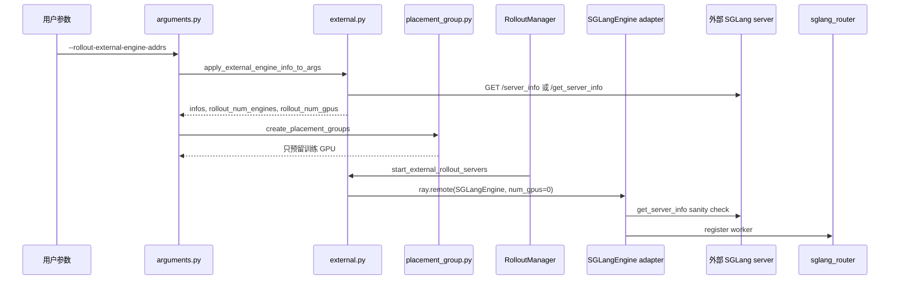

# 外部推理引擎 · 源码走读

这篇追踪一条真实主线：外部系统已经启动了一组 SGLang server，用户把地址传给 Slime，Slime 如何把它们接入 rollout 闭环。

读完后，读者应该能解释三件事：Slime 什么时候访问外部 server；为什么 external 模式不占 rollout GPU；外部 server 既然不归 Slime launch，为什么后续仍能 generate 和 update weights。

---

## 读者任务

| 你遇到的问题 | 本文要帮你定位到 |
|--------------|------------------|
| 传了地址但 Slime 没识别 external | `arguments.py` 的 external 开关与 discovery 触发 |
| `/server_info` 探测失败 | 地址规范化、fallback endpoint、proxy/no_proxy |
| Ray 还在等 rollout GPU | `placement_group.py` 的 external 布局 |
| router 没有 external worker | `start_external_rollout_servers` 与 `_init_external` |
| generate 并发打不上去 | `http_utils.init_http_client` 的 engine 数和连接池 |
| update 权重路径选错 | NCCL、full disk、delta disk 的部署边界 |

---

## 长文读法

这篇按 external rollout 的接入链路读：用户只传外部 SGLang 地址，Slime 先通过 `/server_info` 探测出拓扑，再把结果写回 `args`；Placement Group 因此只给训练侧预留 GPU；RolloutManager 后续创建 zero GPU 的 `SGLangEngine` adapter，由 adapter 做 sanity check、注册 router，并把外部 server 接入 generate / update weights 的数据面。

| 读者任务 | 先读 | 要抓住的判断 |
|----------|------|--------------|
| 第一次建立 external 全景 | 主线图、1 到 5 | external 的关键不是 launch server，而是把已存在 server 的拓扑变成 Slime 内部参数 |
| 排查地址或 `/server_info` 失败 | 1 到 4 | 地址先规范化，再依次尝试 `/server_info` 和 `/get_server_info`，返回值决定 worker type、GPU 数和 PD bootstrap |
| 判断 GPU 为什么没有给 rollout 预留 | 6 到 7 | external 不能和 Slime-managed 拓扑混用，PG 只覆盖训练侧资源 |
| 排查 router 没有外部 worker | 8 到 10 | zero GPU adapter 不是服务进程，它负责校验外部 server args 并向 router 注册 worker |
| 排查 generate 并发或 proxy 影响 | 11 | HTTP client 并发按 rollout engine 数放大，并明确不走系统代理 |
| 判断 recover 和权重更新边界 | 12 到 13 | 外部进程不归 Slime recover；预启动 worker 的权重同步要看部署形态，PD 测试覆盖的是 disk delta 路径 |
| 验证 external PD 端到端形态 | 13 | 训练 GPU 与外部 SGLang GPU 分开，地址和 GPU 数由外部进程暴露的信息推导 |

读的时候不要把 external adapter 理解成“又启动了一套 engine”。它更像 Slime 控制面里的代理对象：占 Ray actor 名额，但不占 rollout GPU，也不拥有外部进程生命周期。

---

## 主线图



---

## 1. 用户传的是地址，Slime 需要主动发现拓扑

系统压力：外部 server 的 TP、PP、worker type、GPU 数不在 Slime YAML 里。只保存地址不够，后续 HTTP 并发、权重 rank、router PD 注册都需要结构化拓扑。

设计选择：CLI 只接收地址列表；参数收尾阶段把 `rollout_external` 标成真，并在非 train-only 模式下立即访问外部 server。

```python
# 来源：slime/utils/arguments.py L555-L561
parser.add_argument(
    "--rollout-external-engine-addrs",
    type=str,
    default=None,
    nargs="+",
    help="Address and ports of the external engines.",
)
```

```python
# 来源：slime/utils/arguments.py L1851-L1854
args.rollout_external = args.rollout_external_engine_addrs is not None

if args.rollout_external and not args.debug_train_only:
    apply_external_engine_info_to_args(args, logger=logger)
```

执行逻辑：

- `None` 和空列表语义不同：没有传参数时不进入 external；传了但没有地址会在 discovery 层报错。
- `debug_train_only` 跳过 discovery，因为训练调试不需要启动 rollout server。
- discovery 发生在创建 Placement Group 之前，所以 PG 能基于 external 模式决定不预留 rollout GPU。

---

## 2. 地址规范化是第一道输入边界

系统压力：用户可能传 `host:port`，也可能传 `http://host:port/`；IPv6 必须带括号，否则 URL 解析会歧义。

设计选择：`normalize_external_engine_addr` 统一成无尾斜杠的 HTTP base URL，并要求 scheme、hostname、port 都存在。

```python
# 来源：slime/backends/sglang_utils/external.py L32-L44
def normalize_external_engine_addr(addr: str) -> str:
    """Normalize ``host:port`` or ``http://host:port`` to an HTTP base URL."""
    if "://" not in addr:
        addr = f"http://{addr}"
    addr = addr.rstrip("/")
    parsed = urlparse(addr)
    if parsed.scheme != "http" or parsed.hostname is None or parsed.port is None:
        raise ValueError(
            f"Invalid external SGLang engine address {addr!r}. "
            "Use host:port or http://host:port (IPv6 must be bracketed)."
        )
    return addr
```

不变量与失败模式：

- external 只接受 HTTP base URL，不接受 OpenAI API path。
- IPv6 地址要写成 `http://[addr]:port`。
- 地址规范化失败时，Slime 还没开始 Ray 编排。

---

## 3. `/server_info` 是 external 的拓扑来源

系统压力：SGLang 版本可能暴露 `/server_info` 或 `/get_server_info`，Slime 需要兼容两种 endpoint，但不能在完全失败时继续启动。

设计选择：`get_server_info` 依次尝试两个 endpoint，收集错误，全部失败后抛异常。

```python
# 来源：slime/backends/sglang_utils/external.py L58-L67
def get_server_info(url: str, timeout: float = 30.0) -> dict:
    errors = []
    for endpoint in ("/server_info", "/get_server_info"):
        try:
            response = requests.get(f"{url}{endpoint}", timeout=timeout)
            response.raise_for_status()
            return response.json()
        except Exception as exc:
            errors.append(f"{endpoint}: {exc}")
    raise RuntimeError(f"Failed to fetch SGLang server info from {url}: {'; '.join(errors)}")
```

执行逻辑：

- 先试新旧兼容 endpoint。
- 只返回 JSON dict，不在这里判断 worker type 或 GPU 数。
- 完全失败要 fail fast，因为后续并发、PG 和权重同步都依赖这个拓扑。

运行验证：external server 启动后手动请求 `http://host:port/server_info`，应能看到 `tp_size`、`pp_size`、`disaggregation_mode` 等字段。

---

## 4. discovery 把 server_info 转成 `ExternalEngineInfo`

系统压力：router 需要 worker type；HTTP client 需要 engine 数；权重同步需要每个 engine 的 GPU 数；PD prefill 还需要 bootstrap port。

设计选择：`discover_external_engines` 保留原始 `server_info`，同时推导 `worker_type`、`num_gpus` 和 `disaggregation_bootstrap_port`。

```python
# 来源：slime/backends/sglang_utils/external.py L70-L104
def _infer_worker_type(server_info: dict) -> str:
    if server_info.get("encoder_only"):
        return "encoder"
    mode = server_info.get("disaggregation_mode")
    if mode in ("prefill", "decode"):
        return mode
    return "regular"


def discover_external_engines(addrs: list[str], timeout: float = 30.0) -> list[ExternalEngineInfo]:
    infos = []
    for addr in addrs:
        url = normalize_external_engine_addr(addr)
        parsed = urlparse(url)
        assert parsed.hostname is not None and parsed.port is not None
        server_info = get_server_info(url, timeout=timeout)

        pp_size = int(server_info.get("pp_size") or server_info.get("pipeline_parallel_size") or 1)
        tp_size = int(server_info.get("tp_size") or server_info.get("tensor_parallel_size") or 1)
        num_gpus = int(server_info.get("num_gpus") or server_info.get("num_gpus_per_engine") or tp_size * pp_size)
        bootstrap_port = server_info.get("disaggregation_bootstrap_port")
        bootstrap_port = int(bootstrap_port) if bootstrap_port is not None else None
```

测试覆盖了 PD 场景：prefill 和 decode 被分别识别，GPU 数来自各自 server_info，prefill 的 bootstrap port 被保留。

```python
# 来源：slime/tests/test_external_sglang_engines.py L61-L106
def test_apply_external_engine_info_handles_pd(monkeypatch):
    payloads = {
        "http://prefill:10090/server_info": {
            "tp_size": 2,
            "pp_size": 1,
            "dp_size": 1,
            "ep_size": 1,
            "disaggregation_mode": "prefill",
            "disaggregation_bootstrap_port": 12090,
        },
        "http://decode:10091/server_info": {
            "tp_size": 4,
            "pp_size": 1,
            "dp_size": 2,
            "ep_size": 2,
            "disaggregation_mode": "decode",
        },
    }

    def fake_get(url, timeout):
        return _Response(payloads[url])

    monkeypatch.setattr("slime.backends.sglang_utils.external.requests.get", fake_get)
    args = Namespace(
        rollout_external=True,
        rollout_external_engine_addrs=["prefill:10090", "decode:10091"],
        rollout_num_gpus=None,
        router_pd_disaggregation=False,
    )

    apply_external_engine_info_to_args(args)

    assert args.rollout_num_gpus == 6
    assert args.rollout_num_engines == 2
    assert [info["worker_type"] for info in args.rollout_external_engine_infos] == ["prefill", "decode"]
    assert [info["num_gpus"] for info in args.rollout_external_engine_infos] == [2, 4]
    assert args.rollout_external_engine_infos[0]["disaggregation_bootstrap_port"] == 12090
```

读者抓手：PD external 注册失败时，先看 prefill server 的 `server_info` 是否带 `disaggregation_bootstrap_port`。

---

## 5. discovery 写回 args，后续模块不再重复探测

系统压力：如果每个模块都自己请求 server_info，会出现时序和一致性问题。Slime 需要一个 single source of truth。

设计选择：`apply_external_engine_info_to_args` 把 infos、engine 数和 GPU 总数写到 `args`。

```python
# 来源：slime/backends/sglang_utils/external.py L107-L131
def apply_external_engine_info_to_args(args, logger=None) -> None:
    """Detect external engines and store the derived topology on ``args``."""
    addrs = args.rollout_external_engine_addrs
    if not addrs:
        raise ValueError("apply_external_engine_info_to_args requires --rollout-external-engine-addrs.")

    infos = discover_external_engines(addrs)
    if not infos:
        raise ValueError("--rollout-external-engine-addrs did not contain any engines.")

    args.rollout_external_engine_infos = [info.to_dict() for info in infos]
    args.rollout_num_engines = len(infos)
    args.rollout_num_gpus = sum(info.num_gpus for info in infos)

    if logger is not None:
        summary = [
            {
                "url": info.url,
                "worker_type": info.worker_type,
                "num_gpus": info.num_gpus,
                "disaggregation_bootstrap_port": info.disaggregation_bootstrap_port,
            }
            for info in infos
        ]
        logger.info(f"Detected external SGLang engines: {summary}")
```

这段解释了为什么 external 模式下可以不传 `--rollout-num-gpus`：它来自外部 server 的发现结果。

---

## 6. 参数校验禁止 external 与 Slime-managed 拓扑混用

系统压力：`--prefill-num-servers` 和 `--sglang-config` 都意味着 Slime 要管理 server topology；external 地址则意味着拓扑已由外部系统给出。混用会让所有权不清。

设计选择：SGLang 参数校验阶段断言互斥。

```python
# 来源：slime/backends/sglang_utils/arguments.py L162-L173
# Mutual-exclusion checks for PD disaggregation / sglang-config.
assert not (
    getattr(args, "prefill_num_servers", None) is not None and getattr(args, "rollout_external", False)
), "prefill_num_servers cannot be set with --rollout-external-engine-addrs."

assert not (
    getattr(args, "sglang_config", None) is not None and getattr(args, "rollout_external", False)
), "sglang_config cannot be set with --rollout-external-engine-addrs."

assert not (
    getattr(args, "sglang_config", None) is not None and getattr(args, "prefill_num_servers", None) is not None
), "sglang_config and prefill_num_servers are mutually exclusive. Use server_groups in the YAML config instead."
```

读者抓手：需要 frozen reference/reward 或多模型 serving 时，不要试图把 external 地址和 `sglang_config` 拼在一起；应先决定谁拥有 server topology。

---

## 7. Placement Group 不为 external rollout 预留 GPU

系统压力：external server 已占用它自己的 GPU。如果 Slime 再在训练 Ray PG 里预留 rollout GPU，会浪费资源，甚至阻塞 Ray 调度。

设计选择：`_get_placement_group_layout` 在 external 模式下返回 `(actor_num_gpus, actor_num_gpus)`，让 rollout slice 为空。

```python
# 来源：slime/ray/placement_group.py L100-L128
def _get_placement_group_layout(args) -> tuple[int, int]:
    actor_num_gpus = args.actor_num_nodes * args.actor_num_gpus_per_node

    if args.debug_train_only:
        return actor_num_gpus, 0

    if args.rollout_external:
        if args.debug_rollout_only:
            return 0, 0
        return actor_num_gpus, actor_num_gpus

    if args.debug_rollout_only:
        return args.rollout_num_gpus, 0

    if args.colocate:
        return max(actor_num_gpus, args.rollout_num_gpus), 0

    return actor_num_gpus + args.rollout_num_gpus, actor_num_gpus
```

```python
# 来源：slime/tests/test_placement_group.py L41-L50
pytest.param({"rollout_external": True}, (16, 16), id="external"),
pytest.param({"rollout_external": True, "debug_rollout_only": True}, (0, 0), id="external_debug_rollout"),
    ],
)
def test_placement_group_layout(overrides, expected):
    assert _get_placement_group_layout(_args(**overrides)) == expected


def test_create_zero_gpu_placement_group_is_empty():
    assert _create_placement_group(0) == (None, [], [])
```

执行逻辑：

- 普通 external：PG 只有训练 GPU，rollout offset 等于 actor GPU 数。
- debug rollout only + external：训练也没有 GPU，PG 为空。
- `args.rollout_num_gpus` 仍有逻辑意义，用于并发、metrics 和权重同步 GPU count，不代表 Ray PG 资源。

---

## 8. RolloutManager 创建 zero GPU adapter，而不是 server 进程

系统压力：后续代码希望拿到 engine actor handle 来调用 pause、flush、update、profile 等控制端点；但 external server 进程已经存在，不能再 launch。

设计选择：`start_external_rollout_servers` 仍创建 `SGLangEngine` actor，但 `num_gpus=0`，并把 external info 转成 `engine.init` kwargs。

```python
# 来源：slime/backends/sglang_utils/external.py L178-L217
def start_external_rollout_servers(args, *, start_router) -> tuple[dict[str, ExternalRolloutServer], list]:
    import ray

    from slime.backends.sglang_utils.sglang_engine import SGLangEngine
    from slime.ray.utils import add_default_ray_env_vars

    infos = external_engine_infos_from_args(args)
    router_ip, router_port = start_router(args, has_pd_disaggregation=any(info.is_pd_worker for info in infos))
    args.sglang_router_ip = router_ip
    args.sglang_router_port = router_port

    engines = []
    engine_gpu_counts = []
    engine_gpu_offsets = []
    init_handles = []
    RolloutRayActor = ray.remote(SGLangEngine)
    gpu_offset = 0
    for rank, info in enumerate(infos):
        rollout_engine = RolloutRayActor.options(
            num_cpus=0.2,
            num_gpus=0,
            runtime_env={"env_vars": add_default_ray_env_vars()},
        ).remote(
            args=args,
            rank=rank,
            worker_type=info.worker_type,
            base_gpu_id=0,
            num_gpus_per_engine=info.num_gpus,
        )
        engines.append(rollout_engine)
        engine_gpu_counts.append(info.num_gpus)
        engine_gpu_offsets.append(gpu_offset)
        gpu_offset += info.num_gpus
```

```python
# 来源：slime/backends/sglang_utils/external.py L46-L55
def external_engine_init_kwargs(info: ExternalEngineInfo) -> dict:
    init_kwargs = {
        "dist_init_addr": f"{info.host}:{info.port}",
        "nccl_port": None,
        "host": info.host,
        "port": info.port,
    }
    if info.worker_type == "prefill":
        init_kwargs["disaggregation_bootstrap_port"] = info.disaggregation_bootstrap_port
    return init_kwargs
```

不变量与失败模式：

- actor 的 `base_gpu_id=0` 不表示它会占用外部 server 的 GPU；它只是满足 `SGLangEngine` 构造参数。
- `engine_gpu_counts` 来自 discovery，后续权重同步会使用。
- prefill 的 bootstrap port 必须进入 `init_kwargs`，否则 router 注册无法构建 PD payload。

---

## 9. `SGLangEngine._init_external` 是控制面接管点

系统压力：外部 server 可能不是用户以为的那个模型、并行配置或 worker 类型。Slime 必须在接入 router 前校验，而不是等 rollout 才暴露 silent mismatch。

设计选择：`_init_external` 重新请求 server info，对 `_compute_server_args` 认为必须检查的字段做一致性断言，然后注册 router。

```python
# 来源：slime/backends/sglang_utils/sglang_engine.py L184-L197
def _init_external(self, expect_server_args, external_engine_need_check_fields):
    logger.info(f"Use external SGLang engine (rank={self.rank}, expect_server_args={expect_server_args})")

    def _sanity_check_server_args(actual_server_args, expect_server_args):
        for name in external_engine_need_check_fields:
            expect_value = expect_server_args.get(name)
            actual_value = actual_server_args.get(name)
            assert (
                actual_value == expect_value
            ), f"{name=} {expect_value=} {actual_value=} {expect_server_args=} {actual_server_args=}"

    actual_server_args = get_server_info(f"http://{self.server_host}:{self.server_port}")
    _sanity_check_server_args(actual_server_args, expect_server_args)
    self._register_to_router(expect_server_args)
```

校验字段来自 `_compute_server_args`，但会跳过 host、port、rank、parallel size 等 external 特例字段。

```python
# 来源：slime/backends/sglang_utils/sglang_engine.py L625-L690
if args.use_rollout_routing_replay:
    kwargs["enable_return_routed_experts"] = True
if args.fp16:
    kwargs["dtype"] = "float16"
external_engine_need_check_fields = [k for k in kwargs.keys() if k not in _EXTERNAL_ENGINE_SKIP_CHECK_FIELDS]

server_arg_fields = dataclasses.fields(ServerArgs)
server_arg_field_names = {attr.name for attr in server_arg_fields}
unused_keys = set(kwargs.keys())
for attr in server_arg_fields:
    if worker_type == "decode" and attr.name == "enable_hierarchical_cache":
        continue
    if hasattr(args, f"sglang_{attr.name}") and attr.name not in kwargs:
        kwargs[attr.name] = getattr(args, f"sglang_{attr.name}")
    unused_keys.discard(attr.name)

return kwargs, external_engine_need_check_fields

_EXTERNAL_ENGINE_SKIP_CHECK_FIELDS = [
    "model_path",
    "trust_remote_code",
    "random_seed",
    "host",
    "port",
    "nccl_port",
    "nnodes",
    "node_rank",
    "dist_init_addr",
    "gpu_id_step",
    "base_gpu_id",
    "tp_size",
    "dp_size",
    "pp_size",
    "ep_size",
    "skip_server_warmup",
    "enable_draft_weights_cpu_backup",
    "enable_metrics",
    "mem_fraction_static",
]
```

读者抓手：sanity check 报 `expect_value` 和 `actual_value` 不一致时，不要改 Slime 代码绕过；先确认外部 server 启动参数是否和训练任务期望一致。

---

## 10. router 注册让外部 server 进入 generate 数据面

系统压力：rollout 生成请求打的是 router，不是每个 external server 地址。外部 server 发现成功后，还必须注册成 router worker。

设计选择：复用 `SGLangEngine._register_to_router`；regular/PD 走不同 payload，encoder 跳过注册。

```python
# 来源：slime/backends/sglang_utils/sglang_engine.py L204-L232
def _register_to_router(self, server_args_dict):
    if self.worker_type == "encoder":
        return

    if self.node_rank == 0 and self.router_ip and self.router_port:
        worker_url = f"http://{self.server_host}:{self.server_port}"
        if parse(sglang_router.__version__) <= parse("0.2.1"):
            assert self.worker_type == "regular", "pd disaggregation is not supported in old router."
            response = requests.post(
                f"http://{self.router_ip}:{self.router_port}/add_worker?url={worker_url}",
            )
        else:
            payload = {
                "url": worker_url,
                "worker_type": self.worker_type,
            }
            if self.worker_type == "prefill":
                bootstrap_port = server_args_dict.get("disaggregation_bootstrap_port")
                if bootstrap_port is None:
                    raise RuntimeError(
                        f"Prefill worker {worker_url} does not have disaggregation_bootstrap_port; "
                        "cannot register it to the PD router."
                    )
                payload["bootstrap_port"] = bootstrap_port
            response = requests.post(
                f"http://{self.router_ip}:{self.router_port}/workers",
                json=payload,
            )
        response.raise_for_status()
```

运行验证：启动后查 router `/workers`，应看到 external server 的 URL 和 worker type；prefill worker 应带 bootstrap port 语义。

---

## 11. HTTP client 并发按 external engine 数扩展

系统压力：external server 数来自 discovery，不来自 `rollout_num_gpus / rollout_num_gpus_per_engine` 的默认公式。HTTP client 如果仍按默认公式估算，可能低估连接数。

设计选择：`get_rollout_num_engines` 优先读取 `args.rollout_num_engines`；`init_http_client` 用它乘以 `sglang_server_concurrency` 配置连接池。

```python
# 来源：slime/utils/http_utils.py L201-L226
def get_rollout_num_engines(args) -> int:
    """Return the number of rollout HTTP engines behind the router."""
    if (num_engines := getattr(args, "rollout_num_engines", None)) is not None:
        return int(num_engines)

    rollout_num_gpus = getattr(args, "rollout_num_gpus", None) or 0
    rollout_num_gpus_per_engine = getattr(args, "rollout_num_gpus_per_engine", None) or 1
    if rollout_num_gpus <= 0:
        return 0
    return max(1, rollout_num_gpus // rollout_num_gpus_per_engine)


def init_http_client(args):
    """Initialize HTTP client and optionally enable distributed POST via Ray."""
    global _http_client, _client_concurrency, _distributed_post_enabled
    num_engines = get_rollout_num_engines(args)
    if num_engines <= 0:
        return

    _client_concurrency = args.sglang_server_concurrency * num_engines
    if _http_client is None:
        _http_client = httpx.AsyncClient(
            limits=httpx.Limits(max_connections=_client_concurrency),
            timeout=httpx.Timeout(None),
            trust_env=False,
        )
```

`trust_env=False` 是 external 部署常见问题的保护：内部 SGLang 通信不应被系统 HTTP proxy 劫持。

---

## 12. 外部进程不归 Slime recover

系统压力：Slime 可以杀掉自己启动的 SGLang 子进程并重建 actor，但 external server 由外部系统管理。Slime 不应该假装能 recover。

设计选择：`ExternalRolloutServer` 的 recover/offload/onload 都是 warning 或空操作；`SGLangEngine.shutdown` 在 external 模式下直接返回。

```python
# 来源：slime/backends/sglang_utils/external.py L135-L165
@dataclasses.dataclass
class ExternalRolloutServer:
    """Rollout server backed by pre-launched external SGLang engines."""

    engines: list
    engine_gpu_counts: list[int]
    engine_gpu_offsets: list[int]
    router_ip: str | None = None
    router_port: int | None = None
    model_name: str = "default"
    update_weights: bool = True
    num_new_engines: int = 0
    server_groups: list = dataclasses.field(default_factory=list)

    @property
    def all_engines(self):
        return self.engines

    def recover(self):
        logger.warning("Fault tolerance is not supported for external rollout engines; skip recover.")

    def offload(self):
        return []

    def onload(self, tags: list[str] | None = None):
        return []
```

```python
# 来源：slime/backends/sglang_utils/sglang_engine.py L329-L331
def shutdown(self):
    if self.args.rollout_external:
        return
```

排障结论：external server 掉线时，Slime 的 Ray actor 和 router 可能仍存在，但真正恢复必须由外部部署系统完成，然后重新注册或重启训练侧控制面。

---

## 13. E2E 测试证明 external PD 的部署形态

系统压力：纯 mock 只能证明 discovery；真正部署还要证明外部 prefill/decode server 先启动，Slime 只拿地址接入，并用 disk delta 同步权重。

测试 `test_qwen3_4B_external_pd.py` 的开头直接说明了这个场景。

```python
# 来源：slime/tests/test_qwen3_4B_external_pd.py L11-L15
Weight sync uses ``--update-weight-mode delta --update-weight-transport disk``
so the post-train sync writes sparse safetensors to a shared dir and the
external engines load them via ``update_weights_from_disk(load_format=delta)``
— that's the only sync path that actually works for pre-launched workers (no
NCCL group between trainer and external engines).
```

测试还刻意在 Ray 启动前限制训练 GPU，避免 Ray 抢 external SGLang 的 GPU。

```python
# 来源：slime/tests/test_qwen3_4B_external_pd.py L223-L225
# Restrict CUDA_VISIBLE_DEVICES to training GPUs before Ray starts so
# ray's bundle allocator doesn't try to claim the external sglang GPUs.
os.environ["CUDA_VISIBLE_DEVICES"] = ",".join(train_gpus)
```

最后，训练参数不传 rollout GPU 数，而是让 Slime 从 external server_info 推导。

```python
# 来源：slime/tests/test_qwen3_4B_external_pd.py L312-L328
# No --rollout-num-gpus / --rollout-num-gpus-per-engine: those are
# inferred from /server_info on each external engine (1 prefill +
# 1 decode, all tp=1).
all_addrs = [f"{external_host}:{port}" for port in (*PREFILL_PORTS, *DECODE_PORTS)]
external_args = "--rollout-external-engine-addrs " + " ".join(all_addrs) + " "

delta_args = (
    "--update-weight-mode delta "
    "--update-weight-transport disk "
    "--update-weight-encoding deltas "
    f"--update-weight-disk-dir {delta_dir} "
    "--update-weight-delta-keep-files "
)
```

---

## 运行验证

1. 启动外部 SGLang 后请求 `/server_info`，确认 `tp_size`、`pp_size`、`disaggregation_mode`、prefill bootstrap port。
2. 启动 Slime 后搜索日志 `Detected external SGLang engines`，确认 `rollout_num_engines` 和 `rollout_num_gpus`。
3. 查看 Placement Group 日志，external 普通训练只应创建训练 GPU 数量的 PG。
4. 请求 router `/workers`，确认 external URL 已注册。
5. 若使用 disk/delta，确认 trainer 和 external server 都能看到同一个 `update_weight_disk_dir`。
6. 若请求受 proxy 影响，设置 `no_proxy/NO_PROXY` 覆盖 external host，E2E 测试也这样做。

---

## 复盘

1. external 模式的主线从 `/server_info` 开始，不从 Ray GPU 分配开始。
2. `rollout_num_gpus` 是发现出的逻辑容量，PG 是否占 GPU要看 `placement_group.py`。
3. zero GPU `SGLangEngine` actor 让 Slime 复用控制面接口，但不拥有外部 server 进程。
4. router 注册是 generate 数据面生效的关键动作。
5. 权重同步路径必须按网络和文件系统现实选择；跨集群 external 最稳的兜底是 disk 或 delta disk。
