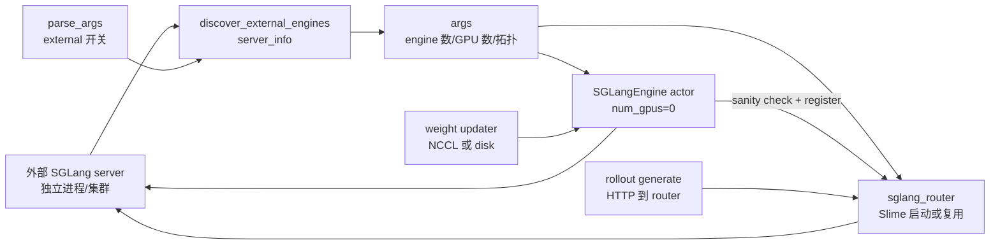

# 外部推理引擎

## 你为什么要读

这组笔记解决一个部署问题：SGLang server 已经由外部系统启动，Slime 训练任务不再占用 rollout GPU、不再 launch server，但仍要发现这些 server、注册到 router、发 generate 请求，并在训练后同步新权重。

读完后，读者应该能判断什么时候用 `--rollout-external-engine-addrs`，什么时候应该继续用 `--sglang-config`；也应该能排查 external 模式下的发现失败、重复地址计数、PD 拓扑不完整、第二个多节点地址未注册、PG 仍占 GPU、权重同步路径选错和外部 engine 不可恢复等问题。

---

## 本专题主线



external 模式的关键不是“没有 engine”，而是“engine 进程不归 Slime 拥有”。Slime 保留控制面：Ray adapter、router、HTTP client、权重更新入口；外部系统拥有 server 进程生命周期、GPU 资源和故障恢复。

---

## 阅读任务

| 读者状态 | 先读什么 | 读完要能做什么 |
|----------|----------|----------------|
| 第一次接入 external | [[Slime-外部推理引擎-核心概念]] → [[Slime-外部推理引擎-源码走读]] | 复述从地址列表到 router worker 的完整启动链 |
| 正在部署/排障 | [[Slime-外部推理引擎-排障指南]] | 从 server_info、router、PG、disk/NCCL、proxy 几类症状定位原因 |
| 准备改代码 | [[Slime-外部推理引擎-数据流]] → [[Slime-外部推理引擎-学习检查]] | 判断新增 external 拓扑字段或权重路径会影响哪些边界 |

---

## 六篇文档分工

| 文件 | 作用 |
|------|------|
| [[Slime-外部推理引擎-核心概念]] | 建立“外部 server + Slime 控制面 adapter”的模型 |
| [[Slime-外部推理引擎-源码走读]] | 按一次 external 接入主线读源码：参数、发现、PG、actor、router、HTTP client |
| [[Slime-外部推理引擎-数据流]] | 拆清 server_info、Ray actor、router worker、generate、权重同步和测试证据 |
| [[Slime-外部推理引擎-排障指南]] | 症状式排障：互斥参数、PD、proxy、recover、权重路径、GPU 占用 |
| [[Slime-外部推理引擎-学习检查]] | 可执行验收：能画图、能复述、能验证、能指出不可归 Slime 管的边界 |

---

## 源码范围

| 源码文件 | 本专题关注点 |
|----------|--------------|
| `slime/utils/arguments.py` | external 参数入口与 discovery 触发 |
| `slime/backends/sglang_utils/external.py` | 地址规范化、server_info 发现、拓扑写回 args、零 GPU adapter 创建 |
| `slime/backends/sglang_utils/sglang_engine.py` | `_init_external` sanity check、router 注册、external shutdown/simulate_crash 边界 |
| `slime/ray/placement_group.py` | external 模式 PG 只覆盖训练 GPU，不预留 rollout GPU |
| `slime/utils/http_utils.py` | generate HTTP client 连接池按 external engine 数扩展 |
| `slime/docs/en/advanced/external-rollout-engines.md` | 官方路线图：何时选 external、何时选 disk/delta |
| `slime/tests/test_external_sglang_engines.py` | mock server_info 验证拓扑推导 |
| `slime/tests/test_placement_group.py` | external PG 布局不占 rollout GPU 的单测 |
| `slime/tests/test_qwen3_4B_external_pd.py` | external PD + disk delta 的端到端部署形态 |

---

## 最小源码证据

外部地址列表只是 CLI 参数；真正切换模式发生在参数收尾阶段。只要 `rollout_external_engine_addrs` 不为 `None`，Slime 会标记 `rollout_external`，并在非 train-only 模式下主动探测外部 server。

```python
# 来源：slime/utils/arguments.py L555-L561
parser.add_argument(
    "--rollout-external-engine-addrs",
    type=str,
    default=None,
    nargs="+",
    help="Address and ports of the external engines.",
)
```

```python
# 来源：slime/utils/arguments.py L1851-L1854
args.rollout_external = args.rollout_external_engine_addrs is not None

if args.rollout_external and not args.debug_train_only:
    apply_external_engine_info_to_args(args, logger=logger)
```

`RolloutManager` 仍走统一启动入口，只是在 `start_rollout_servers` 内部切到 external 分支。

```python
# 来源：slime/ray/rollout.py L1103-L1104
if args.rollout_external:
    return start_external_rollout_servers(args, start_router=_start_router)
```

---

## 本专题先记住的八个判断

1. external 模式不是绕过 Slime rollout，而是把 SGLang server 进程生命周期移到外部。
2. `SGLangEngine` actor 仍存在，但 `num_gpus=0`，它是控制面 adapter，不是推理进程。
3. `rollout_num_gpus` 在 external 模式下是逻辑容量，用于并发与权重 rank 推导，不代表 PG 预留了这些 GPU。
4. external 默认只表示一个 default rollout model；需要多模型、冻结 reference/reward 或复杂 server group 时优先用 `--sglang-config`。
5. external 的故障恢复和 server 重启归外部系统，Slime 只负责发现、注册、发请求和同步权重。
6. 地址列表没有去重：重复地址会重复计算 engine/GPU、重复创建 adapter，并放大权重 rank 与 offset 账。
7. fallback GPU 数只按 `TP×PP` 推导，不含 DP/EP；复杂并行部署应让 `/server_info` 显式返回 `num_gpus` 或 `num_gpus_per_engine`。
8. 一地址一 adapter 不等于一地址一定注册：当前 `rank→node_rank` 复用 managed-engine 公式，多节点 external 地址可能得到 `node_rank!=0`，从而跳过 Router 注册和控制请求；PD 也只检查“存在任一 PD worker”，不验证 prefill/decode 成对。

---

## 运行验证入口

| 要验证什么 | 入口 | 预期现象 |
|------------|------|----------|
| server discovery | 外部 engine `/server_info` 或 `/get_server_info` | 返回 worker type、TP/PP/GPU 数 |
| Slime 识别 external | 日志 `Detected external SGLang engines` | engine 数与地址数一致，GPU 数来自 server_info |
| 地址与 PD 拓扑 | 对地址去重并统计 worker type | URL 唯一；prefill/decode 两侧都存在；复杂并行显式给总 GPU 数 |
| PG 不占 rollout GPU | `test_placement_group.py -k external` 或日志 PG GPU 数 | 普通 external 只创建 actor GPU 数，debug rollout external 为 0 |
| router 注册 | router `/workers` | 每个预期 regular/prefill/decode URL 都出现，prefill 有 bootstrap port；尤其核对第二个多节点地址 |
| generate 通道 | rollout 请求日志或 HTTP client metrics | 请求打 router，不打 Ray actor 做 forward |
| 权重同步 | disk/NCCL 路径日志 | external server 热加载新权重，版本与 updater 对齐 |

---

## 相邻专题

| 方向 | 专题 | 关系 |
|------|------|------|
| 上游控制台 | [[Slime-SGLang-Engine]] | `SGLangEngine._init_external` 与 router 注册共用这里的控制面 |
| 拓扑对照 | [[Slime-引擎拓扑]] | `--sglang-config` 由 Slime launch server，external 只接管外部 server |
| 默认 generate | [[Slime-SGLang-Rollout]] | 请求如何通过 router 变成 Sample |
| 权重同步 | [[Slime-分布式权重同步]]、[[Slime-磁盘权重同步]] | external 部署中 NCCL、disk、delta 怎么选 |
