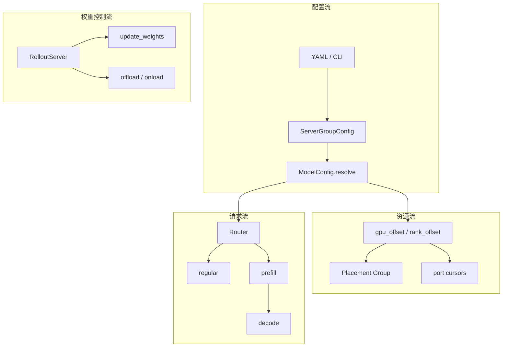

# 引擎拓扑 · 数据流

## 你为什么要读

这篇不再按函数解释源码，而是回答“拓扑实例化后，哪些对象在系统里流动”。EngineTopology 有四条数据流：配置流、资源流、请求流、权重控制流。读者排障时通常不是某个函数看不懂，而是不知道自己看到的是哪条流上的变量。

## 总览



## 1. 配置流：从 YAML 到补齐后的 group

配置流的输入是 YAML 或 CLI，输出不是进程，而是一组已经补齐默认值的 `ModelConfig.server_groups`。这个阶段只决定“要什么形状”，还不决定“落到哪张卡”。

```python
# 定位骨架（据 `slime/backends/sglang_utils/sglang_config.py` L157-L180 删节）：
for m in data["sglang"]:
    raw_groups = m.get("server_groups") or m.get("engine_groups") or []
    groups = [ServerGroupConfig(**g) for g in raw_groups]
    models.append(
        ModelConfig(
            name=m["name"],
            model_path=m.get("model_path"),
            num_gpus_per_engine=m.get("num_gpus_per_engine"),
            server_groups=groups,
            update_weights=m.get("update_weights"),
        )
    )
return SglangConfig(models=models)
```

流动后的对象会多出两个隐含事实：

- 旧字段 `engine_groups` 仍能进入新结构；新配置应使用 `server_groups`，避免继续依赖兼容入口。
- `update_weights` 可以为空，因为是否默认更新要等 `resolve(args)` 拿到 `hf_checkpoint` 后判断。

## 2. 资源流：Placement Group 先切段，ServerGroup 再切组

Ray PG 的布局先决定 actor 与 rollout 是否共用 GPU。非 colocate 时，rollout 段从 actor 段之后开始；colocate 时 rollout offset 为 0，意味着 rollout 和 Megatron 共享同一批槽位。

```python
# 定位骨架（据 `slime/ray/placement_group.py` L102-L132 删节）：
if args.debug_train_only:
    return actor_num_gpus, 0

if args.rollout_external:
    if args.debug_rollout_only:
        return 0, 0
    return actor_num_gpus, actor_num_gpus

if args.debug_rollout_only:
    return args.rollout_num_gpus, 0

if args.colocate:
    return max(actor_num_gpus, args.rollout_num_gpus), 0

return actor_num_gpus + args.rollout_num_gpus, actor_num_gpus
```

`create_placement_groups` 会把同一个 PG 切成 actor 视图和 rollout 视图。`start_rollout_servers` 里再用 `gpu_offset` 在 rollout 视图内部给每个 ServerGroup 切连续区间。

```python
# 定位骨架（据 `slime/ray/rollout.py` L1073-L1086 删节）：
def _compute_rollout_offset(args) -> int:
    if args.debug_train_only or args.debug_rollout_only or args.colocate:
        return 0
    offset = args.actor_num_nodes * args.actor_num_gpus_per_node
    return offset

def _compute_megatron_num_gpus(args) -> int:
    if args.debug_rollout_only:
        return 0
    num = args.actor_num_nodes * args.actor_num_gpus_per_node
    return num
```

排障抓手：

| 现象 | 解释 |
|------|------|
| 非 colocate 下 rollout 没有占 actor 槽 | `rollout_offset = actor_num_gpus`，PG 被切成前后两段 |
| colocate 下 `needs_offload=True` | rollout 绝对起点落在 Megatron GPU 范围内，这是预期 |
| placeholder 后面的 group offset 变大 | placeholder 占 `num_gpus` 槽，但不创建 engine |

## 3. ServerGroup 内部：GPU offset 变成 actor 启动位置

`ServerGroup.start_engines` 把组内第 `i` 个 engine 映射到 PG 的某个 bundle。这里有两个坐标系：`gpu_offset` 是组在 rollout 段内的起点，`base_gpu_id` 是 Ray 重排后实际可见的 GPU id。

```python
# 定位骨架（据 `slime/ray/rollout.py` L154-L187 删节）：
num_gpu_per_engine = min(self.num_gpus_per_engine, self.args.num_gpus_per_node)

pg, reordered_bundle_indices, reordered_gpu_ids = self.pg
validate_server_group_gpu_indices(
    worker_type=self.worker_type,
    gpu_offset=self.gpu_offset,
    num_gpus_per_engine=self.num_gpus_per_engine,
    num_gpu_per_engine=num_gpu_per_engine,
    num_engines=len(self.all_engines),
    num_available_gpus=len(reordered_gpu_ids),
    rollout_num_gpus=self.args.rollout_num_gpus,
    rollout_num_gpus_per_engine=self.args.rollout_num_gpus_per_engine,
)

global_rank = self.rank_offset + i
gpu_index = self.gpu_offset + i * num_gpu_per_engine
base_gpu_id = int(reordered_gpu_ids[gpu_index])
scheduling_strategy = PlacementGroupSchedulingStrategy(
    placement_group=pg,
    placement_group_bundle_index=reordered_bundle_indices[gpu_index],
)
```

这段代码解释了为什么“第几个 engine”不能直接等同于“第几张卡”。Ray 会按节点和 GPU id 重排 PG bundle，Slime 用 `reordered_bundle_indices` 和 `reordered_gpu_ids` 把逻辑布局落到物理位置。

多节点时还要再拆一层：`all_engines` 的长度是 node actor 数，`engines` 按 `nodes_per_engine` 取每个逻辑 HTTP engine 的 node 0。配置中的 `num_gpus / num_gpus_per_engine` 才是逻辑 engine 数；源码局部变量 `num_engines` 实际按本地 GPU 占用算 actor 数，命名容易误导。

## 4. 端口流：同节点共用 port cursor

每个 engine 至少需要 `port`、`nccl_port`、`dist_init_addr`。prefill worker 还多一个 `disaggregation_bootstrap_port`，用于 PD KV 传输或 bootstrap。

```python
# 定位骨架（据 `slime/ray/rollout.py` L945-L1016 删节）：
num_engines_per_node = max(1, args.num_gpus_per_node // _gpus_per_engine)
node_port_cursor: dict[int, int] = {}

for rank, engine in rollout_engines:
    local_rank = rank - rank_offset
    node_index = local_rank // num_engines_per_node
    if node_index in visited_nodes:
        continue
    visited_nodes.add(node_index)

    for i in range(num_engines_on_this_node):
        current_rank = rank + i
        addr_and_ports.setdefault(current_rank, {})
        addr_and_ports[current_rank]["host"] = get_addr()
        addr_and_ports[current_rank]["port"] = get_port()
        addr_and_ports[current_rank]["nccl_port"] = get_port()

        if worker_type == "prefill":
            addr_and_ports[current_rank]["disaggregation_bootstrap_port"] = get_port()

return addr_and_ports, node_port_cursor
```

`port_cursors` 是跨 group 的共享状态。`start_rollout_servers` 每启动一个 group 都把返回的 cursor 传给下一个 group，避免同节点端口重复。

## 5. 请求流：默认 generate 打第一个 Router

本地多模型部署会给每个模型启动 Router，但默认 `generate` 只使用 `args.sglang_router_ip/port`，也就是 YAML 第一项的 Router。多模型选路是 custom rollout 的责任；模型重名会覆盖最终映射，未知名称又会回退默认 Router。

```python
# 定位骨架（据 `slime/rollout/sglang_rollout.py` L153-L203 删节）：
async def generate(args: Namespace, sample: Sample, sampling_params: dict[str, Any]) -> Sample:
    state = GenerateState(args)
    url = f"http://{args.sglang_router_ip}:{args.sglang_router_port}/generate"

    payload = {
        "sampling_params": sampling_params,
        "return_logprob": True,
    }

    if args.use_rollout_routing_replay:
        payload["return_routed_experts"] = True

    with trace_span(sample, "sglang_generate", attrs={"max_new_tokens": sampling_params["max_new_tokens"]}) as span:
        output = await post(url, payload, headers=headers)
        span.update(build_sglang_meta_trace_attrs(output["meta_info"]))
```

custom rollout 可以调用 `get_model_url`：

```python
# 定位骨架（据 `slime/rollout/sglang_rollout.py` L65-L81 删节）：
routers = getattr(args, "sglang_model_routers", None)
if routers and model_name in routers:
    ip, port = routers[model_name]
    return f"http://{ip}:{port}{endpoint}"
return f"http://{args.sglang_router_ip}:{args.sglang_router_port}{endpoint}"
```

排障抓手：如果 ref 模型已经在 YAML 里启动，但请求仍打到 actor Router，先看 custom generate 是否真的使用 `get_model_url(args, "ref")`。

## 6. PD 请求流：同一个 Router 后面有两个 worker pool

PD 不改变训练侧 generate 的 HTTP 入口。它改变的是 Router 后面的 worker 分工：prefill group 处理 prompt/KV 构建，decode group 处理逐 token 生成。

```python
# 定位骨架（据 `slime/ray/rollout.py` L1117-L1126 删节）：
for model_idx, model_cfg in enumerate(config.models):
    model_cfg.resolve(args)

    has_pd = model_cfg.has_pd_disaggregation
    router_ip, router_port = _start_router(args, has_pd_disaggregation=has_pd, force_new=(model_idx > 0))

    if model_idx == 0:
        args.sglang_router_ip = router_ip
        args.sglang_router_port = router_port
```

`has_pd_disaggregation` 的判断来自 `ModelConfig`：

```python
# 定位骨架（据 `slime/backends/sglang_utils/sglang_config.py` L102-L108 删节）：
@property
def has_pd_disaggregation(self) -> bool:
    return any(g.worker_type in ("prefill", "decode") for g in self.server_groups)

@property
def has_encoder_disaggregation(self) -> bool:
    return any(g.worker_type == "encoder" for g in self.server_groups)
```

所以 PD 的关键不是训练侧 URL 变了，而是同一 Router 的调度模式变了。

边界：`has_pd_disaggregation` 只检查是否存在任一 prefill/decode group，不校验两者成对。单侧配置也会打开 PD Router，但服务是否完整要另验。

## 7. 权重控制流：update_weights 过滤 server，不过滤 group

权重同步入口不遍历所有 model。它先找第一个 `update_weights=True` 的 `RolloutServer`，再从该 server 收集 engines、GPU counts、GPU offsets 和 all actors。

```python
# 定位骨架（据 `slime/ray/rollout.py` L511-L540 删节）：
def _get_updatable_server(self) -> Any | None:
    for srv in self.servers.values():
        if srv.update_weights:
            return srv
    return None

def get_updatable_engines_and_lock(self):
    srv = self._get_updatable_server()
    engines = srv.engines if srv else []
    gpu_counts = srv.engine_gpu_counts if srv else []
    gpu_offsets = srv.engine_gpu_offsets if srv else []
    num_new = srv.num_new_engines if srv else 0
    all_engine_actors = srv.all_engines if srv else []
    return engines, self.rollout_engine_lock, num_new, gpu_counts, gpu_offsets, all_engine_actors
```

这意味着 `update_weights` 是模型级边界，不是 group 级边界。一个 actor 模型可以有 prefill 和 decode 两组，它们都属于同一个可更新 server；一个 ref 模型即使有 regular group，也会因为 server 级 `update_weights=False` 被排除。

## 8. Offload 流：group 级判断，server 级并发执行

offload 与 weight update 不同。它看的是每个 group 是否与 Megatron GPU 重叠，即 `needs_offload`。`RolloutServer.offload/onload` 只是把所有 group 的 handle 收集起来并发等待。

```python
# 定位骨架（据 `slime/ray/rollout.py` L382-L410 删节）：
def offload(self):
    handles = []
    for g in self.server_groups:
        handles.extend(g.offload())
    return ray.get(handles) if handles else []

def onload(self, tags: list[str] | None = None):
    handles = []
    for g in self.server_groups:
        handles.extend(g.onload(tags))
    return ray.get(handles) if handles else []

def onload_weights(self):
    handles = []
    for g in self.server_groups:
        if not g.needs_offload:
            continue
        handles.extend(g.onload(tags=[GPU_MEMORY_TYPE_WEIGHTS]))
    return ray.get(handles) if handles else []
```

排障抓手：如果只有某些 group 需要释放显存，先看 `_make_group` 打印的 `needs_offload`，不要只看整个 `RolloutServer` 是否可更新。

`needs_offload` 只比较 group 起点与 Megatron GPU 数，属于整组粗粒度决策；一组若从共享前缀开始并延伸到 rollout-only 后缀，整个 group 都会走 offload。

## 数据流复盘

| 你看到的变量 | 属于哪条流 | 常见误读 |
|--------------|------------|----------|
| `num_gpus` | 配置流与资源流 | 不是 engine 数，而是这组占用的 GPU 槽数 |
| `num_gpus_per_engine` | 配置流与 actor 启动 | 不是全局 TP 的唯一来源，PP 会影响实际 TP |
| `all_engines` 长度 | 资源流 | 多节点时是 node actor 数，不是逻辑 HTTP engine 数 |
| `gpu_offset` | 资源流 | 不是物理 GPU id，而是 rollout 视图内的逻辑偏移 |
| `router_ip/port` | 请求流 | 多模型时默认字段只代表第一个模型 |
| `update_weights` | 权重控制流 | 模型级开关，不是每个 group 单独判断 |
| `needs_offload` | 资源控制流 | group 级开关，和 `update_weights` 是两回事 |
