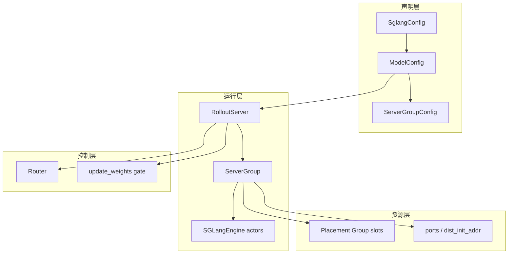

# 引擎拓扑 · 核心概念

## 你为什么要读

这篇先解决“名字太多”的问题。EngineTopology 里最容易混的是配置对象、运行时对象和资源对象：`ServerGroupConfig` 不是 Ray actor，`ServerGroup` 也不是一个 SGLang server；前者是声明，后者是把一组同质 engine 放到 PG 槽位上的运行时容器。

读完本篇后，再看 [[Slime-引擎拓扑-源码走读]] 时应能自然回答：一个 YAML model 会变成几个 Router，几个 ServerGroup，多少个 SGLangEngine，哪些 engine 会进入权重同步。

## 四层对象



| 层 | 对象 | 一句话 |
|----|------|--------|
| 声明层 | `SglangConfig` | 顶层拓扑，来自 YAML、legacy PD flag 或默认 regular |
| 声明层 | `ModelConfig` | 一个逻辑模型，如 actor/ref/reward，每个模型有自己的 Router |
| 声明层 | `ServerGroupConfig` | 一组同质 worker 的预算和启动参数 |
| 运行层 | `RolloutServer` | 一个模型对外呈现的服务容器，内部挂多个 ServerGroup |
| 运行层 | `ServerGroup` | 真正分配 Ray actor、GPU offset、端口和 `engine.init` 的组 |
| 控制层 | Router | generate 请求的 HTTP 入口；PD 时打开 disaggregation 路由 |

## 配置层：先声明形状，不启动进程

`ServerGroupConfig` 最小只需要 `worker_type` 和 `num_gpus`。`num_gpus_per_engine` 可以留空，之后由 model 级默认值或全局 `--rollout-num-gpus-per-engine` 补上。

```python
# 定位骨架（据 `slime/backends/sglang_utils/sglang_config.py` L11-L41 选取字段）：
@dataclasses.dataclass
class ServerGroupConfig:
    worker_type: str
    num_gpus: int
    num_gpus_per_engine: int | None = None
    overrides: dict = dataclasses.field(default_factory=dict)

    def __post_init__(self):
        valid_types = {"regular", "prefill", "decode", "placeholder", "encoder"}
        assert self.worker_type in valid_types
        assert self.num_gpus > 0
```

这里的关键不在 dataclass，而在约束：`worker_type` 决定 SGLang server 角色，`num_gpus` 决定这组在拓扑里占多少槽，`overrides` 是透传到 SGLang `ServerArgs` 的局部修正。`placeholder` 也要求 `num_gpus > 0`，因为它不是“空组”，而是“占槽但不建 engine”。

## 模型层：一个模型必须有一致的 model_path

`ModelConfig.resolve(args)` 是配置对象第一次被注入运行时默认值的位置。它会补 `num_gpus_per_engine`、把 `model_path` 写进每个 group 的 `overrides`，并推断 `update_weights`。

```python
# 定位骨架（据 `slime/backends/sglang_utils/sglang_config.py` L68-L100 删节）：
def resolve(self, args) -> None:
    default_gpus_per_engine = self.num_gpus_per_engine or args.rollout_num_gpus_per_engine
    default_model_path = self.model_path or args.hf_checkpoint
    for g in self.server_groups:
        if g.num_gpus_per_engine is None:
            g.num_gpus_per_engine = default_gpus_per_engine
        if "model_path" not in g.overrides:
            g.overrides["model_path"] = default_model_path

    if self.update_weights is None:
        if effective_model_path != args.hf_checkpoint:
            self.update_weights = False
        else:
            self.update_weights = True
```

这段源码支撑三个规则：

- 同一个 `ModelConfig` 下的所有 server group 必须服务同一个 `model_path`，否则一个 Router 后面会混入不同权重。
- 没显式写 `update_weights` 时，只有 `model_path == args.hf_checkpoint` 的模型默认接收训练权重。
- ref、reward、judge 这类冻结模型应显式写 `update_weights: false`，让读者和程序都少猜一步。

自动推断只比较路径字符串，不做 resolve、realpath 或 checkpoint 身份校验。`./model` 与绝对路径即使指向同一目录也会被判为不同；相同路径的冻结 teacher 又会被判为可更新。因此它是默认值便利，不是模型角色证明。

## 运行层：RolloutServer 是模型壳，ServerGroup 是 engine 池

运行时对象的边界看 `RolloutServer`。它不负责启动 actor；它聚合多个 `ServerGroup`，并给训练侧暴露“哪些 engine 可见、每个 engine 占几张卡、offset 是多少”。

```python
# 定位骨架（据 `slime/ray/rollout.py` L282-L330 选取属性）：
@dataclasses.dataclass
class RolloutServer:
    server_groups: list[ServerGroup]
    router_ip: str | None = None
    router_port: int | None = None
    model_name: str = "default"
    update_weights: bool = True

    @property
    def engines(self):
        return [e for g in self.server_groups for e in g.engines]

    @property
    def engine_gpu_offsets(self) -> list[int]:
        offsets = []
        for g in self.server_groups:
            for j in range(len(g.engines)):
                offsets.append(g.gpu_offset + j * g.num_gpus_per_engine)
        return offsets
```

这里要注意 `engines` 只收集 node-0 engine，便于控制面、HTTP 和权重更新按 engine 粒度交互；`all_engines` 才包含多节点 serving 的所有 actor。`engine_gpu_offsets` 会跨过 placeholder 预留的槽位，所以它是调试 GPU 布局时比“列表下标”更可靠的坐标。

## worker_type：五种形状对应五种系统压力

| `worker_type` | 运行含义 | 典型用途 | 失败边界 |
|---------------|----------|----------|----------|
| `regular` | 每个 engine 自己处理 prefill 和 decode | 短回答、普通 RL、简单部署 | 长上下文时 prefill/decode 资源耦合 |
| `prefill` | PD 的 prompt/KV 构建池 | 长 prompt、多轮 agent、需要不同 TP 的 prefill | 需要 Router 开启 PD |
| `decode` | PD 的逐 token 生成池 | decode 长尾明显、KV transfer 后持续生成 | 与 prefill 配套，单独存在没有完整服务 |
| `encoder` | EPD 的 encoder-only 组 | VLM 或 encoder/LLM 分离 | 非 encoder 组启动前必须拿到 URL |
| `placeholder` | 占用 GPU 槽位但不创建 engine | 预留布局、混合并行对齐 | 不会贡献 `engines`，但会推进 offset |

## 配置入口：三条路只会走一条

`_resolve_sglang_config` 把用户入口收敛成统一的 `SglangConfig`。优先级是：显式 YAML、零 GPU、legacy `--prefill-num-servers`、默认 regular。

```python
# 定位骨架（据 `slime/ray/rollout.py` L1231-L1255 删节）：
def _resolve_sglang_config(args) -> SglangConfig:
    if getattr(args, "sglang_config", None) is not None:
        config = SglangConfig.from_yaml(args.sglang_config)
        expected = args.rollout_num_gpus
        actual = config.total_num_gpus
        assert actual == expected
        return config

    if args.rollout_num_gpus == 0:
        return SglangConfig(models=[ModelConfig(name="default", server_groups=[])])

    if args.prefill_num_servers is not None:
        return SglangConfig.from_prefill_num_servers(args)

    return SglangConfig(
        models=[
            ModelConfig(
                name="default",
                server_groups=[ServerGroupConfig(worker_type="regular", num_gpus=args.rollout_num_gpus)],
            )
        ]
    )
```

这段让很多排障变简单：如果 YAML 的 GPU 总和和 `--rollout-num-gpus` 不一致，失败发生在配置解析阶段；如果 `rollout_num_gpus == 0`，Slime 仍会保留一个默认模型壳，但没有本地 ServerGroup；如果没有任何高级配置，就是一个 regular 单组。

这里没有检查 model name 唯一，也没有要求 PD 同时存在 prefill 和 decode。重名会在后续字典写入时覆盖；只配一侧仍会让 Router 打开 PD，但不代表得到完整可服务拓扑。

## Router：单模型兼容，多模型分流

每个 `ModelConfig` 都会尝试得到一个 Router。第一个模型的 Router 会写回 `args.sglang_router_ip/port`，因此 YAML 顺序决定旧默认 generate 的目标；多模型信息会写到 `args.sglang_model_routers`，给自定义 rollout 选路。

```python
# 定位骨架（据 `slime/rollout/sglang_rollout.py` L65-L81 删节）：
def get_model_url(args: Namespace, model_name: str, endpoint: str = "/generate") -> str:
    routers = getattr(args, "sglang_model_routers", None)
    if routers and model_name in routers:
        ip, port = routers[model_name]
        return f"http://{ip}:{port}{endpoint}"
    return f"http://{args.sglang_router_ip}:{args.sglang_router_port}{endpoint}"
```

默认 `generate` 函数仍然使用 `args.sglang_router_ip/port`，所以多模型部署应把 actor 放在第一项，或在 custom generate 中用 `get_model_url(args, "ref")` 明确选模型。未知 model name 会静默回退默认 Router，拼写错误不会 fail fast。

## 读者抓手

第一次读源码时只记住一句话：`SglangConfig` 说“我想要什么形状”，`start_rollout_servers` 决定“这些形状落在哪些槽和端口”，`RolloutServer` 决定“训练循环能看到哪些 engine”。这三个问题分清后，PD、EPD、多模型、placeholder 和 offload 都只是这条主线上的分支。
