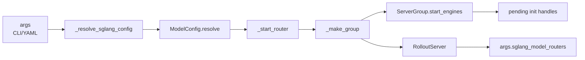

# 引擎拓扑 · 源码走读

## 读者任务

这篇解决一个具体问题：当 Slime 启动 rollout 时，`--sglang-config`、`--prefill-num-servers` 或默认参数如何变成一组真实的 Router、Ray actor、端口和 GPU 槽位。

读完后，你应该能做三件事：

- 启动失败时，判断是 YAML 解析、GPU 总数、Router 端口、Ray actor 还是 SGLangEngine init 出问题。
- 看到一个 PD/EPD/多模型配置时，算出有几个 Router、几个 ServerGroup、多少个 engine。
- 解释为什么某个模型没有参与 `update_weights`，以及为什么 placeholder 会影响 offset 却没有 engine。

## 长文读法

这篇按拓扑编译链路读：RolloutManager 只在构造阶段启动并等待 rollout server ready，`_resolve_sglang_config` 把 CLI、legacy PD 和 YAML 收敛为 `SglangConfig`，每个 `ModelConfig.resolve` 补齐默认模型路径和 `update_weights`，随后每个模型启动自己的 Router，并把每个 server group 编译成带 `gpu_offset/rank_offset/needs_offload` 的 `ServerGroup`，最后才创建 Ray actor、分配端口并暴露给训练循环。

| 读者任务 | 先读 | 要抓住的判断 |
|----------|------|--------------|
| 首次建立拓扑全景 | 先建立模型、贯穿场景、1 到 2 | 这是配置到运行时对象的编译过程，不是单个 engine 的启动函数 |
| 排查 YAML 或 GPU 总数错误 | 2 到 3 | YAML 只表达结构，默认值和 `update_weights` 在 `ModelConfig.resolve` 阶段补齐 |
| 计算 Router 和 ServerGroup 数量 | 4 到 5 | 每个 model 启动 Router；多节点 group 要区分 node actor 数与逻辑 HTTP engine 数 |
| 排查 Ray actor 或 GPU 绑定 | 5 到 6 | `gpu_offset` 映射到 placement group 重排后的 GPU，Ray actor 只申请少量 GPU 资源占位 |
| 排查端口冲突或 PD bootstrap | 7 | 端口按节点 cursor 推进，prefill worker 还会多拿 `disaggregation_bootstrap_port` |
| 排查 EPD 启动顺序 | 8 | encoder group 必须先 ready，URL 注入后 non-encoder group 才能启动 |
| 排查 generate / update_weights 看到哪些模型 | 9 到 10 | `args.sglang_model_routers` 暴露所有模型 Router；权重更新只选第一个 `update_weights=True` 的 server |

读的时候保持三层分开：`SglangConfig` 是声明，`ServerGroup` 是编译后的运行时组，`RolloutServer` 才是训练循环看到的模型服务入口。

## 先建立模型

EngineTopology 的主线是一次“拓扑编译”：



这条线的对象变化如下：

| 阶段 | 对象形态 | 关键问题 |
|------|----------|----------|
| 解析 | `SglangConfig` 与其中的模型列表 | 总 GPU 是否匹配，是否 zero GPU，是否 legacy PD |
| 补默认值 | `ModelConfig` 内每个 group 有完整 `model_path` 和 `num_gpus_per_engine` | 该模型是否接收训练权重 |
| 起 Router | 每个 model 一个 Router | 是否 PD，是否复用用户给定 Router |
| 编译 group | `ServerGroup` 带 `gpu_offset`、`rank_offset`、`needs_offload` | 这组占哪些槽，是否与 Megatron 重叠 |
| 起 actor | Ray actor + SGLang server init handle | 端口是否唯一，init 何时等待 |
| 暴露给训练 | `RolloutServer` 与 `args.sglang_model_routers` | generate 和 update_weights 能看到什么 |

## 贯穿场景

假设用户用 `--sglang-config` 表达一个本地 rollout 拓扑：actor 模型使用 PD，ref 模型冻结；训练脚本同时传入 `--rollout-num-gpus`。Slime 的任务不是“理解业务语义”，而是严格执行这份拓扑声明：

```yaml
sglang:
  - name: actor
    update_weights: true
    server_groups:
      - worker_type: prefill
        num_gpus: 2
        num_gpus_per_engine: 1
      - worker_type: decode
        num_gpus: 2
        num_gpus_per_engine: 1
  - name: ref
    model_path: /models/ref
    update_weights: false
    server_groups:
      - worker_type: regular
        num_gpus: 2
        num_gpus_per_engine: 1
```

从这里开始追源码，不要按文件名追，要按对象生命周期追：这份 YAML 先变成配置对象，再变成两个 Router，再变成三个 ServerGroup，最后变成训练循环可见的 rollout server 字典。

## 主线走读

### 1. 启动边界在 RolloutManager 构造阶段

**系统压力：** rollout engine 启动慢，包含 Ray actor、SGLang server、Router 注册和健康检查；但训练进入 generate 前必须确保它们 ready。

**设计选择：** `RolloutManager.__init__` 先异步启动拓扑，继续加载 data source 和 rollout 函数，最后统一等待 init handle。

**源码证据：**

```python
# 来源：slime/ray/rollout.py L430-L454
        rollout_init_handles: list[Any] = []
        if self.args.debug_train_only:
            self.servers: dict[str, Any] = {}
        else:
            init_http_client(args)
            self.servers, rollout_init_handles = start_rollout_servers(args, pg)

        data_source_cls = load_function(self.args.data_source_path)
        self.data_source = data_source_cls(args)

        self.generate_rollout = load_function(self.args.rollout_function_path)
        self.eval_generate_rollout = load_function(self.args.eval_function_path)
        self.custom_reward_post_process_func = None
        if self.args.custom_reward_post_process_path is not None:
            self.custom_reward_post_process_func = load_function(self.args.custom_reward_post_process_path)
        self.custom_convert_samples_to_train_data_func = None
        if self.args.custom_convert_samples_to_train_data_path is not None:
            self.custom_convert_samples_to_train_data_func = load_function(
                self.args.custom_convert_samples_to_train_data_path
            )
        logger.info(f"import {self.args.rollout_function_path} as generate_rollout function.")
        logger.info(f"import {self.args.eval_function_path} as eval_generate_rollout function.")

        if rollout_init_handles:
            ray.get(rollout_init_handles)
```

**执行逻辑：**

- `debug_train_only` 直接跳过 rollout server，后续不能走真实 generate。
- 正常模式先初始化 HTTP client，再调用 `start_rollout_servers(args, pg)`。
- `start_rollout_servers` 返回 `servers` 和未等待的 `rollout_init_handles`。
- 构造末尾 `ray.get` 是使用前屏障：拓扑可以异步创建，但 manager 可用前必须完成初始化。

**不变量与失败模式：**

- 任一 `engine.init` 失败会在 `ray.get(rollout_init_handles)` 暴露，不会拖到第一次 generate 才失败。
- 如果你在 `debug_train_only` 下还期待 Router 存在，`self.servers` 会是空字典。

### 2. 配置入口先收敛成 SglangConfig

**系统压力：** Slime 同时支持默认 regular、legacy `--prefill-num-servers`、显式 YAML、zero GPU 和 external engine。如果后面每个启动分支都直接读 args，拓扑语义会散掉。

**设计选择：** `_resolve_sglang_config` 把本地 rollout 的几条入口统一成 `SglangConfig`。external engine 在更早处分流，不进入本地 ServerGroup 编译。

**源码证据：**

```python
# 定位骨架（据 `slime/ray/rollout.py` L1231-L1255 删节）：
def _resolve_sglang_config(args) -> SglangConfig:
    if getattr(args, "sglang_config", None) is not None:
        config = SglangConfig.from_yaml(args.sglang_config)
        expected = args.rollout_num_gpus
        actual = config.total_num_gpus
        assert actual == expected, f"sglang_config total GPUs ({actual}) != rollout_num_gpus ({expected})"
        return config

    if args.rollout_num_gpus == 0:
        return SglangConfig(models=[ModelConfig(name="default", server_groups=[])])

    if args.prefill_num_servers is not None:
        return SglangConfig.from_prefill_num_servers(args)

    return SglangConfig(
        models=[
            ModelConfig(
                name="default",
                server_groups=[ServerGroupConfig(worker_type="regular", num_gpus=args.rollout_num_gpus)],
            )
        ]
    )
```

**执行逻辑：**

- YAML 优先：`config.total_num_gpus` 必须等于 `args.rollout_num_gpus`。
- zero GPU 比 `prefill_num_servers` 更早返回，表示本地没有 rollout engine，但仍保留一个默认模型壳。
- `--prefill-num-servers` 只生成默认模型的 prefill/decode 两组，是 legacy 快捷路径。
- 什么都不写时，拓扑退化成单个 regular group。

**不变量与失败模式：**

- YAML 总 GPU 少写或多写，失败点就是这里的 assert。
- `--sglang-config` 与 `--prefill-num-servers` 互斥，参数校验在 `validate_args` 阶段已经阻止混用。
- YAML 没有 model name 唯一性检查，也不要求 PD 的 prefill/decode 成对；这些结构错误会晚到字典覆盖或运行期路由。

### 3. YAML 只负责结构化，默认值在 resolve 里补齐

**系统压力：** YAML 需要表达多模型、多组、group 级 overrides，还要兼容旧字段 `engine_groups`。但 YAML 解析时还不该决定 GPU offset、端口或 Ray actor。

**设计选择：** `SglangConfig.from_yaml` 只把 YAML 转成 dataclass；`ModelConfig.resolve(args)` 才把全局默认值注入 group。

**源码证据：**

```python
# 定位骨架（据 `slime/backends/sglang_utils/sglang_config.py` L157-L180 删节）：
@staticmethod
def from_yaml(path: str) -> "SglangConfig":
    with open(path) as f:
        data = yaml.safe_load(f)

    assert "sglang" in data
    models = []
    for m in data["sglang"]:
        raw_groups = m.get("server_groups") or m.get("engine_groups") or []
        groups = [ServerGroupConfig(**g) for g in raw_groups]
        models.append(
            ModelConfig(
                name=m["name"],
                model_path=m.get("model_path"),
                num_gpus_per_engine=m.get("num_gpus_per_engine"),
                server_groups=groups,
                update_weights=m.get("update_weights"),
            )
        )
    return SglangConfig(models=models)
```

```python
# 定位骨架（据 `slime/backends/sglang_utils/sglang_config.py` L68-L100 删节）：
def resolve(self, args) -> None:
    default_gpus_per_engine = self.num_gpus_per_engine or args.rollout_num_gpus_per_engine
    default_model_path = self.model_path or args.hf_checkpoint
    for g in self.server_groups:
        if g.num_gpus_per_engine is None:
            g.num_gpus_per_engine = default_gpus_per_engine
        if "model_path" not in g.overrides:
            g.overrides["model_path"] = default_model_path

    if self.update_weights is None:
        if effective_model_path != args.hf_checkpoint:
            self.update_weights = False
        else:
            self.update_weights = True
```

**执行逻辑：**

- `from_yaml` 接受 `server_groups`，也兼容旧字段 `engine_groups`。
- `resolve` 先补每个 group 的 `num_gpus_per_engine`。
- `resolve` 再把模型的 `model_path` 注入 group overrides，保证 `_compute_server_args` 能取到。
- 如果模型路径不同于训练的 `hf_checkpoint`，默认 `update_weights=False`。

**不变量与失败模式：**

- 同一模型下所有 group 必须使用同一个 `model_path`；否则一个 Router 后面会混多个模型权重。
- ref/reward 模型如果忘写 `update_weights: false`，源码也会在 `model_path` 不同的时候自动推断为 false；但生产配置最好显式写，避免路径相同但语义冻结的模型被更新。
- 路径判断只是字符串相等，不做 realpath/symlink 归一化；它不能替代显式模型角色声明。

### 4. 每个模型先拿一个 Router

**系统压力：** 单模型脚本需要兼容旧的 `args.sglang_router_ip/port`，多模型又需要每个模型独立 endpoint；PD 还要求 Router 进入 disaggregation 模式。

**设计选择：** `start_rollout_servers` 遍历 model 时先启动 Router。第一个模型兼容旧字段，后续模型 `force_new=True` 分配新端口。

**源码证据：**

```python
# 定位骨架（据 `slime/ray/rollout.py` L1019-L1070 删节）：
def _start_router(args, *, has_pd_disaggregation: bool = False, force_new: bool = False) -> tuple[str, int]:
    if not force_new and args.sglang_router_ip is not None:
        return args.sglang_router_ip, args.sglang_router_port

    router_ip = _wrap_ipv6(get_host_info()[1])
    if force_new:
        router_port = find_available_port(random.randint(3000, 4000))
    else:
        router_port = args.sglang_router_port
        if router_port is None:
            router_port = find_available_port(random.randint(3000, 4000))

    router_args = RouterArgs.from_cli_args(args, use_router_prefix=True)
    router_args.host = router_ip
    router_args.port = router_port

    if has_pd_disaggregation:
        router_args.pd_disaggregation = True
        router_args.disable_circuit_breaker = True

    router_args.disable_health_check = True
    process = multiprocessing.Process(target=run_router, args=(router_args,))
    process.daemon = True
    process.start()
    time.sleep(3)
    assert process.is_alive()
    return router_ip, router_port
```

**执行逻辑：**

- 用户已经传入 Router 地址且不是多模型强制新建时，直接复用。
- 多模型的第二个及之后模型强制分配新端口。
- 只要该模型含 `prefill` 或 `decode`，Router 就打开 `pd_disaggregation`。
- PD 时关闭 circuit breaker，是为了避免 RDMA transfer 的瞬时超时被当成 decode worker 死亡。

**不变量与失败模式：**

- Router 进程启动失败会在 `assert process.is_alive()` 处暴露。
- 自建 Router 只 sleep 3 秒并检查进程仍活着，没有 HTTP readiness；复用用户给定 Router 时更是直接返回地址，不验证可达性。
- 如果 PD 配置没有让 Router 开 `pd_disaggregation`，prefill/decode worker 角色就不会被正确调度；源码用 `model_cfg.has_pd_disaggregation` 自动推断这一点。
- 只要有 prefill 或 decode 任一侧就会打开 PD；源码不校验两侧配对完整。

### 5. _make_group 把声明编译成 runtime group

**系统压力：** 一个模型内可能有多个 group；每组的 TP、worker_type、overrides、offload 需求都不同。它们必须共享同一个 Router，又要在 PG 上占不同 GPU 槽。

**设计选择：** `start_rollout_servers` 内部定义 `_make_group`，用闭包维护全局递增的 `engine_offset` 和 `gpu_offset`。

**源码证据：**

```python
# 定位骨架（据 `slime/ray/rollout.py` L1089-L1169 删节）：
config = _resolve_sglang_config(args)
servers: dict[str, RolloutServer] = {}
pending_init_handles: list[Any] = []
gpu_offset = 0
engine_offset = 0

rollout_pg_offset = _compute_rollout_offset(args)
megatron_num_gpus = _compute_megatron_num_gpus(args)

for model_idx, model_cfg in enumerate(config.models):
    model_cfg.resolve(args)
    has_pd = model_cfg.has_pd_disaggregation
    router_ip, router_port = _start_router(args, has_pd_disaggregation=has_pd, force_new=(model_idx > 0))

    def _make_group(group_cfg, router_ip, router_port, overrides_extra=None):
        nonlocal engine_offset, gpu_offset
        gpus_per_engine = group_cfg.num_gpus_per_engine
        num_gpu_per_engine_local = min(gpus_per_engine, args.num_gpus_per_node)
        num_engines = group_cfg.num_gpus // num_gpu_per_engine_local

        group_abs_start = rollout_pg_offset + gpu_offset
        needs_offload = args.offload_rollout and group_abs_start < megatron_num_gpus
        overrides = dict(group_cfg.overrides)

        group = ServerGroup(
            all_engines=[None] * num_engines if group_cfg.worker_type != "placeholder" else [],
            num_gpus_per_engine=gpus_per_engine,
            worker_type=group_cfg.worker_type,
            rank_offset=engine_offset,
            gpu_offset=gpu_offset,
            sglang_overrides=overrides,
            needs_offload=needs_offload,
            model_path=overrides.get("model_path", args.hf_checkpoint),
            router_ip=router_ip,
            router_port=router_port,
        )
        engine_offset += num_engines
        gpu_offset += group_cfg.num_gpus
        return group
```

**执行逻辑：**

- `_make_group` 中名为 `num_engines` 的值实际是 node actor 数：`num_gpus / min(gpus_per_engine, gpus_per_node)`。逻辑 HTTP engine 数是 `num_gpus / gpus_per_engine`，两者在多节点时不同。
- `gpu_offset` 按 group 的 `num_gpus` 推进；placeholder 也推进。
- `engine_offset` 按 `num_engines` 推进；placeholder 的 `all_engines=[]`，不会产生真实 actor。
- `engine_offset` 因而按 node actor rank 推进，不是按 HTTP 副本推进。
- `needs_offload` 只看 group 绝对起点是否落在 Megatron GPU 范围内；group 跨越训练/rollout 边界时会整组 offload，是粗粒度判定。

**不变量与失败模式：**

- `num_gpus` 应能按 `num_gpus_per_engine` 形成有效 engine 布局，否则后续 GPU index 校验会失败。
- colocate 模式下 rollout 与 Megatron 槽位重叠，`needs_offload=True` 是正常现象，不是资源错配。
- placeholder 不会出现在 `server.engines`，但会改变后续 group 的 offset。

### 6. ServerGroup.start_engines 才真正创建 Ray actor

**系统压力：** 一个 ServerGroup 需要把逻辑 engine 排到 Ray PG 的具体 bundle 上，并为每个 SGLang server 分配 HTTP、NCCL、dist init 和 PD bootstrap 端口。

**设计选择：** `ServerGroup.start_engines` 负责 actor 创建和端口分配，但只返回 init handle，不在本函数里等待。

**源码证据：**

```python
# 定位骨架（据 `slime/ray/rollout.py` L137-L166 删节）：
def start_engines(self, port_cursors: dict[int, int] | None = None) -> tuple[list, dict[int, int]]:
    if port_cursors is None:
        port_cursors = {}
    if self.args.debug_train_only or self.worker_type == "placeholder":
        self.num_new_engines = 0
        return [], port_cursors

    num_gpu_per_engine = min(self.num_gpus_per_engine, self.args.num_gpus_per_node)
    pg, reordered_bundle_indices, reordered_gpu_ids = self.pg
    validate_server_group_gpu_indices(
        worker_type=self.worker_type,
        gpu_offset=self.gpu_offset,
        num_gpus_per_engine=self.num_gpus_per_engine,
        num_gpu_per_engine=num_gpu_per_engine,
        num_engines=len(self.all_engines),
        num_available_gpus=len(reordered_gpu_ids),
        rollout_num_gpus=self.args.rollout_num_gpus,
        rollout_num_gpus_per_engine=self.args.rollout_num_gpus_per_engine,
    )
```

```python
# 定位骨架（据 `slime/ray/rollout.py` L168-L216 删节）：
    RolloutRayActor = ray.remote(SGLangEngine)
    rollout_engines = []
    for i in range(len(self.all_engines)):
        if self.all_engines[i] is not None:
            continue

        global_rank = self.rank_offset + i
        num_gpus = 0.2
        num_cpus = num_gpus

        gpu_index = self.gpu_offset + i * num_gpu_per_engine
        base_gpu_id = int(reordered_gpu_ids[gpu_index])
        scheduling_strategy = PlacementGroupSchedulingStrategy(
            placement_group=pg,
            placement_group_capture_child_tasks=True,
            placement_group_bundle_index=reordered_bundle_indices[gpu_index],
        )

        env_vars = {name: "1" for name in NOSET_VISIBLE_DEVICES_ENV_VARS_LIST} | {
            key: os.environ.get(key, default_val)
            for key, default_val in {
                "SGLANG_JIT_DEEPGEMM_PRECOMPILE": "true",
                "SGLANG_JIT_DEEPGEMM_FAST_WARMUP": "true",
                "SGL_DISABLE_TP_MEMORY_INBALANCE_CHECK": "true",
                "SGLANG_DISABLE_TP_MEMORY_INBALANCE_CHECK": "true",
                "SGLANG_MEMORY_SAVER_CUDA_GRAPH": "true",
                "SGLANG_BATCH_INVARIANT_OPS_ENABLE_MM_FALLBACK_VARIANT": "true",
                "SGLANG_ENABLE_HEALTH_ENDPOINT_GENERATION": "false",
                "SGLANG_ENABLE_STRICT_MEM_CHECK_DURING_IDLE": "false",
            }.items()
        }
        rollout_engine = RolloutRayActor.options(
            num_cpus=num_cpus,
            num_gpus=num_gpus,
            scheduling_strategy=scheduling_strategy,
            runtime_env={
                "env_vars": add_default_ray_env_vars(env_vars),
            },
        ).remote(
            self.args,
            rank=global_rank,
            worker_type=self.worker_type,
            base_gpu_id=base_gpu_id,
            sglang_overrides=self.sglang_overrides,
            num_gpus_per_engine=self.num_gpus_per_engine,
        )
```

```python
# 定位骨架（据 `slime/ray/rollout.py` L218-L246 删节）：
        rollout_engines.append((global_rank, rollout_engine))
        self.all_engines[i] = rollout_engine

    self.num_new_engines = len(rollout_engines)
    if self.num_new_engines == 0:
        return [], port_cursors

    base_port = max(port_cursors.values()) if port_cursors else 15000
    addr_and_ports, port_cursors = _allocate_rollout_engine_addr_and_ports_normal(
        args=self.args,
        rollout_engines=rollout_engines,
        worker_type=self.worker_type,
        num_gpus_per_engine=self.num_gpus_per_engine,
        rank_offset=self.rank_offset,
        base_port=base_port,
    )
    init_handles = [
        engine.init.remote(**(addr_and_ports[rank]), router_ip=self.router_ip, router_port=self.router_port)
        for rank, engine in rollout_engines
    ]
    return init_handles, port_cursors
```

**执行逻辑：**

- placeholder 和 debug train-only 都直接返回空 handle。
- `validate_server_group_gpu_indices` 是 actor 创建前的布局校验。
- 每个 engine 用 `gpu_offset + i * num_gpu_per_engine` 找到 PG 中的起始 GPU。
- Ray actor 只申请 `0.2` GPU 作为控制 actor，真正 SGLang server 使用 `base_gpu_id` 和 `num_gpus_per_engine` 管理可见设备。
- `engine.init.remote` 才会把端口、Router 地址传进 SGLangEngine。

**不变量与失败模式：**

- `port_cursors` 必须跨 group 传递，否则同节点不同 group 可能抢同一批端口。
- `self.all_engines[i]` 非空时会跳过创建，这是故障恢复时复用存活 actor 的基础。

### 7. 端口分配按节点推进，prefill 多一个 bootstrap port

**系统压力：** 一个 SGLang engine 不只需要 HTTP port，还需要 NCCL、分布式初始化地址，以及 DP attention 等连续端口。PD 的 prefill worker 还要暴露 disaggregation bootstrap port。

**设计选择：** `_allocate_rollout_engine_addr_and_ports_normal` 用 node 级 cursor 分配端口，并把 cursor 返回给下一个 ServerGroup。

**源码证据：**

```python
# 定位骨架（据 `slime/ray/rollout.py` L945-L1016 删节）：
num_engines_per_node = max(1, args.num_gpus_per_node // _gpus_per_engine)
addr_and_ports: dict[int, dict] = {}
node_port_cursor: dict[int, int] = {}

for rank, engine in rollout_engines:
    local_rank = rank - rank_offset
    node_index = local_rank // num_engines_per_node
    if node_index in visited_nodes:
        continue
    visited_nodes.add(node_index)

    for i in range(num_engines_on_this_node):
        current_rank = rank + i
        addr_and_ports.setdefault(current_rank, {})
        addr_and_ports[current_rank]["host"] = get_addr()
        addr_and_ports[current_rank]["port"] = get_port()
        addr_and_ports[current_rank]["nccl_port"] = get_port()

        if worker_type == "prefill":
            addr_and_ports[current_rank]["disaggregation_bootstrap_port"] = get_port()

    for i, _ in rollout_engines:
        for key in ["port", "nccl_port", "dist_init_addr"]:
            assert key in addr_and_ports[i]

return addr_and_ports, node_port_cursor
```

**执行逻辑：**

- node index 来自 `local_rank // num_engines_per_node`。
- 每个节点只从第一个待启动 engine 查询地址和端口，再为同节点 engine 连续分配。
- prefill worker 多分配 `disaggregation_bootstrap_port`。
- 每个 engine 至少必须拿到 `port`、`nccl_port` 和 `dist_init_addr`。

**不变量与失败模式：**

- 端口冲突常见症状是 engine init hang 或 server 启动失败；优先看 `Ports for engine` 日志。
- 如果 `dist_init_addr` 缺失，后面的 assert 会在启动阶段暴露。

### 8. EPD 必须先等 encoder ready

**系统压力：** EPD 中非 encoder worker 启动时需要知道 encoder server URL；如果 LLM worker 先启动，它没有办法构造 `encoder_urls`。

**设计选择：** 有 encoder group 时，`start_rollout_servers` 分两阶段：先同步启动 encoder，收集 URL；再启动 regular/prefill/decode。

**源码证据：**

```python
# 定位骨架（据 `slime/ray/rollout.py` L1171-L1205 删节）：
if has_epd:
    encoder_urls: list[str] = []
    for group_cfg in model_cfg.server_groups:
        if group_cfg.worker_type != "encoder":
            continue
        group = _make_group(group_cfg, router_ip, router_port)
        handles, port_cursors = group.start_engines(port_cursors)
        if handles:
            ray.get(handles)
        urls = ray.get([e.get_url.remote() for e in group.engines])
        encoder_urls.extend(u for u in urls if u is not None)
        server_groups.append(group)

    non_encoder_handles: list = []
    for group_cfg in model_cfg.server_groups:
        if group_cfg.worker_type == "encoder":
            continue
        overrides_extra = {}
        if encoder_urls and group_cfg.worker_type in ("prefill", "regular"):
            overrides_extra["language_only"] = True
            overrides_extra["encoder_urls"] = encoder_urls
        group = _make_group(group_cfg, router_ip, router_port, overrides_extra=overrides_extra)
        handles, port_cursors = group.start_engines(port_cursors)
        non_encoder_handles.extend(handles)
        server_groups.append(group)

    pending_init_handles.extend(non_encoder_handles)
```

**执行逻辑：**

- encoder group 的 init handle 会在本段同步 `ray.get`，这和普通 group 的“延迟等待”不同。
- `get_url` 返回的 URL 注入 regular 或 prefill group 的 overrides。
- 后续 non-encoder group 仍然只收集 handle，交给 `RolloutManager.__init__` 末尾统一等待。

**不变量与失败模式：**

- EPD 的 encoder URL 缺失时，regular/prefill group 不会带 `language_only` 和 `encoder_urls`，多模态分离路径无法成立。
- 代码不会为“encoder group 存在但收集到空 URL”单独抛错，而是静默按无注入继续启动 non-encoder group；必须显式验收 URL 非空。
- `tests/utils/test_sglang_config.py` 中的 EPD 单测明确检查 encoder init 先被 `ray.get`，再启动 regular group。

### 9. 最后暴露 RolloutServer 和模型 Router 表

**系统压力：** 训练循环需要一个向后兼容的默认 Router，同时 custom rollout 又需要按模型名访问 actor/ref/reward。

**设计选择：** 每个 model 生成一个 `RolloutServer`，写入 `servers[model_cfg.name]`；所有 Router 再汇总到 `args.sglang_model_routers`。

**源码证据：**

```python
# 定位骨架（据 `slime/ray/rollout.py` L1217-L1228 删节）：
servers[model_cfg.name] = RolloutServer(
    server_groups=server_groups,
    router_ip=router_ip,
    router_port=router_port,
    model_name=model_cfg.name,
    update_weights=model_cfg.update_weights,
)

args.sglang_model_routers = {name: (srv.router_ip, srv.router_port) for name, srv in servers.items()}

return servers, pending_init_handles
```

```python
# 定位骨架（据 `slime/rollout/sglang_rollout.py` L65-L81 删节）：
def get_model_url(args: Namespace, model_name: str, endpoint: str = "/generate") -> str:
    routers = getattr(args, "sglang_model_routers", None)
    if routers and model_name in routers:
        ip, port = routers[model_name]
        return f"http://{ip}:{port}{endpoint}"
    return f"http://{args.sglang_router_ip}:{args.sglang_router_port}{endpoint}"
```

**执行逻辑：**

- `servers` 是 model name 到 runtime server 的映射。
- `update_weights` 被带进 `RolloutServer`，后续权重同步只选择可更新 server。
- `args.sglang_model_routers` 是 custom rollout 的选路表。
- 找不到 model name 时，`get_model_url` 回退到默认 Router。

**不变量与失败模式：**

- 默认 generate 不会自动遍历所有模型，它只用默认 `args.sglang_router_ip/port`。
- 多模型 ref/reward 请求要么在 custom generate 中显式调用 `get_model_url`，要么不会被默认路径使用。
- model name 没有唯一性校验：重名会覆盖 `servers`/router map 中的前一个对象，但前一个 Router/group 已经启动。
- 默认 Router 由第一项决定；未知 model name 静默回退，配置顺序或拼写错误可能把流量送到错误模型而不报错。

### 10. update_weights 只看可更新模型

**系统压力：** 多模型部署里 actor 需要训练权重，ref/reward 通常冻结。如果权重同步误推到冻结模型，会破坏 KL、reward 或 teacher 信号。

**设计选择：** `RolloutManager` 只从第一个 `update_weights=True` 的 server 取 engine、GPU counts、offset 和 all actors。

**源码证据：**

```python
# 定位骨架（据 `slime/ray/rollout.py` L511-L540 删节）：
def _get_updatable_server(self) -> Any | None:
    for srv in self.servers.values():
        if srv.update_weights:
            return srv
    return None

def get_updatable_engines_and_lock(self):
    srv = self._get_updatable_server()
    engines = srv.engines if srv else []
    gpu_counts = srv.engine_gpu_counts if srv else []
    gpu_offsets = srv.engine_gpu_offsets if srv else []
    num_new = srv.num_new_engines if srv else 0
    all_engine_actors = srv.all_engines if srv else []
    return engines, self.rollout_engine_lock, num_new, gpu_counts, gpu_offsets, all_engine_actors
```

**执行逻辑：**

- `update_weights=False` 的模型不会被选入训练权重同步。
- 返回的 `engines` 是 node-0 engine，`all_engine_actors` 用于需要全部 actor 的路径。
- 多个可更新模型时当前只取第一个，源码注释也把多模型权重更新标为尚未完整支持。

**不变量与失败模式：**

- 如果 actor 被误配置成 `update_weights: false`，训练后 rollout 会继续用旧权重。
- 如果 ref/reward 被误配置成 true，权重同步会污染冻结模型。

## 运行验证

### 轻量单测

在依赖完整的开发环境中，优先跑配置单测：

```powershell
$env:PYTHONPATH='F:\源码阅读\slime'
python -m pytest slime/tests/utils/test_sglang_config.py -q
```

预期现象：

- `test_multi_model_total_gpus` 证明 YAML 多模型 GPU 会累加。
- `test_start_rollout_servers_zero_gpu_starts_router_without_engines` 证明 zero GPU 仍会创建默认 Router 映射，但没有 engines。
- `test_start_rollout_servers_waits_for_epd_encoder_before_non_encoder` 证明 EPD encoder 先同步 ready，再注入 `encoder_urls`。
- `test_get_model_url_basic` 证明 custom rollout 可按模型名选 Router。

### 日志抓手

真实启动时重点看这些日志或断点：

| 现象 | 入口 |
|------|------|
| YAML 总 GPU 错误 | `_resolve_sglang_config` 的 `sglang_config total GPUs` assert |
| Router 起不来 | `_start_router` 的 `Launch router` 与 `Router launched` |
| group 是否 offload | `_make_group` 的 `Engine group` 与 `needs_offload` 日志 |
| 端口是否分配 | `_allocate_rollout_engine_addr_and_ports_normal` 的 `Ports for engine` |
| EPD 是否注入 URL | `EPD phase 1 done` 与 group overrides |

### 当前环境说明

本仓库的源码证据来自 upstream 文件和测试文件。若本机未安装 `ray`、`sglang_router`、`httpx` 或 GPU 相关依赖，直接跑 Slime 单测可能在 import 或 collection 阶段失败；这不改变上述源码主线，但会影响本地可执行验证。

## 复盘

- EngineTopology 的核心不是 SGLang 推理逻辑，而是把 rollout 拓扑声明编译成 Router、ServerGroup、Ray actor 和权重同步边界。
- `SglangConfig` 是统一中间表示；默认 regular、legacy PD 和 YAML 最终都走同一套 runtime 编译。
- `gpu_offset` 和 `rank_offset` 是跨 group 的全局游标；placeholder 会推进 GPU 游标但不贡献 engine。
- PD 改变 Router 模式和端口需求，EPD 额外引入“encoder 先 ready，再注入 URL”的同步边界。
- 多模型默认只保证 Router 表可用；真正向哪个模型发请求，要看默认 generate 还是 custom rollout。

下一篇建议读 [[Slime-引擎拓扑-数据流]]，把本篇的对象生命周期换成 GPU 槽位、端口和请求路由三条数据流。
