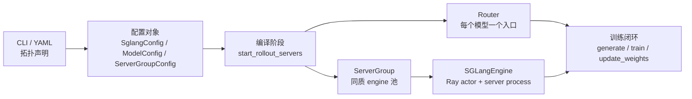

# 引擎拓扑

EngineTopology 解决的问题不是“怎么调用 SGLang”，而是“训练任务给出一份 rollout 拓扑声明后，Slime 如何把它编译成可运行的 Router、Ray actor、端口、GPU 槽位和权重同步边界”。读完本专题，读者应该能解释三类现场问题：为什么某个拓扑起不来，为什么某组 engine 没有收到权重，为什么 PD/EPD 或多模型部署会改变 Router 与 ServerGroup 的形状。

本专题位于 [[Slime-RolloutManager]] 之后。`RolloutManager.__init__` 负责在训练循环开始前启动 rollout 服务，真正把配置落成进程的是 `start_rollout_servers`、`ServerGroup.start_engines` 和 `_start_router`。

## 首次阅读路径

| 读者任务 | 建议入口 | 读完能做什么 |
|----------|----------|--------------|
| 第一次读 rollout 拓扑 | [[Slime-引擎拓扑-核心概念]] | 分清 `SglangConfig`、`ModelConfig`、`ServerGroupConfig`、`RolloutServer`、`ServerGroup` |
| 想沿源码追启动主线 | [[Slime-引擎拓扑-源码走读]] | 从 YAML/CLI 追到 Router、Ray actor、端口和 init handle |
| 想排查资源和路由 | [[Slime-引擎拓扑-数据流]] | 解释 GPU offset、port cursor、多模型 Router 和 `update_weights` 边界 |
| 遇到配置或线上症状 | [[Slime-引擎拓扑-排障指南]] | 按症状找到源码入口和验证方法 |
| 做完自测 | [[Slime-引擎拓扑-学习检查]] | 用单测、日志和图形复述拓扑生命周期 |

## 心理模型

把 EngineTopology 看成一个“拓扑编译器”：



这个模型有三条边界：

| 边界 | 谁负责 | 读者要盯住的变量 |
|------|--------|------------------|
| 声明边界 | `sglang_config.py` | `worker_type`、`num_gpus`、`num_gpus_per_engine`、`update_weights`、`overrides` |
| 编译边界 | `rollout.py` | `gpu_offset`、`rank_offset`、`port_cursors`、`has_pd_disaggregation`、`has_encoder_disaggregation` |
| 运行边界 | `SGLangEngine` 与 Router | `router_ip`、`router_port`、`engine.init` handle、`needs_offload` |

## 先记住四个不显眼的编译风险

- `ModelConfig.name` 没有全局唯一性校验；重名模型仍会各自启动 Router/group，最后却在 `servers[name]` 和 router map 中被后者覆盖，留下已启动但不可寻址的前一套资源。
- `update_weights` 的自动推断只是模型路径字符串与 `args.hf_checkpoint` 的相等比较；相对路径、软链接或同路径冻结副本都可能让语义与字符串判断不一致，生产配置应显式填写。
- 多节点 group 中 `_make_group` 计算的是“node actor 数”，不是逻辑 HTTP engine 数；逻辑 engine 还要除以 `nodes_per_engine`。不要直接用 `len(all_engines)` 报服务副本数。
- 第一个 YAML model 决定旧版默认 Router；`get_model_url` 对未知名称静默回退默认 Router。模型顺序和拼写错误都会改变实际流量目标。

## 源码范围

| 文件 | 角色 |
|------|------|
| `slime/ray/rollout.py` | `RolloutManager` 入口、`RolloutServer`、`ServerGroup`、Router 启动、拓扑实例化 |
| `slime/backends/sglang_utils/sglang_config.py` | YAML/CLI 拓扑对象、默认值解析、`update_weights` 推断 |
| `slime/backends/sglang_utils/arguments.py` | `--sglang-config`、`--prefill-num-servers`、external engine 的互斥校验 |
| `slime/ray/placement_group.py` | actor 与 rollout 在 Ray Placement Group 中的槽位切分 |
| `slime/rollout/sglang_rollout.py` | 默认 generate 请求如何打到 Router，多模型 custom rollout 如何选 Router |
| `slime/tests/utils/test_sglang_config.py` | 零 GPU、多模型、EPD、Router URL 的单测证据 |

## 关键源码锚点

**判断：EngineTopology 的启动边界在 `RolloutManager.__init__`，不是第一次 generate 时。**

```python
# 定位骨架（据 `slime/ray/rollout.py` L430-L454 删节）：
rollout_init_handles: list[Any] = []
if self.args.debug_train_only:
    self.servers: dict[str, Any] = {}
else:
    init_http_client(args)
    self.servers, rollout_init_handles = start_rollout_servers(args, pg)

data_source_cls = load_function(self.args.data_source_path)
self.data_source = data_source_cls(args)

if rollout_init_handles:
    ray.get(rollout_init_handles)
```

这段代码给出两个不变量：正常训练在构造 `RolloutManager` 时就启动 rollout 拓扑；`start_rollout_servers` 可以异步返回 init handle，但 `RolloutManager` 对外可用前必须 `ray.get` 等待完成。

## 与相邻专题的关系

| 方向 | 专题 | 关系 |
|------|------|------|
| 上游 | [[Slime-RolloutManager]] | 决定何时启动 rollout 服务、何时生成样本 |
| 下游 | [[Slime-SGLang-Rollout]] | 默认 generate 只打第一个 Router，自定义 rollout 可用模型名选 Router |
| 控制面 | [[Slime-SGLang-Engine]] | 单个 Ray actor 如何拉起、暂停、恢复、更新 SGLang server |
| 外部部署 | [[Slime-外部推理引擎]] | external 模式绕过本地 ServerGroup 启动，只接管发现、Router 和权重控制 |
| 权重同步 | [[Slime-分布式权重同步]] | `update_weights=True` 的 server 才进入训练权重同步路径 |
