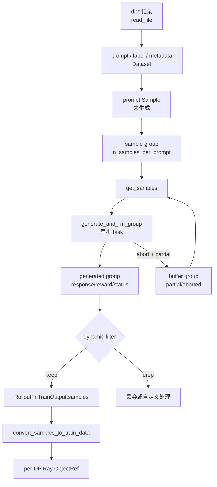

# 数据源 · 数据流

## 你为什么要读

这篇不再重复源码细节，而是把对象边界画清楚：prompt 记录什么时候还是文件行，什么时候变成 prompt 阶段 Sample，什么时候被复制成 group，什么时候带着 response 回到 buffer，什么时候已经离开 DataSource 进入训练 tensor。

## 一张对象生命周期图



每条边都改变了对象语义：

| 边 | 变化 |
|----|------|
| 记录到 prompt Sample | 文件格式差异被消化，prompt/template/metadata 成为 Sample 字段 |
| prompt Sample 到 group | 同一 prompt 被复制成多条 Sample，写入 group/index |
| group 到 task | 每组作为一个异步生成任务提交 |
| task 到 generated group | response、tokens、reward、status 被填充 |
| generated group 到训练 | 只保留通过 filter 的组 |
| task 到 buffer | partial/abort 时保留半成品，下一轮优先消费 |

## RolloutManager 视角：DataSource 是长生命周期状态

RolloutManager 在构造时创建 DataSource，在训练步中传给 rollout 函数，在 checkpoint 时调用它的 save/load。它不是每步重建的临时 iterator。

```python
# 来源：slime/ray/rollout.py L437-L438
        data_source_cls = load_function(self.args.data_source_path)
        self.data_source = data_source_cls(args)
```

```python
# 来源：slime/ray/rollout.py L572-L576
    def save(self, rollout_id):
        self.data_source.save(rollout_id)

    def load(self, rollout_id=None):
        self.data_source.load(rollout_id)
```

这解释了两个现象：

- `sample_offset`、`sample_index` 会跨 rollout step 递增。
- checkpoint 恢复的是同一个数据消费状态，而不是每步从文件头重新读。

## 默认 rollout 视角：DataSource 是 pull 接口

默认 `generate_rollout` 并不直接拿 dataset 对象，而是把 `data_source.get_samples` 这个 bound method 交给 async 主循环。

```python
# 定位骨架（据 `slime/rollout/sglang_rollout.py` L618-L640 删节）：
def generate_rollout(
    args: Namespace, rollout_id: int, data_source: Any, evaluation: bool = False
) -> RolloutFnTrainOutput | RolloutFnEvalOutput:
    assert args.rollout_global_dataset
    if evaluation:
        output, _ = run(eval_rollout(args, rollout_id))
        return output

    output, aborted_samples = run(generate_rollout_async(args, rollout_id, data_source.get_samples))
    if aborted_samples:
        data_source.add_samples(aborted_samples)
    return output
```

`generate_rollout_async` 对这个接口的使用很直接：当未完成的 group 数不足目标时，就再拉 `over_sampling_batch_size` 组。

```python
# 定位骨架（据 `slime/rollout/sglang_rollout.py` L408-L412 删节）：
    while len(data) < target_data_size:
        while state.remaining_batch_size < target_data_size:
            samples = data_source(args.over_sampling_batch_size)
            state.submit_generate_tasks(samples)
```

这里的设计压力是吞吐，而不是“严格一次取一批”。过采样允许 filter drop 后还有足够任务在路上，但代价是 dataset 游标可能比有效训练样本前进得更快。

接口还有一个进展性前提：`get_samples(k)` 必须能返回非空 group。默认 async 主循环的内层 while 没有“数据耗尽”分支；空 dataset 或自定义 source 持续返回 `[]` 时，它会反复拉取而无法进入 `asyncio.wait`。DataSource 不能用空 list 表示永久 EOF，除非配套替换 rollout 控制逻辑。

## Buffer 视角：同形状，不同成熟度

DataSource buffer 存的仍然是 `list[list[Sample]]`，但这些 Sample 可能已经有 response。它和 fresh dataset group 形状相同，成熟度不同。

| 来源 | group 形状 | 典型字段 |
|------|------------|----------|
| dataset | `list[Sample]` | `prompt`、`label`、`metadata`、`group_index`、`index` |
| partial buffer | `list[Sample]` | 上述字段 + 部分 `tokens`、`response`、`status`、`start_rollout_id` |
| generated output | `list[Sample]` | 完整 `tokens`、`response`、`reward`、`rollout_log_probs` |

`add_samples` 的入队校验只检查形状，不检查 Sample 成熟度：

```python
# 来源：slime/rollout/data_source.py L198-L212
    def add_samples(self, samples: list[list[Sample]]):
        """
        Add a sample group to buffer.
        """
        if not samples:
            return
        assert isinstance(samples, list), f"samples must be a list, got {type(samples)}"
        assert isinstance(samples[0], list), f"the elements of samples must be list, got {type(samples[0])}"
        for i in range(0, len(samples)):
            assert (
                len(samples[i]) == self.args.n_samples_per_prompt
            ), f"the length of the elements of samples must be equal to n_samples_per_prompt, got {len(samples[i])} != {self.args.n_samples_per_prompt}"
            group = samples[i]  # type: ignore
            self.buffer.append(group)
```

这意味着：只要 group 长度合法，带 partial response 的组和 fresh prompt 组都能从 `get_samples` 出来，后续 `generate_and_rm` 再根据 status/response 决定是否继续生成或直接返回。

## Dataset 视角：shuffle 是视图切换

`Dataset` 保存 `origin_samples` 和当前 `samples` 视图。shuffle 时不是在当前 `samples` 上继续打乱，而是从 origin 按确定性 permutation 重建。

```python
# 来源：slime/utils/data.py L275-L283
    def shuffle(self, new_epoch_id):
        if self.epoch_id == new_epoch_id:
            return

        random.seed(self.seed + new_epoch_id)
        permutation = list(range(len(self.samples)))
        random.shuffle(permutation)
        self.samples = [self.origin_samples[i] for i in permutation]
        self.epoch_id = new_epoch_id
```

续训时这很关键：`sample_offset=17` 只有在同一个 epoch 排列上才有意义。恢复 offset 但没恢复 shuffle，相当于拿同一把尺子量了另一条路。

副作用边界：实现使用进程级 `random.seed`，不是局部 `random.Random`。所以恢复或跨 epoch shuffle 会改变同一进程其他 Python `random` 消费者的序列；确定性只证明 dataset 排列可重建，不证明其他随机模块不受影响。

## Fully-async 视角：DataSource 变成跨 step 队列

fully-async rollout 不是在每个训练 step 内一次性取大 batch，而是后台 worker 持续从 data source 单组取样，生成完成后把结果放到输出队列。遇到 aborted group 时，它会把 group 重新塞回 data source。

```python
# 来源：slime/rollout/fully_async_rollout.py L136-L152
                while len(active_tasks) < max_concurrent and self.running:
                    groups = self.data_buffer.get_samples(1)
                    if not groups:
                        break
                    for group in groups:
                        gid = gid_counter
                        gid_counter += 1
                        task = asyncio.create_task(
                            generate_and_rm_group(
                                self.args,
                                group,
                                sampling_params=self.state.sampling_params.copy(),
                                evaluation=False,
                            )
                        )
                        task.add_done_callback(self._make_done_cb(gid))
                        active_tasks.add(task)
```

```python
# 来源：slime/rollout/fully_async_rollout.py L183-L189
            if any(getattr(s, "status", None) == Sample.Status.ABORTED for s in result):
                try:
                    self.data_buffer.add_samples([result])
                except Exception:  # noqa: BLE001
                    logger.exception("fully-async: failed to requeue aborted group")
                return
            self.output_queue.put((gid, result))
```

这里 buffer 的语义比默认路径更重：它不只是 partial 回收站，也承担持续补水队列的职责。详见 [[Slime-其他Rollout路径]]。

fully-async 与默认路径并非只差“后台化”：全局 worker 首次创建后冻结首份 args 和 data source；它直接调用 `generate_and_rm_group`，不经过默认 `generate_rollout_async` 的 dynamic filter、过采样 metrics 与 all-samples hook。source 持续返回空列表时，worker 只会每秒重试，而前台收集循环没有 deadline，会一直等待目标 batch。

## 训练侧视角：DataSource 到这里已经退出主线

`process_rollout_data` 位于 `utils/data.py`，但它处理的是 RolloutManager 已经转换好的训练数据分片，不参与 prompt 读取。

```python
# 来源：slime/utils/data.py L292-L303
def process_rollout_data(args, rollout_data_ref, dp_rank, dp_size):
    assert len(rollout_data_ref) == dp_size
    rollout_data = ray.get(rollout_data_ref[dp_rank].inner)

    partition = rollout_data.pop("partition")
    total_lengths = rollout_data["total_lengths"]

    # save the seqlen of the whole rollout batch
    Timer().seq_lens = total_lengths
    rollout_data["total_lengths"] = [total_lengths[i] for i in partition]

    return rollout_data
```

读者容易混淆的边界是：`Dataset` 和 `process_rollout_data` 在同一个工具文件里，但前者服务 prompt 加载，后者服务训练 rank 解包。

## 交互矩阵

| 调用方 | 调用 | 时机 | 失败时先看 |
|--------|------|------|------------|
| `RolloutManager.__init__` | `data_source_cls(args)` | rollout actor 启动 | `--data-source-path`、类签名 |
| `generate_rollout` | `data_source.get_samples` | 每个训练 rollout | group 形状、buffer/dataset 优先级 |
| `generate_rollout` | `data_source.add_samples` | abort 后有 partial group | 是否使用 buffer 子类 |
| `RolloutManager.save/load` | `save` / `load` | checkpoint | `args.save`、`args.load`、rollout id |
| `get_num_rollout_per_epoch` | `len(data_source)` | 计算 epoch 步数 | 是否有 dataset、是否过滤为空 |
| fully-async worker | `get_samples(1)` / `add_samples` | 后台持续运行 | worker 是否复用同一 data source |

对于 custom buffer filter，还要验证返回数不超过请求数。`WithBuffer.get_samples` 没有这个断言；超额返回会把剩余请求数变成负数，并可能把 dataset offset 向后移动。

## 运行验证

检查数据流最实用的是看日志和计数：

| 现象 | 预期 |
|------|------|
| 开启 dynamic filter 后 dataset 消费快于训练样本 | 正常，drop 的组默认不回写 |
| partial rollout 后下一轮先消费旧组 | 只有默认 data source 是 `RolloutDataSourceWithBuffer` 且有 `aborted_samples` 时成立 |
| `len(data_source)=0` | 多半没有 dataset，或过滤后没有样本 |
| 续训后样本顺序变化 | 检查 `epoch_id`、`sample_offset`、`rollout_shuffle` 和 `rollout_seed` |

相关排障入口见 [[Slime-数据源-排障指南]]。
