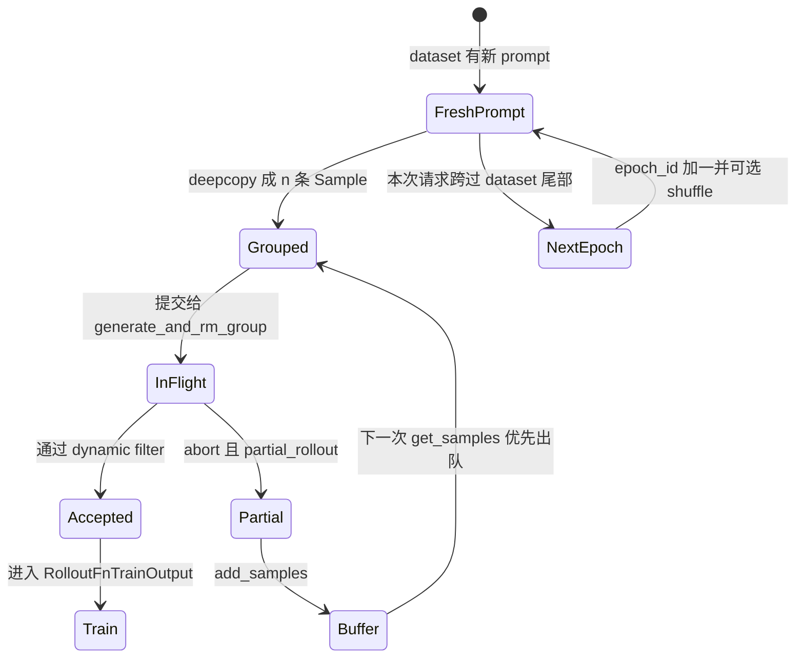

# 数据源 · 核心概念

## 你为什么要读

这篇先回答三个问题：DataSource 为什么不是一个普通 dataset wrapper，`list[list[Sample]]` 为什么是核心接口，buffer 为什么会改变下一步 rollout 的样本来源。读完后再看源码走读，应该能一眼分出“读新 prompt”“复用半成品”“恢复游标”三条路径。

## 心理模型：带回收口的取样账本



这里有两本账：

| 账本 | 字段 | 作用 |
|------|------|------|
| 数据消费账 | `sample_offset`、`epoch_id` | 决定下一次从数据集哪个位置继续 |
| rollout 样本账 | `sample_group_index`、`sample_index` | 给训练、排序、组内 reward 归一化提供稳定编号 |

## 概念一：DataSource 是接口边界，不是文件读取器

`DataSource` 抽象要求实现 `get_samples`、`add_samples`、`save`、`load` 和 `__len__`。这说明 Slime 关心的是“rollout 侧如何取一批 prompt group，并保存这个取样状态”，而不是强制所有实现都必须从本地文件读 prompt。

```python
# 来源：slime/rollout/data_source.py L17-L34
class DataSource(abc.ABC):
    @abc.abstractmethod
    def get_samples(self, num_samples: int) -> list[list[Sample]]:
        """
        Return num_samples samples
        """

    @abc.abstractmethod
    def add_samples(self, samples: list[list[Sample]]):
        """
        Add samples to the data source
        """

    @abc.abstractmethod
    def save(self, rollout_id):
        """
        Save the state of the data source
        """
```

关键点是返回形状：外层是 prompt group，内层是同一个 prompt 的多条 rollout。GRPO、group RM、dynamic filter 都要按这个 group 边界工作。

## 概念二：prompt 有三条来源

| 来源 | 触发条件 | 产生的 Sample 长什么样 |
|------|----------|------------------------|
| 全局 dataset | `rollout_global_dataset=True` 且配置 `prompt_data` | 有 `prompt`、可选 `label`、`metadata`、`multimodal_inputs` |
| 空 Sample | 无 dataset | 只有空 `Sample()`，需要自定义 rollout 填充 |
| buffer | partial/abort 或自定义回灌 | 可能已有 `response`、`tokens`、`status`、`metadata` |

默认训练路径需要全局 dataset。默认 `sglang_rollout.generate_rollout` 入口会断言 `rollout_global_dataset`，所以“无 dataset 的空 Sample”不是默认 SGLang rollout 的常规入口，而是给自定义 data source 或替代 rollout 留出的扩展面。

## 概念三：Dataset 负责把记录变成 prompt 阶段 Sample

`Dataset` 读 jsonl/parquet 后，把每条记录转换成 prompt 阶段的 `Sample`。这个阶段不生成 token，也不算 reward，只准备模型请求所需的 prompt、label、metadata 和多模态输入。

```python
# 定位骨架（据 `slime/utils/data.py` L219-L264 删节）：
        origin_samples = []
        for data in read_file(path):
            as_conversation = apply_chat_template or (multimodal_keys is not None)
            prompt = _build_messages(data, prompt_key, as_conversation, multimodal_keys)

            metadata = data.get(metadata_key) or {}
            tools = None
            if tool_key is not None and tool_key in data:
                tools = data[tool_key]
                if isinstance(tools, str):
                    tools = json.loads(tools)
                elif isinstance(tools, np.ndarray):
                    tools = tools.tolist()
                assert isinstance(tools, list), f"tools must be a list, got {type(tools)} instead"
                metadata["tools"] = tools

            if apply_chat_template:
                output_prompt = tokenizer.apply_chat_template(
                    prompt,
                    tools=tools,
                    tokenize=False,
                    add_generation_prompt=True,
                    **(apply_chat_template_kwargs or {}),
                )
            else:
                output_prompt = prompt
```

这段的设计压力是兼容多种数据形态：纯文本、OpenAI messages、带 tool 的 messages、多模态 placeholder。它把这些差异收束到 `Sample.prompt` 和 `Sample.multimodal_inputs`，让后面的 rollout 只关心如何向 SGLang 发请求。

## 概念四：一次取样会复制 prompt，但不会复制状态指针

同一个 prompt 会被复制成 `n_samples_per_prompt` 条 Sample。它们共享 `group_index`，但 `index` 逐条递增。

```python
# 来源：slime/rollout/data_source.py L107-L118
        samples = []
        for prompt_sample in prompt_samples:
            group = []
            for _ in range(self.args.n_samples_per_prompt):
                sample = copy.deepcopy(prompt_sample)
                sample.group_index = self.sample_group_index
                sample.index = self.sample_index
                self.sample_index += 1
                group.append(sample)
            self.sample_group_index += 1
            samples.append(group)
        return samples
```

这里的 `deepcopy` 很重要。没有它，同一个 prompt 的多条 response 会写回同一个对象，reward、tokens、status 会互相覆盖。`group_index` 则告诉训练侧这些 response 属于同一个 prompt，可以做组内 advantage 或过滤。

## 概念五：buffer 是优先队列，不是第二个 dataset

`RolloutDataSourceWithBuffer.get_samples(N)` 先从 buffer 拿，拿不到的部分才向父类 dataset 要。在正常的“小于等于一个 epoch 可供给量、filter 不超额返回”前提下，总量是 N；源码没有对这两个前提做完整防御。

```python
# 来源：slime/rollout/data_source.py L177-L189
    def get_samples(self, num_samples: int) -> list[list[Sample]]:
        """
        Return num_samples samples
        """

        samples = self._get_samples_from_buffer(num_samples)
        num_samples -= len(samples)

        if num_samples == 0:
            return samples

        samples += super().get_samples(num_samples=num_samples)
        return samples
```

默认 filter 是 FIFO 的 `pop_first`。它原地删除已弹出的 group，避免同一组半成品被重复 rollout。

自定义 buffer filter 若返回超过 N 组，`get_samples` 会把剩余请求数减成负数，随后仍可能调用父类并倒退 `sample_offset`；当前没有返回数量断言。自定义实现必须保证 `0 <= len(result) <= num_samples`，且同步删除或更新 buffer。

## 概念六：checkpoint 保存消费位置

DataSource checkpoint 保存 `sample_offset`、`epoch_id`、`sample_group_index`、`sample_index` 和 metadata。它不保存 dataset 文件内容，也不保存 buffer 中的样本。

```python
# 来源：slime/rollout/data_source.py L123-L136
    def save(self, rollout_id):
        if not self.args.rollout_global_dataset:
            return

        state_dict = {
            "sample_offset": self.sample_offset,
            "epoch_id": self.epoch_id,
            "sample_group_index": self.sample_group_index,
            "sample_index": self.sample_index,
            "metadata": self.metadata,
        }
        path = os.path.join(self.args.save, f"rollout/global_dataset_state_dict_{rollout_id}.pt")
        os.makedirs(os.path.dirname(path), exist_ok=True)
        torch.save(state_dict, path)
```

如果开启 shuffle，恢复后还要按 `epoch_id` 重建同一个 epoch 的排列，否则同一个 `sample_offset` 会指向不同 prompt。

“可重建”不等于“无副作用”：`Dataset.shuffle` 使用 `random.seed(seed + epoch_id)` 和模块级 `random.shuffle`，会覆盖当前进程的 Python 全局 RNG 状态。若同一进程还有 `random` RM、随机插件或其他随机决策，它们的后续序列会被 dataset shuffle 改写。

## 常见误解

| 误解 | 正确模型 |
|------|----------|
| `rollout_batch_size` 是 sample 条数 | 它是 prompt group 数；总 sample 条数还要乘 `n_samples_per_prompt` |
| buffer 会和 dataset 各取 N 个 | buffer 先取，dataset 只补缺口 |
| dynamic filter 丢弃的样本会自动回 buffer | 默认不会，源码注释明确未回写 unused samples |
| `__len__` 表示 buffer + dataset | 默认实现只返回 dataset 长度；无 dataset 时为 0 |
| checkpoint 能恢复 buffer | 默认只恢复 dataset 游标和 metadata |
| `get_samples(N)` 永远返回 N 组 | 默认跨 epoch 逻辑只补一次；N 大于剩余尾部加一个完整 epoch 时会少返回，并可能留下大于 dataset 长度的 offset |
| 配了 `multimodal_keys` 但某行没有媒体字段等价于纯文本 | 此时 `multimodals` 为空却仍构造空正则，字符串 content 会被拆成逐字符 text item |

## 下一步

带着这个模型读 [[Slime-数据源-源码走读]]：从 `RolloutManager.__init__` 创建 DataSource 开始，追一次 `get_samples` 如何变成 SGLang 请求，又如何在 abort 后回到 buffer。
