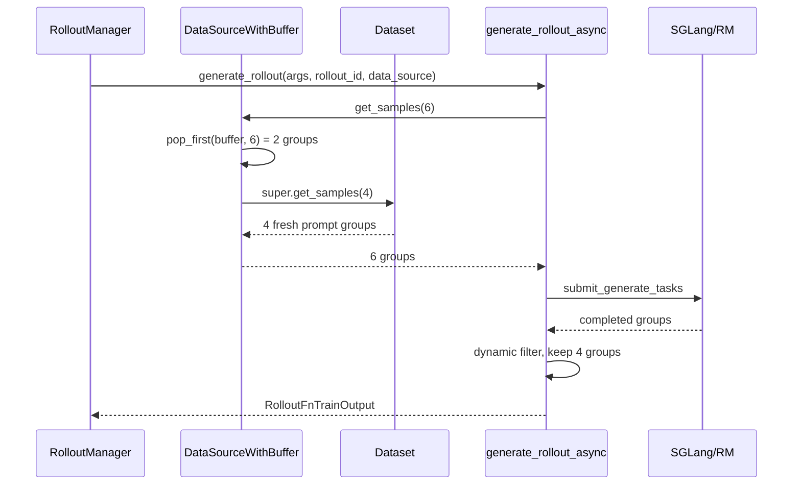

# 数据源 · 源码走读

这篇解决一个具体任务：给定一次训练 rollout，追踪“要 N 组 prompt”这件事如何穿过 `RolloutManager`、`DataSource`、`Dataset`、`generate_rollout_async`，最后变成训练可用的样本。读完后应能定位数据耗尽、续训错位、buffer 没生效、filter 后样本数不足这几类问题。

## 长文读法

这篇按“prompt 组从哪里来、用完怎么补、失败后怎么回灌”读：`RolloutManager` 只保存 data source 接口，`RolloutDataSource` 维护 dataset 游标和 sample 编号，`Dataset` 把文件行转成 prompt 阶段 `Sample`，`RolloutDataSourceWithBuffer` 优先从 buffer 补齐，默认 SGLang rollout 再用 dynamic filter 选出可训练组，partial abort 才把半成品回灌到 buffer。

| 读者任务 | 先读 | 要抓住的判断 |
|----------|------|--------------|
| 第一次建立数据源主线 | 贯穿场景、步骤一到三 | RolloutManager 不知道文件格式，真正的数据游标在 DataSource / Dataset 边界 |
| 排查数据耗尽或跨 epoch 错位 | 步骤二、步骤六、步骤十 | `sample_offset`、`epoch_id`、`sample_group_index`、`sample_index` 是两套账：dataset 位置和训练样本编号 |
| 排查多模态或 chat template 输入 | 步骤三到四 | 文件行先被 Dataset 变成 prompt 阶段 Sample，多模态和模板处理在 dataset 边界收束 |
| 排查长度过滤为什么没生效 | 步骤五 | 只有能可靠估长的输入才做 max length 过滤，list prompt 等场景会跳过或走 processor |
| 判断 buffer 是否真的生效 | 步骤六到七 | WithBuffer 先 pop buffer，再向底层 dataset 补新样本；buffer 不是替代 dataset 的主存储 |
| 排查 filter 后样本不足 | 步骤八 | rollout 会过采样并用 dynamic filter 丢组，直到收满 `rollout_batch_size` |
| 理解 abort / checkpoint 行为 | 步骤九到十 | 只有 partial rollout 的半成品会回灌；save/load 恢复的是数据源游标，不是运行中 pending task |

读的时候一直区分“prompt group”和“训练 sample”：一组 prompt 会复制成 `n_samples_per_prompt` 条 Sample，后续 filter 和 buffer 操作通常按组发生。

## 贯穿场景

假设配置为：

- `rollout_batch_size=4`
- `n_samples_per_prompt=2`
- `over_sampling_batch_size=6`
- 开启 `rollout_global_dataset`
- 使用默认 `RolloutDataSourceWithBuffer`
- 某次 partial rollout 后 buffer 里有 2 组半成品

这一轮 `generate_rollout_async` 第一次拉数据时，会先从 buffer 出 2 组，再从 dataset 新读 4 组，合并成 6 组提交异步生成。最后只有通过 dynamic filter 的 4 组进入训练。



## 步骤一：RolloutManager 只持有接口，不关心数据来源

系统压力：Slime 需要让默认 dataset、本地 buffer、插件 data source 共享同一条 rollout 主循环。RolloutManager 不能写死“从 jsonl 读 prompt”。

设计选择：启动时通过 `--data-source-path` 动态加载类，保存成 `self.data_source`；每次 rollout 时把整个对象交给 rollout 函数。

```python
# 来源：slime/ray/rollout.py L437-L438
        data_source_cls = load_function(self.args.data_source_path)
        self.data_source = data_source_cls(args)
```

```python
# 定位骨架（据 `slime/ray/rollout.py` L650-L653 删节）：
        if self.args.load_debug_rollout_data:
            data = self._load_debug_rollout_data(rollout_id)
        else:
            data = call_rollout_fn(self.generate_rollout, self.args, rollout_id, self.data_source, evaluation=False)
```

执行逻辑：

- `load_function` 让 `--data-source-path` 成为插件入口。
- RolloutManager 不直接调用 `get_samples`，而是把对象传给 `generate_rollout`。
- 默认 rollout 会用 `data_source.get_samples`，替代 rollout 可以用同一对象做别的协议。

不变量与失败模式：

- 自定义 data source 的 `__init__(args)` 必须能被这样调用。
- 自定义 rollout 函数必须接受 `(args, rollout_id, data_source, evaluation=False)`。
- 如果自定义 data source 只实现文件读取、不实现 save/load，checkpoint 路径会断。

## 步骤二：构造 DataSource 时建立两本账

系统压力：一次 rollout 会跨多次取样、跨 epoch、跨 checkpoint 恢复。源码必须同时记录 dataset 位置和 rollout 样本编号。

设计选择：`RolloutDataSource.__init__` 初始化四个游标；如果有全局 dataset，则立刻构建 `Dataset` 并可选 shuffle。

```python
# 定位骨架（据 `slime/rollout/data_source.py` L50-L88 删节）：
class RolloutDataSource(DataSource):
    def __init__(self, args):
        self.args = args

        self.epoch_id = 0
        self.sample_group_index = 0
        self.sample_index = 0
        self.sample_offset = 0
        self.metadata = {}

        if args.rollout_global_dataset and args.prompt_data is not None:
            tokenizer = load_tokenizer(args.hf_checkpoint, trust_remote_code=True)
            processor = load_processor(args.hf_checkpoint, trust_remote_code=True)

            self.dataset = Dataset(
                args.prompt_data,
                tokenizer=tokenizer,
                processor=processor,
                max_length=args.rollout_max_prompt_len,
                prompt_key=args.input_key,
                multimodal_keys=args.multimodal_keys,
                label_key=args.label_key,
                metadata_key=args.metadata_key,
                tool_key=args.tool_key,
                apply_chat_template=args.apply_chat_template,
                apply_chat_template_kwargs=args.apply_chat_template_kwargs,
                seed=args.rollout_seed,
            )
            if self.args.rollout_shuffle:
                self.dataset.shuffle(self.epoch_id)
        else:
            self.dataset = None
```

执行逻辑：

- `sample_offset` 与 `epoch_id` 描述“下一条 prompt 从哪里来”。
- `sample_group_index` 与 `sample_index` 描述“产出的 rollout 样本如何编号”。
- tokenizer/processor 在这里加载，是因为 prompt 长度过滤、chat template、多模态处理都发生在 dataset 构造期。

不变量与失败模式：

- `sample_offset` 不能拿来当 sample 的全局 id。
- `sample_index` 会按 `n_samples_per_prompt` 增长。
- `dataset=None` 时 `__len__` 为 0；默认 SGLang rollout 只断言 global 模式，不断言 `prompt_data` 存在，父类会改为生成空 `Sample()`。

## 步骤三：Dataset 把文件行转换成 prompt 阶段 Sample

系统压力：数据文件可能是 jsonl/parquet、纯文本、多轮 messages、带工具或多模态字段；后续生成逻辑不应感知这些细节。

设计选择：`read_file` 统一产出 dict；`Dataset.__init__` 对每条 dict 构造包含 `prompt`、`label`、`metadata`、`multimodal_inputs` 的 `Sample`。

```python
# 来源：slime/utils/data.py L25-L58
def read_file(path):
    path, row_slice = _parse_generalized_path(path)
    reader = None

    if not os.path.exists(path):
        raise FileNotFoundError(f"Prompt dataset path '{path}' does not exist.")

    if path.endswith(".jsonl"):

        def jsonl_reader(p):
            with open(p, encoding="utf-8") as f:
                for line_num, line in enumerate(f):
                    line = line.strip()
                    if not line:
                        continue
                    try:
                        yield json.loads(line)
                    except json.JSONDecodeError as e:
                        print(f"JSON decode error at line {line_num}: {e}")
                        continue

        reader = jsonl_reader(path)

    elif path.endswith(".parquet"):
        if pq is None:
            raise ImportError("pyarrow is required for parquet support")

        def parquet_reader(p):
            pf = pq.ParquetFile(p)

            for batch in pf.iter_batches():
                yield from batch.to_pylist()

        reader = parquet_reader(path)
```

```python
# 来源：slime/utils/data.py L257-L264
            origin_samples.append(
                Sample(
                    prompt=output_prompt,
                    label=data[label_key] if label_key is not None else None,
                    metadata=metadata,
                    multimodal_inputs=multimodal_inputs,
                )
            )
```

执行逻辑：

- jsonl 坏行会打印错误并跳过；parquet 需要 `pyarrow`。
- `path@[start:end]` 会在 `read_file` 末尾通过 `itertools.islice` 作用于记录流。
- `Dataset` 构造出的样本还没有 response、reward 或 rollout logprob。

不变量与失败模式：

- 文件必须存在，扩展名必须是 `.jsonl` 或 `.parquet`。
- 至少要有 `input_key` 对应字段，否则 prompt 会是 `None`，后续 tokenizer 或 processor 会失败。
- parquet 环境没有 `pyarrow` 时会在加载期直接报错。
- 路径解析正则接受负 start/end，但 `itertools.islice` 不接受负索引；`@[-10:]` 会先解析成功、再在迭代时报 `ValueError`。
- jsonl 坏行全部被跳过时可能形成空 dataset；若启用长度过滤，后续 `origin_samples[0]` 会先触发 `IndexError`。

## 步骤四：多模态和 chat template 在 dataset 边界收束

系统压力：同一套 rollout 代码要支持纯文本和多模态。多模态 placeholder 必须在 processor 前展开成有结构的 content list。

设计选择：`_build_messages` 先把字符串 prompt 包成 user message，再按 `multimodal_keys` 把 placeholder 替换为 image/video item。

```python
# 定位骨架（据 `slime/utils/data.py` L130-L174 删节）：
def _build_messages(data: dict, prompt_key: str, as_conversation: bool, multimodal_keys: dict = None):
    prompt = data.get(prompt_key)

    if isinstance(prompt, str):
        if not as_conversation:
            return prompt
        else:
            prompt = [{"role": "user", "content": prompt}]

    if multimodal_keys:
        multimodals = {}
        for type_name, data_key in multimodal_keys.items():
            mt = MultimodalTypes.get(type_name)
            if mt:
                multimodal_data = data.get(data_key)
                if multimodal_data is not None:
                    multimodals[mt.placeholder] = (mt, list(multimodal_data))

        pattern = "(" + "|".join(re.escape(p) for p in multimodals.keys()) + ")"

        for message in prompt:
            if isinstance(message["content"], str):
                content_list = []
                for segment in re.split(pattern, message["content"]):
                    if not segment:
                        continue
                    if segment in multimodals:
                        mt, content = multimodals[segment]
                        assert len(content) > 0, (
                            f"Not enough {mt.name} data: more '{mt.placeholder}' placeholders in prompt "
                            f"than {mt.name}s provided in data"
                        )
                        item = content.pop(0)
                        if isinstance(item, dict):
                            content_list.append(item)
                        else:
                            content_list.append({"type": mt.name, mt.name: item})
                    else:
                        content_list.append({"type": "text", "text": segment})
                message["content"] = content_list
```

执行逻辑：

- `as_conversation` 由 `apply_chat_template` 或 `multimodal_keys` 触发。
- placeholder 按文本出现顺序消耗多模态数据。
- rich dict 保留原结构，普通字符串路径包装成对应类型。

不变量与失败模式：

- placeholder 数量不能多于数据数量。
- 如果 prompt 已是 content list，当前代码只 warning，不做进一步加工。
- 如果不开 chat template 且 prompt 是 list，长度过滤会跳过，见下一步。
- `multimodal_keys` 已配置但某条记录没有任何实际媒体字段时，`multimodals` 为空，`pattern` 却变成 `()`；字符串 content 会被空正则切成逐字符 text item。

## 步骤五：长度过滤只在可可靠估长时执行

系统压力：超长 prompt 最好在加载期过滤，避免生成期才失败；但 list prompt 和多模态 prompt 的 token 长度不能随便猜。

设计选择：`filter_long_prompt` 对字符串 prompt 做 tokenizer/processor 长度检查；对未模板化的 list prompt 直接 warning 并跳过检查。

```python
# 定位骨架（据 `slime/utils/data.py` L81-L127 删节）：
def filter_long_prompt(origin_samples: list[Sample], tokenizer, processor, max_length: int | None) -> list[Sample]:
    if max_length is None:
        return origin_samples

    if not isinstance(origin_samples[0].prompt, str):
        logger.warning(
            "Skipping max_length check for list prompt. Set apply_chat_template=True to enable length filtering."
        )
        return origin_samples

    if processor:
        text_only = []
        multimodal = []
        for sample in origin_samples:
            if sample.multimodal_inputs and any(v is not None for v in sample.multimodal_inputs.values()):
                multimodal.append(sample)
            else:
                text_only.append(sample)
        filtered_samples = []
        if text_only:
            prompts = [s.prompt for s in text_only]
            input_ids_list = tokenizer(prompts, add_special_tokens=False)["input_ids"]
            for sample, input_ids in zip(text_only, input_ids_list, strict=True):
                if len(input_ids) <= max_length:
                    filtered_samples.append(sample)
        if multimodal:
            from slime.utils.processing_utils import process_vision_info

            for sample in multimodal:
                multimodal_inputs = process_vision_info(sample.prompt, processor)
                processor_output = processor(text=sample.prompt, **multimodal_inputs)
                input_ids = processor_output["input_ids"][0]
                if len(input_ids) <= max_length:
                    filtered_samples.append(sample)
```

执行逻辑：

- `max_length=None` 表示不开启过滤。
- 有 processor 时，纯文本仍走 tokenizer batch，真实多模态走 processor。
- 无 processor 时，所有字符串 prompt 走 tokenizer batch。

不变量与失败模式：

- `origin_samples` 为空会导致 `origin_samples[0]` 访问失败。
- 未模板化 list prompt 不做长度过滤，可能把超长 prompt 留到生成期。
- 多模态样本不能用普通 tokenizer 估长，否则图像 token 展开会被低估。

## 步骤六：`get_samples` 处理跨 epoch 和分组复制

系统压力：一次请求可能跨越 dataset 尾部；同一个 prompt 要复制多条 response；生成结果需要稳定排序。

设计选择：先按 `sample_offset` 切 dataset，不足时跨 epoch 补齐；随后每个 prompt deepcopy 成一组 Sample，写入 `group_index` 和 `index`。

```python
# 定位骨架（据 `slime/rollout/data_source.py` L90-L118 删节）：
    def get_samples(self, num_samples):
        if self.dataset is not None:
            if self.sample_offset + num_samples <= len(self.dataset):
                prompt_samples = self.dataset.samples[self.sample_offset : self.sample_offset + num_samples]
                self.sample_offset += num_samples
            else:
                prompt_samples = self.dataset.samples[self.sample_offset :]
                num_samples -= len(prompt_samples)
                self.epoch_id += 1
                if self.args.rollout_shuffle:
                    self.dataset.shuffle(self.epoch_id)
                prompt_samples += self.dataset.samples[:num_samples]
                self.sample_offset = num_samples
        else:
            prompt_samples = [Sample() for _ in range(num_samples)]

        samples = []
        for prompt_sample in prompt_samples:
            group = []
            for _ in range(self.args.n_samples_per_prompt):
                sample = copy.deepcopy(prompt_sample)
                sample.group_index = self.sample_group_index
                sample.index = self.sample_index
                self.sample_index += 1
                group.append(sample)
            self.sample_group_index += 1
            samples.append(group)
        return samples
```

执行逻辑：

- 不跨 epoch 时只推进 `sample_offset`。
- 跨 epoch 时先取尾部，再 `epoch_id += 1`，可选 shuffle，然后从新 epoch 头部补齐。
- 无 dataset 时返回空 Sample group。
- 每个 prompt group 的内部长度由 `n_samples_per_prompt` 决定。

不变量与失败模式：

- 如果 `num_samples` 大于 dataset 长度很多，当前实现只跨一个 epoch，不是任意多轮循环。
- 这不仅是“少取一些”的温和退化：3 条 dataset 请求 10 组时会返回 6 组并留下 `sample_offset=7`，offset 超出合法范围。
- dataset 为空时每次返回空 groups；默认 rollout 的补水 while 没有 EOF 分支，会反复调用 source 而无法进入等待完成任务的阶段。
- `Dataset.shuffle` 必须与 `epoch_id` 一起恢复，否则 offset 指错 prompt。
- `group_index` 相同、`index` 不同是后续 group 算法的基础。

## 步骤七：buffer 优先补齐这一批

系统压力：partial rollout 产生的半成品已经花过生成成本，应优先继续，而不是立刻丢弃后读新 prompt。

设计选择：buffer 子类先调用 `_get_samples_from_buffer`，不足部分再调用父类 `get_samples`。默认 `pop_first` 是 FIFO。

```python
# 定位骨架（据 `slime/rollout/data_source.py` L168-L196 删节）：
class RolloutDataSourceWithBuffer(RolloutDataSource):
    def __init__(self, args):
        super().__init__(args)
        self.buffer = []
        if self.args.buffer_filter_path is None:
            self.buffer_filter = pop_first
        else:
            self.buffer_filter = load_function(self.args.buffer_filter_path)

    def get_samples(self, num_samples: int) -> list[list[Sample]]:
        samples = self._get_samples_from_buffer(num_samples)
        num_samples -= len(samples)

        if num_samples == 0:
            return samples

        samples += super().get_samples(num_samples=num_samples)
        return samples

    def _get_samples_from_buffer(self, num_samples: int) -> list[list[Sample]]:
        if len(self.buffer) == 0 or num_samples == 0:
            return []

        samples = self.buffer_filter(self.args, None, self.buffer, num_samples)
        return samples
```

```python
# 来源：slime/rollout/data_source.py L225-L229
def pop_first(args, rollout_id, buffer: list[list[Sample]], num_samples: int) -> list[list[Sample]]:
    num_to_pop = min(len(buffer), num_samples)
    samples = buffer[:num_to_pop]
    del buffer[:num_to_pop]
    return samples
```

执行逻辑：

- buffer 为空则完全退回 dataset。
- buffer 不足时，dataset 只补缺口。
- `pop_first` 原地删除已返回的组。

不变量与失败模式：

- 自定义 `buffer_filter` 必须修改 buffer 或以别的方式避免重复返回同一组。
- 自定义 filter 还必须保证返回数不超过 `num_samples`；超额时剩余数变负，父类调用可能把 `sample_offset` 向后移动。
- `rollout_id` 当前传入 `None`，不能假设这里有真实 rollout id。
- buffer group 可以比 fresh prompt group 字段更多，但形状必须一样。

## 步骤八：默认 rollout 只收通过 filter 的组

系统压力：训练需要固定数量的有效 prompt group；dynamic filter 会丢掉 reward 标准不合格的组，因此取样量和有效训练量可能不同。

设计选择：`generate_rollout_async` 不断拉取 `over_sampling_batch_size` 组并提交 task，直到 `data` 收满 `rollout_batch_size` 组。被 dynamic filter drop 的组只减少 pending 计数，不进入训练，也默认不回写 buffer。

```python
# 定位骨架（据 `slime/rollout/sglang_rollout.py` L401-L439 删节）：
    target_data_size = args.rollout_batch_size

    data = []
    all_data = []
    do_print = True
    pbar = tqdm(total=target_data_size * args.n_samples_per_prompt, desc="Rollout generation")
    while len(data) < target_data_size:
        while state.remaining_batch_size < target_data_size:
            samples = data_source(args.over_sampling_batch_size)
            state.submit_generate_tasks(samples)

        done, state.pendings = await asyncio.wait(state.pendings, return_when=asyncio.FIRST_COMPLETED)
        for task in done:
            group: list[Sample] = task.result()

            assert len(group) == args.n_samples_per_prompt
            all_data.append(group)

            dynamic_filter_output = call_dynamic_filter(dynamic_filter, args, group)
            if not dynamic_filter_output.keep:
                metric_gatherer.on_dynamic_filter_drop(reason=dynamic_filter_output.reason)
                state.remaining_batch_size -= 1
                continue

            if len(data) < target_data_size:
                data.append(group)
                pbar.update(args.n_samples_per_prompt)
```

执行逻辑：

- `target_data_size` 是最终有效 group 数。
- `all_data` 保存完成过的组，给可选后处理使用。
- drop 的组已经消耗 dataset 游标，但不会进入 `data`。
- 源码紧接着的注释说明 unused samples 默认没有存回 buffer。

不变量与失败模式：

- group 长度不等于 `n_samples_per_prompt` 会立刻 assert。
- dynamic filter drop 很多时，dataset 消费速度会明显快于训练样本数。
- 如果希望回收 filtered groups，需要自定义 `rollout_all_samples_process_path` 或 fork rollout 逻辑。

## 步骤九：abort 后只有 partial 路径会回灌

系统压力：训练步结束时还有 pending task。Slime 需要让 serving 进入 idle，同时在 partial rollout 模式下尽量保留已生成的 response。

设计选择：`abort` 设置 `state.aborted=True`，等待 pending task 收束；如果开启 `partial_rollout`，把完成的 group 收集到 `aborted_samples`，给带 buffer 的 data source 回写。

```python
# 定位骨架（据 `slime/rollout/sglang_rollout.py` L336-L372 删节）：
async def abort(args: Namespace, rollout_id: int) -> list[list[Sample]]:
    aborted_samples = []

    state = GenerateState(args)
    assert not state.aborted
    state.aborted = True

    if parse(sglang_router.__version__) <= parse("0.2.1"):
        response = await get(f"http://{args.sglang_router_ip}:{args.sglang_router_port}/list_workers")
        urls = response["urls"]
    else:
        response = await get(f"http://{args.sglang_router_ip}:{args.sglang_router_port}/workers")
        urls = [worker["url"] for worker in response["workers"]]

    await abort_servers_until_idle(urls)

    count = 0
    while state.pendings:
        done, state.pendings = await asyncio.wait(state.pendings, return_when=asyncio.FIRST_COMPLETED)

        if not args.partial_rollout:
            continue

        for task in done:
            group = task.result()
            for sample in group:
                if sample.response and "start_rollout_id" not in sample.metadata:
                    sample.metadata["start_rollout_id"] = rollout_id
            aborted_samples.append(group)
            count += len(group)
```

```python
# 来源：slime/rollout/sglang_rollout.py L637-L640
    output, aborted_samples = run(generate_rollout_async(args, rollout_id, data_source.get_samples))
    if aborted_samples:
        data_source.add_samples(aborted_samples)
    return output
```

执行逻辑：

- 未开启 `partial_rollout` 时，pending task 只被 drain，不收集样本。
- 收集时会给已有 response 的 sample 写入 `metadata["start_rollout_id"]`。
- 回写发生在 `generate_rollout` 外层，要求 data_source 支持 `add_samples`。

不变量与失败模式：

- 用纯 `RolloutDataSource` 时 `add_samples` 会抛错。
- 回写 group 长度必须等于当前 `n_samples_per_prompt`。
- buffer 不随 checkpoint 默认保存，进程退出后这些半成品不会自动恢复。

## 步骤十：save/load 恢复的是游标，不是 buffer

系统压力：续训要从同一个数据消费位置继续，不能从头重复，也不能跳错 prompt。

设计选择：`save` 写四个游标和 metadata；`load` 读回后，在 shuffle 模式下用恢复的 epoch 重新 shuffle。

```python
# 来源：slime/rollout/data_source.py L138-L160
    def load(self, rollout_id=None):
        if not self.args.rollout_global_dataset:
            return

        if self.args.load is None:
            return

        path = os.path.join(self.args.load, f"rollout/global_dataset_state_dict_{rollout_id}.pt")
        if not os.path.exists(path):
            logger.info(f"Checkpoint {path} does not exist.")
            return

        logger.info(f"load metadata from {path}")
        logger.info(f"load metadata: {self.metadata}")
        state_dict = torch.load(path)
        self.sample_offset = state_dict.get("sample_offset", 0)
        self.epoch_id = state_dict.get("epoch_id", 0)
        self.sample_group_index = state_dict.get("sample_group_index", 0)
        self.sample_index = state_dict.get("sample_index", 0)
        self.metadata = state_dict.get("metadata", {})

        if self.args.rollout_global_dataset and self.args.rollout_shuffle and self.dataset is not None:
            self.dataset.shuffle(self.epoch_id)
```

执行逻辑：

- 非 global dataset 或未配置 `args.load` 时直接返回。
- checkpoint 不存在时只记日志，不抛异常。
- 恢复后再对 dataset 应用同一个 epoch 的 shuffle。

不变量与失败模式：

- 续训需要 `args.load` 指向含有 `rollout/global_dataset_state_dict_{rollout_id}.pt` 的目录。
- shuffle 的 determinism 来自 `Dataset.shuffle(seed + epoch_id)`。
- buffer 内容不在这个 state dict 里。
- shuffle 通过模块级 `random.seed` 实现，会重置进程全局 Python RNG；同进程的随机 RM 或插件会受影响。

## 步骤十一：fully-async 复用接口，但不复用默认控制面

fully-async 后台 worker 持续调用 `data_buffer.get_samples(1)`，完成后放入跨 step 输出队列，aborted group 则回灌。它直接调用 `generate_and_rm_group`，不会经过默认主循环的 dynamic filter、drop metrics、over-sampling 和 all-samples hook；全局 worker 首次创建后还固定首份 args 与 data source。

若 source 持续返回空列表，worker 每秒重试，前台 `_generate_rollout_async` 没有 deadline，会一直等待 `rollout_batch_size`。因此“实现了相同 DataSource 接口”只证明取样形状兼容，不证明默认 rollout 的质量闸门和终止语义仍然存在。

## 运行验证

可以先不启动完整训练，用插件契约测试确认接口形状：

```powershell
Set-Location 'F:\源码阅读\slime'
python -m pytest tests/plugin_contracts/test_plugin_path_loading_contracts.py -q
```

预期现象：

- 默认 `RolloutDataSourceWithBuffer` 可被动态加载。
- `buffer_filter` 签名前四个参数是 `(args, rollout_id, buffer, num_samples)`。
- 自定义 data source 的 `__init__(args)` 和 `get_samples` 返回 list 形状被验证。

若只想验证源码引用：

```powershell
node maintenance/audit_source_evidence.mjs --note slime_reading/Rollout生成/数据源/Slime-数据源-源码走读.md
```

预期现象：脚本应报告引用文件存在且行号范围有效。
