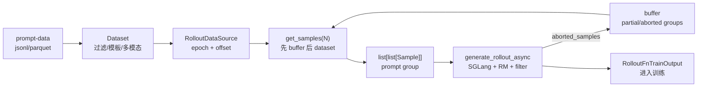

# 数据源

## 你为什么要读

DataSource 是 rollout 的取样状态机。它回答的不是“数据文件怎么读”这一件事，而是训练每一步要从哪里拿 prompt group、如何给同一 prompt 复制多条 sample、怎样在 checkpoint 后继续同一条数据流，以及 partial rollout 产生的半成品是否先回到队列。

读完本专题，读者应该能排查三类问题：训练步数和数据量为什么对不上，partial rollout 为什么复用或没有复用旧样本，续训后 prompt 顺序为什么可能变化。

## 先看主线



把它想成一条带回收口的传送带：

| 位置 | 源码对象 | 读者要盯住什么 |
|------|----------|----------------|
| 原料区 | `Dataset` | 文件格式、chat template、多模态、长度过滤 |
| 游标区 | `sample_offset`、`epoch_id` | 下一次从哪个 prompt 开始取 |
| 复制区 | `n_samples_per_prompt`、`group_index`、`index` | 一个 prompt 如何变成一组 rollout |
| 回收口 | `RolloutDataSourceWithBuffer` | partial/abort 样本是否先于新 prompt 被消费 |
| 交付口 | `generate_rollout_async` | 只把通过 filter 的组交给训练 |

## 阅读顺序

| 文档 | 读者任务 |
|------|----------|
| [[Slime-数据源-核心概念]] | 建立“取样状态机”模型，区分 dataset、游标、buffer、Sample group |
| [[Slime-数据源-源码走读]] | 沿一次 `get_samples` 到 `generate_rollout_async` 的真实主线读源码 |
| [[Slime-数据源-数据流]] | 看清 RolloutManager、默认 rollout、fully-async 和训练侧的边界 |
| [[Slime-数据源-排障指南]] | 用症状反查配置、源码入口和验证方法 |
| [[Slime-数据源-学习检查]] | 按可执行清单验收自己是否真的能排障 |

第一次读建议从专题入口进入核心概念，再读源码走读和数据流。正在排障时先看排障指南，再回到源码走读找证据。

## 源码范围

| 文件 | 作用 |
|------|------|
| `slime/rollout/data_source.py` | DataSource 抽象、默认 dataset 游标、buffer 子类、FIFO 出队 |
| `slime/utils/data.py` | jsonl/parquet 读取、prompt 构造、长度过滤、shuffle、rollout-to-train 解包 |
| `slime/rollout/sglang_rollout.py` | 默认生成主循环、dynamic filter、abort 后的回写 |
| `slime/ray/rollout.py` | RolloutManager 生命周期中实例化、保存、加载 DataSource |
| `slime/rollout/fully_async_rollout.py` | fully-async 把 DataSource 当跨 step 轨迹队列使用 |
| `slime/tests/plugin_contracts/test_plugin_path_loading_contracts.py` | 自定义 data source 与 buffer filter 的契约形状 |

## 上下游衔接

| 方向 | 模块 | 为什么相关 |
|------|------|------------|
| 上游 | [[Slime-Sample数据契约]] | DataSource 产出的是 prompt 阶段的 `Sample`，生成后才补 response 时间轴 |
| 下游 | [[Slime-SGLang-Rollout]] | 默认 rollout 主循环消费 `get_samples`，并把 partial 组写回 |
| 编排 | [[Slime-RolloutManager]] | RolloutManager 负责加载 data source、保存/恢复它的状态 |
| 配置 | [[Slime-训练与Rollout参数]] | `--prompt-data`、`--rollout-batch-size`、`--n-samples-per-prompt` 决定形状 |
| 变体 | [[Slime-其他Rollout路径]] | fully-async 改变 buffer 的角色，但仍遵守同一组接口 |

## 本专题的不变量

- `get_samples(N)` 的 N 是请求的 prompt 组数，不是 token 数，也不是单条 sample 数；默认实现只支持至多跨一个 epoch，超大 N 可能实际少返回并写出越界 offset。
- 每个 group 的长度必须等于 `n_samples_per_prompt`。
- `sample_offset` 管 dataset 内位置；`sample_index` 管 rollout 样本全局编号，两者不是同一个计数器。
- buffer 优先于 dataset，但单次请求的总量仍是 N。
- 默认 dynamic filter 丢弃的组不会自动回写 buffer。
- checkpoint 保存的是数据消费状态，不保存原始 prompt 内容。
- `Dataset.shuffle` 可复现排列，但会调用进程级 `random.seed`，因此还会改变同进程其他 Python 随机逻辑的后续序列。
- fully-async 复用同一全局 worker 和首份 args/data source；它不执行默认 dynamic sampling filter，也不产生对应 drop metrics。

## 验证抓手

最小验证不是起一整套大训练，而是用契约测试和源码审计确认接口形状：

```powershell
Set-Location 'F:\源码阅读\slime'
python -m pytest tests/plugin_contracts/test_plugin_path_loading_contracts.py -q
node maintenance/audit_source_evidence.mjs --note slime_reading/Rollout生成/数据源/Slime-数据源-源码走读.md
```

预期现象：契约测试会验证 `RolloutDataSourceWithBuffer`、自定义 data source、`buffer_filter` 的签名和返回形状；源码审计应报告引用文件存在、行号范围有效。
