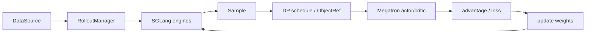

# Slime 学习指南

## 你为什么要读

Slime 的顶层循环很短，真正的复杂度藏在“谁拥有 GPU、Sample 何时换形、哪个 rank 在等待、生成侧装的是哪版权重”。这套文档帮助你理解 Slime 如何用 Ray 编排 SGLang rollout 和 Megatron training，并通过 `generate -> train -> update_weights` 把算法闭环变成可运行的分布式系统。

## 第一次阅读

1. [[RL后训练数学基础]]
2. [[分布式通信与并行]]
3. [[RL训练闭环主线]]
4. [[Slime-项目总览]]
5. [[Slime-RolloutManager]]
6. [[Slime-训练步骤]]
7. [[Slime-Advantage计算]] · [[Slime-Policy-Loss]]
8. [[Slime-分布式权重同步]]
9. [[Slime闭环实验]]

## 三种使用方式

| 当前任务 | 阅读入口 |
|----------|----------|
| 首次学习 | [[Slime-导读与总览]] · [[Slime-学习路径]] |
| 排查 rollout/loss/权重 | [[Slime-RL训练全链路]] · [[knowledge_maps/排障指南.base]] |
| 准备改代码 | [[knowledge_maps/Slime内容.base]]，筛选 walkthrough/dataflow |

## 系统地图

## 专题入口

| 领域 | 入口 |
|------|------|
| 启动、参数、数据准备 | [[Slime-启动与入口]] |
| Ray 资源和 Actor | [[Slime-Ray编排]] |
| Rollout、Sample、Reward | [[Slime-Rollout生成]] |
| Megatron train 和 loss | [[Slime-训练后端]] |
| 权重格式与同步 | [[Slime-权重同步]] |
| Agent 与定制 | [[Slime-高级特性]] · [[Slime-扩展与生态]] |
| 可观测与复盘 | [[Slime-总结复盘]] |

## 完成标准

- 能沿 `prompt -> Sample -> train_data -> ObjectRef -> RolloutBatch` 复述数据形态。
- 能解释 rollout/current/reference logprob 和 advantage 的关系。
- 能说明 DP、PP、CP 对训练字段和 loss 的边界。
- 能证明下一轮 rollout 使用更新后的 weight version。

源码基线：`22cdc6e1`。RL 算法结论应同时核对测试和实验数据。
