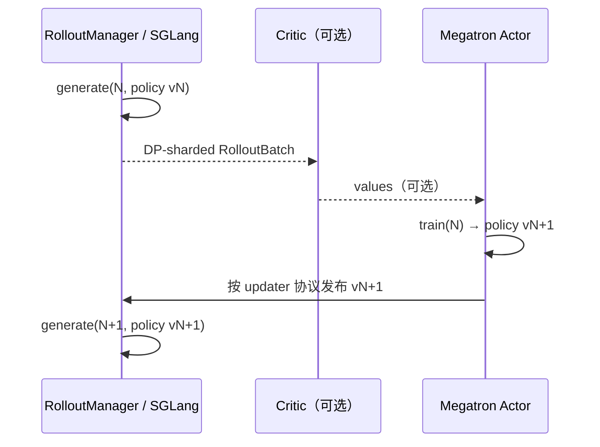
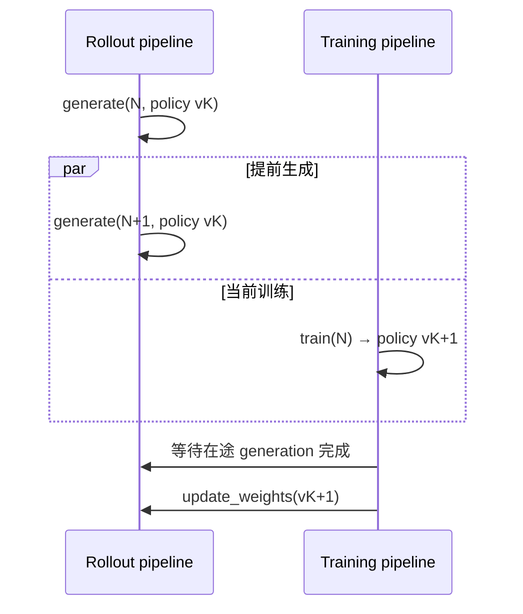
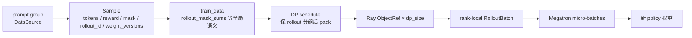

# Slime 学习指南

## 你为什么要读

Slime 的 `train.py` 不到百行，却同时指挥两套重型系统：Megatron 负责训练，SGLang 负责 rollout，Ray 负责把 GPU、进程和对象引用编排到同一条 RL 闭环里。短入口并不等于简单系统；真正困难的是五个问题：

1. **资源账：** actor、critic、rollout engine 各占哪些 GPU，是否 colocate，何时 offload/onload。
2. **样本账：** prompt 怎样变成 `Sample`，再变成按 DP rank 分片的 `RolloutBatch`。
3. **训练账：** rollout logprob、current/ref logprob、reward、value 和 advantage 分别在哪里产生。
4. **版本账：** 某条样本由哪一版 policy 生成，新权重何时可以安全推给 SGLang。
5. **等待账：** 主循环究竟在等生成、critic、actor、NCCL 更新，还是 Ray placement group。

读懂这五本账，才能真正解释 Slime 为什么能跑，而不只是记住 `generate → train → update_weights` 三个动词。

## 先建立三个时序模型

### 1. 同步闭环：一轮训练是一道版本屏障

默认入口 `train.py` 的核心语义是：第 `N` 轮生成完成后才训练，第 `N` 轮训练完成并推权重后，才进入第 `N+1` 轮生成。



这条主线最适合第一次学习，因为同步入口把 generate、train 和 publish 串成清晰屏障。图中的“发布”不是统一的 pause/flush 模板：distributed、full/delta disk、tensor colocate 与外部 engine 的介质、锁、cache 动作和版本提交点不同，必须回到实际 updater。另有两条条件分支：critic-only 阶段可以只训练 critic；`offload_rollout` 下，更新前必须先恢复 weights，更新后再恢复 KV cache。

### 2. 流水异步：生成与训练重叠，但更新仍有屏障

`train_async.py` 会提前启动 `generate(N+1)`，让它与 `train(N)` 重叠。它不是“生成永远使用最新权重”：下一批生成在本轮训练结束前已经开始，因此天然存在受控的 pipeline staleness。



更新达到 `update_weights_interval` 时，主循环先 `ray.get` 等待正在生成的 future，再换权，避免同一次 generation 中途切换模型。这个入口明确禁止 `colocate`。仓库注释所说的 fully async 另见 `examples/full_async`，不能把它与本入口混为一谈。

### 3. Fully async：另一套一致性问题

Fully async 不只是把同步点再删掉几个。生成、训练、样本缓冲和权重发布可能各自前进，读者必须额外追踪：

- rollout id 与 weight version 的对应关系；
- 允许多大的策略陈旧度；
- 缓冲区如何消费、丢弃或重加权旧样本；
- 权重更新期间如何避免 engine 读到混合版本。

第一次阅读不要从这里开始；先把同步闭环读通，再进入对应示例。

## 一条样本的生命周期



关键点不是容器名字，而是语义何时定型：

| 边界 | 定型的事实 | 常见误读 |
|------|------------|----------|
| DataSource → rollout fn | 本轮取哪些 prompt、每个 prompt 采几条 | 以为 RolloutManager 自己生成文本 |
| rollout fn → `Sample` | tokens、reward、loss mask、采样 metadata、weight version | 把 `Sample` 当成只有 prompt/response 的 DTO |
| `Sample` → `train_data` | rollout 分组、loss 分母、训练字段长度契约 | 按裸 sample 平均，破坏 compact rollout 语义 |
| DP schedule → ObjectRef | 每个 DP rank 的 partition 与 micro-batch 顺序 | 以为 RayTrainGroup 收到全局 batch 后再自行均分 |
| actor → rollout engine | 新权重版本可被下一次生成观察 | 以为 optimizer step 完成就自动影响 SGLang |

## 启动顺序为什么不能颠倒

```python
# 来源：train.py L9-L20
def train(args):
    configure_logger()
    # allocate the GPUs
    pgs = create_placement_groups(args)
    init_tracking(args)

    # create the rollout manager, with sglang engines inside.
    # need to initialize rollout manager first to calculate num_rollout
    rollout_manager, num_rollout_per_epoch = create_rollout_manager(args, pgs["rollout"])

    # create the actor and critic models
    actor_model, critic_model = create_training_models(args, pgs, rollout_manager)
```

顺序是 `PlacementGroup → RolloutManager → training models`。RolloutManager 必须先建立，因为 `num_rollout` 可能由数据集长度与 epoch 数计算；training actor 初始化后又会把训练并行配置回连给 RolloutManager，后者据此按 DP 切数据。随后无论同步主循环是否尚未开始，都要先把 actor 初始权重推给 rollout engine，避免第一轮样本来自错误版本。

## 推荐学习路线

### 第一次完整学习

1. [[RL后训练数学基础]]：先弄清 policy、reward、value、advantage、KL。
2. [[分布式通信与并行]] 与 [[Slime-零基础先修]]：补 Ray、DP/TP/PP/CP 与 micro-batch。
3. [[Slime-项目总览]]：建立仓库边界和四类运行时责任。
4. [[Slime-RL训练全链路]]：沿一个 rollout id 走通同步 baseline。
5. [[Slime-RolloutManager]] → [[Slime-训练步骤]]：分别深挖生产侧与消费侧。
6. [[Slime-Advantage计算]] → [[Slime-Policy-Loss]]：把数学对象重新对回 tensor 字段。
7. [[Slime-分布式权重同步]]：理解闭环最后一道版本屏障。
8. [[Slime闭环实验]] 与 [[Slime-综合学习检查]]：用实验和反事实问题验收。

### 按故障切入

| 症状 | 第一入口 | 首先核对 |
|------|----------|----------|
| Ray 一直等资源 | [[Slime-PlacementGroup]] | bundle 数、colocate/external/debug 分支、集群 GPU 注册 |
| rollout 卡住或吞吐骤降 | [[Slime-RolloutManager]] · [[Slime-SGLang-Rollout]] | server health、DataSource、在途请求、reward/verifier |
| loss/advantage 异常 | [[Slime-训练数据]] · [[Slime-Advantage计算]] | `rollout_id`、mask、logprob/value 来源、归一化范围 |
| 某些 DP rank OOM | [[Slime-RL训练全链路]] · [[Slime-训练数据]] | token 长度、pack、FLOPs balance、micro-batch 对齐 |
| 下一轮仍像旧模型 | [[Slime-权重同步]] | updater 类型、engine 集合、实际闸门/介质/提交点、`weight_versions` |
| offload 后恢复失败 | [[Slime-训练主循环]] · [[Slime-SGLang-Engine]] | weights/KV 与 actor wake/sleep 的先后顺序 |

## 专题地图

| 领域 | 入口 | 读完应能回答 |
|------|------|--------------|
| 启动、参数、数据准备 | [[Slime-启动与入口]] | 最终 args 由哪些解析和校验阶段决定？ |
| Ray 资源与 Actor | [[Slime-Ray编排]] | 逻辑 rank 怎样落到节点、bundle 和物理 GPU？ |
| Rollout、Sample、Reward | [[Slime-Rollout生成]] | 一条可训练样本的字段在哪些阶段形成？ |
| Megatron train 与 loss | [[Slime-训练后端]] | 一个 rank-local batch 怎样进入 forward/backward？ |
| 权重格式与同步 | [[Slime-权重同步]] | metadata 与 tensor 各走什么通道，何处形成版本屏障？ |
| 异步、Agent 与插件 | [[Slime-高级特性]] · [[Slime-扩展与生态]] | 扩展点改变的是数据生产、调度还是优化目标？ |
| 可观测、排障与复盘 | [[Slime-总结复盘]] | 如何用日志、debug replay 和版本号证伪猜测？ |

## 完成标准

读完后，不以“看过多少文件”为完成标准，而以能否独立完成这些任务验收：

- 画出同步与流水异步时序，并准确指出二者的权重版本差异。
- 沿 `prompt → Sample → train_data → DP ObjectRef → RolloutBatch → micro-batch` 解释每次换形的责任主体和不变量。
- 给定 colocate、external rollout、debug train-only 三组参数，推导 placement group 的 GPU 布局。
- 给定一批不同长度、含 compact siblings 的 samples，解释为什么要按 `rollout_id` 保组以及 loss 分母如何保持不变。
- 区分 rollout/current/reference logprob、critic value、reward、advantage 的来源和用途。
- 选定一种真实 updater，证明其 writer/lock 或 quiescence、payload、cache/commit 与版本可见性协议；不能把 distributed 路径的 pause/flush/broadcast 顺序外推到所有路径。若无法运行，需给出静态调用链和环境限制。
- 能用 debug rollout replay 把“生成错误”与“训练错误”切开，而不是凭最终 loss 猜原因。

源码基线：`22cdc6e1`。算法效果和性能结论还必须同时注明模型、硬件、并行配置、数据集与 workload；源码只能证明控制流与字段契约，不能替代实验。
